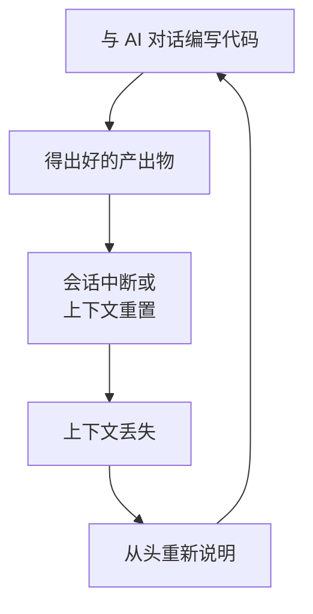
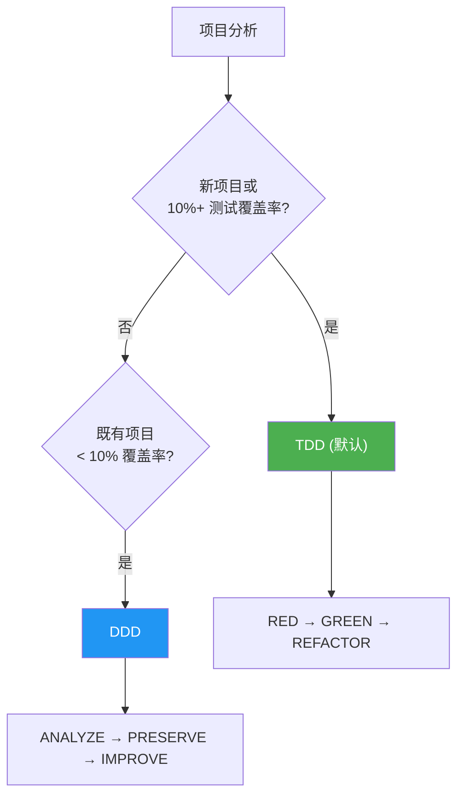
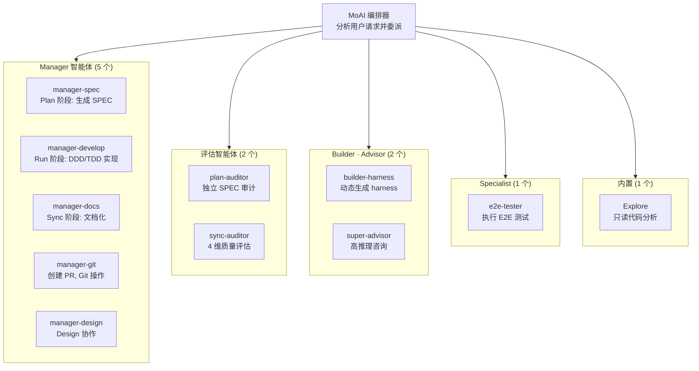
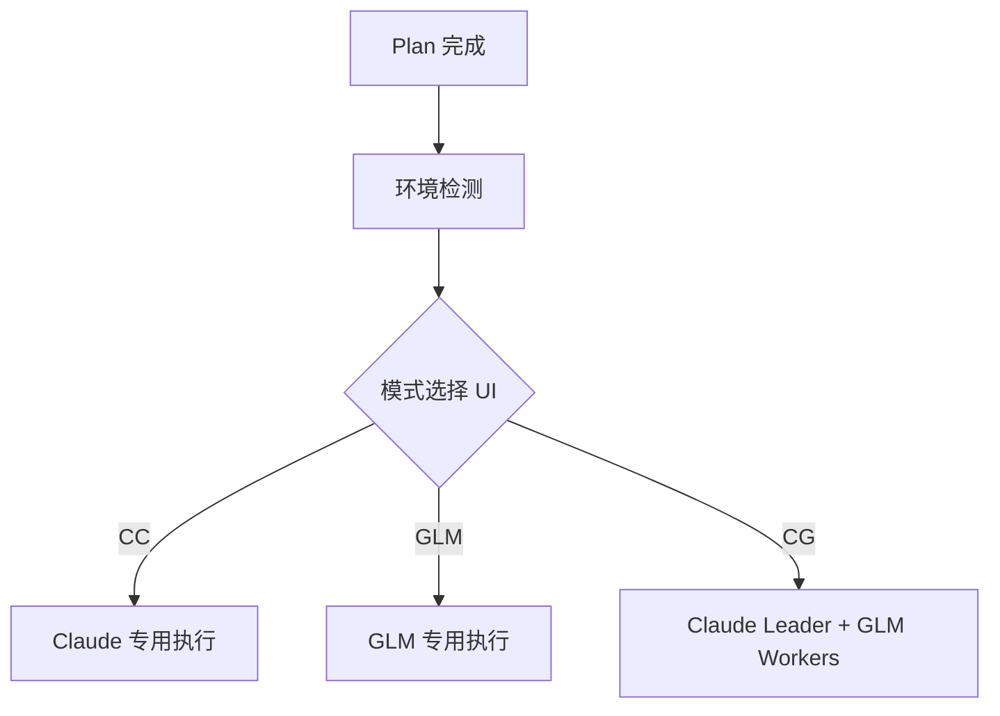

MoAI-ADK 是以 **代币经济学**(Token Economics)为目标的 **Agentic Development Kit**。用更少的 token 产出同等质量的代码,用同样的 token 获得更高的质量 —— 模型选择·推理深度·上下文用量都由系统管理。11 个专业 AI 智能体与 27 个技能协作,并为新项目自动应用 TDD(默认),为测试覆盖率低的既有项目自动应用 DDD。

用 Go 编写的单一二进制 —— 无依赖即可在所有平台上即时运行。


**一句话概括:** MoAI-ADK 是一个把"将与 AI 的对话作为文档(SPEC)留存、安全地改进代码(DDD/TDD)、自动验证质量(TRUST 5)"的工作 —— **连 token 成本也由系统管理** —— 一并完成的智能体开发套件。


## MoAI-ADK 简介

**MoAI** 意为"人人的 AI"(MoAI - Everybody's AI)。**ADK** 是 Agentic Development Kit 的缩写,指 AI 智能体主导开发过程的工具集。

MoAI-ADK 是一个 **让智能体在 Claude Code 内相互协作进行智能体式编码的开发套件**。就像 AI 开发团队协作完成项目一样,每个智能体承担自己专业领域的工作。

| AI 开发团队 | MoAI-ADK | 角色 |
|----------|----------|------|
| 产品负责人 | 用户(开发者) | 决定要做什么 |
| 团队领导 / Tech Lead | MoAI 编排器 | 协调整体工作并委派给 11 个智能体 |
| 策划 / Spec Writer | manager-spec | 把需求整理成 SPEC 文档 |
| 开发者 / Engineers | manager-develop(注入领域上下文) | 用 DDD/TDD 实现实际代码 |
| QA / 代码评审者 | plan-auditor · sync-auditor | 独立审计计划与产出物 |

## 核心价值 —— 三根支柱

v3.0 的价值可归纳为三根支柱。

### 代币经济学(Token Economics)

最大化性价比的智能资源分配。按作业阶段与 SPEC 大小声明式地分配模型与推理深度的 **3 层模型策略**,组合 Claude 领导与 GLM Worker 将实现成本降低 60-70% 的 **CG 模式**,在超预算前优雅停止的 **Token Circuit Breaker**,以及缩减常驻加载上下文的 **上下文瘦身** —— 这些构成了这根支柱。

### 智能体循环工程(Agentic Loop Engineering)

循环自行工作,过程中积累观察。声明完成条件后会话持续工作直到条件满足的 **goal 引擎**,反复修复直到清空诊断工具找到的问题的 **Ralph Engine**(`/moai loop`),把自然语言请求与语言无关地分析意图再路由的 **Analyze-First 路由** 都属于此。积累的观察成为 harness 学习的原料,沿 4 层学习阶梯(观察 → 启发式 → 规则 → 自动更新)使指令进化 —— 自动更新始终只在用户批准门禁之下应用。

### 智能体 harness(Agentic Harness)

不亲自写代码,而是设计智能体能好好工作的环境。11 个智能体目录、基于 SPEC 的 3-phase 工作流(plan → run → sync)、TRUST 5 质量门禁、用自然语言请求生成项目专用 harness 的 Harness v4 Builder 构成这根支柱。详细概念请参阅[harness 工程](/zh/core-concepts/harness-engineering)文档。

## 为何是代币经济学

token 单价持续下降,但智能体式开发的 token 用量增长得更快。随着多个智能体运转、上下文变长、推理变深,决定成本的不是模型价格,而是 **token 运用方式**。

MoAI-ADK 的答案有三:

1. **为每项作业分配合适的模型·推理深度** —— 计划要深,实现要便宜,验证要独立。
2. **给上下文瘦身** —— 最小化常驻加载的指令,并测量提示缓存命中率。
3. **由系统守住预算** —— 追踪 token 使用,在超过阈值前优雅停止。

## 为何是 MoAI-ADK?

### 从 Python 到 Go 的完全重写

将基于 Python 的 MoAI-ADK(~73,000 行)完全用 Go 重写。

| 项目 | Python 版 | Go 版 |
|------|-------------|----------|
| 分发 | pip + venv + 依赖 | **单一二进制**,零依赖 |
| 启动时间 | ~800ms 解释器启动 | **~5ms** 原生执行 |
| 并发 | asyncio / threading | **原生 goroutine** |
| 类型安全 | 运行时(mypy 可选) | **编译期强制** |
| 跨平台 | 需要 Python 运行时 | **预构建二进制**(macOS, Linux, Windows) |
| Hook 执行 | Shell 包装 + Python | **编译的二进制**,JSON 协议 |

### 核心数字(以 v3.0 为准)

- **11 个** 智能体目录(10 个 MoAI 自定义 + 1 个 Anthropic 内置 `Explore`)
- **27 个** 技能(template-managed)
- **36 个** CLI 命令 · **15 种** `/moai` 子命令
- **16 种** 编程语言支持
- **3 级 harness**(minimal / standard / thorough)—— 依 SPEC 复杂度的自适应质量门禁
- 基于 **504 个** SPEC 文档开发的代码库

### 氛围编程的问题点

**氛围编程**(Vibe Coding)是与 AI 自然对话来编写代码的方式。说"帮我做这样的功能",AI 就生成代码。直观又快,但在实务中会出现严重问题。


```mermaid
flowchart TD
    A["与 AI 对话编写代码"] --> B["得出好的产出物"]
    B --> C["会话中断或\n上下文重置"]
    C --> D["上下文丢失"]
    D --> E["从头重新说明"]
    E --> A
```

**实务中遇到的具体问题:**

| 问题 | 情形示例 | 结果 |
|------|----------|------|
| **上下文丢失** | 昨天讨论 1 小时的认证方式今天得重新说明 | 浪费时间,一致性下降 |
| **质量不一致** | AI 有时生成好代码,有时生成坏代码 | 代码质量不可预测 |
| **破坏既有代码** | 说"改一下这部分",结果其他功能坏了 | 出现 bug,需要回滚 |
| **重复说明** | 项目结构、编码规则每次都得重新告知 | 生产力下降 |
| **缺少验证** | 没有办法确认 AI 生成的代码是否安全 | 安全漏洞,测试不足 |
| **浪费 token** | 所有作业都用同一模型·同一推理深度处理 | 成本不可预测,超预算 |

### MoAI-ADK 的解决方案

| 问题 | MoAI-ADK 的解决方案 |
|------|------------------|
| 上下文丢失 | 用 **SPEC 文档** 把需求作为文件永久保留 |
| 质量不一致 | 用 **TRUST 5** 框架应用一致的质量标准 |
| 破坏既有代码 | 用 **DDD/TDD** 先写测试来保护既有功能 |
| 重复说明 | 用 **CLAUDE.md 与技能系统** 自动加载项目上下文 |
| 缺少验证 | 用 **LSP 质量门禁** 自动验证代码质量 |
| 浪费 token | 用 **模型策略 + Token Circuit Breaker** 让系统管理成本 |

## 系统要求

| 平台 | 支持环境 | 备注 |
|--------|---------|------|
| macOS | Terminal, iTerm2 | 完全支持 |
| Linux | Bash, Zsh | 完全支持 |
| Windows | **WSL(推荐)**, PowerShell 7.x+ | 不支持原生 cmd.exe |

**必要条件:**
- 所有平台都需安装 **Git**
- **Windows 用户**:**必须** 安装 [Git for Windows](https://gitforwindows.org/)(含 Git Bash)
  - 为获得最佳体验,推荐使用 **WSL**(Windows Subsystem for Linux)
  - PowerShell 7.x 及以上作为替代方案受支持
  - **不支持** 旧版 Windows PowerShell 5.x 与 cmd.exe

## 快速开始

### 1. 安装

#### macOS / Linux / WSL

```bash
curl -fsSL https://raw.githubusercontent.com/modu-ai/moai-adk/main/install.sh | bash
```

#### Windows(PowerShell 7.x+)

> **推荐**:用上面的 Linux 安装命令搭配 WSL 可获得最佳体验。

```powershell
irm https://raw.githubusercontent.com/modu-ai/moai-adk/main/install.ps1 | iex
```

> 需要先安装 [Git for Windows](https://gitforwindows.org/)。

#### 从源码构建(Go 1.26+)

```bash
git clone https://github.com/modu-ai/moai-adk.git
cd moai-adk && make build
```

> 预构建的二进制可从 [Releases](https://github.com/modu-ai/moai-adk/releases) 页面下载。

### 2. 项目初始化

```bash
moai init my-project
```

交互式向导自动检测语言、框架、方法论后,生成 Claude Code 集成文件。

### 3. 在 Claude Code 中开始开发

```bash
# 运行 Claude Code 后
/moai project                            # 生成项目文档 (product.md, structure.md, tech.md)
/moai plan "添加用户认证"                  # 生成 SPEC 文档
/moai run SPEC-AUTH-001                   # DDD/TDD 实现
/moai sync SPEC-AUTH-001                  # 文档同步与创建 PR
```

也可以直接用自然语言请求 —— `/moai "帮我修登录 bug"` 会经过 **Analyze-First** 意图分析后路由到合适的工作流。

## 核心哲学


**"氛围编程的目的不是快速生产,而是代码质量。"**

MoAI-ADK 不是快速堆出代码的工具。它利用 AI,但目标是做出比人亲自编写 **更高质量** 的代码。快速是在守住质量的同时自然随之而来的附带效果。


这一哲学具体化为三条原则:

1. **规约优先**(SPEC-First):在写代码前用文档明确定义要做什么
2. **安全改进**(DDD/TDD):在保存既有代码行为的同时渐进式改进
3. **自动质量验证**(TRUST 5):用 5 项质量原则自动验证所有代码

## MoAI 开发方法论

MoAI-ADK 会依项目状态自动选择最优的开发方法论。


```mermaid
flowchart TD
    A["项目分析"] --> B{"新项目或\n10%+ 测试覆盖率?"}
    B -->|"是"| C["TDD (默认)"]
    B -->|"否"| D{"既有项目\n< 10% 覆盖率?"}
    D -->|"是"| E["DDD"]
    C --> F["RED → GREEN → REFACTOR"]
    E --> G["ANALYZE → PRESERVE → IMPROVE"]

    style C fill:#4CAF50,color:#fff
    style E fill:#2196F3,color:#fff
```

### TDD 方法论(默认)

新项目与功能开发的默认方法论。先写测试,然后实现。

| 阶段 | 说明 |
|------|------|
| **RED** | 编写定义期望行为的失败测试 |
| **GREEN** | 编写通过测试的最少代码 |
| **REFACTOR** | 在保持测试的同时改进代码质量。 |

对于棕地项目(既有代码库),TDD 会追加 **pre-RED 分析阶段**:在写测试前读既有代码以理解当前行为。

### DDD 方法论(既有项目,覆盖率不足 10%)

用于安全地重构测试覆盖率低的既有项目的方法论。

```
ANALYZE   → 分析既有代码与依赖,识别领域边界
PRESERVE  → 编写特性化测试,捕获当前行为快照
IMPROVE   → 在受测试保护下渐进式改进。
```


方法论在 `moai init` 时自动选择(`--mode <ddd|tdd>`,默认: tdd),可在 `.moai/config/sections/quality.yaml` 的 `development_mode` 中更改。

**参考**:MoAI-ADK v2.5.0+ 采用二元方法论选择(仅 TDD 或 DDD)。为明确性与一致性,hybrid 模式已被移除。


## harness 工程架构

MoAI-ADK 实现 **harness 工程**(Harness Engineering)范式 —— 不是亲自写代码,而是设计 AI 智能体工作环境的方法。

| 构成要素 | 说明 | 命令 |
|----------|------|--------|
| **Self-Verify Loop** | 智能体自主执行 编写代码 → 测试 → 失败 → 修复 → 通过 的循环 | `/moai loop` |
| **Goal 引擎** | 声明完成条件后,会话持续工作直到条件满足或达到回合上限 | `/moai goal` |
| **Context Map** | 代码库架构地图与文档始终提供给智能体 | `/moai codemaps` |
| **Session Persistence** | `progress.md` 跨会话追踪已完成阶段;中断的执行会自动恢复 | `/moai run SPEC-XXX` |
| **Failing Checklist** | 所有验收标准在执行开始时注册为待办作业;实现完成时标记完成 | `/moai run SPEC-XXX` |
| **Language-Agnostic** | 支持 16 种语言:自动检测语言,选择正确的 LSP/linter/测试/覆盖率工具 | 所有工作流 |
| **Garbage Collection** | 定期扫描并清除死代码、AI Slop、未使用 import | `/moai clean` |
| **Scaffolding First** | 实现前生成空文件桩以防止熵增 | `/moai run SPEC-XXX` |


"人把方向,智能体执行。" —— 工程师的角色从写代码转变为设计 harness(SPEC、质量门禁、反馈循环)。完整概念在[harness 工程](/zh/core-concepts/harness-engineering)文档中讲解。


## AI 智能体编排

MoAI 是 **战略编排器**。它不亲自写代码,而是把工作委派给 11 个保留智能体(10 个 MoAI 自定义 + 1 个 Anthropic 内置 `Explore`)。核心设计原则是 **计划与审计的分离** —— 制作者不检查。

### 11 个智能体目录

| 分类 | 智能体 | 角色 |
|------|---------|------|
| **Manager** | manager-spec | Plan 阶段: 生成 SPEC 文档 |
| | manager-develop | Run 阶段: DDD/TDD/autofix 实现 |
| | manager-docs | Sync 阶段: 文档化与创建 PR |
| | manager-git | Git 工作流与基于 Tier 的 PR 路由 |
| | manager-design | Design 阶段: Claude Design 协作 |
| **Evaluator** | plan-auditor | SPEC 计划的独立审计(防偏见) |
| | sync-auditor | 4 维质量评估(功能 40 · 安全 25 · 匠心 20 · 一致性 15) |
| **Builder** | builder-harness | 生成项目专用 harness(智能体/技能/命令) |
| **Advisor** | super-advisor | 高推理咨询(E1-E4 升级) |
| **Specialist** | e2e-tester | 执行 Web/移动/桌面 E2E 测试 |
| **内置** | Explore | 只读代码库探索 |


```mermaid
flowchart TD
    MoAI["MoAI 编排器\n分析用户请求并委派"]

    subgraph Managers["Manager 智能体 (5 个)"]
        M1["manager-spec\nPlan 阶段: 生成 SPEC"]
        M2["manager-develop\nRun 阶段: DDD/TDD 实现"]
        M3["manager-docs\nSync 阶段: 文档化"]
        M4["manager-git\n创建 PR, Git 操作"]
        M5["manager-design\nDesign 协作"]
    end

    subgraph Evaluators["评估智能体 (2 个)"]
        E1["plan-auditor\n独立 SPEC 审计"]
        E2["sync-auditor\n4 维质量评估"]
    end

    subgraph BuilderAdvisor["Builder · Advisor (2 个)"]
        B1["builder-harness\n动态生成 harness"]
        B2["super-advisor\n高推理咨询"]
    end

    subgraph Specialist["Specialist (1 个)"]
        S1["e2e-tester\n执行 E2E 测试"]
    end

    subgraph Explore["内置 (1 个)"]
        X1["Explore\n只读代码分析"]
    end

    MoAI --> Managers
    MoAI --> Evaluators
    MoAI --> BuilderAdvisor
    MoAI --> Specialist
    MoAI --> Explore
```

### 27 个技能(Progressive Disclosure)

用 3 级 Progressive Disclosure 系统进行 token 高效管理。只有技能说明(~100 token)常驻列表中,正文(~5K token)仅在实际调用时加载 —— 是上下文瘦身的一个维度。

| 类别 | 示例 |
|----------|------|
| **Foundation** | core, cc, thinking, quality |
| **Workflow** | spec, project, ddd, tdd, testing, worktree |
| **Domain** | backend, frontend, database, html-report |
| **Language** | Go, Python, TypeScript, Rust, Java, Kotlin, Swift, C++... |
| **Platform** | Vercel, Supabase, Firebase, Auth0, Clerk... |
| **Reference** | REST/GraphQL patterns, OWASP, git workflow |
| **Tool** | ast-grep, svg |

## MoAI 工作流

### Plan → Run → Sync 流水线

MoAI 的核心工作流由 3 个阶段构成:


```mermaid
flowchart TD
    Start(["开始开发"]) --> Plan

    subgraph Plan["1. Plan 阶段"]
        P1["探索代码库"] --> P2["分析需求"]
        P2 --> P3["生成 SPEC 文档\nEARS 格式"]
    end

    Plan --> Run

    subgraph Run["2. Run 阶段"]
        R1["分析 SPEC 并\n制定执行计划"] --> R2["DDD/TDD 实现"]
        R2 --> R3["TRUST 5\n质量验证"]
    end

    Run --> Sync

    subgraph Sync["3. Sync 阶段"]
        S1["生成文档"] --> S2["更新 README/CHANGELOG"]
        S2 --> S3["创建 Pull Request"]
    end

    Sync --> Done(["开发完成"])

    style Plan fill:#E3F2FD,stroke:#1565C0
    style Run fill:#E8F5E9,stroke:#2E7D32
    style Sync fill:#FFF3E0,stroke:#E65100
```

Plan 阶段产出物由 **plan-auditor** 独立审计,进入 Run 阶段前会经过 **实施启动批准**(人工门禁)。Sync 阶段结束后 **sync-auditor** 执行 4 维质量评估 —— 不是"好像做完了",而是用证据判定完成。

**实际使用示例:**

```bash
# 1. Plan: 定义需求
> /moai plan "实现基于 JWT 的用户认证功能"

# 2. Run: 用 DDD/TDD 方式实现
> /moai run SPEC-AUTH-001

# 3. Sync: 生成文档与 PR
> /moai sync SPEC-AUTH-001
```

#### 执行模式选择门禁

从 Plan 阶段转到 Run 阶段时,MoAI 会自动检测当前执行环境(cc/glm/cg)并显示用户可确认或更改的选择 UI。


```mermaid
flowchart TD
    A["Plan 完成"] --> B["环境检测"]
    B --> C{"模式选择 UI"}
    C -->|"CC"| D["Claude 专用执行"]
    C -->|"GLM"| E["GLM 专用执行"]
    C -->|"CG"| F["Claude Leader + GLM Workers"]
```

该门禁保证无论环境状态如何都使用正确的执行模式,防止实现过程中的模式不一致。

### /moai 子命令

所有子命令都在 Claude Code 内用 `/moai <子命令>` 执行。

#### 核心工作流

| 子命令 | 别名 | 用途 | 主要标志 |
|-----------|------|------|-----------|
| `plan` | `spec` | 生成 SPEC 文档(EARS 格式) | `--worktree`, `--branch`, `--resume SPEC-XXX` |
| `run` | `impl` | SPEC 的 DDD/TDD 实现 | `--resume SPEC-XXX` |
| `sync` | `docs`, `pr` | 文档同步、代码地图、创建 PR | `--merge`, `--skip-mx` |

#### 智能体循环

| 子命令 | 用途 | 主要标志 |
|-----------|------|-----------|
| `goal` | 完成条件声明型自主连续循环(条件满足或达到回合上限) | `status`, `clear` |
| `loop` | 基于诊断的反复自动修复(goal 引擎之上的预设,默认最多 10 次) | `--max N`, `--auto-fix`, `--seq` |
| `fix` | 自动修复 LSP 错误、lint、类型错误(单次 pass) | `--dry`, `--seq`, `--level N`, `--resume` |

#### 质量与代码库

| 子命令 | 别名 | 用途 | 主要标志 |
|-----------|------|------|-----------|
| `review` | `code-review` | 安全与 @MX 标签合规的代码评审 | `--staged`, `--branch`, `--security` |
| `gate` | -- | 提交前质量门禁(lint/format/type/test 并行) | -- |
| `clean` | `refactor-clean` | 死代码识别与安全移除 | `--dry`, `--safe-only`, `--file PATH` |
| `mx` | -- | 扫描代码库并添加 @MX 代码级注释 | `--all`, `--dry`, `--priority P1-P4`, `--force` |
| `codemaps` | `update-codemaps` | 生成架构文档 | `--force`, `--area AREA` |

#### 项目与 harness

| 子命令 | 别名 | 用途 |
|-----------|------|------|
| `project` | `init` | 生成项目文档(product.md, structure.md, tech.md, codemaps/)+ 自动配置 harness |
| `harness` | -- | harness 学习生命周期管理 · 用自然语言生成 harness |
| `feedback` | `fb`, `bug`, `issue` | 收集反馈并创建 GitHub issue |

#### 默认工作流(自然语言)

| 子命令 | 用途 | 主要标志 |
|-----------|------|-----------|
| *(无)* | Analyze-First 意图分析 → 完全自主 plan → run → sync 流水线。复杂度分数 >= 5 时自动生成 SPEC。 | `--loop`, `--max N`, `--branch`, `--pr`, `--resume SPEC-XXX` |

### 编排模式

MoAI 编排器分析作业复杂度来选择执行形态。

| 模式 | 形态 | 适合的作业 |
|------|------|-----------|
| **顺序子智能体**(默认) | 分阶段单一智能体委派 | 编码为主的作业、可预测的工作流 |
| **并行子智能体** | 3-5 个只读智能体同时扇出 | 调查·评审·审计等并行分析 |
| **动态工作流** | 脚本编排多个智能体 | 大规模扫描、交叉验证研究 |


**v3.0 变更**:过去的 Agent Teams 静态编排层已退役。即使强制 `--team` 也会回退到子智能体模式。不过 Claude Code 的原生 teammate 运行时 —— `moai cg` 的 tmux 分割窗口 —— 原样保留。团队模式质量钩子(TeammateIdle 的 LSP 门禁验证、TaskCompleted 的 SPEC 参照确认)也与 native teammate 运行时一同保留。


### CG 模式(Claude + GLM 混合)

代币经济学支柱的实战工具。Leader 使用 **Claude API**、Workers 使用 **GLM API** 的混合模式,通过 tmux 会话级环境变量隔离实现。策略·计划·审计由 Claude 承担,大量实现由 GLM 承担,在实现为主的作业中节省 60-70% 成本。

```
┌─────────────────────────────────────────────────────────────┐
│  LEADER (当前 tmux pane, Claude API)                         │
│  - moai cg 激活后用 /moai 命令编排                            │
│  - 处理 plan, quality, sync 阶段                             │
│  - 无 GLM 环境 → 使用 Claude API                            │
└──────────────────────┬──────────────────────────────────────┘
                       │ Agent Teams (新 tmux pane)
                       ▼
┌─────────────────────────────────────────────────────────────┐
│  TEAMMATES (新 tmux pane, GLM API)                           │
│  - 继承 tmux 会话环境 → 使用 GLM API                        │
│  - 在 run 阶段执行实现作业                                    │
│  - 用 SendMessage 与领导通信                                  │
└─────────────────────────────────────────────────────────────┘
```

```bash
# 1. 保存 GLM API 密钥(仅一次)
moai glm sk-your-glm-api-key

# 2. 激活 CG 模式
moai cg

# 3. 在同一 pane 启动 Claude Code(重要!)
claude

# 4. 运行工作流
/moai "作业说明"
```

| 命令 | Leader | Workers | 需要 tmux | 成本节省 | 使用场景 |
|--------|--------|---------|----------|----------|----------|
| `moai cc` | Claude | Claude | 否 | - | 复杂作业、最高质量 |
| `moai glm` | GLM | GLM | 推荐 | ~70% | 成本优化 |
| `moai cg` | Claude | GLM | **必需** | **~60%** | 质量 + 成本平衡 |

### 自主开发循环(Ralph Engine)

结合 LSP 诊断与 AST-grep 的自主错误修复引擎:

```bash
/moai fix       # 单次 pass: 扫描 → 分类 → 修复 → 验证
/moai loop      # 反复修复: 直到完成条件满足(默认最多 10 次)
```

**Ralph Engine 工作方式:**
1. **并行扫描**:同时运行 LSP 诊断 + AST-grep + linter
2. **自动分类**:从级别 1(自动修复)到级别 4(用户介入)对错误分类
3. **收敛检测**:同一错误反复出现时应用替代策略
4. **完成标准**:0 错误、0 类型错误、85%+ 覆盖率

若想直接声明完成条件,可使用 goal 引擎:

```text
/moai goal "go test ./... exits 0; 所有 AC 记录为 PASS"
/moai goal status
/moai goal clear
```

`/moai loop` 是 goal 引擎之上的预设 —— 反复修复直到清空诊断工具找到的问题队列。

### 推荐的工作流链

**新功能开发:**
```
/moai plan → /moai run SPEC-XXX → /moai sync SPEC-XXX
```

**Bug 修复:**
```
/moai fix (或 /moai loop) → /moai review → /moai sync
```

**重构:**
```
/moai plan → /moai clean → /moai run SPEC-XXX → /moai review → /moai codemaps
```

**文档更新:**
```
/moai codemaps → /moai sync
```

## TRUST 5 质量框架

所有代码变更都用 5 项质量标准验证:

| 标准 | 含义 | 验证内容 |
|------|------|----------|
| **T**ested | 已测试 | 85%+ 覆盖率、特性化测试、单元测试通过 |
| **R**eadable | 易读 | 明确的命名规则、一致的代码风格、0 lint 错误 |
| **U**nified | 统一 | 一致的格式化、import 排序、遵循项目结构 |
| **S**ecured | 安全 | 遵循 OWASP、输入验证、0 安全警告 |
| **T**rackable | 可追踪 | Conventional Commits、issue 参照、结构化日志 |

## @MX 标签系统

MoAI-ADK 使用 **@MX 代码级注释系统** 在 AI 智能体间传递上下文、不变量、危险区域。

| 标签类型 | 用途 | 添加时机 |
|----------|------|----------|
| `@MX:ANCHOR` | 重要契约 | fan_in >= 3 的函数,变更时影响范围广 |
| `@MX:WARN` | 危险区域 | goroutine、复杂度 >= 15、全局状态变异 |
| `@MX:NOTE` | 传递上下文 | 魔法常量、缺失文档、业务规则 |
| `@MX:TODO` | 未完成作业 | 缺失测试、未实现功能 |

@MX 标签系统设计为 **只标注最危险、最重要的代码**。大多数代码不需要标签,这是正常的设计。

```bash
# 扫描整个代码库
/moai mx --all

# 预览(不修改文件)
/moai mx --dry

# 按优先级扫描
/moai mx --priority P1
```

## 模型策略(代币经济学的核心)

MoAI-ADK 依 Claude Code 订阅套餐为智能体分配最优 AI 模型。目标是在套餐用量限制内最大化质量 —— 为计划·审计这类推理繁重的阶段分配上位模型,为重复性实现·文档化分配轻量模型。

| 策略 | 特点 |
|------|------|
| **max** | 最高质量 —— 计划·审计分配 Opus,最大吞吐量 |
| **medium**(默认) | 质量与成本的平衡 |
| **low** | 经济,不含 Opus —— 以 Sonnet 为中心分配 |

### 设置方法

```bash
# 项目初始化时
moai init my-project          # 在交互式向导中选择模型策略

# 既有项目重新设置
moai update                   # 对各设置步骤给出交互式提示
```


默认策略是 `medium`。GLM 设置隔离在 `settings.local.json` 中(不提交到 Git)。设置键是 `llm.yaml` 的 `performance_tier: max | medium | low`(`--high`/`--low` 分别是 `--model-policy max`/`low` 的 deprecated 别名)。订阅/API 套餐轴单独分离为 `plan_type: api | subscription`。


## Task 指标日志

MoAI-ADK 在开发会话中自动捕获 Task 工具指标:

- **位置**:`.moai/logs/task-metrics.jsonl`
- **捕获指标**:token 用量、工具调用、耗时、智能体类型
- **目的**:会话分析、性能优化、成本追踪

Task 工具完成时 PostToolUse 钩子记录指标。用这些数据分析智能体效率并优化 token 消耗 —— 代币经济学从测量开始。

## 项目结构

安装 MoAI-ADK 后,项目中会生成如下结构。

```
my-project/
├── CLAUDE.md                  # MoAI 的执行指南
├── .claude/
│   ├── agents/moai/           # 10 个 MoAI 自定义智能体定义 (+ Explore 内置)
│   ├── skills/moai-*/         # 27 个技能模块
│   ├── hooks/moai/            # 自动化钩子脚本
│   └── rules/moai/            # 编码规则与标准
└── .moai/
    ├── config/                # MoAI 配置文件
    │   └── sections/
    │       └── quality.yaml   # TRUST 5 质量设置
    ├── specs/                 # SPEC 文档仓库
    │   └── SPEC-XXX/
    │       └── spec.md
    └── memory/                # 跨会话保持上下文
```

**主要文件说明:**

| 文件/目录 | 角色 |
|--------------|------|
| `CLAUDE.md` | MoAI 读取的执行指南。包含项目规则、智能体目录、工作流定义 |
| `.claude/agents/` | 定义各智能体的专业领域与工具权限 |
| `.claude/skills/` | 承载编程语言、各平台最佳实践的知识模块 |
| `.moai/specs/` | 存放 SPEC 文档之处。每个功能有单独的目录 |
| `.moai/config/` | 管理 TRUST 5 质量标准、DDD/TDD 设置等项目配置 |

## 多语言支持

MoAI-ADK 支持 4 种语言。用户用韩语请求就用韩语回复,用英语请求就用英语回复。

| 语言 | 代码 | 支持范围 |
|------|------|----------|
| 韩语 | ko | 对话、文档、命令、错误消息 |
| 英语 | en | 对话、文档、命令、错误消息 |
| 日语 | ja | 对话、文档、命令、错误消息 |
| 中文 | zh | 对话、文档、命令、错误消息 |


**语言设置:** 可在 `.moai/config/sections/language.yaml` 中分别设置对话语言、代码注释语言、提交信息语言。例如,可设置为对话用中文而代码注释与提交信息用英语。


## 下一步

理解了 MoAI-ADK 的全貌后,现在轮到详细了解各核心概念了。

- [harness 工程](/zh/core-concepts/harness-engineering) —— 学习设计智能体工作环境的范式
- [基于 SPEC 的开发](/core-concepts/spec-based-dev) —— 学习如何把需求定义为文档
- [领域驱动开发](/core-concepts/ddd) —— 学习安全改进既有代码的方法
- [TRUST 5 质量](/core-concepts/trust-5) —— 学习自动验证代码质量的方法
- [MoAI Memory](/claude-code/context-memory/memory) —— 学习跨会话如何保存上下文
