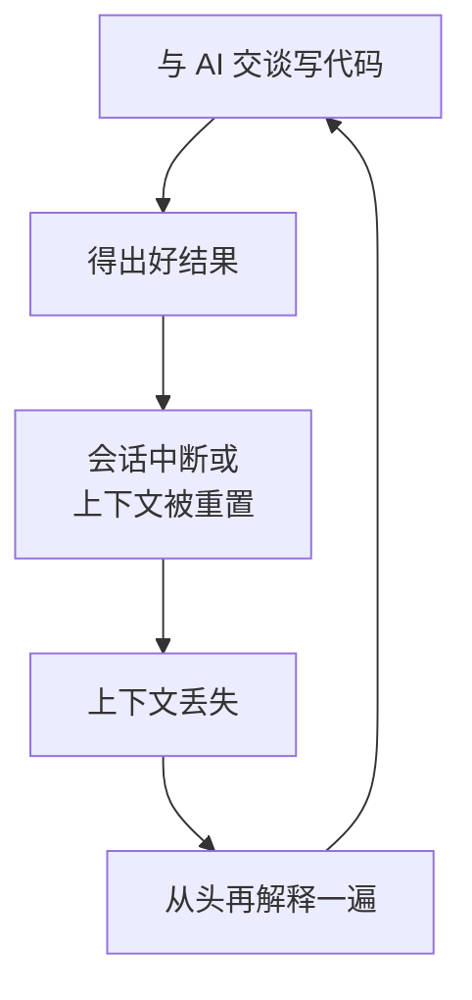
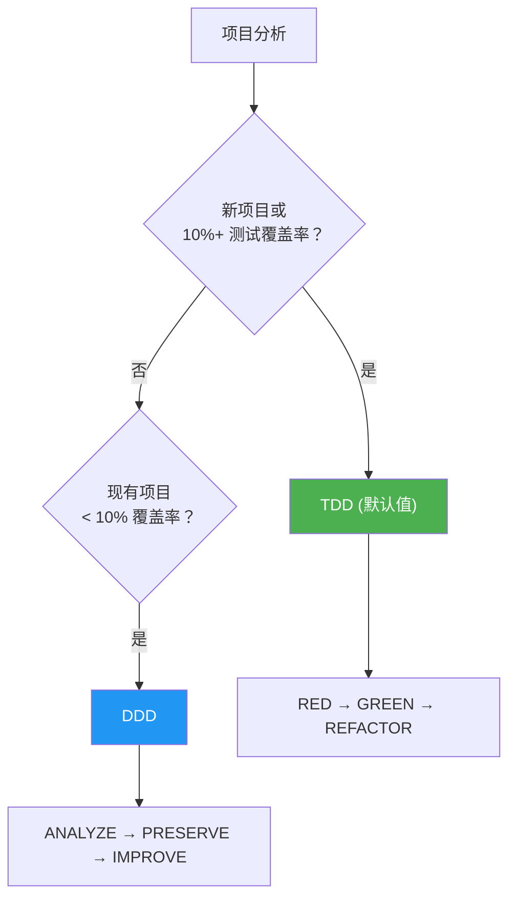
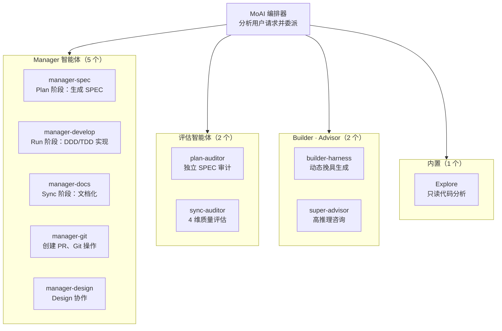
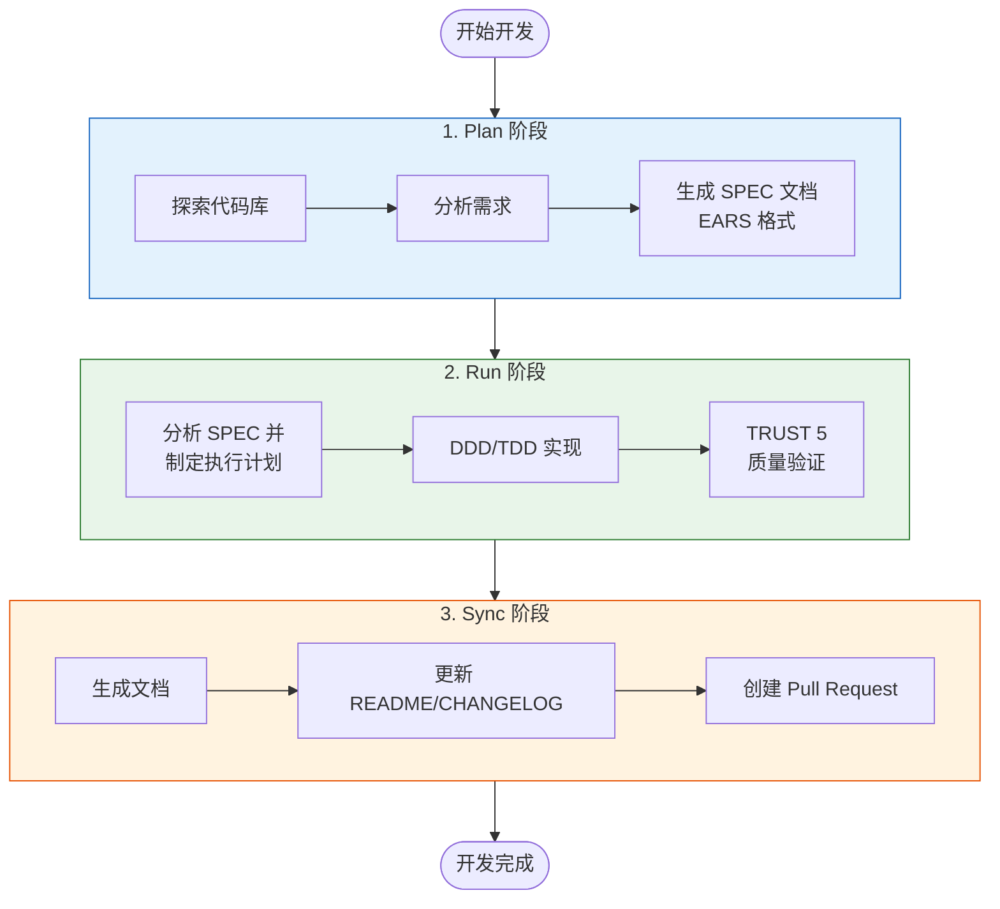
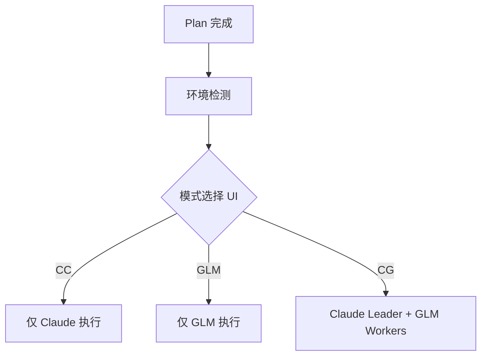

MoAI-ADK 是以 **代币经济学** (Token Economics) 为目标的 **Agentic Development Kit**。用更少的 token 得到同等质量的代码，用同样的 token 得到更高的质量 — 模型选择·推理深度·上下文用量都由系统管理。10 个专业 AI 智能体与 27 个技能协作，新项目自动应用 TDD（默认值），测试覆盖率低的现有项目自动应用 DDD。

用 Go 编写的单体二进制 -- 无依赖，在所有平台上即刻运行。


**一句话总结：** MoAI-ADK 是"把与 AI 的对话留成文档 (SPEC)、安全地改进代码 (DDD/TDD)、自动验证质量 (TRUST 5)"— 并且**连 token 成本也由系统管理**的智能体开发套件。


## MoAI-ADK 介绍

**MoAI** 意为"大家的 AI" (MoAI - Everybody's AI)。**ADK** 是 Agentic Development Kit 的缩写，指由 AI 智能体主导开发过程的工具集。

MoAI-ADK 是**让智能体们在 Claude Code 内相互协作、执行智能体编程的开发套件**。就像一个 AI 开发团队协作完成项目，每个智能体负责自己专业领域的工作。

| AI 开发团队 | MoAI-ADK | 角色 |
|----------|----------|------|
| 产品负责人 | 用户（开发者） | 决定要做什么 |
| 团队领队 / Tech Lead | MoAI 编排器 | 协调全部工作，委派给 10 个智能体 |
| 策划 / Spec Writer | manager-spec | 把需求整理为 SPEC 文档 |
| 开发者 / Engineers | manager-develop（注入领域上下文） | 用 DDD/TDD 实现实际代码 |
| QA / 代码审查员 | plan-auditor · sync-auditor | 独立审计计划与产出 |

## 核心价值 — 三大支柱

v3.0 的价值可以概括为三大支柱。

### 代币经济学 (Token Economics)

最大化成本效益的智能资源分配。按工作阶段与 SPEC 规模声明式分配模型与推理深度的 **3 层模型策略**、组合 Claude 领队与 GLM worker 把实现成本降低 60-70% 的 **CG 模式**、在超出预算之前优雅停机的 **Token Circuit Breaker**，以及缩减常驻加载上下文的**上下文瘦身**共同构成这一支柱。

### 智能体循环工程 (Agentic Loop Engineering)

循环自主工作，过程中积累观察。声明完成条件后会话持续工作直到条件满足的 **goal 引擎**、反复修复直到清空诊断工具找到的问题的 **Ralph Engine**（`/moai loop`）、与语言无关地分析自然语言请求意图并路由的 **Analyze-First 路由**都属于这里。积累的观察成为挽具学习的原料，指令沿 4 层学习阶梯（观察 → 启发式 → 规则 → 自动更新）演化 — 自动更新永远只在用户批准门禁之下应用。

### 智能体挽具 (Agentic Harness)

不直接写代码，而是设计让智能体高效工作的环境。10 个智能体目录、基于 SPEC 的 3-phase 工作流（plan → run → sync）、TRUST 5 质量门禁，以及用自然语言请求生成项目专属挽具的 Harness v4 Builder 构成这一支柱。详细概念请参考[挽具工程](/zh/core-concepts/harness-engineering)文档。

## 为什么是代币经济学

token 单价持续下降，但智能体开发的 token 用量增长得更快。智能体越开越多、上下文越来越长、推理越来越深，决定成本的不再是模型价格，而是 **token 的运用方式**。

MoAI-ADK 的答案有三条。

1. **为每项任务分配合适的模型·推理深度** — 规划要深，实现要省，验证要独立。
2. **给上下文瘦身** — 最小化常驻加载的指令，并测量提示缓存命中率。
3. **预算由系统守护** — 追踪 token 使用，在超过阈值之前优雅停机。

## 为什么选 MoAI-ADK？

### 从 Python 到 Go 的完全重写

基于 Python 的 MoAI-ADK（约 73,000 行）已用 Go 完全重写。

| 项目 | Python 版本 | Go 版本 |
|------|-------------|----------|
| 分发 | pip + venv + 依赖 | **单体二进制**，零依赖 |
| 启动时间 | ~800ms 解释器启动 | **~5ms** 原生执行 |
| 并发 | asyncio / threading | **原生 goroutine** |
| 类型安全 | 运行时（mypy 可选） | **编译期强制** |
| 跨平台 | 需要 Python 运行时 | **预构建二进制**（macOS、Linux、Windows） |
| Hook 执行 | Shell 包装 + Python | **编译后二进制**，JSON 协议 |

### 核心数字（以 v3.0 为准）

- **10 个**智能体目录（9 个 MoAI 自定义 + 1 个 Anthropic 内置 `Explore`）
- **27 个**技能 (template-managed)
- **36 个** CLI 命令 · **15 种** `/moai` 子命令
- 支持 **16 种**编程语言
- 基于 **487 个** SPEC 文档开发的代码库

### 氛围编程的问题

**氛围编程** (Vibe Coding) 是与 AI 自然对话、边聊边写代码的方式。说一句"给我做个这样的功能"，AI 就生成代码。直观又快速，但在实际工作中会出现严重问题。


```mermaid
flowchart TD
    A["与 AI 交谈写代码"] --> B["得出好结果"]
    B --> C["会话中断或\n上下文被重置"]
    C --> D["上下文丢失"]
    D --> E["从头再解释一遍"]
    E --> A
```

**实际工作中遇到的具体问题：**

| 问题 | 场景示例 | 结果 |
|------|----------|------|
| **上下文丢失** | 昨天讨论 1 小时的认证方式今天要重新解释 | 浪费时间、一致性下降 |
| **质量不一致** | AI 有时生成好代码，有时生成坏代码 | 代码质量无法预测 |
| **破坏现有代码** | 说"把这里改一下"，结果别的功能坏了 | 产生 bug、需要回滚 |
| **重复解释** | 项目结构、编码规则每次都得重新告知 | 生产力下降 |
| **缺乏验证** | 没有办法确认 AI 生成的代码是否安全 | 安全漏洞、缺少测试 |
| **浪费 token** | 所有任务用同一模型·同一推理深度处理 | 成本无法预测、超出预算 |

### MoAI-ADK 的解决方案

| 问题 | MoAI-ADK 的解决方案 |
|------|------------------|
| 上下文丢失 | 用 **SPEC 文档**把需求保存为文件、永久留存 |
| 质量不一致 | 用 **TRUST 5** 框架应用一致的质量标准 |
| 破坏现有代码 | 用 **DDD/TDD** 先写测试保护既有功能 |
| 重复解释 | 用 **CLAUDE.md 与技能系统**自动加载项目上下文 |
| 缺乏验证 | 用 **LSP 质量门禁**自动验证代码质量 |
| 浪费 token | 用**模型策略 + Token Circuit Breaker**让系统管理成本 |

## 系统要求

| 平台 | 支持环境 | 备注 |
|--------|---------|------|
| macOS | Terminal、iTerm2 | 完全支持 |
| Linux | Bash、Zsh | 完全支持 |
| Windows | **WSL (推荐)**、PowerShell 7.x+ | 不支持原生 cmd.exe |

**必要条件：**
- 所有平台都需要安装 **Git**
- **Windows 用户**：**必须**安装 [Git for Windows](https://gitforwindows.org/)（含 Git Bash）
  - 为获得最佳体验，推荐使用 **WSL** (Windows Subsystem for Linux)
  - PowerShell 7.x 以上作为备选支持
  - 旧版 Windows PowerShell 5.x 与 cmd.exe **不受支持**

## 快速开始

### 1. 安装

#### macOS / Linux / WSL

```bash
curl -fsSL https://raw.githubusercontent.com/modu-ai/moai-adk/main/install.sh | bash
```

#### Windows (PowerShell 7.x+)

> **推荐**：使用上面的 Linux 安装命令配合 WSL 可获得最佳体验。

```powershell
irm https://raw.githubusercontent.com/modu-ai/moai-adk/main/install.ps1 | iex
```

> 必须先安装 [Git for Windows](https://gitforwindows.org/)。

#### 从源码构建 (Go 1.26+)

```bash
git clone https://github.com/modu-ai/moai-adk.git
cd moai-adk && make build
```

> 预构建二进制可在 [Releases](https://github.com/modu-ai/moai-adk/releases) 页面下载。

### 2. 初始化项目

```bash
moai init my-project
```

交互式向导自动检测语言、框架、方法论后，生成 Claude Code 集成文件。

### 3. 在 Claude Code 中开始开发

```bash
# Claude Code 실행 후
/moai project                            # 프로젝트 문서 생성 (product.md, structure.md, tech.md)
/moai plan "사용자 인증 추가"              # SPEC 문서 생성
/moai run SPEC-AUTH-001                   # DDD/TDD 구현
/moai sync SPEC-AUTH-001                  # 문서 동기화 및 PR 생성
```

也可以直接用自然语言发出请求 — `/moai "登录 bug 修一下"` 会经过 **Analyze-First** 意图分析，路由到合适的工作流。

## 核心哲学


**"氛围编程的目的不是快速生产，而是代码质量。"**

MoAI-ADK 不是快速刷代码的工具。目标是善用 AI，做出比人亲手编写**质量更高**的代码。快只是守住质量后自然而然的附带效果。


这一哲学具体化为三条原则：

1. **规格优先** (SPEC-First)：写代码之前先用文档明确定义要做什么
2. **安全改进** (DDD/TDD)：在保存现有代码行为的前提下渐进改进
3. **自动质量验证** (TRUST 5)：用 5 项质量原则自动验证所有代码

## MoAI 开发方法论

MoAI-ADK 会根据项目状态自动选择最优开发方法论。


```mermaid
flowchart TD
    A["项目分析"] --> B{"新项目或\n10%+ 测试覆盖率？"}
    B -->|"是"| C["TDD (默认值)"]
    B -->|"否"| D{"现有项目\n< 10% 覆盖率？"}
    D -->|"是"| E["DDD"]
    C --> F["RED → GREEN → REFACTOR"]
    E --> G["ANALYZE → PRESERVE → IMPROVE"]

    style C fill:#4CAF50,color:#fff
    style E fill:#2196F3,color:#fff
```

### TDD 方法论（默认值）

新项目与功能开发的默认方法论。先写测试，再实现。

| 阶段 | 说明 |
|------|------|
| **RED** | 编写定义预期行为的失败测试 |
| **GREEN** | 编写通过测试的最少代码 |
| **REFACTOR** | 保持测试通过的同时改进代码质量。 |

对于棕地项目（既有代码库），TDD 会增加 **pre-RED 分析阶段**：在编写测试之前先阅读现有代码，理解当前行为。

### DDD 方法论（现有项目，覆盖率低于 10%）

用于安全重构测试覆盖率低的现有项目的方法论。

```
ANALYZE   → 기존 코드와 의존성 분석, 도메인 경계 식별
PRESERVE  → 특성화 테스트 작성, 현재 동작 스냅샷 캡처
IMPROVE   → 테스트 보호 하에 점진적 개선.
```


方法论在 `moai init` 时自动选择（`--mode <ddd|tdd>`，默认值：tdd），可在 `.moai/config/sections/quality.yaml` 的 `development_mode` 中更改。

**提示**：MoAI-ADK v2.5.0+ 采用二元方法论选择（仅 TDD 或 DDD）。混合模式为了清晰与一致性已被移除。


## 挽具工程架构

MoAI-ADK 实现了 **挽具工程** (Harness Engineering) 范式 — 不是直接写代码，而是设计 AI 智能体的工作环境。

| 组成要素 | 说明 | 命令 |
|----------|------|--------|
| **Self-Verify Loop** | 智能体自主执行编码 → 测试 → 失败 → 修复 → 通过的循环 | `/moai loop` |
| **Goal 引擎** | 声明完成条件后，会话自主持续工作直到条件满足或达到轮次上限 | `/moai goal` |
| **Context Map** | 代码库架构图与文档始终提供给智能体 | `/moai codemaps` |
| **Session Persistence** | `progress.md` 跨会话追踪已完成步骤；中断的执行自动恢复 | `/moai run SPEC-XXX` |
| **Failing Checklist** | 所有验收标准在执行开始时注册为待办任务；实现完成后标记完成 | `/moai run SPEC-XXX` |
| **Language-Agnostic** | 支持 16 种语言：自动检测语言，选择正确的 LSP/lint/测试/覆盖率工具 | 所有工作流 |
| **Garbage Collection** | 定期扫描并清除死代码、AI Slop、未使用的 import | `/moai clean` |
| **Scaffolding First** | 实现前生成空文件桩，防止熵增 | `/moai run SPEC-XXX` |


"人掌舵，智能体执行。" — 工程师的角色从编写代码转向设计挽具（SPEC、质量门禁、反馈循环）。完整概念在[挽具工程](/zh/core-concepts/harness-engineering)文档中介绍。


## AI 智能体编排

MoAI 是**战略编排器**。它不直接写代码，而是把工作委派给 10 个保留智能体（9 个 MoAI 自定义 + 1 个 Anthropic 内置 `Explore`）。核心设计原则是**规划与审计分离** — 谁做的东西不由谁来检查。

### 10 个智能体目录

| 分类 | 智能体 | 角色 |
|------|---------|------|
| **Manager** | manager-spec | Plan 阶段：生成 SPEC 文档 |
| | manager-develop | Run 阶段：DDD/TDD/autofix 实现 |
| | manager-docs | Sync 阶段：文档化与创建 PR |
| | manager-git | Git 工作流与基于 Tier 的 PR 路由 |
| | manager-design | Design 阶段：Claude Design 协作 |
| **Evaluator** | plan-auditor | SPEC 计划的独立审计（防止偏见） |
| | sync-auditor | 4 维质量评估（功能 40 · 安全 25 · 工艺 20 · 一致性 15） |
| **Builder** | builder-harness | 生成项目专属挽具（智能体/技能/命令） |
| **Advisor** | super-advisor | 高推理咨询（E1-E4 升级） |
| **内置** | Explore | 只读代码库探索 |


```mermaid
flowchart TD
    MoAI["MoAI 编排器\n分析用户请求并委派"]

    subgraph Managers["Manager 智能体（5 个）"]
        M1["manager-spec\nPlan 阶段：生成 SPEC"]
        M2["manager-develop\nRun 阶段：DDD/TDD 实现"]
        M3["manager-docs\nSync 阶段：文档化"]
        M4["manager-git\n创建 PR、Git 操作"]
        M5["manager-design\nDesign 协作"]
    end

    subgraph Evaluators["评估智能体（2 个）"]
        E1["plan-auditor\n独立 SPEC 审计"]
        E2["sync-auditor\n4 维质量评估"]
    end

    subgraph BuilderAdvisor["Builder · Advisor（2 个）"]
        B1["builder-harness\n动态挽具生成"]
        B2["super-advisor\n高推理咨询"]
    end

    subgraph Explore["内置（1 个）"]
        X1["Explore\n只读代码分析"]
    end

    MoAI --> Managers
    MoAI --> Evaluators
    MoAI --> BuilderAdvisor
    MoAI --> Explore
```

### 27 个技能 (Progressive Disclosure)

通过 3 级 Progressive Disclosure 系统实现 token 高效管理。只有技能描述（约 100 token）常驻列表，正文（约 5K token）仅在实际调用时加载 — 这是上下文瘦身的一环。

| 类别 | 示例 |
|----------|------|
| **Foundation** | core、cc、thinking、quality |
| **Workflow** | spec、project、ddd、tdd、testing、worktree |
| **Domain** | backend、frontend、database、html-report |
| **Language** | Go、Python、TypeScript、Rust、Java、Kotlin、Swift、C++... |
| **Platform** | Vercel、Supabase、Firebase、Auth0、Clerk... |
| **Reference** | REST/GraphQL patterns、OWASP、git workflow |
| **Tool** | ast-grep、svg |

## MoAI 工作流

### Plan → Run → Sync 流水线

MoAI 的核心工作流由 3 个阶段构成：


```mermaid
flowchart TD
    Start(["开始开发"]) --> Plan

    subgraph Plan["1. Plan 阶段"]
        P1["探索代码库"] --> P2["分析需求"]
        P2 --> P3["生成 SPEC 文档\nEARS 格式"]
    end

    Plan --> Run

    subgraph Run["2. Run 阶段"]
        R1["分析 SPEC 并\n制定执行计划"] --> R2["DDD/TDD 实现"]
        R2 --> R3["TRUST 5\n质量验证"]
    end

    Run --> Sync

    subgraph Sync["3. Sync 阶段"]
        S1["生成文档"] --> S2["更新 README/CHANGELOG"]
        S2 --> S3["创建 Pull Request"]
    end

    Sync --> Done(["开发完成"])

    style Plan fill:#E3F2FD,stroke:#1565C0
    style Run fill:#E8F5E9,stroke:#2E7D32
    style Sync fill:#FFF3E0,stroke:#E65100
```

Plan 阶段的产物由 **plan-auditor** 独立审计，进入 Run 阶段之前要经过**实现启动批准**（人工门禁）。Sync 阶段结束后，**sync-auditor** 执行 4 维质量评估 — 完成判定靠证据，而不是"感觉做完了"。

**实际使用示例：**

```bash
# 1. Plan: 요구사항 정의
> /moai plan "JWT 기반 사용자 인증 기능 구현"

# 2. Run: DDD/TDD 방식으로 구현
> /moai run SPEC-AUTH-001

# 3. Sync: 문서 생성 및 PR
> /moai sync SPEC-AUTH-001
```

#### 执行模式选择门禁

从 Plan 阶段转入 Run 阶段时，MoAI 会自动检测当前执行环境 (cc/glm/cg)，并显示用户可确认或更改的选择 UI。


```mermaid
flowchart TD
    A["Plan 完成"] --> B["环境检测"]
    B --> C{"模式选择 UI"}
    C -->|"CC"| D["仅 Claude 执行"]
    C -->|"GLM"| E["仅 GLM 执行"]
    C -->|"CG"| F["Claude Leader + GLM Workers"]
```

这道门禁确保无论环境状态如何都使用正确的执行模式，防止实现过程中的模式不一致。

### /moai 子命令

所有子命令都在 Claude Code 内以 `/moai <子命令>` 执行。

#### 核心工作流

| 子命令 | 别名 | 用途 | 主要标志 |
|-----------|------|------|-----------|
| `plan` | `spec` | 生成 SPEC 文档（EARS 格式） | `--worktree`、`--branch`、`--resume SPEC-XXX` |
| `run` | `impl` | SPEC 的 DDD/TDD 实现 | `--resume SPEC-XXX` |
| `sync` | `docs`、`pr` | 文档同步、代码图、创建 PR | `--merge`、`--skip-mx` |

#### 智能体循环

| 子命令 | 用途 | 主要标志 |
|-----------|------|-----------|
| `goal` | 声明完成条件的自主连续循环（直到条件满足或轮次上限） | `status`、`clear` |
| `loop` | 基于诊断的反复自动修复（goal 引擎之上的预设，最多 100 次） | `--max N`、`--auto-fix`、`--seq` |
| `fix` | 自动修复 LSP 错误、lint、类型错误（单次） | `--dry`、`--seq`、`--level N`、`--resume` |

#### 质量与代码库

| 子命令 | 别名 | 用途 | 主要标志 |
|-----------|------|------|-----------|
| `review` | `code-review` | 安全与 @MX 标签合规代码审查 | `--staged`、`--branch`、`--security` |
| `gate` | -- | 提交前质量门禁（lint/format/type/test 并行） | -- |
| `clean` | `refactor-clean` | 识别并安全删除死代码 | `--dry`、`--safe-only`、`--file PATH` |
| `mx` | -- | 扫描代码库并添加 @MX 代码级注释 | `--all`、`--dry`、`--priority P1-P4`、`--force` |
| `codemaps` | `update-codemaps` | 生成架构文档 | `--force`、`--area AREA` |

#### 项目与挽具

| 子命令 | 别名 | 用途 |
|-----------|------|------|
| `project` | `init` | 生成项目文档（product.md、structure.md、tech.md、codemaps/）+ 自动配置挽具 |
| `harness` | -- | 管理挽具学习生命周期 · 用自然语言生成挽具 |
| `feedback` | `fb`、`bug`、`issue` | 收集反馈并创建 GitHub issue |

#### 默认工作流（自然语言）

| 子命令 | 用途 | 主要标志 |
|-----------|------|-----------|
| *(无)* | Analyze-First 意图分析 → 全自主 plan → run → sync 流水线。复杂度评分 >= 5 时自动生成 SPEC。 | `--loop`、`--max N`、`--branch`、`--pr`、`--resume SPEC-XXX` |

### 编排模式

MoAI 编排器分析任务复杂度来选择执行形态。

| 模式 | 形态 | 适合的任务 |
|------|------|-----------|
| **顺序子智能体**（默认） | 逐阶段单智能体委派 | 编码为主的任务、可预测的工作流 |
| **并行子智能体** | 3-5 个只读智能体同时扇出 | 调查·审查·审计等并行分析 |
| **动态工作流** | 脚本编排多个智能体 | 大规模扫描、交叉验证研究 |


**v3.0 变更**：过去的 Agent Teams 静态编排层已退役。即使强制 `--team` 也会回退到子智能体模式。不过 Claude Code 的原生 teammate 运行时 — `moai cg` 的 tmux 分屏 — 依旧保留。团队模式质量钩子（TeammateIdle 的 LSP 门禁验证、TaskCompleted 的 SPEC 引用确认）也随原生 teammate 运行时一并保留。


### CG 模式（Claude + GLM 混合）

这是代币经济学支柱的实战工具。Leader 使用 **Claude API**、Workers 使用 **GLM API** 的混合模式，通过 tmux 会话级环境变量隔离实现。战略·规划·审计由 Claude 负责，大量实现由 GLM 承担，在实现为主的任务中节省 60-70% 成本。

```
┌─────────────────────────────────────────────────────────────┐
│  LEADER (현재 tmux 패인, Claude API)                         │
│  - /moai --team 실행 시 워크플로우 오케스트레이션             │
│  - plan, quality, sync 단계 처리                             │
│  - GLM 환경 없음 → Claude API 사용                           │
└──────────────────────┬──────────────────────────────────────┘
                       │ Agent Teams (새 tmux 패인)
                       ▼
┌─────────────────────────────────────────────────────────────┐
│  TEAMMATES (새 tmux 패인, GLM API)                           │
│  - tmux 세션 환경 상속 → GLM API 사용                        │
│  - run 단계에서 구현 작업 실행                                │
│  - SendMessage로 리더와 통신                                  │
└─────────────────────────────────────────────────────────────┘
```

```bash
# 1. GLM API 키 저장 (한 번만)
moai glm sk-your-glm-api-key

# 2. CG 모드 활성화
moai cg

# 3. 같은 패인에서 Claude Code 시작 (중요!)
claude

# 4. 팀 워크플로우 실행
/moai --team "작업 설명"
```

| 命令 | Leader | Workers | 需要 tmux | 成本节省 | 使用场景 |
|--------|--------|---------|----------|----------|----------|
| `moai cc` | Claude | Claude | 否 | - | 复杂任务、最高质量 |
| `moai glm` | GLM | GLM | 推荐 | ~70% | 成本优化 |
| `moai cg` | Claude | GLM | **必须** | **~60%** | 质量 + 成本平衡 |

### 自主开发循环 (Ralph Engine)

这是结合 LSP 诊断与 AST-grep 的自主错误修复引擎：

```bash
/moai fix       # 단일 패스: 스캔 → 분류 → 수정 → 검증
/moai loop      # 반복 수정: 완료 조건 충족까지 반복 (최대 100회)
```

**Ralph Engine 工作方式：**
1. **并行扫描**：同时运行 LSP 诊断 + AST-grep + lint
2. **自动分类**：把错误从级别 1（自动修复）到级别 4（需要用户介入）分类
3. **收敛检测**：同一错误反复出现时应用替代策略
4. **完成标准**：0 错误、0 类型错误、85%+ 覆盖率

如果想直接声明完成条件，请使用 goal 引擎：

```text
/moai goal "go test ./... exits 0; 모든 AC가 PASS로 기록"
/moai goal status
/moai goal clear
```

`/moai loop` 是构建在 goal 引擎之上的预设 — 反复修复，直到清空诊断工具找到的问题队列。

### 推荐工作流链

**新功能开发：**
```
/moai plan → /moai run SPEC-XXX → /moai sync SPEC-XXX
```

**Bug 修复：**
```
/moai fix (또는 /moai loop) → /moai review → /moai sync
```

**重构：**
```
/moai plan → /moai clean → /moai run SPEC-XXX → /moai review → /moai codemaps
```

**文档更新：**
```
/moai codemaps → /moai sync
```

## TRUST 5 质量框架

所有代码变更都以 5 项质量标准验证：

| 标准 | 含义 | 验证内容 |
|------|------|----------|
| **T**ested | 已测试 | 85%+ 覆盖率、特性测试、单元测试通过 |
| **R**eadable | 易读 | 清晰的命名规范、一致的代码风格、0 lint 错误 |
| **U**nified | 统一 | 一致的格式化、import 排序、遵循项目结构 |
| **S**ecured | 安全 | 遵循 OWASP、输入验证、0 安全警告 |
| **T**rackable | 可追踪 | Conventional Commits、引用 issue、结构化日志 |

## @MX 标签系统

MoAI-ADK 使用 **@MX 代码级注释系统**在 AI 智能体之间传递上下文、不变量与危险区域。

| 标签类型 | 用途 | 添加时机 |
|----------|------|----------|
| `@MX:ANCHOR` | 重要契约 | fan_in >= 3 的函数，变更影响范围广 |
| `@MX:WARN` | 危险区域 | goroutine、复杂度 >= 15、全局状态变更 |
| `@MX:NOTE` | 传递上下文 | 魔法常量、缺失文档、业务规则 |
| `@MX:TODO` | 未完成工作 | 缺少测试、未实现功能 |

@MX 标签系统被设计为**只标记最危险、最重要的代码**。大部分代码不需要标签，这是正常的设计。

```bash
# 전체 코드베이스 스캔
/moai mx --all

# 미리보기 (파일 수정 없음)
/moai mx --dry

# 우선순위별 스캔
/moai mx --priority P1
```

## 模型策略（代币经济学的核心）

MoAI-ADK 会根据 Claude Code 订阅套餐为智能体分配最优 AI 模型。目标是在套餐用量限制内将质量最大化 — 规划·审计等推理密集的阶段分配高端模型，重复性实现·文档化分配轻量模型。

| 策略 | 套餐 | 特点 |
|------|--------|------|
| **High** | Max $200/月 | 最高质量 — 规划·审计分配 Opus，最大吞吐量 |
| **Medium** | Max $100/月 | 质量与成本的平衡 |
| **Low** | Plus $20/月 | 经济，不含 Opus — 以 Sonnet 为主分配 |

### 设置方法

```bash
# 프로젝트 초기화 시
moai init my-project          # 대화형 마법사에서 모델 정책 선택

# 기존 프로젝트 재설정
moai update                   # 각 설정 단계에 대한 대화형 프롬프트
```


默认策略为 `High`。GLM 设置隔离在 `settings.local.json` 中（不会提交到 Git）。设置键为 `model_policy: high | medium | low`。


## Task 指标日志

MoAI-ADK 在开发会话中自动捕获 Task 工具指标：

- **位置**：`.moai/logs/task-metrics.jsonl`
- **捕获的指标**：token 用量、工具调用、耗时、智能体类型
- **目的**：会话分析、性能优化、成本追踪

Task 工具完成时，PostToolUse 钩子会记录指标。用这些数据分析智能体效率、优化 token 消耗 — 代币经济学从测量开始。

## 项目结构

安装 MoAI-ADK 后，项目中会生成如下结构。

```
my-project/
├── CLAUDE.md                  # MoAI의 실행 지침서
├── .claude/
│   ├── agents/moai/           # 9개 MoAI 커스텀 에이전트 정의 (+ Explore 빌트인)
│   ├── skills/moai-*/         # 27개 스킬 모듈
│   ├── hooks/moai/            # 자동화 훅 스크립트
│   └── rules/moai/            # 코딩 규칙 및 표준
└── .moai/
    ├── config/                # MoAI 설정 파일
    │   └── sections/
    │       └── quality.yaml   # TRUST 5 품질 설정
    ├── specs/                 # SPEC 문서 저장소
    │   └── SPEC-XXX/
    │       └── spec.md
    └── memory/                # 세션 간 컨텍스트 유지
```

**主要文件说明：**

| 文件/目录 | 角色 |
|--------------|------|
| `CLAUDE.md` | MoAI 阅读的执行指南。包含项目规则、智能体目录、工作流定义 |
| `.claude/agents/` | 定义各智能体的专业领域与工具权限 |
| `.claude/skills/` | 包含编程语言、平台最佳实践的知识模块 |
| `.moai/specs/` | 保存 SPEC 文档的地方。每个功能有独立目录 |
| `.moai/config/` | 管理 TRUST 5 质量标准、DDD/TDD 设置等项目配置 |

## 多语言支持

MoAI-ADK 支持 4 种语言。用户用韩语提问就用韩语回答，用英语提问就用英语回答。

| 语言 | 代码 | 支持范围 |
|------|------|----------|
| 韩语 | ko | 对话、文档、命令、错误消息 |
| 英语 | en | 对话、文档、命令、错误消息 |
| 日语 | ja | 对话、文档、命令、错误消息 |
| 中文 | zh | 对话、文档、命令、错误消息 |


**语言设置：** 在 `.moai/config/sections/language.yaml` 中可分别设置对话语言、代码注释语言、提交信息语言。例如可以设置为对话用中文，代码注释与提交信息用英语。


## 下一步

理解了 MoAI-ADK 的整体图景后，接下来该详细了解各个核心概念了。

- [挽具工程](/zh/core-concepts/harness-engineering) -- 学习设计智能体工作环境的范式
- [基于 SPEC 的开发](/zh/core-concepts/spec-based-dev) -- 学习如何用文档定义需求
- [领域驱动开发](/zh/core-concepts/ddd) -- 学习安全改进现有代码的方法
- [TRUST 5 质量](/zh/core-concepts/trust-5) -- 学习自动验证代码质量的方法
- [MoAI Memory](/zh/claude-code/context-memory/memory) -- 学习上下文如何跨会话保存
