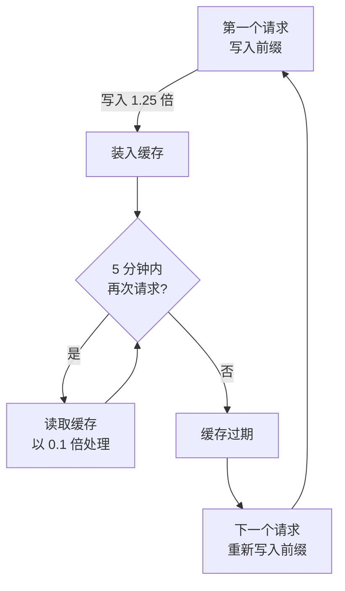

# 提示缓存 —— 成本节约与盈亏平衡

**提示缓存** (prompt caching) 不再重算上一请求已经处理过的前段，而是直接复用。模型每个回合都会从头重发整段对话，只要前段与上一请求相同，就从缓存取用，按原价的约 10% 处理。因此对话越长、重复出现的上下文越大，节省的幅度就越大。


本文从 **成本** 视角讨论提示缓存 —— 节省原理、盈亏平衡、缓存变凉时漏钱的位置，以及自主级别与成本的关系。运作原理与上下文管理的详细说明请看[提示缓存](/zh/claude-code/context-memory/prompt-caching)。两篇文档从不同角度照亮同一功能 —— 那边是上下文管理，这边是成本优化。


## 为什么成本会降下来

模型在请求与请求之间什么都记不住。所以 Claude Code 每个回合都构造新的 API 请求，从头装进**全部上下文** —— 系统提示、项目指令、工具定义、至今为止的对话与工具结果，再加上新消息。

关键在于新内容总是**追加在最末尾**。每个请求的绝大部分与上一请求完全相同，真正新的只有最后一次交换。提示缓存解决的正是这道"不变的前段"，让它不必每次重算。如果说 MoAI-ADK 的**代币经济学** (tokenomics) 负责削减常驻加载的上下文本身，提示缓存就是把剩下的上下文拿来廉价复用。

## 前缀与三个层

缓存要命中，请求的开头部分 —— **前缀** (prefix) —— 必须与上一请求 100% 相同。这个前缀按固定顺序组装。

| 顺序 | 层 | 装入什么 | 何时变化 |
|------|------|-----------------|-------------|
| 1 | 工具定义 (tools) | 内置工具 + MCP 工具 schema | MCP 服务器连接 · 断开、升级 |
| 2 | 系统提示 (system) | 核心指令、权限规则、`CLAUDE.md`、自动记忆 | 权限规则变更、会话启动文件编辑、`/clear` |
| 3 | 消息 (messages) | 用户输入 + 回应 + 工具结果 | 每个回合（追加在最末尾） |

几乎不变的内容排在前头。只有消息层变化时，工具定义与系统提示保持缓存。反过来，系统提示或工具定义一变，后面的所有内容都落在另一个前缀之后，**整体失效** —— 一个回合又慢又贵。

这里只需记住一件事 —— **前段越稳定，缓存活得越久，节省越大。** 必须精确匹配才能命中、每个模型 · effort 档位各自独立建缓存等更深的说明，都在[上下文管理文档](/zh/claude-code/context-memory/prompt-caching)里。

## 成本结构与盈亏平衡

缓存运转得好不好，看 API 随每次响应报告的两个代币数值就知道。

| 字段 | 含义 | 成本（相对基本输入单价） |
|------|------|----------------------------|
| `cache_read_input_tokens` | 从缓存**读取**的代币 | **0.1 倍**（≈10%） |
| `cache_creation_input_tokens` | **新写入**缓存的代币 | **1.25 倍**（5 分钟 TTL） · **2 倍**（1 小时 TTL） |

读取只要一般输入的 10%，因此从缓存读的比例越高，同样的工作处理得越便宜。写入比一般输入贵 25%，但这是一笔"先多付一次、后面省回来"的投资。

### 盈亏平衡： 2 个请求

缓存开始净赚的时点很明确 —— **第 2 个请求**。

第一个请求为把前缀写入缓存支付 1.25 倍（5 分钟 TTL）。TTL 之内到来的第二个请求以 0.1 倍读取该前缀。两个请求合起来，已经抵消并超过首次写入的溢价。以同一前缀延续的请求越多，节省越累积。


**实用法则**： 同一前缀的请求连续 2 个以上时，缓存稳赚不赔。一次就结束的工作，用不用缓存对成本影响不大。


### 缓存成本的流动



### 直接调用 API 的情形

以下仅适用于**直接调用 Anthropic API 的开发者**。Claude Code 用户不适用 —— 运行时会自行管理。

原则只有一条 —— **断点放在每次请求都变的数据（问题、时间戳）之前的最后一个稳定块上**。

```python
# 在稳定的系统提示上放置缓存断点
response = client.messages.create(
    model="claude-opus-4-8",
    max_tokens=1024,
    system=[{
        "type": "text",
        "text": "稳定的系统提示...",
        "cache_control": {"type": "ephemeral", "ttl": "1h"}
    }],
    messages=[{"role": "user", "content": user_query}]
)
```

## 5 分钟寿命： 漏钱的位置

命中缓存的请求持续到来时缓存保持温热，但**5 分钟内一次请求都没有**就会过期。这个寿命是**基于空闲** (idle-based) 的 —— 距最后一个请求过了 5 分钟，缓存消失，下一个请求必须从头重写前缀。

需要人介入的长等待一旦超过这 5 分钟，缓存就凉了。回答问题的时间、等待审查的时间都算在内。上下文越大，这笔过期成本也越大 —— 要重新填充的前缀更大。所以，不是真正必要的闸门，就别在上下文很大的状态下久停。

| 认证方式 | 默认 TTL | 备注 |
|-----------|----------|------|
| Claude 订阅 (Pro/Max/Team/Enterprise) | 1 小时（自动，无额外费用） | 超出额度时自动切换为 5 分钟 |
| API 密钥 · 第三方 | 5 分钟 | 可用 `ENABLE_PROMPT_CACHING_1H=1` 切换为 1 小时 |

Claude Code 2.1.243 起，`promptCacheTtl` 和 `subagentPromptCacheTtl` 设置（环境变量 `CLAUDE_CODE_PROMPT_CACHE_TTL` / `CLAUDE_CODE_SUBAGENT_PROMPT_CACHE_TTL`）允许 API 密钥和云提供商会话只为主对话保留 1 小时缓存，子代理仍为 5 分钟。z.ai 等第三方网关是否真正生效尚未实测 —— 网关环境下，确认之前请按 5 分钟默认值来规划。

## 破坏缓存的行为（成本视角）

做出下列行为后，下一个请求错过缓存，一个回合又慢又贵。付过一次又慢又贵的回合之后，新前缀会重新缓存。

| 行为 | 影响 |
|------|------|
| 切换模型 (`/model`) | 整体重算（每个模型缓存独立） |
| 变更 effort 档位 (`/effort`) | 整体重算 |
| MCP 服务器连接 · 断开 | 工具定义层失效 → 整体 |
| 整体拒绝工具（`Bash`、`WebFetch` 等裸名 deny 规则） | 工具定义层失效 → 整体 |
| 对话压缩 (`/compact`、自动压缩) | 消息层重写 |
| Claude Code 升级 | 系统提示 · 工具定义变化 → 整体重建 |

> `Bash(rm *)` 这类**限定范围**的 deny 规则，以及所有 allow · ask 规则，不改变工具集合，前缀原样保留。


**会话启动文件尤其昂贵** —— `CLAUDE.md`、`.claude/rules/` 下的规则、输出风格、常驻加载的技能，在会话启动时进入系统提示层。会话中途修改这些文件，系统提示层随之变化，整体失效；若上下文已经变大，整个前缀都要重写。这类修改请**集中到工作结束时或 `/clear` 之前**做。


失效的完整清单与"保住缓存的行为"在[上下文管理文档](/zh/claude-code/context-memory/prompt-caching)里。

## 自主级别 (MOAI_AUTONOMY_TIER) 与成本 · 速度

MoAI-ADK 的自主级别决定的是"人介入到什么频率"，并不直接改变缓存行为。但**人介入越频繁，缓存变凉的空档越多**，成本随之受影响。

`MOAI_AUTONOMY_TIER` 环境变量有三个值。

| 级别 | 人工介入 | 对缓存的影响 |
|------|-----------|-------------------|
| `semi-auto`（默认） | 每一步确认 · 审批闸门 | 长等待频繁越过 5 分钟寿命 → 缓存重写频繁 |
| `automatic` | 执行自主，仅核心决策确认 | 阻塞等待减少，缓存更久温热 |
| `fully-autonomous` | 人工介入最少（需要沙箱） | 等待最少，最有利于维持缓存温度 |

semi-auto 下，等待任务开工批准或回答问题很容易停超过 5 分钟，其间缓存变凉。等人回来的那一刻，要按 1.25 倍重写已经变大的前缀。级别越高，这类阻塞等待越少，**同样的工作处理得更便宜也更快**。


成本与速度的收益来自少走审查闸门。`automatic` 与 `fully-autonomous` 下，提交前的同步验证（vet · lint · test）闸门关闭；`fully-autonomous` 下连生命周期钩子都降为观察专用。省下成本的同时，人工直接确认的位置也在减少——级别选择不只是成本问题，也是**审查责任**问题。


## 模型选择对缓存成本的影响

模型是缓存键的一部分。内容相同，模型一换就整体重算。所以保持模型一致本身就是省缓存成本的事。MoAI-ADK 用两道装置守住这份一致性。

- **配置矩阵** (profile matrix)： max · medium · low 三档配置为每个智能体定下 `{模型, effort 档位}` 格子。用 `moai model profile --json` 查询。每个智能体的模型固定后，即使同时启动多个智能体，缓存也不会被搅动。
- **逐智能体的模型注入** (model-policy)： 每次 `Agent()` 启动都明确写出模型。智能体定义的默认值是 `model: inherit`，漏写模型就会悄悄回落到父会话的模型——这是搅动缓存的常见原因。声明的模型与实际解析出的模型不一致时，按漂移捕获。

每个模型能进入缓存的**最小代币数**也不同。比这更短的前缀不会入缓存（不报错，按普通方式处理）。

| 模型 | 上下文 | 最小缓存代币 |
|------|----------|----------------|
| Claude Fable 5 | 256K | 512 |
| Claude Opus 5 | 1M | 1,024 |
| Claude Sonnet 5 | 200K | 1,024 |
| Claude Opus 4.7 | 1M | 2,048 |
| Claude Haiku 4.5 | 200K | 4,096 |

> 像 2026 年阵容里的 Opus 4.8（1M 上下文）这样的新模型，最小缓存代币按各自家族另行设定；上表没有的模型请到[官方提示缓存文档](https://platform.claude.com/docs/en/build-with-claude/prompt-caching)确认。

## 省成本的习惯

缓存自动开启，但带着缓存意识工作，能省下远多于预期的成本与延迟。核心只有一条 —— 不变的前段维持得越久收益越大，所以要守住这段前段不被搅动。

1. **会话开始时定死，中途不改**： 模型、effort 档位、MCP 服务器在会话开始时定好，直到工作结束保持不动。这三样是引发整体重算最常见的原因。
2. **常驻加载文件留到工作末尾再改**： 会话中途修改 `CLAUDE.md`、规则、输出风格、常驻加载技能会导致整体失效。集中到一个工作结束后或 `/clear` 之前处理。
3. **别在上下文很大时长停**： 超过 5 分钟的等待会凉掉缓存。上下文越大，重新填充的成本也越大。
4. **`/compact` 放在自然的关口**： 在工作与工作之间有意义的边界执行。若走错了路，能回退到已缓存回合的 **`/rewind`** 比整体重新摘要的 `/compact` 更便宜。
5. **`/clear` 只在真正需要时用**： `/clear` 会把温热的缓存整个丢掉。剩下的收尾工作不长的话，保持缓存直接收尾，比背着旧上下文开始大工作更便宜。

## 用 CG 模式再省一步

如果说缓存是"把同样的内容便宜地再用一遍"这一轴，**CG 模式** (CG Mode) 就是"少用贵模型"这一轴。它把 tmux 会话切分开，领队用 Claude、实现工作者用便宜的 GLM（z.ai 后端），在实现为主的工作上**把成本降低约 60-70%**。两条轴互不重叠 —— CG 模式下各后端的缓存由各后端自行处理（Claude 用提示缓存，GLM 用基于内容相似度的隐式缓存）。

详细结构与切换命令请看[CG 模式](/zh/multi-llm/cg-mode)。

## 成本监控

想看缓存运转得好不好，观察两个代币数值。

- **statusline**： 可以使用每个回合实时显示缓存命中 (cache hit) 的状态栏段。
- **API 响应**： `cache_read_input_tokens`（读取）与 `cache_creation_input_tokens`（写入）的比例是核心信号。

**读取对写入的比例**是缓存健康度的关键。读取压倒性地多于写入，说明缓存运转良好。反过来，写入代币每个回合都居高不下，说明前缀某处每次都在变 —— 到上面的"破坏缓存的行为"表里找原因。

延迟方面同样受益。不再重算不变的前缀，响应更快。只有缓存失效的那个回合会慢一次、贵一次。

## 小结

- **节省原理**： 以 0.1 倍复用不变的前段。前段越大、越稳定，节省越大。
- **盈亏平衡**： 2 个请求。第一个请求的 1.25 倍写入溢价，由 TTL 内第二个请求的 0.1 倍读取收回。
- **5 分钟寿命**： 长时间的人工等待会凉掉缓存。上下文很大时尤其昂贵。
- **自主级别**： `MOAI_AUTONOMY_TIER` 越高，阻塞等待越少，缓存保持温热，对成本 · 速度有利，但审查闸门也随之减少。
- **监控**： statusline cache hit + 读取/写入代币比例。

## 相关文档

- [提示缓存](/zh/claude-code/context-memory/prompt-caching) —— 运作原理、前缀匹配、上下文管理（上下文管理视角）
- [上下文窗口](/zh/claude-code/context-memory/context-window) —— 上下文窗口大小与各模型差异
- [CG 模式](/zh/multi-llm/cg-mode) —— Claude + GLM 混合，成本降低 60-70%
- [模型策略](/zh/multi-llm/model-policy) —— 逐智能体的模型注入与漂移防范

## 来源（官方文档）

- [How Claude Code uses prompt caching](https://code.claude.com/docs/en/prompt-caching) —— 自动管理、TTL 自动选择、失效因素
- [Prompt caching (API)](https://platform.claude.com/docs/en/build-with-claude/prompt-caching) —— `cache_control`、价格倍数、各模型最小代币
- [Manage costs effectively](https://code.claude.com/docs/en/costs) —— Claude Code 的自动成本优化
