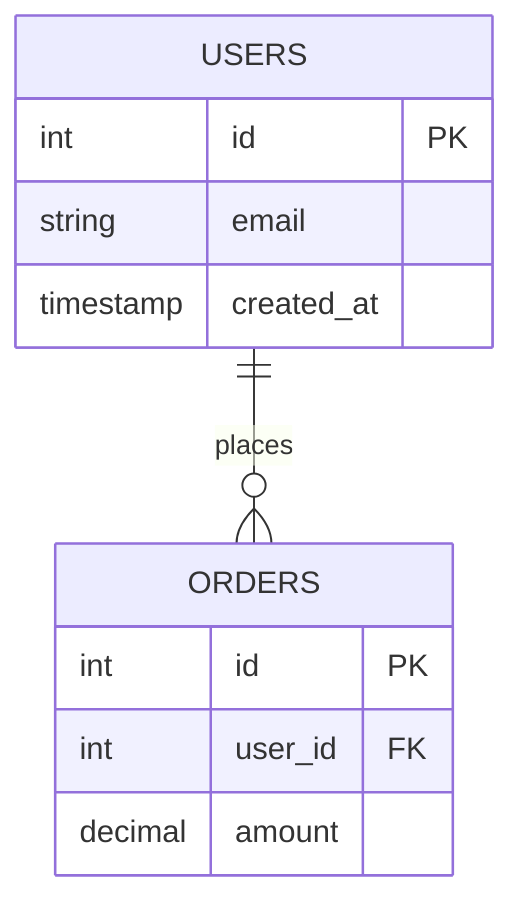

## 7 文件模板集

运行 `/moai db init` 时，这 7 个文件在 `.moai/project/db/` 中自动创建:

```
.moai/project/db/
├── README.md              (~50 行) 基本概述
├── schema.md              (自动生成) 表注册表
├── erd.mmd                (自动生成) 实体关系图
├── migrations.md          (自动生成) 迁移时间线
├── rls-policies.md        (模板) 行级安全
├── queries.md             (模板) 常见查询库
└── seed-data.md           (模板) 种子数据模式
```

## 每个文件的角色

### README.md

本部分的概述和导航指南。

内容:
- 数据库工作流介绍
- 7 个文件的描述
- 常见工作流 (添加迁移、更新架构)

此文件供用户编辑，自动更新时受保护。

### schema.md

自动文档化所有表、列和关系。

结构:

```markdown
# 架构

## 表索引

| 表 | 列数 | 主键 | 最新迁移 |
|---|------|------|--------|
| users | 8 | id | 20240101_create_users.sql |
| orders | 12 | id | 20240115_add_orders.sql |

## users

| 列 | 类型 | 约束 | 描述 |
|----|------|------|------|
| id | bigint | PRIMARY KEY, NOT NULL | 用户 ID |
| email | varchar(255) | UNIQUE, NOT NULL | 电子邮件地址 |
| created_at | timestamp | NOT NULL | 创建时间戳 |
```

**[HARD] 自动生成** — `/moai db refresh` 时完全重新生成。

### erd.mmd

使用 Mermaid 语法可视化表关系。

示例:



**[HARD] 自动生成** — `/moai db refresh` 时完全重新生成。

### migrations.md

应用的迁移文件时间线。

结构:

```markdown
# 迁移历史

## 2024 年 1 月

- `2024-01-01` — 001_create_users.sql — 创建用户表
- `2024-01-01` — 002_create_orders.sql — 创建订单表
- `2024-01-15` — 003_add_email.sql — 添加电子邮件字段

## 2024 年 2 月

- `2024-02-01` — 004_add_status.sql — 添加状态字段
```

**[HARD] 自动生成** — `/moai db refresh` 时完全重新生成。

### rls-policies.md

为 Supabase、PostgreSQL 等定义行级安全 (RLS) 政策。

此文件是用户创作的模板。示例:

```markdown
# 行级安全政策

## users 表

- **仅选择与 auth.uid() 匹配的行** — 用户只能查看自己的个人资料
- **仅 admin 角色可查看所有行** — 管理员可查看所有用户

## orders 表

- **仅选择自己的订单** — user_id = auth.uid()
- **管理员可查看所有订单** — 检查 admin 角色
```

此文件供用户编辑，自动更新时受保护。

### queries.md

AI 代理可参考的常见查询模式。

内容:

- 用户查询和身份验证
- 订单聚合查询
- 报告生成查询
- 数据迁移脚本

示例:

```sql
-- 按电子邮件查询用户
SELECT * FROM users WHERE email = $1;

-- 月度营收聚合
SELECT DATE_TRUNC('month', created_at) as month, SUM(amount)
FROM orders
GROUP BY DATE_TRUNC('month', created_at)
ORDER BY month DESC;
```

此文件供用户编辑，自动更新时受保护。

### seed-data.md

项目的初始数据或测试数据模式。

结构:

```markdown
# 种子数据

## 开发环境

### 默认用户

```json
{
  "email": "admin@example.com",
  "role": "admin"
},
{
  "email": "user@example.com",
  "role": "user"
}
```

## 生产环境

生产环境种子数据保留在单独的存储库中。
```

此文件供用户编辑，自动更新时受保护。

## _TBD_ 标记用于自定义

初始创建时，模板文件 (rls-policies.md、queries.md、seed-data.md) 包含 `_TBD_` 标记:

```markdown
# 行级安全政策

_TBD_: 在此输入项目的 RLS 政策。
```

找到每个 `_TBD_` 标记并:

1. 删除标记
2. 编写实际项目内容
3. 保存文件

例如:

```markdown
# 行级安全政策

## users 表

- **仅经过身份验证的用户可查看自己的数据** — auth.uid() = id
- **仅 admin 角色可查看所有行** — role = 'admin'
```

## 用户编辑内容保护

用户编辑的部分在自动同步期间受保护。

机制:

1. 向用户编辑块添加 SHA-256 哈希
2. `/moai db refresh` 执行时验证哈希
3. 哈希匹配则跳过该部分，仅更新自动生成部分

示例:

```markdown
---
# 自动生成部分
## 表索引
[自动更新]

---
# 用户自定义部分 (SHA-256: abc123...)
## 关系描述

这是用户直接编写的内容。
自动更新时保留。
```

## 生成的 schema.md 示例

初始化后，schema.md 看起来像:

```markdown
# 架构

## 表索引

| 表 | 列数 | 主键 | 最新迁移 |
|----|------|------|--------|
| users | 8 | id | 20240101_create_users.sql |

## users

创建: 20240101_create_users.sql

| 列 | 类型 | 允许 NULL | 默认值 | 描述 |
|----|------|---------|--------|------|
| id | bigint | NO | auto_increment | 用户唯一 ID |
| email | varchar(255) | NO | - | 电子邮件地址 |
| password_hash | varchar(255) | NO | - | 哈希密码 |
| created_at | timestamp | NO | CURRENT_TIMESTAMP | 账户创建时间 |

### 外键

无

### 索引

- PRIMARY KEY: id
- UNIQUE: email
```

## 相关配置文件

### db.yaml

`.moai/config/sections/db.yaml` 中的全局设置:

```yaml
db:
  auto_sync: true                        # 启用自动同步
  debounce_window_seconds: 10            # 去抖窗口
  approval_required: false               # 是否需要批准
  migration_patterns:                    # 自定义迁移路径
    - path: "db/migrations"
      language: "go"
```

## 工作流

### 典型工作流

1. 添加新迁移文件: `db/migrations/004_add_status.sql`
2. 自动同步钩子 10 秒后触发
3. `schema.md`、`erd.mmd`、`migrations.md` 自动更新
4. `rls-policies.md`、`queries.md`、`seed-data.md` 保持不变
5. 用户根据需要手动更新

### 完全重建

需要完全重建时:

```bash
/moai db refresh
```

提示:

```
完全重建架构? (y/n)
```

输入 "y" 将:
- 重新扫描所有迁移文件
- 完全重新生成 schema.md
- 完全重新生成 erd.mmd
- 完全重新生成 migrations.md
- 用户编辑部分受保护
```
