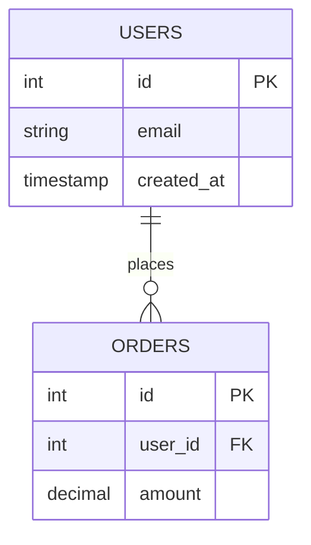

`.moai/project/db/` 是关于项目数据库的单一参照点。它分为 3 个自动生成
文件与 4 个用户编辑模板，自动生成部分由 `/moai db refresh` 管理，用户
编辑部分即使在更新期间也会受到保护。

## 7 个文件模板集

运行 `/moai db init` 时，`.moai/project/db/` 目录会自动生成以下 7 个文件：

```
.moai/project/db/
├── README.md              (~ 50 行) 基本概述
├── schema.md              (自动生成) 表注册表
├── erd.mmd                (自动生成) 实体关系图
├── migrations.md          (自动生成) 迁移时间线
├── rls-policies.md        (模板) Row-level security
├── queries.md             (模板) 常用查询库
└── seed-data.md           (模板) 种子数据模式
```

## 各文件的作用

### README.md

本部分的概述与导航指南。

内容：
- DB 工作流介绍
- 包含的 7 个文件说明
- 常见工作流程（添加迁移、更新架构）

此文件供用户编辑，自动更新时受保护。

### schema.md

自动记录所有表、列和关系。

结构：

```markdown
# 架构

## 表列表

| 表 | 列数 | 主键 | 最后迁移 |
|--------|--------|--------|-----------------|
| users | 8 | id | 20240101_create_users.sql |
| orders | 12 | id | 20240115_add_orders.sql |

## users

| 列 | 类型 | 约束 | 说明 |
|------|------|--------|------|
| id | bigint | PRIMARY KEY, NOT NULL | 用户唯一 ID |
| email | varchar(255) | UNIQUE, NOT NULL | 邮箱地址 |
| created_at | timestamp | NOT NULL | 创建时间 |
```

**自动生成文件** —— `/moai db refresh` 时会完全重新生成，请勿直接修改。

### erd.mmd

用 Mermaid 语法可视化表之间的关系。

示例：


```mermaid
erDiagram
    USERS ||--o{ ORDERS : places
    USERS {
        int id PK
        string email
        timestamp created_at
    }
    ORDERS {
        int id PK
        int user_id FK
        decimal amount
    }
```

**自动生成文件** —— `/moai db refresh` 时会完全重新生成，请勿直接修改。

### migrations.md

已应用迁移文件的时间线。

结构：

```markdown
# 迁移历史

## 2024 年 1 月

- `2024-01-01` — 001_create_users.sql — 创建用户表
- `2024-01-01` — 002_create_orders.sql — 创建订单表
- `2024-01-15` — 003_add_email.sql — 添加邮箱字段

## 2024 年 2 月

- `2024-02-01` — 004_add_status.sql — 添加状态字段
```

**自动生成文件** —— `/moai db refresh` 时会完全重新生成，请勿直接修改。

### rls-policies.md

在 Supabase、PostgreSQL 等环境中定义 Row-Level Security (RLS) 策略。

此文件是模板，由用户手动编写。示例：

```markdown
# Row-Level Security 策略

## users 表

- **只选择与 auth.uid() 匹配的行** — 只能查看自己的个人资料
- **只有 admin 角色可查看所有行** — 管理员可查看所有用户

## orders 表

- **只查看自己的订单** — user_id = auth.uid()
- **管理员可查看所有订单** — 校验 admin 角色
```

此文件供用户编辑，自动更新时受保护。

### queries.md

供 AI 代理参考的常用查询模式。代理不再每次都从头推理查询，而是复用经过
验证的模式，因此在质量和 Token 成本两方面都有收益。

内容：

- 用户查询与认证
- 订单聚合查询
- 报表生成查询
- 数据迁移脚本

示例：

```sql
-- 按邮箱查询用户
SELECT * FROM users WHERE email = $1;

-- 按月汇总销售额
SELECT DATE_TRUNC('month', created_at) as month, SUM(amount)
FROM orders
GROUP BY DATE_TRUNC('month', created_at)
ORDER BY month DESC;
```

此文件供用户编辑，自动更新时受保护。

### seed-data.md

项目的初始数据或测试数据模式。

结构示例 —— 开发环境部分将默认账户列表整理为 JSON：

```json
[
  { "email": "admin@example.com", "role": "admin" },
  { "email": "user@example.com", "role": "user" }
]
```

生产环境种子数据保存在单独的仓库中。

此文件供用户编辑，自动更新时受保护。

## 通过 _TBD_ 标记自定义

初次生成时，模板文件 (rls-policies.md, queries.md, seed-data.md) 中包含 `_TBD_` 标记：

```markdown
# Row-Level Security 策略

_TBD_: 请在此输入项目的 RLS 策略。
```

找到 `_TBD_` 标记后执行以下操作：

1. 删除标记
2. 编写实际项目内容
3. 保存

例如：

```markdown
# Row-Level Security 策略

## users 表

- **只有已认证用户可查看自己的数据** — auth.uid() = id
- **只有 admin 角色可查看所有行** — role = 'admin'
```

## 保护用户编辑的内容

用户修改过的部分即使在自动同步期间也会受到保护。

机制：

1. 为各文件的用户编辑块添加 SHA-256 哈希
2. 运行 `/moai db refresh` 时验证哈希
3. 若哈希一致则跳过该部分，只更新自动生成的部分

例如：

```markdown
---
# 自动生成部分
## 表列表
[自动更新]

---
# 用户自定义部分 (SHA-256: abc123...)
## 关系说明

这一部分是用户亲自编写的内容。
即使自动更新时也会保留。
```

## 生成的 schema.md 示例

初始化后，schema.md 形态如下：

```markdown
# 架构

## 表索引

| 表名 | 列数 | 主键 | 最后迁移 |
|---------|--------|--------|-----------------|
| users | 8 | id | 20240101_create_users.sql |

## users

创建: 20240101_create_users.sql

| 列 | 类型 | 允许 NULL | 默认值 | 说明 |
|------|------|---------|--------|------|
| id | bigint | NO | auto_increment | 用户唯一 ID |
| email | varchar(255) | NO | - | 邮箱地址 |
| password_hash | varchar(255) | NO | - | 哈希后的密码 |
| created_at | timestamp | NO | CURRENT_TIMESTAMP | 账户创建时间 |

### 外键

无

### 索引

- PRIMARY KEY: id
- UNIQUE: email
```

## 相关配置文件

### db.yaml

在 `.moai/config/sections/db.yaml` 中进行全局配置：

```yaml
db:
  auto_sync: true                        # 启用自动同步
  debounce_window_seconds: 10            # 防抖窗口
  approval_required: false               # 是否必须批准
  migration_patterns:                    # 自定义迁移路径
    - path: "db/migrations"
      language: "go"
```

## 工作流

### 常见工作流程

1. 添加新迁移文件：`db/migrations/004_add_status.sql`
2. 自动同步钩子在 10 秒后触发
3. 自动更新 `schema.md`、`erd.mmd`、`migrations.md`
4. `rls-policies.md`、`queries.md`、`seed-data.md` 保持不变
5. 用户在需要时手动更新

### 完全重建

需要手动重建时：

```bash
/moai db refresh
```

提示：

```
是否要完全重建架构? (y/n)
```

输入 "y" 后：
- 重新扫描所有迁移文件
- 完全重新生成 schema.md
- 完全重新生成 erd.mmd
- 完全重新生成 migrations.md
- 用户编辑部分受保护
