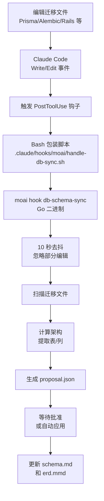

## 架构概述

MoAI 的数据库工作流自动检测迁移文件的更改并同步架构文档。这通过 PostToolUse 钩子实现。

## 事件流



## 自动检测

### 支持的事件

当迁移文件改变时自动检测:

| 语言 | 迁移路径 | 文件模式 |
|------|--------|---------|
| Go | `db/migrations/` | `*.sql` |
| Python | `alembic/versions/` | `*.py` |
| TypeScript | `prisma/migrations/` | `*.sql` |
| JavaScript | `migrations/` | `*.js` |
| Rust | `migrations/` | `*.sql` |
| Java | `src/main/resources/db/migration/` | `V*.sql` |
| Ruby | `db/migrate/` | `*.rb` |
| PHP | `database/migrations/` | `*.php` |

### 去抖窗口

为防止部分编辑造成错误，实现了 **10 秒去抖窗口**:

- 检测到迁移文件改变
- 等待 10 秒
- 10 秒内没有额外改变，则执行架构扫描
- 10 秒内有额外改变，则重置计时器

## 配置选项

### 启用自动同步

在 `.moai/config/sections/db.yaml` 中配置:

```yaml
db:
  auto_sync: true              # 默认: true
  debounce_window_seconds: 10  # 默认: 10 秒
  approval_required: false     # 默认: false (自动应用)
```

### 禁用自动同步

为项目禁用自动同步:

```yaml
db:
  auto_sync: false
```

此情况下，手动同步:

```bash
/moai db refresh
```

## 手动同步

使用 `/moai db refresh` 命令:

```bash
/moai db refresh
```

此命令:

1. 等待用户确认 (REQ-024) — "完全重建架构？"
2. 全量扫描所有迁移文件
3. 重新生成 schema.md、erd.mmd、migrations.md
4. 输出摘要

## 与 /moai sync 的关系

运行完整文档同步工作流 (`/moai sync`) 时:

- Phase 0.08: 数据库架构自动刷新
- 独立于自动同步钩子工作
- 执行所有文档的集成更新

## 用户编辑内容保护

自动同步期间，用户编辑的部分受保护:

- 使用 SHA-256 哈希跟踪更改
- 自动检测用户编辑部分
- 仅更新自动生成内容
- 保留用户编辑部分

例如在 `schema.md` 中:

```markdown
# 架构文档

## 自动生成部分
[自动更新]

## 自定义注释 (用户编辑)
[自动更新时保留]
```

## 验证钩子注册

检查 PostToolUse 钩子是否正确注册:

```bash
grep -A10 '"PostToolUse"' .claude/settings.json
```

预期输出:

```json
"PostToolUse": [{
  "hooks": [{
    "command": "\"$CLAUDE_PROJECT_DIR/.claude/hooks/moai/handle-db-sync.sh\"",
    "timeout": 15
  }]
}]
```

## 故障排除

### 钩子不工作

1. 检查钩子脚本是否存在:

```bash
ls -la .claude/hooks/moai/handle-db-sync.sh
```

2. 验证执行权限:

```bash
chmod +x .claude/hooks/moai/handle-db-sync.sh
```

3. 检查 moai 二进制路径:

```bash
which moai
```

### 架构更新不正确

禁用自动同步并手动验证:

```yaml
db:
  auto_sync: false
```

然后手动刷新以验证结果:

```bash
/moai db refresh
```
