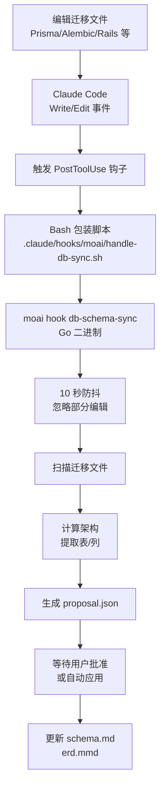

## 架构概述

MoAI 的数据库工作流会自动检测迁移文件的变更并同步架构文档。为了让人无需
记住"要更新文档"这件事，我们把这个观察回路挂在了 Claude Code 的
PostToolUse 钩子上 —— 代理干活，文档自动跟进。

## 事件流


```mermaid
flowchart TD
    A["编辑迁移文件<br/>Prisma/Alembic/Rails 等"] --> B["Claude Code<br/>Write/Edit 事件"]
    B --> C["触发 PostToolUse 钩子"]
    C --> D["Bash 包装脚本<br/>.claude/hooks/moai/handle-db-sync.sh"]
    D --> E["moai hook db-schema-sync<br/>Go 二进制"]
    E --> F["10 秒防抖<br/>忽略部分编辑"]
    F --> G["扫描迁移文件"]
    G --> H["计算架构<br/>提取表/列"]
    H --> I["生成 proposal.json"]
    I --> J["等待用户批准<br/>或自动应用"]
    J --> K["更新 schema.md<br/>erd.mmd"]
```

## 自动检测机制

### 支持的事件

迁移文件发生变更时会被自动检测：

| 语言 | 迁移路径 | 文件模式 |
|------|-----------------|---------|
| Go | `db/migrations/` | `*.sql` |
| Python | `alembic/versions/` | `*.py` |
| TypeScript | `prisma/migrations/` | `*.sql` |
| JavaScript | `migrations/` | `*.js` |
| Rust | `migrations/` | `*.sql` |
| Java | `src/main/resources/db/migration/` | `V*.sql` |
| Ruby | `db/migrate/` | `*.rb` |
| PHP | `database/migrations/` | `*.php` |

### 防抖窗口

若每次保存文件都触发扫描则过于浪费，因此为了防止部分编辑造成误报，设置了
**10 秒防抖窗口**：

- 检测到迁移文件变更
- 等待 10 秒
- 若 10 秒内没有进一步变更，执行架构扫描
- 若 10 秒内有进一步变更，重置计时器

## 配置选项

### 启用自动同步

在 `.moai/config/sections/db.yaml` 中配置：

```yaml
db:
  auto_sync: true              # 默认值: true
  debounce_window_seconds: 10  # 默认值: 10 秒
  approval_required: false     # 默认值: false (自动应用)
```

### 禁用自动同步

若要在特定项目中禁用自动同步：

```yaml
db:
  auto_sync: false
```

这种情况下需要手动同步：

```bash
/moai db refresh
```

## 手动同步方式

使用 `/moai db refresh` 命令：

```bash
/moai db refresh
```

这条命令会：

1. 等待用户确认 (REQ-024) —— "是否要完全重建架构?"
2. 完整扫描所有迁移文件
3. 重新生成 schema.md、erd.mmd、migrations.md
4. 输出结果摘要

## 与 /moai sync 的关系

运行整体文档同步工作流 (`/moai sync`) 时：

- Phase 0.08: 包含 DB 架构自动刷新
- 与自动同步钩子相互独立地运行
- 统一更新所有文档

## 保护用户编辑的内容

即使在自动同步期间，用户修改过的部分也会受到保护：

- 通过 SHA-256 哈希跟踪变更
- 自动检测用户编辑区间
- 只更新自动生成的内容
- 保留用户编辑的部分

例如在 `schema.md` 中：

```markdown
# 架构文档

## 自动生成部分
[自动更新]

## 自定义注释（用户编辑）
[即使自动更新时也会保留]
```

## 确认钩子配置

确认 PostToolUse 钩子是否正确注册：

```bash
grep -A10 '"PostToolUse"' .claude/settings.json
```

预期输出：

```json
"PostToolUse": [{
  "hooks": [{
    "command": "\"$CLAUDE_PROJECT_DIR/.claude/hooks/moai/handle-db-sync.sh\"",
    "timeout": 15
  }]
}]
```

## 问题排查

### 钩子不工作

1. 确认钩子脚本存在：

```bash
ls -la .claude/hooks/moai/handle-db-sync.sh
```

2. 确认执行权限：

```bash
chmod +x .claude/hooks/moai/handle-db-sync.sh
```

3. 确认 `moai` 二进制路径：

```bash
which moai
```

### 架构更新有误

禁用自动同步并手动验证：

```yaml
db:
  auto_sync: false
```

之后手动刷新并确认结果：

```bash
/moai db refresh
```
