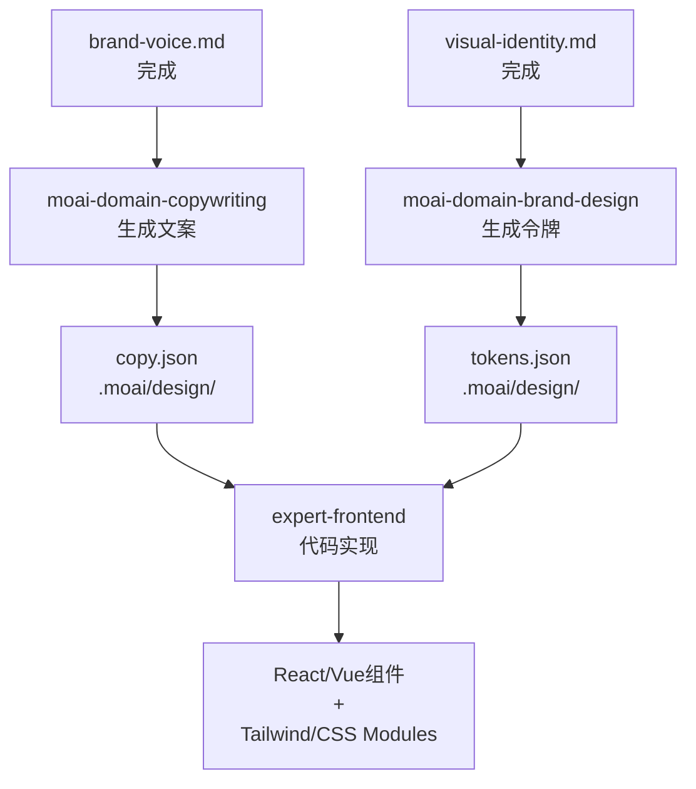

# 代码路径

路径B从**完整的品牌背景**自动生成设计令牌和组件规范。

## 必需文件

路径B需要三个完整文件:

### 1. brand-voice.md

品牌语调、术语、消息指导

**用于:** `moai-domain-copywriting`技能生成hero、功能、CTA等文案

### 2. visual-identity.md

颜色、排版、视觉语言

**用于:** `moai-domain-brand-design`技能生成设计令牌

### 3. target-audience.md

目标客户档案和偏好

**用于:** 文案和设计的所有阶段

## 技能架构

### moai-domain-copywriting

**目的:** 生成符合品牌voice的营销文案

**输出:** 结构化JSON(hero、features、CTA等部分)

**Anti-AI-Slop规则:**
- 包含具体数字("削减90%" 是,"大幅" 否)
- 读者为主语("你能成功" 是)
- 主动语态优先
- 删除抽象表达

### moai-domain-brand-design

**目的:** 自动生成设计令牌和组件规范

**输出:** 设计令牌JSON + 组件规范

**WCAG AA合规:**
- 颜色对比度比例4.5:1最小(文本)
- 3:1最小(图形元素)
- 自动验证

## 工作流



## 运行路径B

### 步骤1: 验证品牌文件

```bash
ls -la .moai/project/brand/
# brand-voice.md       ✓
# visual-identity.md   ✓
# target-audience.md   ✓
```

### 步骤2: 运行/moai design

```
/moai design
```

### 步骤3: 选择路径B

```
选择路径:

1. (推荐) 使用Claude Design...
2. 代码设计(文案 + 设计令牌)
   → 无需额外订阅

选择: 2
```

### 步骤4: 自动生成

`moai-domain-copywriting` → `moai-domain-brand-design`执行

**生成文件:**
- `.moai/design/copy.json` — 页面文案
- `.moai/design/tokens.json` — 设计令牌
- `.moai/design/components.json` — 组件规范

### 步骤5: 进入GAN Loop

`expert-frontend`代理:
1. 接收令牌和文案
2. 生成React/Vue组件 + 样式
3. `evaluator-active`评分(4维)
4. 失败时修正迭代(最多5次)

## 设计期间编辑品牌文件

如需中途调整:

```bash
# 编辑文件
vim .moai/project/brand/visual-identity.md

# 重新运行(覆盖生成的文件)
/moai design
```

结果:
- `tokens.json`重新生成(新颜色/排版)
- `copy.json`保留(手动编辑时受保护)

## 后续步骤

- [GAN Loop](./gan-loop.md) — Builder-Evaluator迭代过程
- [Sprint Contract协议](./gan-loop.md#sprint-contract协议) — 每次迭代的接受标准
- [4维评分](./gan-loop.md#4维评分) — 详细评分标准
