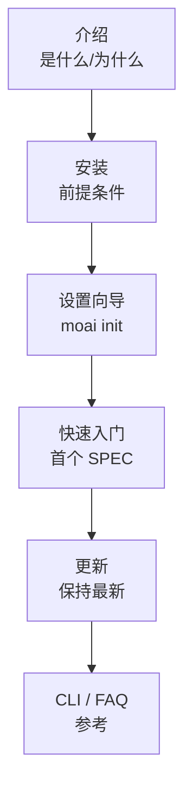

欢迎使用 MoAI-ADK。按照 **介绍 → 安装 → 快速入门** 的顺序阅读，30 分钟内即可运行第一个 MoAI-ADK 项目。


已完成安装？直接前往 [快速入门](./quickstart)。查找 CLI 标志请参考 [CLI 参考](./cli)，遇到问题请查看 [常见问题](./faq)。


## 学习路径

## 推荐阅读顺序

| 顺序 | 文档 | 学习内容 |
|------|------|---------|
| 1 | [介绍](./introduction) | MoAI-ADK 是什么以及它解决的问题 |
| 2 | [安装](./installation) | 在 macOS/Linux 上安装并验证前提条件 |
| 3 | [设置向导](./init-wizard) | 使用 `moai init` 配置项目 |
| 4 | [快速入门](./quickstart) | 创建首个 SPEC 并运行 `/moai plan → run → sync` |
| 5 | [更新](./update) | 保持模板和二进制文件最新 |
| 6 | [CLI 参考](./cli) | `moai` 子命令完整索引 |
| 7 | [常见问题](./faq) | 安装和运行时常见问题 |


**下一步**：完成安装后，探索 [核心概念](/zh/core-concepts/) 了解 SPEC 开发、DDD 和 TRUST 5 质量框架。

