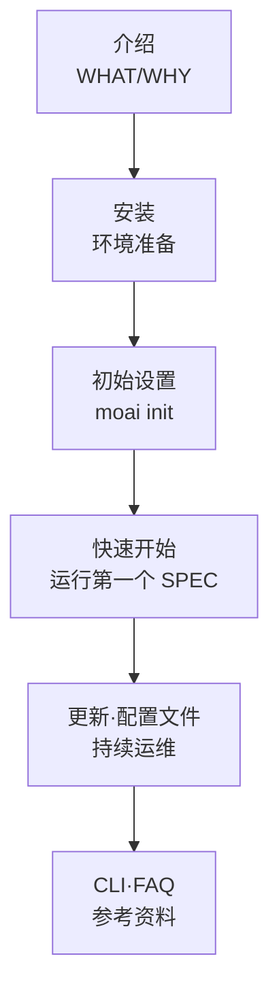

 <strong>所属价值</strong>: 🪙 代币经济学 · 🧠 递归式自学习 · 🛡️ 代理型线束

<!-- @value: tokenomics, self-learning, agentic-harness -->

这是为初次接触 MoAI-ADK 的用户准备的入门路径。按 **介绍 → 安装 → 快速开始** 的顺序阅读，30 分钟内即可运行第一个 MoAI-ADK 项目。安装只需下载一个单体二进制文件，运行第一个 SPEC 也不需要额外的运行时或依赖。


如果已经完成安装，请直接前往[快速开始](./quickstart)。想了解 CLI 标志请查看 [CLI 参考](./cli)，遇到问题请查看[常见问题](./faq)。


## 学习路径

```mermaid
flowchart TD
    A["介绍<br>WHAT/WHY"] --> B["安装<br>环境准备"]
    B --> C["初始设置<br>moai init"]
    C --> D["快速开始<br>运行第一个 SPEC"]
    D --> E["更新·配置文件<br>持续运维"]
    E --> F["CLI·FAQ<br>参考资料"]
```

## 推荐阅读顺序

| 顺序 | 文档 | 核心内容 |
|------|------|----------|
| 1 | [介绍](./introduction) | MoAI-ADK 是什么，解决什么问题 |
| 2 | [安装](./installation) | macOS/Linux 上的安装与前置条件 |
| 3 | [Windows 使用指南](./windows-guide) | Windows 环境的特殊注意事项 |
| 4 | [初始设置](./init-wizard) | 使用 `moai init` 交互式向导配置项目 |
| 5 | [快速开始](./quickstart) | 创建第一个 SPEC 并运行 `/moai plan → run → sync` |
| 6 | [更新](./update) | 让模板保持最新版本 |
| 7 | [配置文件管理](./profile) | 用户配置文件·环境变量·设置同步 |
| 8 | [CLI 参考](./cli) | `moai` 二进制全部子命令索引 |
| 9 | [常见问题](./faq) | 安装·运行时常见问题与解决方法 |


**下一步**：完成安装后，可以在[核心概念](/zh/core-concepts/)中学习 v3.0 的三大支柱 — **代币经济学** (Tokenomics)、**智能体循环工程** (Agentic Loop Engineering)、**智能体挽具** (Agentic Harness) — 以及 SPEC·DDD·TRUST 5 等 MoAI-ADK 的设计哲学。

