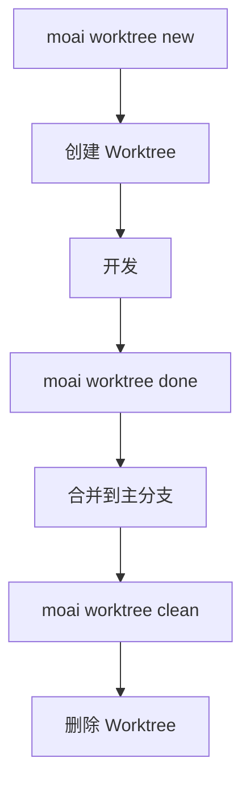

参考 MoAI-ADK 命令行界面的所有命令和选项。

## 命令列表

```bash
moai --help
```

**输出示例:**

```
MoAI-ADK - Agentic Development Kit for Claude Code

Usage:
  moai [command]

Available Commands:
  init        Interactive project setup (auto-detects language/framework/methodology)
  doctor      System health diagnosis and environment verification
  status      Project status summary including Git branch, quality metrics, etc.
  update      Update to the latest version (with automatic rollback support)
  worktree    Manage Git worktrees for parallel SPEC development
  hook        Claude Code hook dispatcher
  profile     Manage Claude Code configuration profiles
  glm         Switch to GLM backend (cost-effective) or update API key
  claude      Switch to Claude backend (Anthropic API)
  version     Display version, commit hash, and build date

Flags:
  -h, --help      help for moai
  -v, --version   version for moai
```

| 命令 | 描述 |
|---------|-------------|
| `moai init` | 项目初始化 (自动检测语言/框架/方法论) |
| `moai doctor` | 系统诊断和环境验证 |
| `moai status` | 项目状态概览 (Git 分支、质量指标等) |
| `moai inventory` | 活跃会话、worktree、harness 集成库存读取专用列表 (添加 `--json` 用于结构化输出) |
| `moai update` | 更新到最新版本 (支持自动回滚) |
| `moai worktree` | Git worktree 管理 (并行 SPEC 开发) |
| `moai hook` | Claude Code 钩子调度器 |
| `moai profile` | Profile 管理 (list、setup、current、delete) |
| `moai glm` | 切换到 GLM 后端 (`--team`: GLM Worker 模式) |
| `moai claude`、`moai cc` | 切换到 Claude 后端 |
| `moai cg` | 启用 CG 模式 — Claude 领导 + GLM 团队成员 (需要 tmux) |
| `moai version` | 显示版本、提交哈希、构建日期 |

---

## moai init

初始化项目。

```bash
moai init [PATH] [OPTIONS]
```

### 选项

| 选项 | 描述 |
|--------|-------------|
| `-y, --non-interactive` | 非交互模式 (使用默认值) |
| `--mode [personal\|team]` | 项目模式 |
| `--locale [ko\|en\|ja\|zh]` | 首选语言 (默认: en) |
| `--language TEXT` | 编程语言 (如果指定则自动检测) |
| `--force` | 强制重新初始化而无需确认 |

### 示例

```bash
# 初始化新项目
moai init my-project

# 韩语、团队模式
moai init my-project --locale ko --mode team

# Python 项目
moai init --language python
```

---

## moai update

将 MoAI-ADK 更新到最新版本。

```bash
moai update [OPTIONS]
```

### 选项

| 选项 | 描述 |
|--------|-------------|
| `--path PATH` | 项目路径 (默认: 当前目录) |
| `--force` | 强制更新而不备份 |
| `--check` | 仅检查版本 (不更新) |
| `--project` | 仅同步项目模板 |
| `--templates-only` | 仅同步模板 (跳过包升级) |
| `--yes` | 自动确认 (CI/CD 模式) |
| `-c, --config` | 编辑项目配置 (与初始设置向导相同) |
| `--merge` | 自动合并 (保留用户更改) |
| `--manual` | 手动合并 (创建指南) |

### 示例

```bash
# 检查更新
moai update --check

# 强制更新
moai update --force

# 自动合并
moai update --merge
```


**重要:** `--force` 选项不创建备份。用户更改可能会丢失。


---

## moai doctor

运行系统诊断。

```bash
moai doctor [OPTIONS]
```

### 选项

| 选项 | 描述 |
|--------|-------------|
| `-v, --verbose` | 显示详细的工具版本和语言检测 |
| `--fix` | 为缺失的工具建议修复 |
| `--export PATH` | 导出到 JSON 文件 |
| `--check TEXT` | 仅检查特定工具 |
| `--check-commands` | 诊断斜杠命令加载问题 |
| `--shell` | 诊断 shell 和 PATH 配置 (WSL/Linux) |

### 示例

```bash
# 完整诊断
moai doctor

# 详细诊断
moai doctor --verbose

# 建议修复
moai doctor --fix
```

---

## moai profile

管理 Profile。Profile 为独立的 Claude Code 配置环境。

### profile 子命令

| 命令 | 描述 |
|--------|-------------|
| `moai profile list` | 显示所有可用 Profile 列表 |
| `moai profile setup` | 使用交互式向导创建新 Profile |
| `moai profile current` | 显示当前活跃 Profile 信息 |
| `moai profile delete <name>` | 删除指定 Profile |

### moai profile list

```bash
moai profile list
```

显示所有可用 Profile 和当前活跃 Profile。

### moai profile setup

```bash
moai profile setup
```

交互式向导创建新 Profile:

1. **Profile 名称**: 唯一标识符 (例如: `work`、`personal`)
2. **用户名**: Claude Code 用来称呼用户的名称
3. **语言设置**:
   - 对话语言 (conversation_language)
   - Git 提交语言 (git_commit_lang)
   - 代码注释语言 (code_comment_lang)
   - 文档语言 (doc_lang)
4. **模型设置**:
   - 模型策略 (model_policy): high、medium、low
   - 默认模型 (model): inherit、opus、sonnet、haiku、1M 上下文模型
5. **执行设置**:
   - 权限模式 (permission_mode): default、acceptEdits
6. **显示设置**:
   - 状态栏模式 (statusline_mode): off、basic、full
   - 状态栏主题 (statusline_theme): auto、light、dark、monokai、nord、dracula
   - 团队成员显示 (teammate_display): auto、in-process、tmux

### moai profile current

```bash
moai profile current
```

显示当前活跃 Profile 的信息。

### moai profile delete

```bash
moai profile delete <name>
```

删除指定 Profile 及其目录。

### Profile 运行

使用 Profile 运行 MoAI 命令，使用 `-p` 标志:

```bash
# 在 Claude 模式下使用特定 Profile
moai cc -p work

# 在 GLM 模式下使用特定 Profile
moai glm -p personal

# 在 CG 模式下使用特定 Profile
moai cg -p team-project
```

Profile 的 Claude Code 设置应用于该会话。

### Profile vs MoAI Worktree

| 功能 | Profile | Worktree |
|------|---------|----------|
| **目的** | Claude Code 配置隔离 | 项目文件隔离 |
| **路径** | `~/.moai/claude-profiles/<name>/` | `~/.moai/worktrees/<project>/<spec>/` |
| **用途** | 管理不同环境配置 | SPEC 开发工作区 |

---

## moai glm

切换到 GLM 后端或更新 API 密钥。

```bash
moai glm [OPTIONS] [API_KEY]
```

### 选项

| 选项 | 描述 |
|--------|-------------|
| `-p, --profile TEXT` | 使用的 Profile 名称 |
| `--team` | 启动 GLM Worker 模式 (Opus 领导 + GLM-5 团队成员) |
| `--help` | 显示帮助 |

### 用法

```bash
# 切换到 GLM 后端
moai glm

# 更新 API 密钥
moai glm <api-key>

# 启动 GLM Worker 模式 (经济高效的团队开发)
moai glm --team

# 从 z.ai 获取 API 密钥
# https://z.ai/subscribe?ic=1NDV03BGWU

# Profile 指定运行
moai glm -p work

# GLM Worker 模式启动 (经济高效的团队开发)
moai glm --team
```

### GLM Worker 模式

使用 `--team` 选项可启动经济高效的 GLM Worker 模式:

- **配置**: Opus 模型的领导代理 + GLM-5 模型的团队成员代理
- **优势**: 相比 Claude 节省 70% 成本，性能相当
- **用途**: 大规模团队开发时优化令牌成本

### 基于 Profile 的登录 (v2.7.0+)

`moai glm`、`moai cc` 和 `moai cg` 现在是支持持久配置文件的登录命令。配置文件存储在 `~/.moai/claude-profiles/`。

- 首次运行时提供交互式配置文件设置向导
- 配置文件跨会话持久化
- 从 `moai glm` 切换到 `moai cg` 时自动重置 GLM 设置

---

## moai claude

切换到 Claude 后端 (Anthropic API)。

```bash
$ moai claude [OPTIONS]
# 或简写
$ moai cc [OPTIONS]
```

### 选项

| 选项 | 描述 |
|--------|-------------|
| `-p, --profile TEXT` | 使用的 Profile 名称 |

### 用法

```bash
# 切换到 Claude 后端
moai cc

# Profile 指定运行
moai cc -p work
```

---

## moai cg

启用 CG 模式 (Claude + GLM 混合)。领导使用 Claude API，团队成员使用 GLM API，通过 tmux 会话级别环境变量隔离实现。

```bash
moai cg [OPTIONS]
```

### 选项

| 选项 | 描述 |
|--------|-------------|
| `-p, --profile TEXT` | 使用的 Profile 名称 |


**v2.7.1 变更**: CG 模式现在是**默认**团队模式。使用 `--team` 时，无需额外设置即以 CG 模式运行。


### 工作原理

1. 将 GLM 配置注入 tmux 会话环境
2. 从 settings 中移除 GLM 环境 — 领导窗格使用 Claude API
3. 设置 `CLAUDE_CODE_TEAMMATE_DISPLAY=tmux` — 团队成员在新窗格中继承 GLM 环境

### 用法

```bash
# 1. 保存 GLM API 密钥 (仅首次)
moai glm sk-your-glm-api-key

# 2. 启用 CG 模式 (必须在 tmux 中)
moai cg

# 3. 在同一窗格中启动 Claude Code
claude

# 4. 运行团队工作流
/moai --team "任务描述"

# Profile 指定运行
moai cg -p team-project
```

### 注意事项

| 项目 | 描述 |
|------|------|
| **需要 tmux** | 必须在 tmux 会话内运行。将 VS Code 终端默认设置为 tmux 更方便。 |
| **领导启动位置** | 必须在运行 `moai cg` 的**同一窗格**中启动 Claude Code。 |
| **会话结束** | session_end 钩子自动清理 tmux 会话环境。 |

### 模式比较

| 命令 | 领导 | 工作者 | 需要 tmux | 成本节省 | 用途 |
|------|------|--------|-----------|----------|------|
| `moai cc` | Claude | Claude | 否 | - | 最高质量 |
| `moai glm` | GLM | GLM | 推荐 | ~70% | 成本优化 |
| `moai cg` | Claude | GLM | **必须** | **~60%** | 质量 + 成本平衡 |

### 显示模式

| 模式 | 描述 | 通信 | 领导/工作者分离 |
|------|------|------|------------------|
| `in-process` | 默认模式 | SendMessage | 相同环境 |
| `tmux` | 分屏显示 | SendMessage | 会话环境隔离 |


**注意:** CG 模式仅在 `tmux` 显示模式下支持领导/工作者 API 分离。


---

## moai status

检查项目状态。

```bash
moai status
```

**输出示例:**

```
╭────── 项目状态 ──────╮
│   模式          personal   │
│   区域          unknown    │
│   SPECs         1          │
│   分支          main       │
│   Git 状态      Modified   │
╰────────────────────────────╯
```

**输出信息:**
- **模式**: 工作模式 (personal、team、manual)
- **区域**: 语言设置
- **SPECs**: 活动 SPEC 数量
- **分支**: 当前分支
- **Git 状态**: Git 状态 (Clean、Modified)

---

## moai inventory

查询活跃会话、worktree、harness 的集成读取专用库存。

```bash
moai inventory [OPTIONS]
```

### 选项

| 选项 | 描述 |
|--------|-------------|
| `--json` | 结构化 JSON 格式输出 |

### 用法

```bash
# 查看基本库存
moai inventory

# JSON 格式查询 (编程使用)
moai inventory --json
```

**输出信息:**
- **活跃会话**: 当前运行的 Claude Code 会话
- **Worktree**: 并行开发的活跃 Git worktree 列表
- **Harness**: 注册的开发 harness 列表

更多信息，请参阅 [库存管理](./inventory) 页面。

---

## moai worktree

管理用于并行 SPEC 开发的 Git worktrees。

```bash
moai worktree [OPTIONS] COMMAND [ARGS]...
```

### 子命令

| 命令 | 描述 |
|---------|-------------|
| `moai worktree new` | 创建新 worktree |
| `moai worktree list` | 列出活动 worktrees |
| `moai worktree switch` | 切换到 worktree |
| `moai worktree go` | 导航到 worktree 目录 |
| `moai worktree sync` | 与上游同步 |
| `moai worktree remove` | 删除 worktree |
| `moai worktree clean` | 清理过时的 worktrees |
| `moai worktree recover` | 从现有目录恢复 |

### moai worktree new

创建新 worktree。

```bash
moai worktree new [OPTIONS] SPEC_ID
```

#### 选项

| 选项 | 描述 |
|--------|-------------|
| `-b, --branch TEXT` | 用户分支名称 |
| `--base TEXT` | 基础分支 (默认: main) |
| `--repo PATH` | 仓库路径 |
| `--worktree-root PATH` | Worktree 根路径 |
| `-f, --force` | 即使存在也强制创建 |
| `--glm` | 使用 GLM LLM 设置 |
| `--llm-config PATH` | 用户 LLM 配置文件路径 |

#### 示例

```bash
# 为 SPEC-001 创建 worktree
moai worktree new SPEC-001

# 指定用户分支
moai worktree new SPEC-001 --branch feature-auth

# 更改基础分支
moai worktree new SPEC-001 --base develop
```

### moai worktree list

列出活动 worktrees。

```bash
moai worktree list [OPTIONS]
```

#### 选项

| 选项 | 描述 |
|--------|-------------|
| `--format [table\|json]` | 输出格式 |
| `--repo PATH` | 仓库路径 |
| `--worktree-root PATH` | Worktree 根路径 |

### moai worktree remove

删除 worktree。

```bash
moai worktree remove [OPTIONS] SPEC_ID
```

#### 选项

| 选项 | 描述 |
|--------|-------------|
| `-f, --force` | 强制删除未提交的更改 |
| `--repo PATH` | 仓库路径 |
| `--worktree-root PATH` | Worktree 根路径 |

### worktree 工作流



---

## moai hook

MoAI-ADK 事件的 Claude Code 钩子调度器。

```bash
moai hook <event>
```

### 支持的事件（16 个）

| 事件 | 描述 |
|-------|-------------|
| `PreToolUse` | 工具执行前 |
| `PostToolUse` | 工具执行后 |
| `Notification` | 系统通知 |
| `Stop` | 会话结束 |
| `SubagentStop` | 子代理结束 |
| `UserPromptSubmit` | 用户提示提交 |
| `PreCompact` | 上下文压缩前 |
| `PostCompact` | 上下文压缩后 |
| `PermissionRequest` | 权限请求 |
| `PostToolFailure` | 工具执行失败后 |
| `SubagentStart` | 子代理启动 |
| `TeammateIdle` | 团队成员空闲状态 |
| `TaskCompleted` | 任务完成 |
| `WorktreeCreate` | 工作树创建 |
| `WorktreeRemove` | 工作树删除 |
| `model` | 模型选择 |

### 示例

```bash
# 运行 PreToolUse 钩子
moai hook PreToolUse

# 运行 PostToolUse 钩子
moai hook PostToolUse

# 用户提示提交钩子
moai hook UserPromptSubmit
```

---

## Statusline v3

MoAI Statusline v3 在 Claude Code 状态栏中显示实时 API 使用量。

### v3 新功能

| 功能 | 描述 |
|------|------|
| **RGB 渐变色** | 根据使用量比例平滑变色 |
| **5H/7D API 使用量** | 显示 5 小时/7 天累计使用量 |
| **rate_limits 字段解析** | Claude API 响应的精确限制信息 |

### 颜色渐变

根据使用量比例颜色平滑变化:

- **0-30%**: 绿色 → 黄色 (安全)
- **31-70%**: 黄色 → 橙色 (注意)
- **71-100%**: 橙色 → 红色 (接近限制)

### API 使用量显示

```
5H: 45K/200K (22%) | 7D: 180K/500K (36%)
```

- **5H**: 最近 5 小时使用量
- **7D**: 最近 7 天使用量
- **比例**: 相对于当前配额的使用百分比

### 配置方法

在 Profile 设置向导 (`moai profile setup`) 中选择以下选项:

1. **statusline_mode**: `off`、`basic`、`full`
2. **statusline_theme**: `auto`、`light`、`dark`、`monokai`、`nord`、`dracula`

### 用法

```bash
# 创建 Profile 时配置 Statusline
moai profile setup
# → 选择 statusline_mode: full
# → 选择 statusline_theme: auto

# 使用 Profile 运行
moai cc -p my-profile
```

---

## 任务指标日志

MoAI-ADK 在开发会话期间自动捕获 Task 工具指标。

### 日志文件

- **位置**: `.moai/logs/task-metrics.jsonl`
- **格式**: JSONL (JSON Lines)

### 捕获指标

| 指标 | 描述 |
|------|------|
| 令牌使用量 | 输入/输出令牌数量 |
| 工具调用 | 使用的工具列表及调用次数 |
| 持续时间 | 任务执行时间 |
| 代理类型 | 执行的代理类型 |

### 用途

- 会话分析与性能优化
- 代理效率分析
- 令牌消耗追踪与成本管理

Task 工具完成时，PostToolUse 钩子会自动记录指标。

---

## 模型策略设置

MoAI-ADK 根据 Claude Code 订阅计划为代理分配最优的 AI 模型。

### 策略层级

| 策略 | 计划 | 🟣 Opus | 🔵 Sonnet | 🟡 Haiku |
|------|------|---------|-----------|----------|
| **High** | Max $200/月 | 23 | 1 | 4 |
| **Medium** | Max $100/月 | 4 | 19 | 5 |
| **Low** | Plus $20/月 | 0 | 12 | 16 |

### 配置方法

```bash
# 项目初始化时 (交互式向导)
moai init my-project

# 重新配置现有项目
moai update -c

# 手动配置 (.moai/config/sections/user.yaml)
# model_policy: high | medium | low
```

> **注意**: 默认策略为 `High`。运行 `moai update` 后，通过 `moai update -c` 配置设置。

### 1M 上下文模型

在 Profile 设置过程中选择**默认模型**时，可以选择 1M 上下文模型:

- `claude-opus-4-6 1M context`
- `claude-sonnet-4-6 1M context`

这些模型适合用于大规模代码库分析或长文档工作。

---

## 环境变量

| 变量 | 描述 |
|----------|-------------|
| `MOAI_API_KEY` | API 密钥 (Claude/GLM) |
| `MOAI_MODE` | 执行模式 (development/production) |
| `MOAI_LOCALE` | 语言设置 (ko/en/ja/zh) |
| `MOAI_WORKTREE_ROOT` | Worktree 根路径 |

---

## 另请参阅

- [快速开始](./quickstart)
- [安装](./installation)
- [更新](./update)
- [配置文件](./profile)
