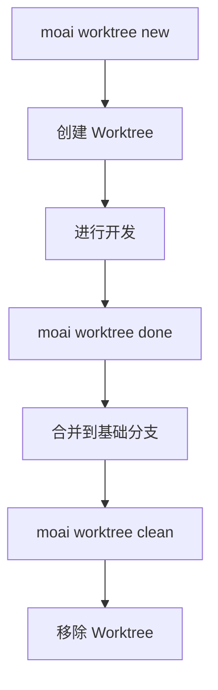

在这里查阅 MoAI-ADK 命令行接口的全部命令与选项。终端的 `moai`（Go 二进制）与 Claude Code 对话窗口的 `/moai`（斜杠子命令）是不同的工具 — 本文介绍的是终端 CLI。

## 命令列表

```bash
moai --help
```

**输出示例：**

```
MoAI-ADK - Agentic Development Kit for Claude Code

Usage:
  moai [command]

Available Commands:
  init        Interactive project setup (auto-detects language/framework/methodology)
  doctor      System health diagnosis and environment verification
  status      Project status summary including Git branch, quality metrics, etc.
  update      Update to the latest version (with automatic rollback support)
  worktree    Manage Git worktrees for parallel SPEC development
  hook        Claude Code hook dispatcher
  profile     Manage Claude Code configuration profiles
  glm         Switch to GLM backend (cost-effective) or update API key
  claude      Switch to Claude backend (Anthropic API)
  version     Display version, commit hash, and build date

Flags:
  -h, --help      help for moai
  -v, --version   version for moai
```

| 命令 | 说明 |
|--------|------|
| `moai init` | 初始化项目（自动检测语言/框架/方法论） |
| `moai doctor` | 系统诊断与环境验证 |
| `moai status` | 项目状态摘要（Git 分支、质量指标等） |
| `moai inventory` | 活跃会话、worktree、挽具统一清单只读列表（add `--json` for structured output） |
| `moai update` | 更新到最新版本（支持自动回滚） |
| `moai worktree` | 管理 Git worktree（并行 SPEC 开发） |
| `moai hook` | Claude Code 钩子调度器 |
| `moai profile` | Profile 管理（list、setup、current、delete） |
| `moai glm` | 切换 GLM 后端（`--team`：GLM Worker 模式） |
| `moai claude`、`moai cc` | 切换 Claude 后端 |
| `moai cg` | 启用 CG 模式 — Claude 领队 + GLM 队友（必须 tmux） |
| `moai version` | 显示版本、提交哈希、构建日期 |

---

## moai init

初始化项目。

```bash
moai init [PATH] [OPTIONS]
```

### 选项

| 选项 | 说明 |
|------|------|
| `-y, --non-interactive` | 非交互模式（使用默认值） |
| `--mode [personal\|team]` | 项目模式 |
| `--locale [ko\|en\|ja\|zh]` | 偏好语言（默认值：en） |
| `--language TEXT` | 编程语言（不指定时自动检测） |
| `--force` | 无需确认，强制重新初始化 |

### 示例

```bash
# 새 프로젝트 초기화
moai init my-project

# 한국어, 팀 모드
moai init my-project --locale ko --mode team

# Python 프로젝트
moai init --language python
```

---

## moai update

将 MoAI-ADK 更新到最新版本。

```bash
moai update [OPTIONS]
```

### 选项

| 选项 | 说明 |
|------|------|
| `--path PATH` | 项目路径（默认值：当前目录） |
| `--force` | 不备份，强制更新 |
| `--check` | 仅确认版本（不更新） |
| `--project` | 仅同步项目模板 |
| `--templates-only` | 仅同步模板（跳过包升级） |
| `--yes` | 自动确认（CI/CD 模式） |
| `-c, --config` | 编辑项目设置（与初始设置向导相同） |
| `--merge` | 自动合并（保留用户修改） |
| `--manual` | 手动合并（生成指南） |

### 示例

```bash
# 업데이트 확인
moai update --check

# 강제 업데이트
moai update --force

# 자동 병합
moai update --merge
```


**重要：** `--force` 选项不会创建备份，用户的修改可能丢失。


---

## moai doctor

执行系统诊断。

```bash
moai doctor [OPTIONS]
```

### 选项

| 选项 | 说明 |
|------|------|
| `-v, --verbose` | 显示详细工具版本与语言检测 |
| `--fix` | 提出缺失工具的修复建议 |
| `--export PATH` | 导出为 JSON 文件 |
| `--check TEXT` | 仅检查特定工具 |
| `--check-commands` | 诊断斜杠命令加载问题 |
| `--shell` | 诊断 shell 与 PATH 配置（WSL/Linux） |

### 示例

```bash
# 전체 진단
moai doctor

# 상세 진단
moai doctor --verbose

# 수정 제안
moai doctor --fix
```

---

## moai profile

管理 Profile。Profile 提供独立的 Claude Code 配置环境。

### Profile 子命令

| 命令 | 说明 |
|--------|------|
| `moai profile list` | 显示所有可用 Profile 列表 |
| `moai profile setup` | 通过交互式向导创建新 Profile |
| `moai profile current` | 显示当前活跃 Profile 信息 |
| `moai profile delete <name>` | 删除指定的 Profile |

### moai profile list

```bash
moai profile list
```

显示所有可用 Profile 与当前活跃的 Profile。

### moai profile setup

```bash
moai profile setup
```

交互式向导创建新 Profile：

1. **Profile 名称**：唯一标识符（例：`work`、`personal`）
2. **用户名**：Claude Code 称呼用户的名字
3. **语言设置**：
   - 对话语言 (conversation_language)
   - Git 提交语言 (git_commit_lang)
   - 代码注释语言 (code_comment_lang)
   - 文档语言 (doc_lang)
4. **模型设置**：
   - 模型策略 (model_policy)：high、medium、low
   - 默认模型 (model)：inherit、opus、sonnet、haiku、1M context 模型
5. **执行设置**：
   - 权限模式 (permission_mode)：default、acceptEdits
6. **显示设置**：
   - 状态栏模式 (statusline_mode)：off、basic、full
   - 状态栏主题 (statusline_theme)：auto、light、dark、monokai、nord、dracula
   - 队友显示 (teammate_display)：auto、in-process、tmux

### moai profile current

```bash
moai profile current
```

显示当前激活的 Profile 信息。

### moai profile delete

```bash
moai profile delete <name>
```

删除指定的 Profile 及其目录。

### 使用 Profile 运行

要使用 Profile 执行 MoAI 命令，请使用 `-p` 标志：

```bash
# Claude 모드에서 특정 Profile 사용
moai cc -p work

# GLM 모드에서 특정 Profile 사용
moai glm -p personal

# CG 모드에서 특정 Profile 사용
moai cg -p team-project
```

Profile 的 Claude Code 设置会应用到该会话。

### Profile vs MoAI Worktree

| 功能 | Profile | Worktree |
|------|---------|----------|
| **目的** | 隔离 Claude Code 配置 | 隔离项目文件 |
| **路径** | `~/.moai/claude-profiles/<name>/` | `~/.moai/worktrees/<project>/<spec>/` |
| **用途** | 管理不同的环境设置 | SPEC 开发用工作区 |

---

## moai glm

切换到 GLM 后端或更新 API 密钥。

```bash
moai glm [OPTIONS] [API_KEY]
```

### 选项

| 选项 | 说明 |
|------|------|
| `-p, --profile TEXT` | 要使用的 Profile 名称 |
| `--team` | 启动 GLM Worker 模式（Opus 领队 + GLM-5 队友） |
| `--help` | 显示帮助 |

### 用法

```bash
# GLM 백엔드 전환
moai glm

# API 키 업데이트
moai glm <api-key>

# Profile 지정 실행
moai glm -p work

# GLM Worker 모드 시작 (비용 효율적 팀 개발)
moai glm --team

# z.ai에서 API 키 발급받기
# https://z.ai/subscribe?ic=1NDV03BGWU
```

### GLM Worker 模式

使用 `--team` 选项会启动成本高效的 GLM Worker 模式：

- **构成**：Opus 模型的领队智能体 + GLM-5 模型的队友智能体
- **优点**：相比 Claude 节省 70% 成本，性能相当
- **用途**：大规模团队开发时优化 token 成本

### 基于 Profile 的设置 (v2.7.0+)

`moai glm`、`moai cc`、`moai cg` 现在是支持持久 Profile 的登录命令。Profile 保存在 `~/.moai/claude-profiles/`。

- 首次运行时提供交互式 Profile 设置向导
- Profile 在会话之间保持
- 从 `moai glm` 切换到 `moai cg` 时自动重置 GLM 设置

---

## moai claude

切换到 Claude 后端 (Anthropic API)。

```bash
$ moai claude [OPTIONS]
# 또는 단축어
$ moai cc [OPTIONS]
```

### 选项

| 选项 | 说明 |
|------|------|
| `-p, --profile TEXT` | 要使用的 Profile 名称 |

### 用法

```bash
# Claude 백엔드 전환
moai cc

# Profile 지정 실행
moai cc -p work
```

---

## moai cg

启用 CG 模式（Claude + GLM 混合）。领队使用 Claude API，队友使用 GLM API，通过 tmux 会话级环境变量隔离实现。

```bash
moai cg [OPTIONS]
```

### 选项

| 选项 | 说明 |
|------|------|
| `-p, --profile TEXT` | 要使用的 Profile 名称 |

### 工作方式

1. 将 GLM 设置注入 tmux 会话环境
2. 从 settings 中移除 GLM 环境 — 领队窗口使用 Claude API
3. 设置 `CLAUDE_CODE_TEAMMATE_DISPLAY=tmux` — 队友在新窗口中继承 GLM 环境

### 用法

```bash
# 1. GLM API 키 저장 (최초 1회)
moai glm sk-your-glm-api-key

# 2. CG 모드 활성화 (tmux 내에서 실행)
moai cg

# 3. 같은 창에서 Claude Code 시작
claude

# 4. 팀 워크플로우 실행
/moai --team "작업 설명"

# Profile 지정 실행
moai cg -p team-project
```

### 注意事项

| 项目 | 说明 |
|------|------|
| **必须 tmux** | 必须在 tmux 会话内运行。将 VS Code 终端默认设为 tmux 会很方便。 |
| **领队启动位置** | 必须在执行 `moai cg` 的**同一个窗口**中启动 Claude Code。 |
| **会话结束** | session_end 钩子会自动清理 tmux 会话环境。 |

### 模式对比

| 命令 | 领队 | Worker | 必须 tmux | 成本节省 | 用途 |
|--------|------|------|-----------|-----------|------|
| `moai cc` | Claude | Claude | 否 | - | 最高质量 |
| `moai glm` | GLM | GLM | 推荐 | ~70% | 成本优化 |
| `moai cg` | Claude | GLM | **必须** | **~60%** | 质量 + 成本平衡 |

### 显示模式

| 模式 | 说明 | 通信 | 领队/Worker 分离 |
|------|------|------|----------------|
| `in-process` | 默认模式 | SendMessage | 同一环境 |
| `tmux` | 分屏显示 | SendMessage | 会话环境隔离 |


**v2.7.1 变更**：CG 模式现已成为**默认**团队模式。使用 `--team` 时无需额外设置即以 CG 模式运行。


---

## moai status

确认项目状态。

```bash
moai status
```

**输出示例：**

```
╭────── Project Status ──────╮
│   Mode          personal   │
│   Locale        unknown    │
│   SPECs         1          │
│   Branch        main       │
│   Git Status    Modified   │
╰────────────────────────────╯
```

**输出信息：**
- **Mode**：工作模式（personal、team、manual）
- **Locale**：语言设置
- **SPECs**：活跃 SPEC 数量
- **Branch**：当前分支
- **Git Status**：Git 状态（Clean、Modified）

---

## moai inventory

查询统一管理活跃会话、worktree、挽具的只读清单。

```bash
moai inventory [OPTIONS]
```

### 选项

| 选项 | 说明 |
|------|------|
| `--json` | 以结构化 JSON 格式输出 |

### 用法

```bash
# 기본 인벤토리 보기
moai inventory

# JSON 형식으로 조회 (프로그래밍 활용)
moai inventory --json
```

**输出信息：**
- **活跃会话**：当前正在运行的 Claude Code 会话
- **Worktree**：用于并行开发的活跃 Git worktree 列表
- **挽具**：已注册的开发挽具列表

详细内容请参考[清单管理](./inventory)页面。

---

## moai worktree

管理 Git worktree，进行并行 SPEC 开发。

```bash
moai worktree [OPTIONS] COMMAND [ARGS]...
```

### 子命令

| 命令 | 说明 |
|--------|------|
| `moai worktree new` | 创建新 worktree |
| `moai worktree list` | 活跃 worktree 列表 |
| `moai worktree switch` | 切换到 worktree |
| `moai worktree go` | 进入 worktree 目录 |
| `moai worktree sync` | 与上游同步 |
| `moai worktree remove` | 移除 worktree |
| `moai worktree clean` | 清理陈旧的 worktree |
| `moai worktree recover` | 从现有目录恢复 |

### moai worktree new

创建新 worktree。

```bash
moai worktree new [OPTIONS] SPEC_ID
```

#### 选项

| 选项 | 说明 |
|------|------|
| `-b, --branch TEXT` | 用户分支名 |
| `--base TEXT` | 基础分支（默认值：main） |
| `--repo PATH` | 仓库路径 |
| `--worktree-root PATH` | worktree 根路径 |
| `-f, --force` | 即使已存在也强制创建 |
| `--glm` | 使用 GLM LLM 设置 |
| `--llm-config PATH` | 用户 LLM 设置文件路径 |

#### 示例

```bash
# SPEC-001을 위한 worktree 생성
moai worktree new SPEC-001

# 사용자 브랜치 지정
moai worktree new SPEC-001 --branch feature-auth

# 기본 브랜치 변경
moai worktree new SPEC-001 --base develop
```

### moai worktree list

显示活跃 worktree 列表。

```bash
moai worktree list [OPTIONS]
```

#### 选项

| 选项 | 说明 |
|------|------|
| `--format [table\|json]` | 输出格式 |
| `--repo PATH` | 仓库路径 |
| `--worktree-root PATH` | worktree 根路径 |

### moai worktree remove

移除 worktree。

```bash
moai worktree remove [OPTIONS] SPEC_ID
```

#### 选项

| 选项 | 说明 |
|------|------|
| `-f, --force` | 强制移除未提交的变更 |
| `--repo PATH` | 仓库路径 |
| `--worktree-root PATH` | worktree 根路径 |

### worktree 工作流


```mermaid
flowchart TD
    A[moai worktree new] --> B[创建 Worktree]
    B --> C[进行开发]
    C --> D[moai worktree done]
    D --> E[合并到基础分支]
    E --> F[moai worktree clean]
    F --> G[移除 Worktree]
```

---

## moai hook

面向 MoAI-ADK 事件的 Claude Code 钩子调度器。

```bash
moai hook <event>
```

### 支持的事件（16 个）

| 事件 | 说明 |
|-------|------|
| `PreToolUse` | 工具执行前 |
| `PostToolUse` | 工具执行后 |
| `Notification` | 系统通知 |
| `Stop` | 会话结束 |
| `SubagentStop` | 子智能体结束 |
| `UserPromptSubmit` | 用户提交提示 |
| `PreCompact` | 上下文压缩前 |
| `PostCompact` | 上下文压缩后 |
| `PermissionRequest` | 权限请求 |
| `PostToolFailure` | 工具执行失败后 |
| `SubagentStart` | 子智能体启动 |
| `TeammateIdle` | 队友空闲状态 |
| `TaskCompleted` | 任务完成 |
| `WorktreeCreate` | 创建 worktree |
| `WorktreeRemove` | 移除 worktree |
| `model` | 模型选择 |

### 示例

```bash
# PreToolUse 훅 실행
moai hook PreToolUse

# PostToolUse 훅 실행
moai hook PostToolUse

# 사용자 프롬프트 제출 훅
moai hook UserPromptSubmit
```

---

## Statusline v3

MoAI Statusline v3 在 Claude Code 状态栏中显示实时 API 用量。

### v3 新功能

| 功能 | 说明 |
|------|------|
| **RGB Gradient 颜色** | 随用量比例平滑变化的颜色 |
| **5H/7D API 用量** | 显示 5 小时/7 天累计用量 |
| **解析 rate_limits 字段** | Claude API 响应中精确的限制信息 |

### 颜色渐变

颜色随用量比例平滑变化：

- **0-30%**：Green → Yellow（安全）
- **31-70%**：Yellow → Orange（注意）
- **71-100%**：Orange → Red（接近上限）

### API 用量显示

```
5H: 45K/200K (22%) | 7D: 180K/500K (36%)
```

- **5H**：最近 5 小时用量
- **7D**：最近 7 天用量
- **比例**：相对当前配额的使用比例

### 设置方法

在 Profile 设置向导（`moai profile setup`）中选择以下选项：

1. **statusline_mode**：`off`、`basic`、`full`
2. **statusline_theme**：`auto`、`light`、`dark`、`monokai`、`nord`、`dracula`

### 用法

```bash
# Profile 생성 시 Statusline 설정
moai profile setup
# → statusline_mode: full 선택
# → statusline_theme: auto 선택

# Profile과 함께 실행
moai cc -p my-profile
```

---

## Task 指标日志

MoAI-ADK 在开发会话中自动捕获 Task 工具指标。

### 日志文件

- **位置**：`.moai/logs/task-metrics.jsonl`
- **格式**：JSONL (JSON Lines)

### 捕获的指标

| 指标 | 说明 |
|--------|------|
| token 用量 | 输入/输出 token 数 |
| 工具调用 | 使用的工具列表与调用次数 |
| 耗时 | 任务执行时间 |
| 智能体类型 | 执行的智能体种类 |

### 用途

- 会话分析与性能优化
- 智能体效率分析
- token 消耗追踪与成本管理

Task 工具完成时，PostToolUse 钩子会自动记录指标。

---

## 模型策略设置

MoAI-ADK 会根据 Claude Code 订阅套餐为智能体分配最优 AI 模型 — 这是代币经济学的出发点。规划·审计等推理密集的阶段分配高端模型，重复性任务分配轻量模型。

### 策略层级

| 策略 | 套餐 | 特点 |
|------|--------|------|
| **High** | Max $200/月 | 最高质量 — 规划·审计分配 Opus，最大吞吐量 |
| **Medium** | Max $100/月 | 质量与成本的平衡 |
| **Low** | Plus $20/月 | 经济，不含 Opus — 以 Sonnet 为主分配 |

### 设置方法

```bash
# 프로젝트 초기화 시 (대화형 마법사)
moai init my-project

# 기존 프로젝트 재설정
moai update -c

# 수동 설정 (.moai/config/sections/user.yaml)
# model_policy: high | medium | low
```

> **提示**：默认策略为 `High`。执行 `moai update` 后请用 `moai update -c` 配置设置。

### 1M 上下文模型

在 Profile 设置中选择**默认模型**时，可以选择 1M 上下文变体。`[1m]` 后缀不是独立模型，而是 Claude Code 的原生上下文窗口修饰符：

- `opus` / `opus[1m]`
- `sonnet` / `sonnet[1m]`
- `fable` / `fable[1m]`

这些变体适合大型代码库分析或长文档处理。

---

## 环境变量

| 变量 | 说明 |
|------|------|
| `MOAI_API_KEY` | API 密钥（Claude/GLM） |
| `MOAI_MODE` | 运行模式（开发/生产） |
| `MOAI_LOCALE` | 语言设置（ko/en/ja/zh） |
| `MOAI_WORKTREE_ROOT` | worktree 根路径 |

---

## 参考

- [快速开始](./quickstart)
- [安装](./installation)
- [更新](./update)
- [Profile](./profile)
