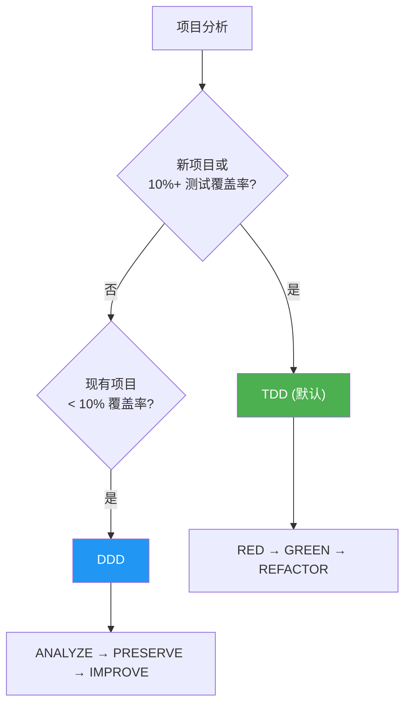

# 常见问题

MoAI-ADK 使用过程中的常见问题和解答。

---

## Q: 状态栏中的版本指示器是什么意思？

MoAI 状态栏显示版本信息和更新通知:

```
🗿 v2.2.2 ⬆️ v2.2.5
```

- **`v2.2.2`**: 当前安装的版本
- **`⬆️ v2.2.5`**: 可更新的新版本

当您使用最新版本时，只显示版本号:

```
🗿 v2.2.5
```

**更新方法**: 运行 `moai update`，更新通知将消失。


**注意**: 这与 Claude Code 内置的版本指示器 (`🔅 v2.1.38`) 不同。MoAI 指示器跟踪 MoAI-ADK 版本，而 Claude Code 单独显示自己的版本。


---

## Q: 如何自定义状态栏显示的段落？

状态栏支持 4 种显示预设和自定义配置:

| 预设 | 描述 |
|------|------|
| **Full** (默认) | 显示所有 8 个段落 |
| **Compact** | 仅显示 Model + Context + Git Status + Branch |
| **Minimal** | 仅显示 Model + Context |
| **Custom** | 选择个别段落 |

在 `moai init` / `moai update -c` 向导中配置，或直接编辑 `.moai/config/sections/statusline.yaml`:

```yaml
statusline:
  preset: compact  # 或 full, minimal, custom
  segments:
    model: true
    context: true
    output_style: false
    directory: false
    git_status: true
    claude_version: false
    moai_version: false
    git_branch: true
```


详情请参阅 [SPEC-STATUSLINE-001](https://github.com/modu-ai/moai-adk/blob/main/.moai/specs/SPEC-STATUSLINE-001/spec.md)。


---

## Q: 如何选择模型策略？

MoAI-ADK 根据 Claude Code 订阅计划为 28 个代理分配最优的 AI 模型。在计划的速率限制内最大化质量。

### 策略层级比较

| 策略 | 计划 | 🟣 Opus | 🔵 Sonnet | 🟡 Haiku | 用途 |
|------|------|---------|-----------|----------|------|
| **High** | Max $200/月 | 23 | 1 | 4 | 最高质量、最大吞吐量 |
| **Medium** | Max $100/月 | 4 | 19 | 5 | 质量与成本平衡 |
| **Low** | Plus $20/月 | 0 | 12 | 16 | 经济型、无 Opus 访问 |


**为什么重要？** Plus $20 计划不包含 Opus 访问。设置 `Low` 可确保所有代理仅使用 Sonnet 和 Haiku，防止速率限制错误。更高计划可在关键代理 (安全、策略、架构) 上使用 Opus，同时在常规任务上使用 Sonnet/Haiku。


### 层级代理模型分配

#### Manager Agents

| 代理 | High | Medium | Low |
|------|------|--------|-----|
| manager-spec | 🟣 opus | 🟣 opus | 🔵 sonnet |
| manager-strategy | 🟣 opus | 🟣 opus | 🔵 sonnet |
| manager-ddd | 🟣 opus | 🔵 sonnet | 🔵 sonnet |
| manager-tdd | 🟣 opus | 🔵 sonnet | 🔵 sonnet |
| manager-project | 🟣 opus | 🔵 sonnet | 🟡 haiku |
| manager-docs | 🔵 sonnet | 🟡 haiku | 🟡 haiku |
| manager-quality | 🟡 haiku | 🟡 haiku | 🟡 haiku |
| manager-git | 🟡 haiku | 🟡 haiku | 🟡 haiku |

#### Expert Agents

| 代理 | High | Medium | Low |
|------|------|--------|-----|
| expert-backend | 🟣 opus | 🔵 sonnet | 🔵 sonnet |
| expert-frontend | 🟣 opus | 🔵 sonnet | 🔵 sonnet |
| expert-security | 🟣 opus | 🟣 opus | 🔵 sonnet |
| expert-debug | 🟣 opus | 🔵 sonnet | 🔵 sonnet |
| expert-refactoring | 🟣 opus | 🔵 sonnet | 🔵 sonnet |
| expert-devops | 🟣 opus | 🔵 sonnet | 🟡 haiku |
| expert-performance | 🟣 opus | 🔵 sonnet | 🟡 haiku |
| expert-testing | 🟣 opus | 🔵 sonnet | 🟡 haiku |

#### Builder Agents

| 代理 | High | Medium | Low |
|------|------|--------|-----|
| builder-agent | 🟣 opus | 🔵 sonnet | 🟡 haiku |
| builder-skill | 🟣 opus | 🔵 sonnet | 🟡 haiku |
| builder-plugin | 🟣 opus | 🔵 sonnet | 🟡 haiku |

### 配置方法

```bash
# 项目初始化时
moai init my-project          # 交互式向导包含模型策略选择

# 重新配置现有项目
moai update -c                # 重新运行配置向导
```


默认策略是 `High`。运行 `moai update` 后，会提示您通过 `moai update -c` 配置此设置。


---

## Q: 出现"Allow external CLAUDE.md file imports?"警告

打开项目时，Claude Code 可能会显示关于外部文件导入的安全提示:

```
External imports:
  /Users/<user>/.moai/config/sections/quality.yaml
  /Users/<user>/.moai/config/sections/user.yaml
  /Users/<user>/.moai/config/sections/language.yaml
```


**建议操作**: 选择 **"No, disable external imports"** ✅


**为什么？**
- 您项目的 `.moai/config/sections/` 已包含这些文件
- 项目特定设置优先于全局设置
- 必要配置已嵌入 CLAUDE.md 文本中
- 禁用外部导入更安全，不影响功能

**这些文件是什么？**
- `quality.yaml`: TRUST 5 框架和开发方法论设置
- `language.yaml`: 语言偏好 (对话、注释、提交)
- `user.yaml`: 用户名 (可选，用于 Co-Authored-By 标注)

---

## Q: TDD 和 DDD 方法论有什么区别？

MoAI-ADK v2.5.0+ 使用 **二元方法论选择** (仅 TDD 或 DDD)。为清晰和一致性，混合模式已被移除。

### 方法论选择指南



### TDD 方法论 (默认)

新项目和功能开发的默认方法论。先写测试，再实现。

| 阶段 | 描述 |
|------|------|
| **RED** | 编写定义预期行为的失败测试 |
| **GREEN** | 编写使测试通过的最少代码 |
| **REFACTOR** | 在保持测试通过的同时改进代码质量 |

对于棕地项目 (现有代码库)，TDD 通过 **RED 前分析步骤** 增强: 在编写测试前阅读现有代码以了解当前行为。

### DDD 方法论 (覆盖率 < 10% 的现有项目)

一种用于安全重构测试覆盖率最低的现有项目的方法论。

```
ANALYZE   → 分析现有代码和依赖关系，识别领域边界
PRESERVE  → 编写表征测试，捕获当前行为快照
IMPROVE   → 在测试保护下逐步改进
```

### 方法论选择表

| 项目状态 | 测试覆盖率 | 推荐方法论 | 原因 |
|----------|------------|------------|------|
| 新项目 | N/A | TDD | 测试优先开发 |
| 现有项目 | 50%+ | TDD | 已有强大测试基础 |
| 现有项目 | 10-49% | TDD | 可扩展测试 |
| 现有项目 | < 10% | DDD | 需要渐进式表征测试 |

### 配置方法

```bash
# 项目初始化时自动检测
moai init my-project          # 可用 --mode <ddd|tdd> 标志指定

# 手动配置
# 编辑 .moai/config/sections/quality.yaml
development_mode: tdd         # 或 ddd
```


**注意:** v2.5.0 及更早版本的混合模式已被移除。现在必须明确选择 TDD 或 DDD。


---

## Q: 为什么我的代码没有 @MX 标签？

这是 **完全正常的**。@MX 标签系统旨在仅标记 AI 需要首先注意的最危险和最重要的代码。

| 问题 | 回答 |
|------|------|
| 没有标签是否有问题？ | **不是。** 大多数代码不需要标签。 |
| 标签什么时候添加？ | 仅在 **高 fan_in** (调用者 >= 3)、**复杂逻辑** (复杂度 >= 15)、**危险模式** (无 context 的协程) 时添加。 |
| 所有项目都类似吗？ | **是的。** 每个项目中大多数代码都没有标签。 |

### 标签优先级

| 优先级 | 条件 | 标签类型 |
|--------|------|---------|
| **P1 (关键)** | fan_in >= 3 | `@MX:ANCHOR` |
| **P2 (危险)** | 协程、复杂度 >= 15 | `@MX:WARN` |
| **P3 (上下文)** | 魔法常量、无 godoc | `@MX:NOTE` |
| **P4 (缺失)** | 无测试文件 | `@MX:TODO` |

扫描代码库的 @MX 标签：

```bash
/moai mx --all        # 全量扫描
/moai mx --dry        # 仅预览
/moai mx --priority P1  # 仅关键项
```

---

## 有更多问题？

- [GitHub Discussions](https://github.com/modu-ai/moai-adk/discussions) — 问题、想法、反馈
- [Issues](https://github.com/modu-ai/moai-adk/issues) — 错误报告、功能请求
- [Discord 社区](https://discord.gg/moai-adk) — 实时聊天、技巧分享
