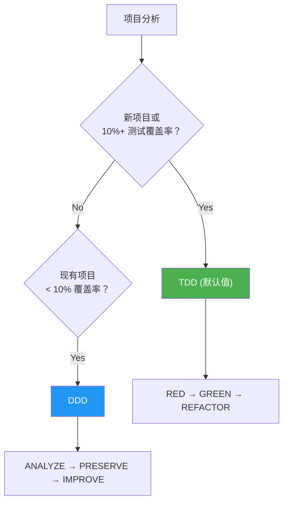

以下是使用 MoAI-ADK 时经常被问到的问题与解答。

---

## Q: `moai` 和 `/moai` 有什么区别？

它们是完全不同的两样东西。这是最常见的混淆，先说清楚。

| | `moai`（终端 CLI） | `/moai`（斜杠子命令） |
|---|---|---|
| **执行位置** | 终端 shell | Claude Code 对话窗口 |
| **本质** | Go 二进制 | Claude Code 技能调用 |
| **用途** | 项目设置、模板部署 | AI 智能体开发工作流 |
| **示例** | `moai init my-project` | `/moai plan "认证功能"` |

- 在终端运行 `moai plan` 不会生效 — `/moai plan` 只在 Claude Code 内有效。
- 在 Claude Code 中输入 `/moai init` 也不会生效 — `moai init` 是终端命令。

---

## Q: statusline 中的版本显示是什么意思？

MoAI statusline 同时显示版本信息与更新提醒：

```
🗿 v2.2.2 ⬆️ v2.2.5
```

- **`v2.2.2`**：当前已安装的版本
- **`⬆️ v2.2.5`**：可更新的新版本

使用最新版本时只显示版本号：

```
🗿 v2.2.5
```

**更新方法**：执行 `moai update` 后更新提醒会消失。


**提示**：这与 Claude Code 内置的版本显示（`🔅 v2.1.38`）不同。MoAI 显示追踪的是 MoAI-ADK 版本，Claude Code 会单独显示自己的版本。


---

## Q: 如何自定义 statusline 显示的分段？

statusline 支持 4 种显示预设与自定义设置：

| 预设 | 说明 |
|--------|------|
| **Full**（默认值） | 显示全部 8 个分段 |
| **Compact** | 仅显示 Model + Context + Git Status + Branch |
| **Minimal** | 仅显示 Model + Context |
| **Custom** | 逐个选择分段 |

可在 `moai init` 或 `moai update -c` 向导中设置，或直接编辑 `.moai/config/sections/statusline.yaml`：

```yaml
statusline:
  preset: compact  # 또는 full, minimal, custom
  segments:
    model: true
    context: true
    output_style: false
    directory: false
    git_status: true
    claude_version: false
    moai_version: false
    git_branch: true
```


详细内容请参考 [SPEC-STATUSLINE-001](https://github.com/modu-ai/moai-adk/blob/main/.moai/specs/SPEC-STATUSLINE-001/spec.md)。


---

## Q: 如何选择模型策略？

MoAI-ADK 会根据 Claude Code 订阅套餐为智能体分配最优 AI 模型。这是在套餐用量限制内将质量最大化的代币经济学装置。

### 策略层级对比

| 策略 | 套餐 | 特点 |
|------|--------|------|
| **High** | Max $200/月 | 最高质量 — 规划·审计分配 Opus，最大吞吐量 |
| **Medium** | Max $100/月 | 质量与成本的平衡 |
| **Low** | Plus $20/月 | 经济，不含 Opus — 以 Sonnet 为主分配 |


**为什么重要？** Plus $20 套餐不包含 Opus。设为 `Low` 时，所有智能体都在无 Opus 的情况下运行，避免触发用量限制错误。在更高套餐中，核心阶段（规划、审计）分配 Opus，一般任务分配轻量模型。


### 各层级智能体模型分配

**10 个智能体目录**（9 个 MoAI 自定义 + 1 个 Anthropic 内置 `Explore`）中，MoAI 自定义智能体按层级分配模型。过去的 12 个归档智能体 (archived agents) 已不可用。

#### Manager Agents（5 个）

| 智能体 | High | Medium | Low |
|---------|------|--------|-----|
| manager-spec | opus | opus | sonnet |
| manager-develop | opus | sonnet | sonnet |
| manager-docs | sonnet | haiku | haiku |
| manager-git | haiku | haiku | haiku |
| manager-design | sonnet | sonnet | sonnet |

#### Evaluator · Builder · Advisor Agents（4 个）

| 智能体 | High | Medium | Low |
|---------|------|--------|-----|
| plan-auditor | opus | opus | sonnet |
| sync-auditor | opus | sonnet | sonnet |
| builder-harness | opus | sonnet | haiku |
| super-advisor | opus | opus | sonnet |

内置 `Explore` 直接沿用会话模型。

### 设置方法

```bash
# 프로젝트 초기화 시
moai init my-project          # 대화형 마법사에서 모델 정책 선택

# 기존 프로젝트 재설정
moai update -c                # 설정 마법사 재실행
```


默认策略为 `High`。执行 `moai update` 后，会提示用 `moai update -c` 来配置此设置。


---

## Q: 出现了 "Allow external CLAUDE.md file imports?" 警告

打开项目时，Claude Code 可能针对外部文件 import 显示安全提示：

```
External imports:
  /Users/<user>/.moai/config/sections/quality.yaml
  /Users/<user>/.moai/config/sections/user.yaml
  /Users/<user>/.moai/config/sections/language.yaml
```


**推荐操作：** 请选择 **"No, disable external imports"**。


**原因：**
- 项目的 `.moai/config/sections/` 中已存在这些文件
- 项目级设置优先于全局设置
- 必需的设置已包含在 CLAUDE.md 文本中
- 禁用外部 import 更安全，且不影响功能

**文件说明：**
- `quality.yaml`：TRUST 5 框架及开发方法论设置
- `language.yaml`：语言设置（对话、注释、提交）
- `user.yaml`：用户名（可选，用于 Co-Authored-By 显示）

---

## Q: TDD 与 DDD 方法论有什么区别？

MoAI-ADK v2.5.0+ 采用**二元方法论选择**（仅 TDD 或 DDD）。为了清晰与一致性，hybrid 模式已被移除。

### 方法论选择指南


```mermaid
flowchart TD
    A["项目分析"] --> B{"新项目或<br/>10%+ 测试覆盖率？"}
    B -->|"Yes"| C["TDD (默认值)"]
    B -->|"No"| D{"现有项目<br/>< 10% 覆盖率？"}
    D -->|"Yes"| E["DDD"]
    C --> F["RED → GREEN → REFACTOR"]
    E --> G["ANALYZE → PRESERVE → IMPROVE"]

    style C fill:#4CAF50,color:#fff
    style E fill:#2196F3,color:#fff
```

### TDD 方法论（默认值）

推荐用于新项目与功能开发的默认方法论。先写测试。

| 阶段 | 说明 |
|------|------|
| **RED** | 编写定义预期行为的失败测试 |
| **GREEN** | 编写通过测试的最少代码 |
| **REFACTOR** | 在保持测试通过的同时改进代码质量 |

在棕地项目（既有代码库）中会增加 **RED 前分析阶段**：在编写测试之前先阅读现有代码，把握当前行为。

### DDD 方法论（测试覆盖率 < 10% 的现有项目）

用于在测试覆盖率极低的现有项目中安全重构的方法论。

```
ANALYZE   → 기존 코드와 의존성 분석, 도메인 경계 식별
PRESERVE  → 특성 테스트 작성, 현재 동작 스냅샷 캡처
IMPROVE   → 테스트로 보호된 상태에서 점진적 개선
```

### 方法论选择表

| 项目状态 | 测试覆盖率 | 推荐方法论 | 理由 |
|--------------|---------------|-------------|------|
| 新项目 | N/A | TDD | 测试优先开发 |
| 现有项目 | 50%+ | TDD | 已有测试基础 |
| 现有项目 | 10-49% | TDD | 可扩展测试 |
| 现有项目 | < 10% | DDD | 需要渐进式特性测试 |

### 设置方法

```bash
# 프로젝트 초기화 시 자동 감지
moai init my-project          # --mode <ddd|tdd> 플래그로 지정 가능

# 수동 설정
# .moai/config/sections/quality.yaml 편집
development_mode: tdd         # 또는 ddd
```


**提示：** v2.5.0 之前的 hybrid 模式已被移除。现在必须明确选择 TDD 或 DDD 之一。


---

## Q: 为什么我的代码里没有 @MX 标签？

这是**完全正常**的。@MX 标签系统的设计目标，是只标记 AI 需要优先关注的最危险、最重要的代码。

| 问题 | 回答 |
|------|------|
| 没有标签是问题吗？ | **不是。** 大部分代码不需要标签。 |
| 标签什么时候添加？ | 仅在**高 fan_in**（调用者 >= 3）、**复杂逻辑**（复杂度 >= 15）、**危险模式**（无 context 的 goroutine）时添加。 |
| 所有项目都类似吗？ | **是。** 所有项目中大部分代码都没有标签。 |

### 标签优先级

| 优先级 | 条件 | 标签类型 |
|---------|------|----------|
| **P1（致命）** | fan_in >= 3 | `@MX:ANCHOR` |
| **P2（危险）** | goroutine、复杂度 >= 15 | `@MX:WARN` |
| **P3（上下文）** | 魔法常量、无 godoc | `@MX:NOTE` |
| **P4（缺失）** | 无测试文件 | `@MX:TODO` |

用 @MX 标签扫描代码库：

```bash
/moai mx --all        # 전체 스캔
/moai mx --dry        # 미리보기
/moai mx --priority P1  # 치명적 항목만
```

---

## 还有更多问题？

- [GitHub Discussions](https://github.com/modu-ai/moai-adk/discussions) — 提问、想法、反馈
- [Issues](https://github.com/modu-ai/moai-adk/issues) — Bug 报告、功能请求
- [Discord 社区](https://discord.gg/Z7E7Mdc5aN) — 实时交流、分享技巧
