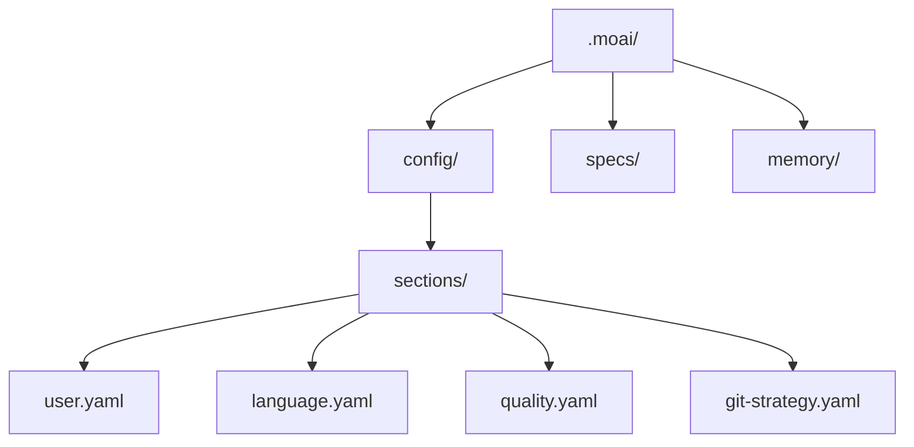
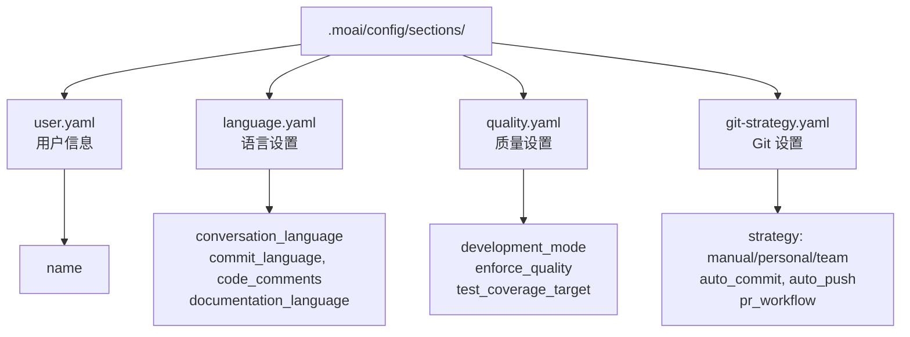

# 初始设置

使用 MoAI-ADK 的交互式设置向导完成您的首次设置。通过 9 步配置您的系统进行开发。

## 启动设置向导

### 创建新项目

要创建并初始化新项目:

```bash
moai init my-project
```

这将创建一个 `my-project` 文件夹并初始化 MoAI-ADK。

### 在当前文件夹中安装

要在现有项目中安装 MoAI-ADK,请导航到该文件夹并运行:

```bash
cd my-existing-project
moai init
```


`moai init` 直接在当前文件夹中安装。对于新项目,使用 `moai init <project-name>`。


## 9 步设置过程

### 步骤 1: 选择对话语言

选择 Claude 与您交流时使用的语言。

```bash
? 选择对话语言:
▸ English - English
  Korean (한국어) - Korean
  Japanese (日本語) - Japanese
  Chinese (中文) - Chinese
```


语言可以稍后在 `.moai/config/sections/language.yaml` 中更改。


### 步骤 2: 输入姓名

用于配置文件。按 Enter 键可跳过。

```bash
? 输入姓名: [name]
```

### 步骤 3: 选择 Git 自动化模式

设置 Claude 可以执行的 Git 操作范围。

```bash
? 选择 Git 自动化模式:
▸ Manual - AI 不提交或推送
  Personal - AI 可以创建分支和提交
  Team - AI 可以创建分支、提交和创建 PR
```

**Manual**: AI 不执行任何 Git 操作。所有提交和推送由用户直接执行。
**Personal**: AI 可以创建分支并提交。适合个人项目。
**Team**: AI 执行分支创建、提交和 PR 创建。针对团队协作工作流进行了优化。


Git 设置保存在 `.moai/config/sections/git-strategy.yaml` 中。可以随时使用 `moai update -c` 命令重新配置。


### 步骤 4: 选择 Git 提供商

选择您项目的 Git 托管平台。

```bash
? 选择 Git 提供商:
▸ GitHub - GitHub.com
  GitLab - GitLab.com 或自托管 GitLab
```

### 步骤 5: 选择 Git 提交消息语言

选择编写提交消息使用的语言。

```bash
? 选择 Git 提交消息语言:
▸ Korean (한국어) - 用韩语提交
  English - 用英语提交
  Japanese (日本語) - 用日语提交
  Chinese (中文) - 用中文提交
```


提交消息语言可以与代码注释语言不同设置。


### 步骤 6: 选择代码注释语言

选择代码注释使用的语言。

```bash
? 选择代码注释语言:
▸ Korean (한국어) - 用韩语注释
  English - 用英语注释
  Japanese (日本語) - 用日语注释
  Chinese (中文) - 用中文注释
```


对于大多数项目，建议使用英语作为代码注释。


### 步骤 7: 选择文档语言

选择文档文件使用的语言。

```bash
? 选择文档语言:
▸ Korean (한국어) - 用韩语编写文档
  English - 用英语编写文档
  Japanese (日本語) - 用日语编写文档
  Chinese (中文) - 用中文编写文档
```

### 步骤 8: 选择 Agent Teams 执行模式

配置 MoAI 使用 Agent Teams (并行) 还是 sub-agents (顺序)。

```bash
? 选择 Agent Teams 执行模式:
▸ Auto (推荐) - 基于任务复杂度的智能选择
  Sub-agent (经典) - 传统单智能体模式
  Team (实验性) - 并行 Agent Teams (需要实验性功能)
```

**Auto**: 根据任务复杂度自动选择最优模式。适用于大多数情况，推荐使用。
**Sub-agent**: 单个智能体按顺序处理任务。适合高度依赖性的任务。
**Team**: 多个专业智能体并行协作。需要 `CLAUDE_CODE_EXPERIMENTAL_AGENT_TEAMS=1` 环境变量。

### 步骤 9: 选择团队成员显示模式

配置 Agent 团队成员的显示方式。分割屏幕需要 tmux。

```bash
? 选择团队成员显示模式:
▸ Auto (推荐) - tmux 可用时使用 tmux，否则使用 in-process (默认)
  In-Process - 在同一终端中运行 (任何地方都可用)
  Tmux - tmux 分割屏幕 (需要 tmux/iTerm2)
```

**Auto**: 自动检测 tmux 是否可用，并选择最优显示模式。
**In-Process**: 团队成员工作在同一终端窗口中运行。无需 tmux 也可工作。
**Tmux**: 在 tmux 分割屏幕中直观监控团队成员工作。

## 设置完成

完成所有步骤后,将创建配置文件:



检查生成的配置文件:

```bash
cat .moai/config/sections/user.yaml
```

## 配置结构



## 修改配置

配置可以随时修改:

### 手动修改

```bash
# 用户设置
vim .moai/config/sections/user.yaml

# 语言设置
vim .moai/config/sections/language.yaml

# 质量设置
vim .moai/config/sections/quality.yaml

# Git 设置
vim .moai/config/sections/git-strategy.yaml
```

### 重置配置

重新运行设置向导以重新配置所有设置:

```bash
# 重新运行设置向导 (推荐)
moai update -c

# 或完全重置
moai init --reset
```


`moai update -c` 允许您选择性地仅重置要更改的项目,同时保留现有设置。



`moai init --reset` 会覆盖所有现有设置。备份重要设置。


## 配置验证

验证配置是否正确设置:

```bash
moai doctor
```

输出示例:

```bash
moai doctor
Running system diagnostics...

┏━━━━━━━━━━━━━━━━━━━━━━━━━━━━━━━━━━━━━━━━━━┳━━━━━━━━┓
┃ Check                                    ┃ Status ┃
┡━━━━━━━━━━━━━━━━━━━━━━━━━━━━━━━━━━━━━━━━━━╇━━━━━━━━┩
│ Python >= 3.11                           │   ✓    │
│ Git installed                            │   ✓    │
│ Project structure (.moai/)               │   ✓    │
│ Config file (.moai/config/config.yaml)   │   ✓    │
└──────────────────────────────────────────┴────────┘

✓ All checks passed
```

此命令验证:

- Python >= 3.11 已安装
- Git 已安装
- 项目结构 (`.moai/` 文件夹)
- 配置文件 (`.moai/config/config.yaml`)

## 下一步

设置完成后,按照[快速开始](./quickstart)指南创建您的第一个项目。

```bash
moai --help
```

您可以查看所有命令和选项。

---

## 下一步

在[快速开始](./quickstart)中了解如何创建您的第一个项目。
