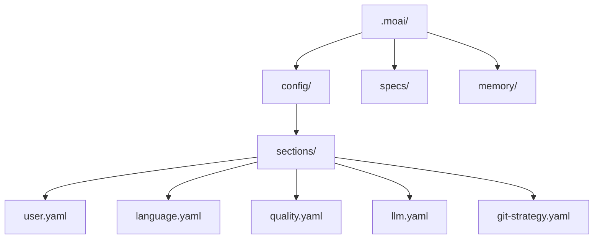

通过 MoAI-ADK 的交互式设置向导完成首次设置。按你的开发环境配置语言、模型策略、报告格式、质量/工作流设置。这里设定的所有值都会保存为 `.moai/config/sections/` 下的 YAML 文件,之后随时可以直接改文件,或重新运行向导来更改。

## 启动设置向导

### 创建新项目

想在创建新项目的同时初始化:

```bash
moai init my-project
```

该命令会创建 `my-project` 文件夹并初始化 MoAI-ADK。

### 安装到既有文件夹

想在既有项目中安装 MoAI-ADK,请移动到该文件夹后运行:

```bash
cd my-existing-project
moai init
```


`moai init` 会直接安装到当前文件夹。新项目请用 `moai init <项目名>` 创建。


## 向导结构

初始化向导始终运行相同的固定 3 页流程 —— 没有可扩大或缩小提问范围的模式标志,所有用户看到的提问都相同。

| 页面 | 提问 |
|------|------|
| **Page 1 —— 基本** | 对话语言、名称、项目名称 |
| **Page 2 —— 模型与报告** | 性能层级(模型策略)、报告格式 |
| **Page 3 —— 质量与工作流** | LSP 集成、强制质量门禁、项目模式、设计工作流、Claude Design 联动 |

```bash
moai init my-project
```


向导不会询问 Git 自动化模式与提供方。`moai init` 会从仓库中已配置的 Git 远程自动检测。之后想更改 Git 设置,请运行 `moai update --reconfigure` —— 只有该路径会显示单独的 Git 提问集(自动化模式、提供方、凭据)。


## Page 1 —— 基本

### 第 1 步:选择对话语言

选择 Claude 回复所用的语言。之后的所有提问都会以该语言呈现。

```bash
? 选择对话语言:
▸ English
  Korean (한국어)
  Japanese (日本語)
  Chinese (中文)
```

该设置保存到 `.moai/config/sections/language.yaml`。

### 第 2 步:输入名称

配置文件中使用的用户名。可按 Enter 跳过。

```bash
? 输入名称: [名称]
```

该设置保存到 `.moai/config/sections/user.yaml` 的 `user.name` 字段。

### 第 3 步:项目名称

项目的名称。默认值为当前目录名。

```bash
? 输入项目名称: [my-project]
```

## Page 2 —— 模型与报告

### 性能层级(模型策略)

选择分配给智能体的 AI 模型层级 —— 这是代币经济学的核心设置。

```bash
? 选择性能层级:
▸ Medium - Opus 5 (high~low) + Sonnet (low, single-shot rows only)
  High - Opus 5 (max~medium) + Sonnet (low, single-shot rows only)
  Low - Opus 5 (medium~low) + Sonnet (low, docs/e2e/single-shot rows)
```

| 层级 | 特点 |
|------|------|
| **High** | 最高质量 —— 对调用频率最低的两个代理使用 `max` 推理深度 |
| **Medium**（默认） | 质量与成本的平衡 —— 成本/分数曲线的膝点 |
| **Low** | 每任务最低成本 —— 智能体类代理降至 Opus `low` effort |

该设置保存到 `.moai/config/sections/llm.yaml` 的 `performance_tier` 字段，并作为 `profile` 字段(配置矩阵列)的 legacy 别名读取。用 `--profile high|medium|low` 标志直接指定则保存到 `profile` 字段。每个配置文件的代理 model+effort 映射请参阅[配置矩阵](/zh/advanced/profile-matrix/)页面。

### 报告格式

选择报告生成为 HTML+Markdown 还是仅 Markdown。

```bash
? 选择报告格式:
▸ HTML + Markdown (推荐) - 同时生成可在浏览器查看的 HTML 报告与 Markdown
  仅 Markdown - 仅生成 Markdown 报告(更轻量,便于 diff)
```

该设置保存到 `.moai/config/sections/report.yaml` 的 `report.format` 字段。

## Page 3 —— 质量与工作流

### LSP integration

选择是否在 run 阶段启用语言服务器诊断。默认为 **启用(Yes)**,如不需要可回答 No 来 opt-out。

该设置保存到 `.moai/config/sections/lsp.yaml` 的 `lsp.enabled` 字段。

### quality gates

选择是否强制 TRUST 5 质量门禁。

- **Enforce quality gates**(默认: Yes)—— 质量门禁失败时阻断实现推进

该设置保存到 `.moai/config/sections/quality.yaml` 的 `constitution.enforce_quality` 字段。

### project mode

选择项目协作模式。

```bash
? Select project mode:
▸ Personal (Recommended) - Solo developer
  Team - Multi-developer setup
```

该设置保存到 `.moai/config/sections/project.yaml` 的 `project.mode` 字段。

### design workflow

选择是否启用 MoAI 设计流水线与 Claude Design 联动。

- **Enable design workflow**(默认: Yes)
- **Enable Claude Design integration**(默认: Yes,仅在启用 design 时显示)

这些设置保存到 `.moai/config/sections/design.yaml` 的 `design.enabled` / `design.claude_design.enabled` 字段。

## 非交互模式(CI/CD)

用标志指定所有值即可无需向导完成初始化:

```bash
moai init my-project \
  --non-interactive \
  --project-mode personal \
  --profile medium \
  --enable-lsp=false \
  --enforce-quality
```

## 设置完成

完成所有步骤后会生成配置文件:


```mermaid
graph TD
    A[".moai/"] --> B["config/"]
    A --> C["specs/"]
    A --> D["memory/"]
    B --> E["sections/"]
    E --> F["user.yaml"]
    E --> G["language.yaml"]
    E --> H["quality.yaml"]
    E --> I["llm.yaml"]
    E --> J["git-strategy.yaml"]
```

## 修改设置

### 手动修改

```bash
# 用户设置
vim .moai/config/sections/user.yaml

# 语言设置
vim .moai/config/sections/language.yaml

# 模型策略(性能层级)
vim .moai/config/sections/llm.yaml

# 质量设置
vim .moai/config/sections/quality.yaml
```

### 重新设置

可重新运行设置向导来更改配置:

```bash
# 重新运行设置向导(推荐)
moai update -c
```


`moai update -c` 命令可在保留既有设置的同时,只选择性地重新设置想更改的项目。


## 验证设置

确认设置是否正确配置:

```bash
moai doctor
```

该命令会验证 Git 是否安装、项目结构(`.moai/` 文件夹)、配置文件、各语言的开发工具。可用 `--verbose` 确认详情。

## 下一步

设置完成后,请跟随[快速开始](./quickstart)指南创建你的第一个项目。

```bash
moai --help
```
