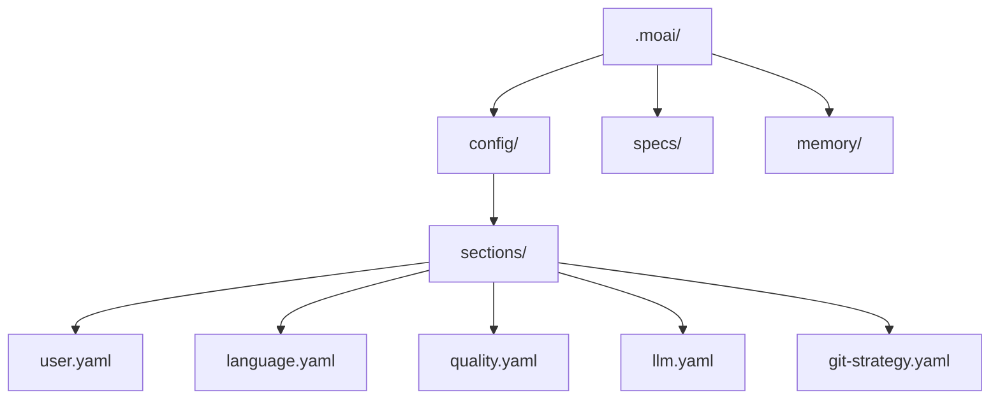

通过 MoAI-ADK 的交互式设置向导完成首次设置。向导只询问必须由人来决定的 5 项 —— 对话语言、姓名、要部署的代理框架、会话权限模式，以及是否启用 Jev 类型化判断。其余设置(模型策略、报告格式、质量门禁、设计工作流等)按推荐默认值保存，之后需要时可以更改。

大多数设置保存为 `.moai/config/sections/` 下的 YAML 文件，每个文件只负责一个关注点，修改某个值时只需打开对应文件。会话权限模式是例外，它写入用户级的 Claude Code 设置(见下方 Page 2)。

## 启动设置向导

### 创建新项目

想在创建新项目的同时初始化:

```bash
moai init my-project
```

该命令会创建 `my-project` 文件夹并初始化 MoAI-ADK。

### 安装到既有文件夹

想在既有项目中安装 MoAI-ADK,请移动到该文件夹后运行:

```bash
cd my-existing-project
moai init
```


`moai init` 会直接安装到当前文件夹。新项目请用 `moai init <项目名>` 创建。


## 向导结构

初始化向导不提供模式选择，始终按同一流程运行。没有扩大或缩小问题范围的标志，每个人看到的问题都一样。问题共 5 个，分为 3 页。屏幕顶部的进度指示(`● ● ● ○ ○ 3 / 5`)统计的是问题数，不是页数。

| 页面 | 问题 |
|------|------|
| **Page 1 —— 基本** | 对话语言、姓名 |
| **Page 2 —— 代理与自主** | 要部署的代理框架、会话权限模式 |
| **Page 3 —— 判断能力** | 是否启用 Jev 类型化判断 |

```bash
moai init my-project
```


向导不会询问 Git 自动化模式和提供商。`moai init` 会根据仓库中已配置的 Git 远程自动判断。之后要更改 Git 设置，请运行 `moai update -c` (`--config`)。Git 相关问题(自动化模式、提供商、认证信息)只会在这条路径中出现。


## Page 1 —— 基本

设置对话语言和姓名两项。对话语言有预填的默认值，姓名只有在配置文件中已保存时才会预填。无论哪种情况，直接按 Enter 即可继续。

**对话语言** —— MoAI 与你对话时使用的语言。选择后向导界面会立即切换为该语言。

```bash
? 选择对话语言
▸ English
  Korean (한국어)
  Japanese (日本語)
  Chinese (中文)
```

该设置保存到 `.moai/config/sections/language.yaml`。

**姓名** —— MoAI 称呼你时使用的名字。留空则跳过。

```bash
? 输入您的姓名: [姓名]
```

该设置保存到 `.moai/config/sections/user.yaml` 的 `user.name` 字段。


向导不询问项目名称。`moai init <项目名>` 会使用你传入的名称，不传则使用当前文件夹名称。也可以用 `--name` 标志直接指定。


## Page 2 —— 代理与自主

### 代理框架

选择要为此项目部署并接入哪个代理框架。选择不同，放到项目根目录的文件也不同。

```bash
? 选择要部署并接入的代理框架
▸ 仅 Claude (推荐) - 部署 .claude/ 表面与 AGENTS.md（沿用至今的默认行为）
  仅 Codex         - 仅部署 AGENTS.md 与 Codex 表面 — 不会生成 .claude/ 目录、CLAUDE.md 和 .mcp.json
  Claude + Codex   - 在相同的 .claude/ 部署之上追加 .codex/ 接入，并强制开启 .mcp.json 供应
```

指定 `--llm claude|gpt|both` 标志时，标志优先于此处的回答。

### 会话权限模式

选择 Claude Code 会话以哪种权限模式启动。

```bash
? 选择会话权限模式
▸ 自动接受编辑 (推荐) - 自动接受文件编辑;其他工具仍需确认
  自动模式            - 在分类器安全检查下自动批准工具调用
  跳过权限检查        - 跳过所有提示;需要沙箱证明 (Docker/gVisor 等)
```

该设置不写入项目 YAML，而是写入用户级的 Claude Code 设置(`defaultMode`)。默认的"自动接受编辑"对应 `defaultMode: acceptEdits`。"跳过权限检查"只有在存在沙箱证明且终止开关关闭时才会生效，否则会降为自动模式应用。指定 `--autonomy-tier semi-auto|automatic|fully-autonomous` 标志时，标志优先于此处的回答。

## Page 3 —— 判断能力

### Jev 类型化判断

Jev 针对传入的状态回答类型化问题并返回概率，它本身不做任何决定。

```bash
? 要启用 Jev 类型化判断吗？（可选，默认关闭）
```

默认值为**关闭**。启用后，卡片正文或请求正文会发送到外部厂商的服务器，请在了解这一点后再选择。该设置保存到 `.moai/config/sections/workflow.yaml` 的 `workflow.jev.enabled` 字段。


此问题只在 `moai init` 中出现。`moai update -c` 不会询问，之后要更改请打开 `moai web` 设置页面。


## 向导不询问的设置

以下各项不经询问、直接按默认值保存。要更改，请传入标志，或在设置完成后使用 `moai update -c` 或 `moai web`。

| 项目 | 默认值 | 更改方式 |
|------|--------|----------|
| 性能层级(模型策略) | Medium | `--model-policy` 或 `--profile`、`moai update -c` |
| 报告格式 | HTML + Markdown | `moai update -c` |
| LSP 集成 | 开启 | `--enable-lsp` |
| 强制质量门禁 | 开启 | `--enforce-quality` |
| 设计工作流与 Claude Design 集成 | 开启 | `--enable-design` |
| Git 自动化模式与提供商 | 根据远程仓库设置判断 | `--git-mode`、`--git-provider`、`moai update -c` |

### 性能层级(模型策略)

`moai init` 不询问模型策略，直接保存为 Medium。使用 `moai update -c` 重新设置时会显示下面的界面。

```bash
? 选择模型策略:
  Max - Opus 5.5 (high~medium) + Sonnet (low, 文档/一次性任务) — Max $200 套餐
▸ Medium (推荐) - Opus 5.5 (high~low) + Sonnet (low, 文档/一次性任务) — Max $100 套餐
  Low - Opus 5.5 (high~low) + Sonnet (low, 文档/E2E/一次性任务) — Plus $20 套餐
```

| 层级 | 特点 |
|------|------|
| **Max** | 质量优先 —— 与 Medium 相同，只有 `builder-harness` 和 `e2e-tester` 两个代理的 effort 高一级 |
| **Medium**（默认，推荐） | 质量与成本的平衡 —— 成本/分数曲线的膝点 |
| **Low** | 每任务最低成本 —— 大多数智能体类代理降至 Opus `medium` |

该设置保存到 `.moai/config/sections/llm.yaml` 的 `performance_tier` 字段，并作为 `profile` 字段(配置矩阵列)的 legacy 别名读取。用 `--profile high|medium|low` 标志直接指定则保存到 `profile` 字段。每个配置文件的代理 model+effort 映射请参阅[配置矩阵](/zh/advanced/profile-matrix/)页面。

## 非交互模式(CI/CD)

用标志指定所有值，即可不经向导完成初始化:

```bash
moai init my-project \
  --non-interactive \
  --llm claude \
  --autonomy-tier semi-auto \
  --profile medium \
  --enable-lsp=false \
  --enforce-quality
```

## 设置完成

完成所有步骤后会生成配置文件:


```mermaid
graph TD
    A[".moai/"] --> B["config/"]
    A --> C["specs/"]
    A --> D["memory/"]
    B --> E["sections/"]
    E --> F["user.yaml"]
    E --> G["language.yaml"]
    E --> H["quality.yaml"]
    E --> I["llm.yaml"]
    E --> J["git-strategy.yaml"]
```

安装部署技能镜像时优先使用符号链接。在无法创建链接的环境里会改为复制部署,此时 `moai init` 的完成摘要会一并注明 —— 只需知道一点:副本不像链接那样跟着源头走。

## 修改设置

### 手动修改

```bash
# 用户设置
vim .moai/config/sections/user.yaml

# 语言设置
vim .moai/config/sections/language.yaml

# 模型策略(性能层级)
vim .moai/config/sections/llm.yaml

# 质量设置
vim .moai/config/sections/quality.yaml
```

### 重新设置

可重新运行设置向导来更改配置:

```bash
# 重新运行设置向导(推荐)
moai update -c
```


`moai update -c` 命令可在保留既有设置的同时,只选择性地重新设置想更改的项目。


## 验证设置

确认设置是否正确配置:

```bash
moai doctor
```

该命令会验证 Git 是否安装、项目结构(`.moai/` 文件夹)、配置文件、各语言的开发工具。可用 `--verbose` 确认详情。

## 下一步

设置完成后,请跟随[快速开始](./quickstart)指南创建你的第一个项目。

```bash
moai --help
```
