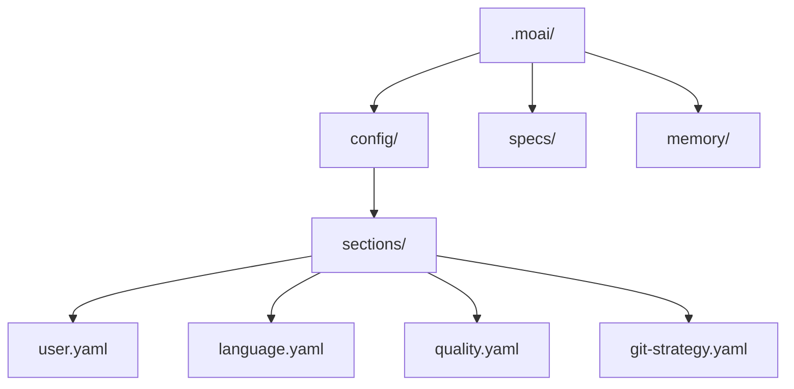
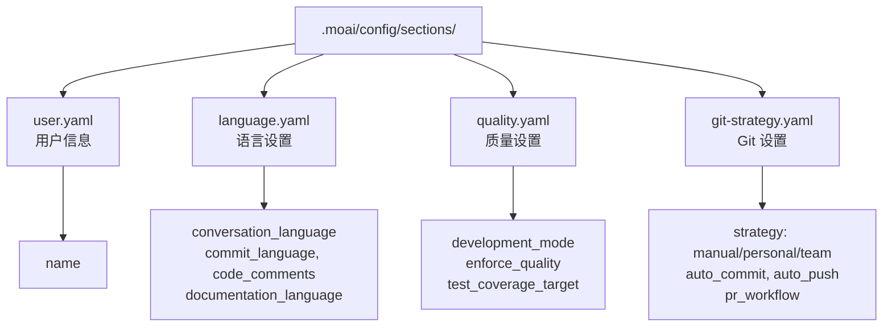

通过 MoAI-ADK 的交互式设置向导完成首次设置。向导共 9 个步骤，按你的开发环境配置语言、Git 自动化范围与执行模式。这里设定的所有值都保存为 `.moai/config/sections/` 下的 YAML 文件，之后随时可以直接改文件，或重新运行向导来更改。

## 启动设置向导

### 创建新项目

要在创建新项目的同时进行初始化：

```bash
moai init my-project
```

该命令会创建 `my-project` 文件夹并初始化 MoAI-ADK。

### 安装到当前文件夹

要在现有项目中安装 MoAI-ADK，请进入该文件夹后执行：

```bash
cd my-existing-project
moai init
```


`moai init` 会直接安装到当前文件夹。新项目请用 `moai init <项目名>` 创建。


## 9 步设置流程

### 第 1 步：选择对话语言

选择 Claude 回复时使用的语言。

```bash
? 대화 언어를 선택하세요:
▸ English - English
  Korean (한국어) - Korean
  Japanese (日本語) - Japanese
  Chinese (中文) - Chinese
```


语言选择之后可以在 `.moai/config/sections/language.yaml` 文件中更改。


### 第 2 步：输入姓名

用于设置文件。按 Enter 可跳过。

```bash
? 이름 입력: [이름]
```

### 第 3 步：选择 Git 自动化模式

设置 Claude 可以执行的 Git 操作范围。

```bash
? Git 자동화 모드 선택:
▸ Manual - AI가 커밋이나 푸시를 하지 않음
  Personal - AI가 브랜치 생성 및 커밋 가능
  Team - AI가 브랜치 생성, 커밋, PR 생성 가능
```

**Manual**：AI 不执行任何 Git 操作。所有提交和推送均由用户亲自执行。
**Personal**：AI 可以创建分支并提交。适合个人项目。
**Team**：AI 可以创建分支、提交并创建 PR。为团队协作工作流优化。


Git 设置保存在 `.moai/config/sections/git-strategy.yaml` 文件中。随时可以用 `moai update -c` 命令重新设置。


### 第 4 步：选择 Git 提供商

选择项目的 Git 托管平台。

```bash
? Git 프로바이더 선택:
▸ GitHub - GitHub.com
  GitLab - GitLab.com 또는 자체 호스팅 GitLab
```

### 第 5 步：选择 Git 提交信息语言

选择编写提交信息时使用的语言。

```bash
? Git 커밋 메시지 언어 선택:
▸ Korean (한국어) - 한국어로 커밋
  English - 영어로 커밋
  Japanese (日本語) - 일본어로 커밋
  Chinese (中文) - 중국어로 커밋
```


提交信息语言可以与代码注释语言分别设置。


### 第 6 步：选择代码注释语言

选择代码注释使用的语言。

```bash
? 코드 주석 언어 선택:
▸ Korean (한국어) - 한국어로 주석
  English - 영어로 주석
  Japanese (日本語) - 일본어로 주석
  Chinese (中文) - 중국어로 주석
```


大多数项目建议将代码注释语言设为英语。


### 第 7 步：选择文档语言

选择文档文件使用的语言。

```bash
? 문서 언어 선택:
▸ Korean (한국어) - 한국어로 문서
  English - 영어로 문서
  Japanese (日本語) - 일본어로 문서
  Chinese (中文) - 중국어로 문서
```

### 第 8 步：选择 Agent Teams 执行模式

设置 MoAI 使用 Agent Teams（并行）还是 sub-agents（顺序）。

```bash
? Agent Teams 실행 모드 선택:
▸ Auto (권장) - 작업 복잡도 기반 지능형 선택
  Sub-agent (클래식) - 기존 단일 에이전트 모드
  Team (실험적) - 병렬 Agent Teams (실험적 기능 필요)
```

**Auto**：根据任务复杂度自动选择最优模式。大多数情况下推荐使用。
**Sub-agent**：单个智能体按顺序处理任务。适合依赖性强的任务。
**Team**：多个专业智能体并行协作。需要 `CLAUDE_CODE_EXPERIMENTAL_AGENT_TEAMS=1` 环境变量。

### 第 9 步：选择队友显示模式

设置 Agent 队友的显示方式。分屏显示需要 tmux。

```bash
? 팀원 표시 모드 선택:
▸ Auto (권장) - tmux 사용 가능 시 tmux, 없으면 in-process (기본값)
  In-Process - 같은 터미널에서 실행 (어디서나 동작)
  Tmux - tmux 분할 화면 (tmux/iTerm2 필요)
```

**Auto**：自动检测 tmux 是否安装，选择最优显示模式。
**In-Process**：队友任务在同一终端窗口中运行。无需 tmux 也能工作。
**Tmux**：以 tmux 分屏方式直观查看队友的工作。

## 设置完成

完成所有步骤后，会生成设置文件：


```mermaid
graph TD
    A[.moai/] --> B[config/]
    A --> C[specs/]
    A --> D[memory/]
    B --> E[sections/]
    E --> F[user.yaml]
    E --> G[language.yaml]
    E --> H[quality.yaml]
    E --> I[git-strategy.yaml]
```

查看生成的设置文件：

```bash
cat .moai/config/sections/user.yaml
```

## 设置结构


```mermaid
graph TB
    A[.moai/config/sections/] --> B[user.yaml<br>用户信息]
    A --> C[language.yaml<br>语言设置]
    A --> D[quality.yaml<br>质量设置]
    A --> E[git-strategy.yaml<br>Git 设置]

    B --> B1[name]
    C --> C1[conversation_language<br>commit_language, code_comments<br>documentation_language]
    D --> D1[development_mode<br>enforce_quality<br>test_coverage_target]
    E --> E1[strategy: manual/personal/team<br>auto_commit, auto_push<br>pr_workflow]
```

## 修改设置

设置随时可以修改：

### 手动修改

```bash
# 사용자 설정
vim .moai/config/sections/user.yaml

# 언어 설정
vim .moai/config/sections/language.yaml

# 품질 설정
vim .moai/config/sections/quality.yaml

# Git 설정
vim .moai/config/sections/git-strategy.yaml
```

### 重新设置

重新运行设置向导即可重新配置所有设置：

```bash
# 설정 마법사 다시 실행 (권장)
moai update -c

# 또는 전체 초기화
moai init --reset
```


`moai update -c` 命令可以在保留现有设置的同时，仅选择性地重设想更改的项目。



`moai init --reset` 选项会覆盖全部现有设置。重要设置请提前备份。


## 验证设置

确认设置是否正确配置：

```bash
moai doctor
```

该命令验证以下内容：

- 是否安装 Git
- 项目结构（`.moai/` 文件夹）
- 设置文件（`.moai/config/config.yaml`）
- 各语言开发工具检测（用 `--verbose` 查看详情）

所有项目通过时会显示 `All checks passed` 消息。若缺少工具，可通过 `moai doctor --fix` 获取修复建议。

## 下一步

设置完成后，请按照[快速开始](./quickstart)指南创建第一个项目。全部命令与选项随时可以查看：

```bash
moai --help
```
