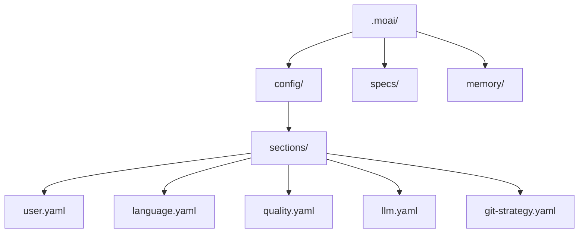

通过 MoAI-ADK 的交互式设置向导完成首次设置。按你的开发环境配置语言、Git 自动化范围、模型策略、harness 配置文件。这里设定的所有值都会保存为 `.moai/config/sections/` 下的 YAML 文件,之后随时可以直接改文件,或重新运行向导来更改。

## 启动设置向导

### 创建新项目

想在创建新项目的同时初始化:

```bash
moai init my-project
```

该命令会创建 `my-project` 文件夹并初始化 MoAI-ADK。

### 安装到既有文件夹

想在既有项目中安装 MoAI-ADK,请移动到该文件夹后运行:

```bash
cd my-existing-project
moai init
```


`moai init` 会直接安装到当前文件夹。新项目请用 `moai init <项目名>` 创建。


## 向导模式

初始化向导按提问的深度分三种模式运行。

| 模式 | 标志 | 提问范围 |
|------|--------|----------|
| **Quick**(默认) | (无) | 仅核心设置 —— 语言、名称、Git、模型策略 |
| **Standard** | `--standard` | Quick + Phase 1 提问(project mode, harness profile, LSP, quality, design) |
| **Advanced** | `--advanced` | Standard + Phase 2 提问(仅在满足前置条件时) |

```bash
# 默认向导(Quick)
moai init my-project

# 含 Phase 1 提问
moai init my-project --standard

# 含 Phase 1 + Phase 2 提问
moai init my-project --advanced
```

## Quick 模式(默认)

不带标志运行时只询问核心设置。对大多数用户已经足够。

### 第 1 步:选择对话语言

选择 Claude 回复所用的语言。

```bash
? 选择对话语言:
▸ English
  Korean (한국어)
  Japanese (日本語)
  Chinese (中文)
```

该设置保存到 `.moai/config/sections/language.yaml`。

### 第 2 步:输入名称

配置文件中使用的用户名。可按 Enter 跳过。

```bash
? 输入名称: [名称]
```

### 第 3 步:选择 Git 自动化模式

设置 Claude 可执行的 Git 操作范围。

```bash
? 选择 Git 自动化模式:
▸ Manual - AI 不进行提交或推送
  Personal - AI 可创建分支并提交
  Team - AI 可创建分支、提交、创建 PR
```

- **Manual**:AI 不执行 Git 操作。所有提交与推送由用户亲自执行。
- **Personal**:AI 可创建分支并提交。适合个人项目。
- **Team**:AI 可执行创建分支、提交,直至创建 PR。为团队协作工作流优化。


Git 设置保存到 `.moai/config/sections/git-strategy.yaml` 文件。


### 第 4 步:选择 Git 提供方

选择项目的 Git 托管平台。

```bash
? 选择 Git 提供方:
▸ GitHub - GitHub.com
  GitLab - GitLab.com 或自托管 GitLab
```

### 第 5 步:提交信息语言

选择撰写提交信息所用的语言。可与代码注释语言设为不同。

### 第 6 步:代码注释语言

选择代码注释所用的语言。大多数项目推荐英语。

### 第 7 步:文档语言

选择文档文件所用的语言。

### 第 8 步:性能层级(模型策略)

选择分配给智能体的 AI 模型层级 —— 这是代币经济学的核心设置。

```bash
? 选择性能层级:
▸ medium (推荐) - 质量与成本的平衡
  max - 最高质量,计划·审计分配 Opus
  low - 经济,以 Sonnet 为中心分配
```

| 层级 | 特点 |
|------|------|
| **max** | 最高质量 —— 计划·审计分配 Opus,最大推理深度 |
| **medium**(默认) | 质量与成本的平衡 |
| **low** | 经济 —— 以 Sonnet 为中心分配 |

该设置保存到 `.moai/config/sections/llm.yaml` 的 `performance_tier` 字段，并作为 `profile` 字段(配置矩阵列)的 legacy 别名读取。用 `--profile max|medium|low` 标志直接指定则保存到 `profile` 字段。每个配置文件的代理 model+effort 映射请参阅[配置矩阵](/zh/advanced/profile-matrix/)页面。

## Standard 模式(Phase 1 提问)

给出 `--standard` 标志时,除 Quick 模式的所有提问外还会显示 Phase 1 提问。

### project mode

选择项目协作模式。

```bash
? Select project mode:
▸ Personal (Recommended) - Solo developer
  Team - Multi-developer setup
```

### harness evaluator profile

选择质量评估器的默认配置文件。

```bash
? Select default harness evaluator profile:
▸ default
  strict
  lenient
  frontend
```

### LSP integration

选择是否在 run 阶段启用语言服务器诊断。默认为禁用(opt-in)。

### quality gates

选择是否强制 TRUST 5 质量门禁以及是否允许覆盖率例外。

- **Enforce quality gates**(默认: Yes)—— 质量门禁失败时阻断实现推进
- **Allow coverage exemptions**(默认: No)—— 将特定文件/包排除在覆盖率对象之外

### design workflow

选择是否启用 MoAI 设计流水线与 Claude Design 联动。

- **Enable design workflow**(默认: Yes)
- **Enable Claude Design integration**(默认: Yes,仅在启用 design 时显示)

## Advanced 模式(Phase 2 提问)

`--advanced` 标志包含 `--standard`,并额外显示 Phase 2 提问。Phase 2 提问仅在满足 run 阶段完成等前置条件时显示,无条件时会自动跳过并输出提示消息。

## 非交互模式(CI/CD)

用标志指定所有值即可无需向导完成初始化:

```bash
moai init my-project \
  --non-interactive \
  --project-mode personal \
  --profile medium \
  --harness-profile default \
  --enable-lsp=false \
  --enforce-quality
```

## 设置完成

完成所有步骤后会生成配置文件:


```mermaid
graph TD
    A[".moai/"] --> B["config/"]
    A --> C["specs/"]
    A --> D["memory/"]
    B --> E["sections/"]
    E --> F["user.yaml"]
    E --> G["language.yaml"]
    E --> H["quality.yaml"]
    E --> I["llm.yaml"]
    E --> J["git-strategy.yaml"]
```

## 修改设置

### 手动修改

```bash
# 用户设置
vim .moai/config/sections/user.yaml

# 语言设置
vim .moai/config/sections/language.yaml

# 模型策略(性能层级)
vim .moai/config/sections/llm.yaml

# 质量设置
vim .moai/config/sections/quality.yaml
```

### 重新设置

可重新运行设置向导来更改配置:

```bash
# 重新运行设置向导(推荐)
moai update -c
```


`moai update -c` 命令可在保留既有设置的同时,只选择性地重新设置想更改的项目。


## 验证设置

确认设置是否正确配置:

```bash
moai doctor
```

该命令会验证 Git 是否安装、项目结构(`.moai/` 文件夹)、配置文件、各语言的开发工具。可用 `--verbose` 确认详情。

## 下一步

设置完成后,请跟随[快速开始](./quickstart)指南创建你的第一个项目。

```bash
moai --help
```
