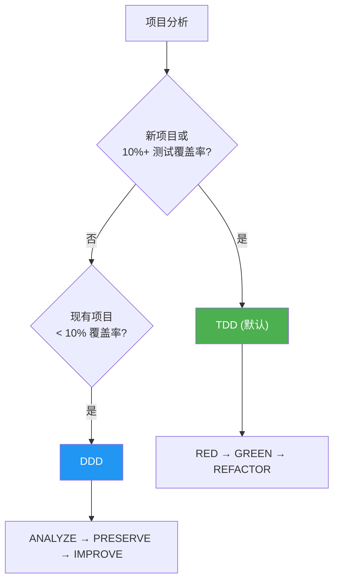
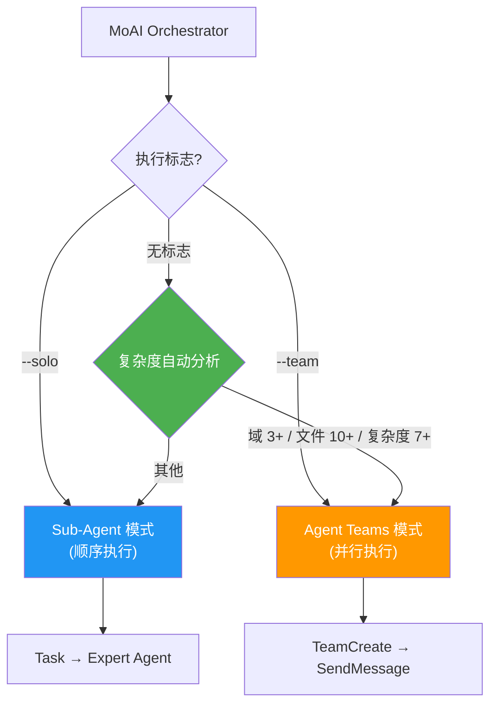
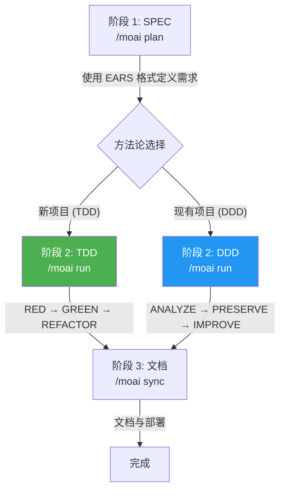

MoAI-ADK 是一个基于 AI 的开发环境,是高效生成高质量代码的综合工具包。

## 符号指南

在本文档中,命令前缀表示执行环境:

- **Claude Code** 命令在聊天窗口中输入
  ```bash
  > /moai plan "功能描述"
  ```

- **终端** 命令在终端中输入
  ```bash
  moai init my-project
  ```

## 核心概念

MoAI-ADK 基于 **SPEC 优先 DDD** (Domain-Driven Development) 方法论,并通过 **TRUST 5** 质量框架确保代码质量。

### 什么是 SPEC?(简单理解)

**SPEC** (Specification) 是"将与 AI 的对话记录保存为文档"。

**Vibe Coding** (氛围编程) 的最大问题是 **上下文丢失**:
- 😰 与 AI 讨论 1 小时的内容在会话结束时 **消失**
- 😰 第二天继续工作时,必须 **从头开始解释**
- 😰 对于复杂功能,**结果与意图不符**

**SPEC 解决这个问题:**
- ✅ 通过 **保存到文件** 永久保留需求
- ✅ 即使会话结束,也可以通过阅读 SPEC **继续工作**
- ✅ 使用 **EARS 格式** 明确定义,消除歧义


**一句话总结**: 昨天讨论的"JWT 认证 + 1 小时过期 + 刷新令牌" - 今天无需重新解释。只需 `/moai run SPEC-AUTH-001` 即可立即开始实现!


### 什么是 TDD?(简单理解)

**TDD** (Test-Driven Development) 是"先写测试再开发的方法"。

用准备考试来类比:
- 📝 **先写评分标准 (测试)** — 功能不存在,自然会失败
- 💡 **写通过标准的最小代码** — 恰好够用即可
- ✨ **完善为更好的代码** — 在保持测试通过的同时改进

MoAI-ADK 通过 **RED-GREEN-REFACTOR** 循环自动化此过程:

| 阶段 | 含义 | 作用 |
|------|------|------|
| 🔴 **RED** | 失败 | 先为尚不存在的功能编写测试 |
| 🟢 **GREEN** | 通过 | 编写通过测试的最小代码 |
| 🔵 **REFACTOR** | 改进 | 在保持测试通过的同时提升代码质量 |

### 什么是 DDD?(简单理解)

**DDD** (Domain-Driven Development) 是"安全的代码改进方法"。

用家庭装修类比:
- 🏠 **不拆除现有房屋**,一次改进一个房间
- 📸 **装修前拍摄当前状态照片** (= 表征测试)
- 🔧 **一次处理一个房间,每次检查** (= 增量改进)

MoAI-ADK 通过 **ANALYZE-PRESERVE-IMPROVE** 循环自动化此过程:

| 阶段 | 含义 | 作用 |
|------|---------|--------------|
| **ANALYZE** | 分析 | 理解当前代码结构和问题 |
| **PRESERVE** | 保留 | 用测试记录当前行为(安全网) |
| **IMPROVE** | 改进 | 在测试通过的同时进行增量改进 |

### 开发方法论选择

MoAI-ADK 根据项目状态自动选择最优的开发方法论。



| 方法论 | 对象 | 循环 |
|--------|------|------|
| **TDD** | 新项目或 10%+ 覆盖率 | RED → GREEN → REFACTOR |
| **DDD** | 10% 以下覆盖率的现有项目 | ANALYZE → PRESERVE → IMPROVE |


MoAI-ADK v2.5.0+ 使用二元方法论选择 (仅 TDD 或 DDD)。为清晰和一致性，混合模式已被移除。方法论在 `moai init` 时自动选择，可通过 `.moai/config/sections/quality.yaml` 中的 `development_mode` 更改。


### TRUST 5 质量框架

TRUST 5 基于 5 条核心原则:

| 原则 | 描述 |
|-----------|-------------|
| **T**ested (已测试) | 85% 覆盖率、表征测试、行为保留 |
| **R**eadable (可读) | 清晰的命名约定、一致的格式 |
| **U**nified (统一) | 统一的样式指南、自动格式化 |
| **S**ecured (安全) | OWASP 合规、安全验证、漏洞分析 |
| **T**rackable (可追踪) | 结构化提交、变更历史追踪 |

## Go 版本特性

MoAI-ADK 2.5 完全用 Go 重写了 Python 版本，以最大化性能和效率。

| 项目 | Python 版本 | Go 版本 |
|------|-------------|---------|
| 分发 | pip + venv + 依赖 | **单一二进制**，零依赖 |
| 启动时间 | ~800ms 解释器启动 | **~5ms** 原生执行 |
| 并发性 | asyncio / threading | **原生 goroutines** |
| 类型安全 | 运行时 (mypy 可选) | **编译时强制** |
| 跨平台 | 需要 Python 运行时 | **预构建二进制** (macOS, Linux, Windows) |

### 核心数值

- **34,220 行** Go 代码，**32** 个包
- **85-100%** 测试覆盖率
- **28** 个专业 AI 代理 + **52** 项技能
- **18** 种编程语言支持
- **16** 个 Claude Code 钩子事件

## 系统要求

| 平台 | 支持环境 | 备注 |
|------|---------|------|
| macOS | Terminal, iTerm2 | 完全支持 |
| Linux | Bash, Zsh | 完全支持 |
| Windows | **WSL (推荐)**, PowerShell 7.x+ | 不支持原生 cmd.exe |

**前提条件:**
- 所有平台都必须安装 **Git**
- **Windows 用户**: 推荐使用 WSL (Windows Subsystem for Linux) 以获得最佳体验

## 核心价值

MoAI-ADK 提供以下核心价值:

- **基于 SPEC 的 TDD/DDD**: 将需求文档化并渐进式开发的结构化方法论 (新项目使用 TDD, 遗留代码使用 DDD)
- **TRUST 5 质量框架**: 保障测试、可读性、统一性、安全性、可追踪性的 5 项原则
- **28 个专业代理**: 针对各开发阶段专业化的 AI 代理团队
- **52 项技能**: 支持各种开发场景的可扩展技能库
- **多语言支持**: 支持韩语、英语、日语、中文 4 种语言
- **Sequential Thinking MCP**: 通过逐步推理进行结构化问题解决
- **Ralph-Style LSP Integration**: 基于 LSP 的自主工作流和实时质量反馈

## 主要功能

MoAI-ADK 提供 28 个专业 AI 代理和 52 项技能,自动化和优化整个开发工作流。

### 代理类别

| 类别 | 数量 | 关键代理 |
|----------|-------|------------|
| **管理器** | 8 | spec、ddd、tdd、docs、quality、project、strategy、git |
| **专家** | 8 | backend、frontend、security、devops、performance、debug、testing、refactoring |
| **构建器** | 3 | agent、skill、plugin |
| **团队** | 8 | researcher、analyst、architect、designer、backend-dev、frontend-dev、tester、quality |

### 模型策略 (令牌优化)

MoAI-ADK 根据 Claude Code 订阅计划为 28 个代理分配最优的 AI 模型。在计划的速率限制内最大化质量。

| 策略 | 计划 | 🟣 Opus | 🔵 Sonnet | 🟡 Haiku | 用途 |
|------|------|---------|-----------|----------|------|
| **High** | Max $200/月 | 23 | 1 | 4 | 最高质量、最大吞吐量 |
| **Medium** | Max $100/月 | 4 | 19 | 5 | 质量与成本平衡 |
| **Low** | Plus $20/月 | 0 | 12 | 16 | 经济型、无 Opus 访问 |


Plus $20 计划不包含 Opus 访问。设置 **Low** 可确保所有代理仅使用 Sonnet 和 Haiku，防止速率限制错误。更高计划可在关键代理 (安全、策略、架构) 上使用 Opus，同时在常规任务上使用 Sonnet/Haiku。


#### 主要代理模型分配

| 代理 | High | Medium | Low |
|------|------|--------|-----|
| manager-spec, manager-strategy, expert-security | 🟣 opus | 🟣 opus | 🔵 sonnet |
| manager-ddd/tdd, expert-backend/frontend | 🟣 opus | 🔵 sonnet | 🔵 sonnet |
| manager-quality, team-researcher | 🟡 haiku | 🟡 haiku | 🟡 haiku |

### 双重执行模式

提供 `--solo` (Sub-Agent 模式) 和 `--team` (Agent Teams 模式) 两种执行模式。两种模式均可自主判断顺序或并行执行。无标志运行时,MoAI-ADK 分析任务复杂度并自动选择最优模式。



| 标志 | 模式 | 执行方式 |
|------|------|----------|
| `--solo` | Sub-Agent 模式 | 顺序委派专家代理 |
| `--team` | Agent Teams 模式 | 并行团队协作 |
| (无) | 自动选择 | 根据复杂度自主判断 |

```bash
/moai run SPEC-AUTH-001          # 自动选择
/moai run SPEC-AUTH-001 --team   # 强制 Agent Teams 模式 (并行)
/moai run SPEC-AUTH-001 --solo   # 强制 Sub-Agent 模式 (顺序)
```

### SPEC 优先工作流

MoAI-ADK 遵循 3 阶段开发工作流。Run 阶段的方法论根据项目状态自动选择:



### 推荐工作流链

**新功能开发:**
```
/moai plan → /moai run SPEC-XXX → /moai sync SPEC-XXX
```

**错误修复:**
```
/moai fix (或 /moai loop) → /moai review → /moai sync
```

**重构:**
```
/moai plan → /moai clean → /moai run SPEC-XXX → /moai review → /moai coverage → /moai codemaps
```

**文档更新:**
```
/moai codemaps → /moai sync
```

## 多语言支持

MoAI-ADK 支持 4 种语言:

- 🇰🇷 **韩语** (Korean)
- 🇺🇸 **英语** (English)
- 🇯🇵 **日语** (Japanese)
- 🇨🇳 **中文** (Chinese)

您可以在安装向导中选择首选语言,或直接在配置文件中更改。

## LSP 集成

**LSP** (Language Server Protocol) 是代码编辑器与语言工具之间的标准通信协议。它实时检测代码错误、类型错误和 Lint 结果,提供即时反馈。

**Ralph-Loop Style** 是将 LSP 诊断结果用作反馈循环的自主工作流。检测到质量问题时自动调用修复代理,并重复执行直到达到质量标准。

MoAI-ADK 通过 Ralph-Loop Style LSP 集成提供自主工作流:

- **基于 LSP 的完成标记自动检测**: 实时监控代码质量状态
- **实时回归检测**: 即时检测变更对现有功能的影响
- **自动完成条件**: 达到 0 错误、0 类型错误、85% 覆盖率时自动完成


Ralph-Loop Style LSP 集成自动化了开发工作流的质量门,无需手动干预即可维持高代码质量。


## 💡 使用 GLM 节省 50~70% 令牌

GLM 是与 Claude Code 完全兼容的 AI 模型。在 **CG 模式**下，将 Claude Opus 领导与 GLM-5 团队成员组合，可在实现任务中节省 **50~70% 令牌**。

### CG 模式: Claude + GLM 智能体团队

CG 模式下，Claude Opus 负责整个工作流的编排，GLM-5 团队成员以低成本并行处理实现任务。

| 角色 | 模型 | 负责工作 |
|------|------|---------|
| **领导** | Claude Opus | 编排、架构决策、代码审查 |
| **团队成员** | GLM-5 | 代码实现、测试编写、文档化 |

| 任务类型 | 推荐模式 | 节省效果 |
|---------|---------|---------|
| 实现密集型 SPEC (`/moai run`) | CG 模式 | **节省 50~70%** |
| 代码生成、测试、文档化 | CG 模式 | **节省 50~70%** |
| 架构设计、安全审查 | 仅 Claude | 需要 Opus 推理能力 |

### 切换到 GLM

```bash
# 切换到 GLM 后端
moai glm

# GLM Worker 模式启动 (Opus 领导 + GLM-5 团队成员)
moai glm --team

# CG 模式 (Claude 领导 + GLM 团队成员，需要 tmux)
moai cg

# 返回 Claude 后端
moai cc
```


如果您还没有 GLM 账户，请在 [z.ai (额外 10% 折扣)](https://z.ai/subscribe?ic=1NDV03BGWU) 注册。通过链接注册产生的奖励将用于 **MoAI 开源开发**。🙏


## 入门指南

要开始您的 MoAI-ADK 之旅:

1. **[安装](/getting-started/installation)** - 在您的系统上安装 MoAI-ADK
2. **[初始设置](/getting-started/installation)** - 运行交互式设置向导
3. **[快速开始](/getting-started/quickstart)** - 创建您的第一个项目
4. **[核心概念](/core-concepts/what-is-moai-adk)** - 深入了解 MoAI-ADK

## 主要优势

| 优势 | 描述 |
|---------|-------------|
| **质量保证** | 使用 TRUST 5 框架保持一致的质量 |
| **生产力** | 通过 AI 代理自动化减少开发时间 |
| **成本效益** | 使用 GLM 5 节省 70% 成本 |
| **可扩展** | 通过模块化架构灵活扩展 |
| **多语言** | 支持 4 种语言 |

## 其他资源

- [GitHub仓库](https://github.com/modu-ai/moai-adk)
- [文档网站](https://adk.mo.ai.kr)
- [社区论坛](https://github.com/modu-ai/moai-adk/discussions)

---

## 下一步

在[安装指南](./installation)中了解 MoAI-ADK 的安装。
