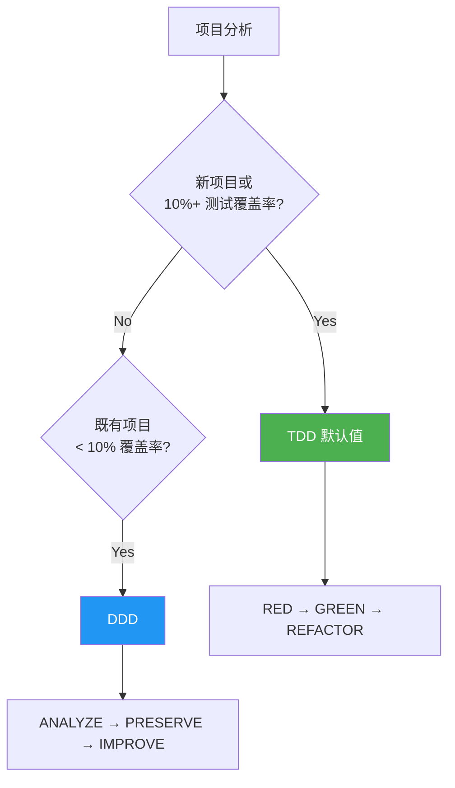

MoAI-ADK 是以 **代币经济学**(Token Economics)为目标的 Agentic Development Kit。用更少的 token 产出同等质量的代码,用同样的 token 获得更高的质量 —— 模型选择、推理深度、上下文用量都由系统管理。它是用 Go 编写的单一二进制,无需依赖即可直接运行。



## 表记法说明

本文中代码块的前缀表示执行环境:

- 在 **Claude Code** 对话窗输入的命令
  ```bash
  > /moai plan "功能描述"
  ```

- 在 **终端**(Terminal)输入的命令
  ```bash
  moai init my-project
  ```

## 核心价值 —— 三根支柱

MoAI-ADK v3.0 的价值可归纳为三根支柱。

| 支柱 | 一句话说明 | 代表工具 |
|------|-----------|----------|
| **代币经济学** | 最大化性价比的智能资源分配 | 3 层模型策略 · CG 模式 · Token Circuit Breaker |
| **智能体循环工程** | 循环自行工作,观察积累使 harness 学习 | `/moai goal` · `/moai loop` · Analyze-First 路由 |
| **智能体 harness** | 不亲自写代码,而是设计智能体工作的环境 | 11 个智能体 · SPEC 3-phase · TRUST 5 |

各支柱的详细内容在[核心概念](/zh/core-concepts/)一节讲解。本文只看开始所需的部分。

## 核心概念

MoAI-ADK 以 **基于 SPEC 的 TDD/DDD** 方法论为基础,并通过 **TRUST 5** 质量框架保障代码质量。

### 什么是 SPEC?(轻松理解)

**SPEC**(Specification)就是"把与 AI 的对话作为文档留存下来"。

**氛围编程**(Vibe Coding)最大的问题是 **上下文丢失**:

- 与 AI 讨论 1 小时的内容,会话一断就 **消失**
- 第二天想接着工作,得 **从头重新说明**
- 功能越复杂,越会出现 **与意图不同的结果**

**SPEC 解决这个问题:**

- 将需求 **保存为文件** 永久保留
- 即使会话中断,只要读 SPEC 就能 **接着工作**
- 用 EARS 格式 **无歧义地** 明确定义
- 无需重复相同说明,因此 **也节省 token**


**一句话概括:** 昨天与 AI 讨论的"JWT 认证 + 1 小时过期 + 刷新令牌",今天无需重新说明,用 `/moai run SPEC-AUTH-001` 一行就能立即开始实现!


### 什么是 TDD?(轻松理解)

**TDD**(Test-Driven Development)是"先写测试再开发的方法"。

用出考题来比喻:

- **先写评分标准(测试)** —— 因为功能还不存在,自然失败
- **写通过标准的最少代码** —— 只写恰好需要的量
- **打磨成更好的代码** —— 在保持测试通过的状态下改进

MoAI-ADK 用 **RED-GREEN-REFACTOR** 循环自动化这一过程:

| 阶段 | 含义 | 做的事 |
|------|------|--------|
| **RED** | 失败 | 先写尚不存在功能的测试 |
| **GREEN** | 通过 | 写通过测试的最少代码 |
| **REFACTOR** | 改进 | 在保持测试的同时提升代码质量 |

### 什么是 DDD?(轻松理解)

**DDD**(Domain-Driven Development)是"安全的代码改进方法"。

用房屋翻新来比喻:

- **不拆掉现有房子**,一个房间一个房间地改进
- **翻新前记录当前状态**(= 特性化测试)
- **一个房间一个房间地做,每次都确认**(= 渐进式改进)

MoAI-ADK 用 **ANALYZE-PRESERVE-IMPROVE** 循环自动化这一过程:

| 阶段 | 含义 | 做的事 |
|------|------|--------|
| **ANALYZE** | 分析 | 把握当前代码结构与问题点 |
| **PRESERVE** | 保存 | 用测试记录当前行为(安全网) |
| **IMPROVE** | 改进 | 在保持测试通过的同时逐点改进 |

### 开发方法论选择

MoAI-ADK 会依项目状态自动选择最优的开发方法论。


```mermaid
flowchart TD
    A["项目分析"] --> B{"新项目或<br/>10%+ 测试覆盖率?"}
    B -->|"Yes"| C["TDD 默认值"]
    B -->|"No"| D{"既有项目<br/>< 10% 覆盖率?"}
    D -->|"Yes"| E["DDD"]
    C --> F["RED → GREEN → REFACTOR"]
    E --> G["ANALYZE → PRESERVE → IMPROVE"]

    style C fill:#4CAF50,color:#fff
    style E fill:#2196F3,color:#fff
```

| 方法论 | 对象 | 循环 |
|--------|------|--------|
| **TDD** | 新项目或 10%+ 覆盖率 | RED → GREEN → REFACTOR |
| **DDD** | 覆盖率不足 10% 的既有项目 | ANALYZE → PRESERVE → IMPROVE |


MoAI-ADK v2.5.0+ 采用二元方法论选择(仅 TDD 或 DDD)。为明确性与一致性,hybrid 模式已被移除。方法论在 `moai init` 时自动选择,可在 `.moai/config/sections/quality.yaml` 的 `development_mode` 中更改。


### TRUST 5 质量框架

TRUST 5 以以下 5 项核心原则为基础:

| 原则 | 说明 |
|------|------|
| **T**ested | 85% 覆盖率、特性化测试、行为保存 |
| **R**eadable | 明确的命名规则、一致的格式化 |
| **U**nified | 统一的风格指南、自动格式化 |
| **S**ecured | 遵循 OWASP、安全验证、漏洞分析 |
| **T**rackable | 结构化提交、变更历史追踪 |

## Go Edition 特点

MoAI-ADK 将 Python Edition 完全用 Go 重写,以最大化性能与效率。

| 项目 | Python Edition | Go Edition |
|------|---------------|------------|
| 分发 | pip + venv + 依赖 | **单一二进制**,无依赖 |
| 启动时间 | ~800ms 解释器启动 | **~5ms** 原生执行 |
| 并发 | asyncio / threading | **原生 goroutines** |
| 类型安全 | 运行时(mypy 可选) | **编译期强制** |
| 跨平台 | 需要 Python 运行时 | **预构建二进制**(macOS, Linux, Windows) |

### 核心数字(以 v3.0 为准)

- **11 个** 智能体目录(10 个 MoAI 自定义 + 1 个 Anthropic 内置 `Explore`)
- **27 个** 技能(template-managed)
- **36 个** CLI 命令 · **15 种** `/moai` 子命令
- **16 种** 编程语言支持
- 基于 **504 个** SPEC 文档开发的代码库

## 系统要求

| 平台 | 支持环境 | 备注 |
|--------|----------|------|
| macOS | Terminal, iTerm2 | 完全支持 |
| Linux | Bash, Zsh | 完全支持 |
| Windows | **WSL(推荐)**, PowerShell 7.x+ | 不支持原生 cmd.exe |

**必要条件:**
- 所有平台都必须安装 **Git**
- **Windows 用户**:为获得最佳体验,推荐使用 WSL(Windows Subsystem for Linux)

## 主要功能

### 智能体目录(11 个)

MoAI 编排器不亲自实现,而是把工作委派给 11 个专业智能体。计划与审计是分离的 —— 制作者不检查。

| 类别 | 数量 | 主要智能体 |
|----------|------|--------------|
| **Manager** | 5 个 | manager-spec, manager-develop, manager-docs, manager-git, manager-design |
| **Evaluator** | 2 个 | plan-auditor, sync-auditor |
| **Builder** | 1 个 | builder-harness |
| **Advisor** | 1 个 | super-advisor(高推理咨询) |
| **Specialist** | 1 个 | e2e-tester(执行 Web/移动/桌面 E2E 测试) |
| **内置** | 1 个 | Explore(Anthropic 内置,只读代码分析) |

### 模型策略(代币经济学)

MoAI-ADK 依 Claude Code 订阅套餐为智能体分配最优 AI 模型。在套餐的用量限制内最大化质量 —— 为计划·审计这类推理繁重的阶段分配上位模型,为重复作业分配轻量模型。

| 层级 | 特点 |
|------|------|
| **max** | 最高质量 —— 计划·审计分配 Opus,最大推理深度 |
| **medium**(默认) | 质量与成本的平衡 |
| **low** | 经济 —— 以 Sonnet 为中心分配 |


默认层级是 **medium**。`low` 层级设计为即使没有上位模型(Opus)整个工作流也能运转。`max` 层级会为核心阶段(计划、审计)分配 Opus,为一般作业分配轻量模型。通过 `--model-policy` 标志或初始化向导设置。


### 执行模式与编排

自然语言请求会经过 **Analyze-First** 路由 —— 无论用哪种语言请求,都先分析意图再连接到合适的工作流。编排器会依作业复杂度在顺序子智能体(默认)、并行子智能体扇出、动态工作流之间选择其一。

```bash
/moai run SPEC-AUTH-001           # 基于复杂度自动选择
/moai run SPEC-AUTH-001 --solo    # 强制顺序子智能体
```


**v3.0 变更**:过去的 Agent Teams 静态编排层已退役。即使强制 `--team` 也会回退到子智能体模式。Claude Code 的原生 teammate 运行时 —— `moai cg` 的 tmux 分割窗口 —— 原样保留。


### SPEC-First 工作流

MoAI-ADK 遵循 3 阶段开发工作流。Run 阶段的方法论依项目状态自动选择:


```mermaid
flowchart TD
    A["Phase 1: SPEC<br/>/moai plan"] -->|"用 EARS 格式定义需求"| B{"方法论选择"}
    B -->|"新项目 (TDD)"| C["Phase 2: TDD<br/>/moai run"]
    B -->|"既有项目 (DDD)"| D["Phase 2: DDD<br/>/moai run"]
    C -->|"RED → GREEN → REFACTOR"| E["Phase 3: Docs<br/>/moai sync"]
    D -->|"ANALYZE → PRESERVE → IMPROVE"| E
    E -->|"文档化与部署"| F["完成"]

    style C fill:#4CAF50,color:#fff
    style D fill:#2196F3,color:#fff
```

### 智能体循环

声明完成条件后,循环会自行工作:

```text
/moai goal "直到所有测试通过且 lint 干净"     # 条件声明型循环
/moai loop                                    # 基于诊断的反复修复(最多 100 次)
/moai fix                                     # 单次 pass 自动修复
```

`/moai loop` 是 goal 引擎之上的预设 —— 反复修复直到清空诊断工具找到的问题队列。

### 推荐的工作流链

**新功能开发:**
```
/moai plan → /moai run SPEC-XXX → /moai sync SPEC-XXX
```

**Bug 修复:**
```
/moai fix (或 /moai loop) → /moai review → /moai sync
```

**重构:**
```
/moai plan → /moai clean → /moai run SPEC-XXX → /moai review → /moai codemaps
```

**文档更新:**
```
/moai codemaps → /moai sync
```

## 多语言支持

MoAI-ADK 支持以下 4 种语言:

- **韩语**(Korean)
- **英语**(English)
- **日语**(Japanese)
- **中文**(Chinese)

在安装向导中选择偏好语言,或在配置文件中直接更改。

## LSP 集成

**LSP**(Language Server Protocol)是代码编辑器与语言工具之间的标准通信协议。它实时检测代码错误、类型错误、lint 结果以提供即时反馈。

**Ralph-Loop Style** 是把 LSP 诊断结果用作反馈循环的自主工作流。检测到质量问题时自动调用修复智能体,反复直到达成质量标准。

MoAI-ADK 通过 Ralph-Loop Style LSP 集成提供自主工作流:

- **基于 LSP 的完成自动检测**:实时监控代码质量状态
- **实时回归探测**:立即检测变更对既有功能的影响
- **自动完成条件**:达成 0 错误、0 类型错误、85% 覆盖率时自动判定完成


Ralph-Loop Style LSP 集成使开发工作流的质量门禁自动化,让你无需手动介入也能保持高代码质量。


## 用 GLM 节省 token(50~70%)

GLM 是与 Claude Code 完全兼容的 AI 模型。在 **CG 模式** 下组合 Claude 领导与 GLM 队友,可在实现作业中 **节省 50~70% token** —— 是代币经济学支柱的代表性实战工具。

### CG 模式:Claude + GLM 混合

CG 模式是 Claude 编排整个工作流、实现作业由成本更低的 GLM 队友并行处理的方式。

| 角色 | 模型 | 负责作业 |
|------|------|---------|
| **领导** | Claude | 编排、架构决策、代码评审 |
| **队友** | GLM | 代码实现、编写测试、文档化 |

| 作业类型 | 推荐模式 | 节省效果 |
|----------|----------|---------|
| 实现为主的 SPEC(`/moai run`) | CG 模式 | **节省 50~70%** |
| 代码生成、测试、文档化 | CG 模式 | **节省 50~70%** |
| 架构设计、安全评审 | Claude 专用 | 需要深度推理 |

### GLM 切换命令

```bash
# 切换到 GLM 后端(GLM 单独)
moai glm

# CG 模式(Claude 领导 + GLM 队友,需要 tmux)
moai cg

# 回到 Claude 后端
moai cc
```


若没有 GLM 账户,请在 [z.ai 注册(额外 10% 折扣)](https://z.ai/subscribe?ic=1NDV03BGWU)注册。通过注册链接获得的奖励将用于 **MoAI 开源开发**。


## 开始

要开始 MoAI-ADK 之旅,请遵循以下步骤:

1. **[安装](/getting-started/installation)** - 在系统中安装 MoAI-ADK
2. **[初始设置](/getting-started/init-wizard)** - 运行交互式设置向导
3. **[快速开始](/getting-started/quickstart)** - 创建第一个项目
4. **[核心概念](/core-concepts/what-is-moai-adk)** - 深入理解 MoAI-ADK

## 核心优势

| 优势 | 说明 |
|------|------|
| **质量保障** | 用 TRUST 5 框架保持一致的质量 |
| **token 效率** | 用模型策略 + CG 模式 + Token Circuit Breaker 让系统管理成本 |
| **生产力提升** | 用 AI 智能体自动化缩短开发时间 |
| **可扩展** | 用模块化架构与 harness 构建器灵活扩展 |
| **多语言** | 支持 4 种语言 |

## 附加资源

- [GitHub 仓库](https://github.com/modu-ai/moai-adk)
- [文档站点](https://adk.mo.ai.kr)
- [社区论坛](https://github.com/modu-ai/moai-adk/discussions)

---

## 下一步

在[安装指南](./installation)中了解 MoAI-ADK 的安装方法。
