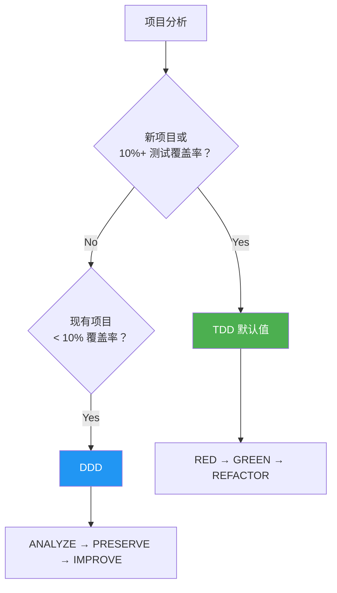
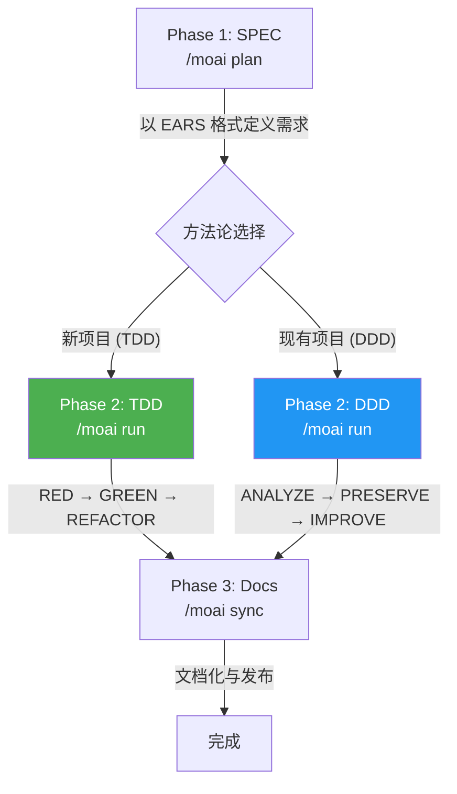

MoAI-ADK 是以 **代币经济学** (Token Economics) 为目标的 Agentic Development Kit。用更少的 token 得到同等质量的代码，用同样的 token 得到更高的质量 — 模型选择、推理深度、上下文用量都由系统管理。它是用 Go 编写的单体二进制，无需依赖即可直接运行。

## 标记法说明

本文档中代码块的前缀表示执行环境：

- 在 **Claude Code** 对话窗口中输入的命令
  ```bash
  > /moai plan "기능 설명"
  ```

- 在 **终端** (Terminal) 中输入的命令
  ```bash
  moai init my-project
  ```

## 核心价值 — 三大支柱

MoAI-ADK v3.0 的价值可以概括为三大支柱。

| 支柱 | 一句话说明 | 代表工具 |
|------|-----------|----------|
| **代币经济学** | 最大化成本效益的智能资源分配 | 3 层模型策略 · CG 模式 · Token Circuit Breaker |
| **智能体循环工程** | 循环自主工作，观察积累使挽具学习 | `/moai goal` · `/moai loop` · Analyze-First 路由 |
| **智能体挽具** | 不直接写代码，而是设计智能体的工作环境 | 11 个智能体 · SPEC 3-phase · TRUST 5 |

各支柱的详细内容在[核心概念](/zh/core-concepts/)一节中介绍。本文只讲开始上手所需的部分。

## 核心概念

MoAI-ADK 以 **基于 SPEC 的 TDD/DDD** 方法论为基础，并通过 **TRUST 5** 质量框架保证代码质量。

### 什么是 SPEC？（通俗理解）

**SPEC** (Specification) 就是"把与 AI 的对话留成文档"。

**氛围编程** (Vibe Coding) 最大的问题是**上下文丢失**：

- 与 AI 讨论了 1 小时的内容，会话一断就**消失了**
- 第二天要继续工作，就得**从头再解释一遍**
- 功能越复杂，越容易得到**与意图不符的结果**

**SPEC 解决了这个问题：**

- 将需求**保存为文件**，永久留存
- 即使会话中断，只要读 SPEC 就能**接着干**
- 用 EARS 格式**毫不含糊地**明确定义
- 不用重复同样的解释，**token 也省了**


**一句话总结：** 昨天与 AI 讨论的"JWT 认证 + 1 小时过期 + 刷新令牌"，今天无需重新解释，一行 `/moai run SPEC-AUTH-001` 就能直接开始实现！


### 什么是 TDD？（通俗理解）

**TDD** (Test-Driven Development) 是"先写测试再开发的方法"。

用出考题来比喻：

- **先写评分标准（测试）** — 功能还不存在，当然会失败
- **编写通过标准的最少代码** — 只写刚好需要的部分
- **把代码打磨得更好** — 在测试保持通过的前提下改进

MoAI-ADK 用 **RED-GREEN-REFACTOR** 循环把这个过程自动化：

| 阶段 | 含义 | 做的事 |
|------|------|--------|
| **RED** | 失败 | 先为尚不存在的功能编写测试 |
| **GREEN** | 通过 | 编写通过测试的最少代码 |
| **REFACTOR** | 改进 | 保持测试通过的同时提升代码质量 |

### 什么是 DDD？（通俗理解）

**DDD** (Domain-Driven Development) 是"安全改进代码的方法"。

用房屋改造来比喻：

- **不拆掉旧房子**，一个房间一个房间地改
- **改造前先记录现状**（= 特性测试）
- **一次改一间，每次都验收**（= 渐进式改进）

MoAI-ADK 用 **ANALYZE-PRESERVE-IMPROVE** 循环把这个过程自动化：

| 阶段 | 含义 | 做的事 |
|------|------|--------|
| **ANALYZE** | 分析 | 把握当前代码结构与问题点 |
| **PRESERVE** | 保存 | 用测试记录当前行为（安全网） |
| **IMPROVE** | 改进 | 在测试通过的前提下逐步改进 |

### 开发方法论选择

MoAI-ADK 会根据项目状态自动选择最优开发方法论。


```mermaid
flowchart TD
    A["项目分析"] --> B{"新项目或<br/>10%+ 测试覆盖率？"}
    B -->|"Yes"| C["TDD 默认值"]
    B -->|"No"| D{"现有项目<br/>< 10% 覆盖率？"}
    D -->|"Yes"| E["DDD"]
    C --> F["RED → GREEN → REFACTOR"]
    E --> G["ANALYZE → PRESERVE → IMPROVE"]

    style C fill:#4CAF50,color:#fff
    style E fill:#2196F3,color:#fff
```

| 方法论 | 对象 | 循环 |
|--------|------|--------|
| **TDD** | 新项目或 10%+ 覆盖率 | RED → GREEN → REFACTOR |
| **DDD** | 覆盖率低于 10% 的现有项目 | ANALYZE → PRESERVE → IMPROVE |


MoAI-ADK v2.5.0+ 采用二元方法论选择（仅 TDD 或 DDD）。为了清晰与一致性，hybrid 模式已被移除。方法论在 `moai init` 时自动选择，可在 `.moai/config/sections/quality.yaml` 的 `development_mode` 中更改。


### TRUST 5 质量框架

TRUST 5 基于以下 5 项核心原则：

| 原则 | 说明 |
|------|------|
| **T**ested | 85% 覆盖率、特性测试、行为保持 |
| **R**eadable | 清晰的命名规范、一致的格式化 |
| **U**nified | 统一的风格指南、自动格式化 |
| **S**ecured | 遵循 OWASP、安全验证、漏洞分析 |
| **T**rackable | 结构化提交、变更历史追踪 |

## Go Edition 特点

MoAI-ADK 用 Go 完全重写了 Python Edition，将性能与效率最大化。

| 项目 | Python Edition | Go Edition |
|------|---------------|------------|
| 分发 | pip + venv + 依赖 | **单体二进制**，无依赖 |
| 启动时间 | ~800ms 解释器启动 | **~5ms** 原生执行 |
| 并发 | asyncio / threading | **原生 goroutines** |
| 类型安全 | 运行时（mypy 可选） | **编译期强制** |
| 跨平台 | 需要 Python 运行时 | **预构建二进制**（macOS、Linux、Windows） |

### 核心数字（以 v3.0 为准）

- **11 个**智能体目录（10 个 MoAI 自定义 + 1 个 Anthropic 内置 `Explore`）
- **27 个**技能 (template-managed)
- **36 个** CLI 命令 · **15 种** `/moai` 子命令
- 支持 **16 种**编程语言
- 基于 **487 个** SPEC 文档开发的代码库

## 系统要求

| 平台 | 支持环境 | 备注 |
|--------|----------|------|
| macOS | Terminal、iTerm2 | 完全支持 |
| Linux | Bash、Zsh | 完全支持 |
| Windows | **WSL (推荐)**、PowerShell 7.x+ | 不支持原生 cmd.exe |

**必要条件：**
- 所有平台都必须安装 **Git**
- **Windows 用户**：为获得最佳体验，推荐使用 WSL (Windows Subsystem for Linux)

## 主要功能

### 智能体目录（11 个）

MoAI 编排器不直接实现，而是把工作委派给 11 个专业智能体。规划与审计是分离的 — 谁做的东西不由谁来检查。

| 类别 | 数量 | 主要智能体 |
|----------|------|--------------|
| **Manager** | 5 个 | manager-spec、manager-develop、manager-docs、manager-git、manager-design |
| **Evaluator** | 2 个 | plan-auditor、sync-auditor |
| **Builder** | 1 个 | builder-harness |
| **Advisor** | 1 个 | super-advisor（高推理顾问） |
| **Specialist** | 1 个 | e2e-tester（网页/移动/桌面 E2E 测试执行） |
| **内置** | 1 个 | Explore（Anthropic 内置，只读代码分析） |

### 模型策略（代币经济学）

MoAI-ADK 会根据 Claude Code 订阅套餐为智能体分配最优 AI 模型，在套餐用量限制内将质量最大化 — 规划·审计等推理密集的阶段分配高端模型，重复性任务分配轻量模型。

| 策略 | 套餐 | 特点 |
|------|--------|------|
| **High** | Max $200/月 | 最高质量 — 规划·审计分配 Opus，最大吞吐量 |
| **Medium** | Max $100/月 | 质量与成本的平衡 |
| **Low** | Plus $20/月 | 经济，不含 Opus — 以 Sonnet 为主分配 |


Plus $20 套餐不包含 Opus。设置 **Low** 策略后，即使没有高端模型，整个工作流也能运行而不触发用量限制错误。在更高套餐中，核心阶段（规划、审计）分配 Opus，一般任务分配轻量模型。


### 执行模式与编排

自然语言请求都会经过 **Analyze-First** 路由 — 无论用哪种语言发出请求，都先分析意图再连接到合适的工作流。编排器根据任务复杂度，在顺序子智能体（默认）、并行子智能体扇出、动态工作流之间选择其一。

```bash
/moai run SPEC-AUTH-001           # 복잡도 기반 자동 선택
/moai run SPEC-AUTH-001 --solo    # 순차 서브에이전트 강제
```


**v3.0 变更**：过去的 Agent Teams 静态编排层已退役。即使强制 `--team` 也会回退到子智能体模式。Claude Code 的原生 teammate 运行时 — `moai cg` 的 tmux 分屏 — 依旧保留。


### SPEC-First 工作流

MoAI-ADK 遵循 3 阶段开发工作流。Run 阶段的方法论根据项目状态自动选择：


```mermaid
flowchart TD
    A["Phase 1: SPEC<br/>/moai plan"] -->|"以 EARS 格式定义需求"| B{"方法论选择"}
    B -->|"新项目 (TDD)"| C["Phase 2: TDD<br/>/moai run"]
    B -->|"现有项目 (DDD)"| D["Phase 2: DDD<br/>/moai run"]
    C -->|"RED → GREEN → REFACTOR"| E["Phase 3: Docs<br/>/moai sync"]
    D -->|"ANALYZE → PRESERVE → IMPROVE"| E
    E -->|"文档化与发布"| F["完成"]

    style C fill:#4CAF50,color:#fff
    style D fill:#2196F3,color:#fff
```

### 智能体循环

声明完成条件后，循环就会自主工作：

```text
/moai goal "모든 테스트가 통과하고 lint가 깨끗할 때까지"   # 조건 선언형 루프
/moai loop                                              # 진단 기반 반복 수정 (최대 100회)
/moai fix                                               # 단일 패스 자동 수정
```

`/moai loop` 是构建在 goal 引擎之上的预设 — 反复修复，直到清空诊断工具找到的问题队列。

### 推荐工作流链

**新功能开发：**
```
/moai plan → /moai run SPEC-XXX → /moai sync SPEC-XXX
```

**Bug 修复：**
```
/moai fix (또는 /moai loop) → /moai review → /moai sync
```

**重构：**
```
/moai plan → /moai clean → /moai run SPEC-XXX → /moai review → /moai codemaps
```

**文档更新：**
```
/moai codemaps → /moai sync
```

## 多语言支持

MoAI-ADK 支持以下 4 种语言：

- **韩语** (Korean)
- **英语** (English)
- **日语** (Japanese)
- **中文** (Chinese)

可在安装向导中选择偏好语言，或直接在设置文件中更改。

## LSP 集成

**LSP** (Language Server Protocol) 是代码编辑器与语言工具之间的标准通信协议。它实时检测代码错误、类型错误与 lint 结果，提供即时反馈。

**Ralph-Loop Style** 是把 LSP 诊断结果用作反馈循环的自主工作流。检测到质量问题时自动调用修复智能体，并重复执行直到达到质量标准。

MoAI-ADK 通过 Ralph-Loop Style LSP 集成提供自主工作流：

- **基于 LSP 的完成自动检测**：实时监控代码质量状态
- **实时回归检测**：即时发现变更对现有功能的影响
- **自动完成条件**：达到 0 错误、0 类型错误、85% 覆盖率时自动判定完成


Ralph-Loop Style LSP 集成将开发工作流的质量门禁自动化，即使没有人工介入也能维持高代码质量。


## 用 GLM 节省 token（50~70%）

GLM 是与 Claude Code 完全兼容的 AI 模型。在 **CG 模式**中组合 Claude 领队与 GLM 队友，可在实现类任务中**节省 50~70% 的 token** — 这是代币经济学支柱的代表性实战工具。

### CG 模式：Claude + GLM 混合

CG 模式由 Claude 编排整个工作流，实现类任务由成本更低的 GLM 队友并行处理。

| 角色 | 模型 | 负责任务 |
|------|------|---------|
| **领队** | Claude | 编排、架构决策、代码审查 |
| **队友** | GLM | 代码实现、测试编写、文档化 |

| 任务类型 | 推荐模式 | 节省效果 |
|----------|----------|---------|
| 实现为主的 SPEC (`/moai run`) | CG 模式 | **节省 50~70%** |
| 代码生成、测试、文档化 | CG 模式 | **节省 50~70%** |
| 架构设计、安全审查 | 仅 Claude | 需要深度推理 |

### GLM 切换命令

```bash
# GLM 백엔드로 전환
moai glm

# GLM Worker 모드 시작 (Claude 리더 + GLM 팀원)
moai glm --team

# CG 모드 (Claude 리더 + GLM 팀원, tmux 필수)
moai cg

# Claude 백엔드로 복귀
moai cc
```


如果还没有 GLM 账户，请通过 [注册 z.ai（额外 10% 折扣）](https://z.ai/subscribe?ic=1NDV03BGWU) 注册。通过注册链接产生的回馈将用于 **MoAI 开源开发**。


## 开始使用

按以下步骤开启 MoAI-ADK 之旅：

1. **[安装](/zh/getting-started/installation)** - 在系统上安装 MoAI-ADK
2. **[初始设置](/zh/getting-started/init-wizard)** - 运行交互式设置向导
3. **[快速开始](/zh/getting-started/quickstart)** - 创建第一个项目
4. **[核心概念](/zh/core-concepts/what-is-moai-adk)** - 深入理解 MoAI-ADK

## 核心优势

| 优势 | 说明 |
|------|------|
| **质量保证** | 用 TRUST 5 框架维持一致的质量 |
| **token 高效** | 模型策略 + CG 模式 + Token Circuit Breaker，成本由系统管理 |
| **提升生产力** | AI 智能体自动化缩短开发时间 |
| **可扩展** | 模块化架构与挽具 Builder 带来灵活扩展 |
| **多语言** | 支持 4 种语言 |

## 更多资源

- [GitHub 仓库](https://github.com/modu-ai/moai-adk)
- [文档站点](https://adk.mo.ai.kr)
- [社区论坛](https://github.com/modu-ai/moai-adk/discussions)

---

## 下一步

在[安装指南](./installation)中了解 MoAI-ADK 的安装方法。
