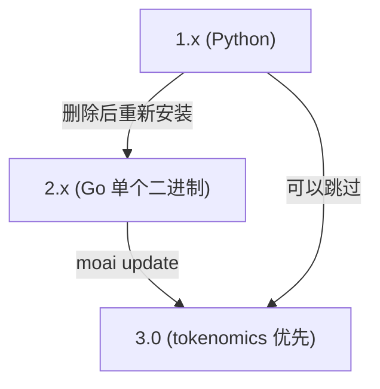

# 迁移指南

MoAI-ADK 经历了两次大转换。(1) 1.x(Python) 到 2.x(Go 单个二进制),(2) 2.x 到 3.0(tokenomics 优先代理工作流)。这个页面将两次转换整理为一个流程。根据从哪里来,跳到相应段落。

## 整体流程



1.x 用户可以不经过 2.x 直接升级到 3.0。遵循下面 1.x 段落的删除步骤后,直接到 [3.0 安装](#3-0-安装) 段落即可。

## 1.x (Python) 用户 — 到 2.x


**MoAI-ADK 1.x (Python 版本) 用户必须先删除现有版本。** 1.x 和 2.x 使用相同的 `moai` 命令,现有版本残留会冲突。


### 第 1 步:删除现有 1.x

```bash
# 用 uv 安装的
uv tool uninstall moai-adk

# 用 pip 安装的
pip uninstall moai-adk
```

### 第 2 步:备份现有配置(可选)

```bash
# 想备份现有配置
cp -r ~/.moai ~/.moai-v1-backup
```

### 第 3 步:安装 2.x

```bash
curl -fsSL https://adk.mo.ai.kr/install.sh | bash
```

### 第 4 步:确认安装

```bash
moai version
```

完成这些步骤后不再需要 Python 运行时和虚拟环境。2.x 是单个 Go 二进制,启动时间从约 800ms 降到 5ms,许可证也从 GPL-3.0 改为 Apache-2.0。


**许可证变更**: MoAI-ADK 1.x(Python) 是 GPL-3.0,从 2.x(Go) 开始是 Apache-2.0。商业使用·修改·分发自由,没有公开源代码义务。


### pip / uv 冲突解决

pip 和 uv 将包安装在不同位置。混用两个工具会导致 `moai` 命令运行错误版本。出现症状则完全删除后重装:

```bash
# 1. 删除所有现有版本
uv tool uninstall moai-adk 2>/dev/null || true
pip uninstall moai-adk -y 2>/dev/null || true

# 2. 确认并删除剩余二进制
which moai && rm $(which moai) 2>/dev/null || true

# 3. 重新安装
curl -fsSL https://adk.mo.ai.kr/install.sh | bash

# 4. 确认
moai version
```

## 2.x 用户 — 到 3.0

3.0 是与 2.x 保持兼容性的同时转为 tokenomics 优先的正式(GA)发布。用户文件(`.claude/`、`.moai/project/`、`.moai/specs/`)会自动保留。

### 3.0 安装

现有项目先运行模板同步,然后升级二进制。

```bash
# 1. v3.0.0 模板同步(保留用户文件)
moai update

# 2. CLI 二进制升级
moai update --binary

# 3. 确认
moai version    # 报告 v3.0.0
```

新项目或干净环境下一行安装脚本就够了。

```bash
curl -fsSL https://adk.mo.ai.kr/install.sh | bash
```

如果已经安装了 Go,也可以用 `go install`。

```bash
go install github.com/modu-ai/moai-adk/cmd/moai@latest
```

### 3.0 的主要变化

升级到 3.0 后,代理目录·自律循环·成本控制重新设计。整理迁移中最常遇到的变化。

#### 代理目录整合为 11 个

archived 代理名称(`manager-strategy`、`expert-backend`、`researcher` 等)在 spawn 时**被拒绝**。替代方案:(a) 使用 11 个保留代理之一,或 (b) 改为在每个位置 spawn 带域允许列表的 `Agent(general-purpose)` 模式。

#### Agent Teams 静态编组层退休

强制 `--team` / `--mode team` 输出 `MODE_TEAM_UNAVAILABLE` 并回退到子代理模式。原生 Claude Code 队友运行时(`moai cg` GLM 面、`worktree --team`)不受影响。

#### Context7 MCP 依赖退休

`mcp__context7__*` 从所有 `allowed-tools` 和配置 ask-list 中移除。库文档查询使用 WebSearch/WebFetch 回退策略。

#### `/moai e2e` 多用途化

仅限 Web 的 E2E 子命令废弃,重新设计为覆盖 Web·移动·桌面的多平台子系统(由 `e2e-tester` 代理主导)。

#### 引入配置文件矩阵(3.0.1)

`plan_type × performance_tier` 双轴设计改为**代理组单一配置文件矩阵**(`max`/`medium`/`low`)。`moai init --plan-type` 退休,由 `moai init --profile <max|medium|low>` 替代。现有 `llm.yaml`(`plan_type` + `claude_models` + `performance_tier`) 无错误加载并归结为正确的配置文件 — 下次保存时清理退休的键。


**配置迁移自动完成。** legacy `llm.yaml` 照原样读取并转换为正确的配置文件,不需要手动修改配置文件。


### v2 → v3 清洁重新安装相关的已知问题

从 2.x 到 3.0 的路径中报告的两个 regression 在 3.0.0 发布前后全部修复。

- **配置无限循环(#1084)** — 用户修改的 `language.yaml` / `design.yaml` 每次运行都回退到默认值。通过修复 `system.yaml` 的 `v3.*` 版本来绕过 v2 指纹。
- **模板冲突循环** — `.claude/rules/moai/design` 同时存在于退休路径和 v3 模板,导致清洁重新安装无限循环。从退休列表中移除该项目,添加构建时回归守卫。
- **退休的 v2 权限 deny 规则(#1101)** — v2 时代的 12 个 `deny` 项在升级后残留,每次会话开始时警告。3.0.1 中一次迁移清理。

如果使用最新的 3.0.x 二进制,这些问题已经解决。

## 跳过 — 从 1.x 到 3.0

1.x 用户可以不经过 2.x 直接升级到 3.0。

```bash
# 1. 删除现有 Python 版本
uv tool uninstall moai-adk 2>/dev/null || true
pip uninstall moai-adk -y 2>/dev/null || true
which moai && rm $(which moai) 2>/dev/null || true

# 2. (可选) 备份
cp -r ~/.moai ~/.moai-v1-backup 2>/dev/null || true

# 3. 安装 3.0
curl -fsSL https://adk.mo.ai.kr/install.sh | bash

# 4. 确认
moai version
```

许可证从 GPL-3.0(1.x) 改为 Apache-2.0(2.x 以上)。商业使用限制消失。

## 升级后确认

升级版本后确认以下内容。

```bash
moai version      # 报告预期版本
moai doctor       # harness·hook·配置健康检查
```

如果 `moai doctor` 显示红色项,通常是模板同步未完成。再运行一次 `moai update` 大部分可解决。

## 删除

要完全删除,删除二进制和配置目录。

```bash
# 删除二进制
rm "$(which moai)"

# 删除配置目录(可选)
rm -rf "$HOME/.moai"
```

## 下一步

- [安装](/zh/getting-started/installation/) — 各操作系统安装详情
- [初始设置向导](/zh/getting-started/init-wizard/) — 项目初始化
- [CLI 概览](/zh/getting-started/cli/) — 常用命令一览
