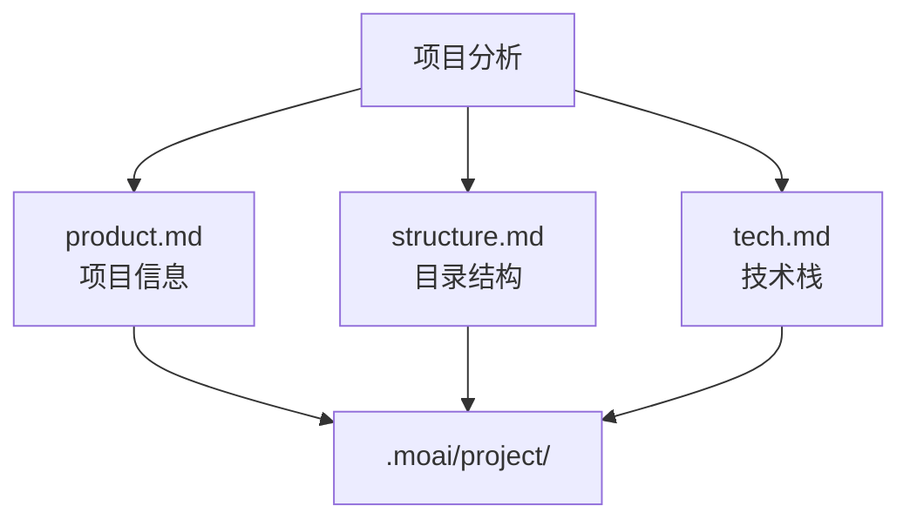
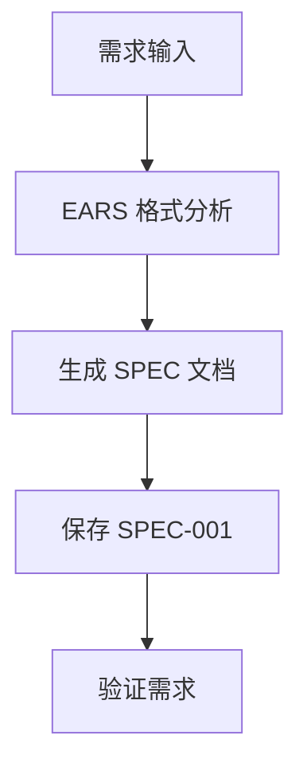
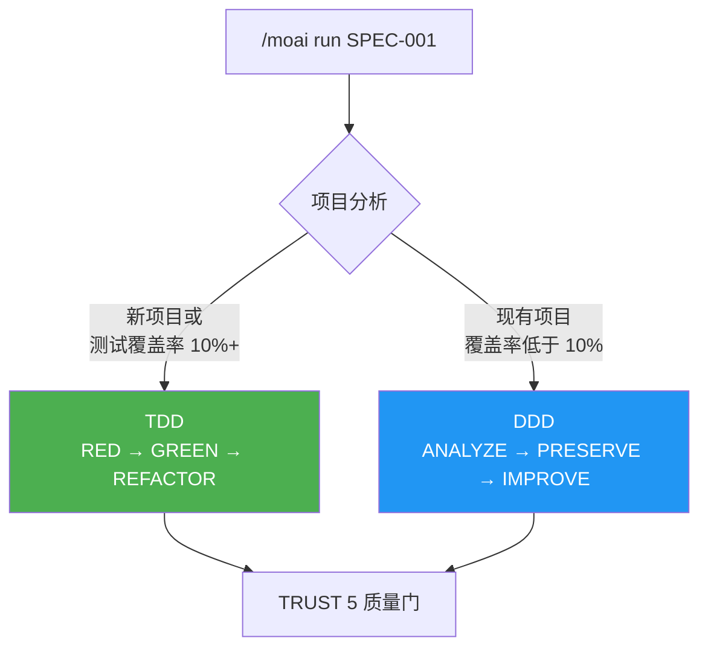
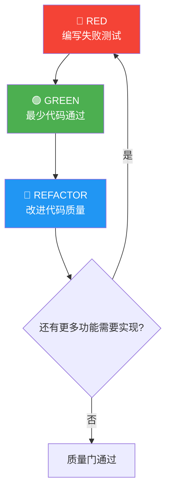
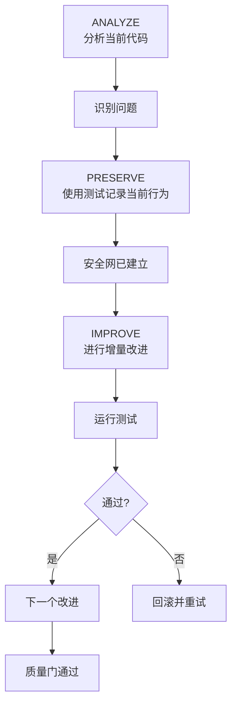
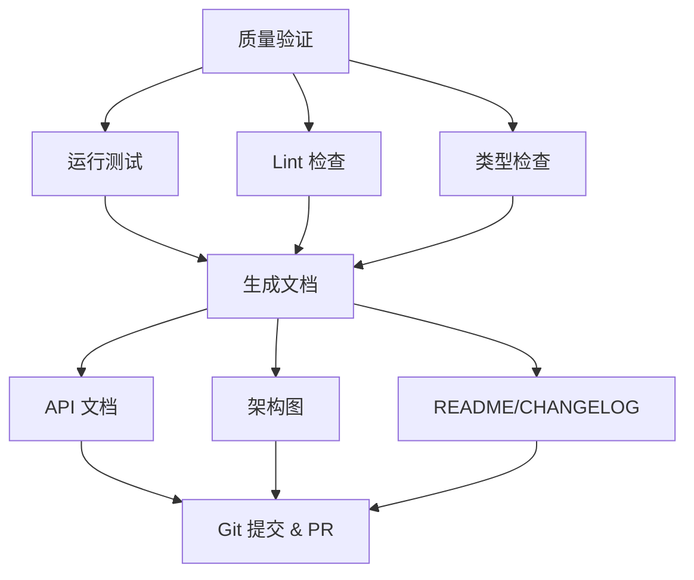
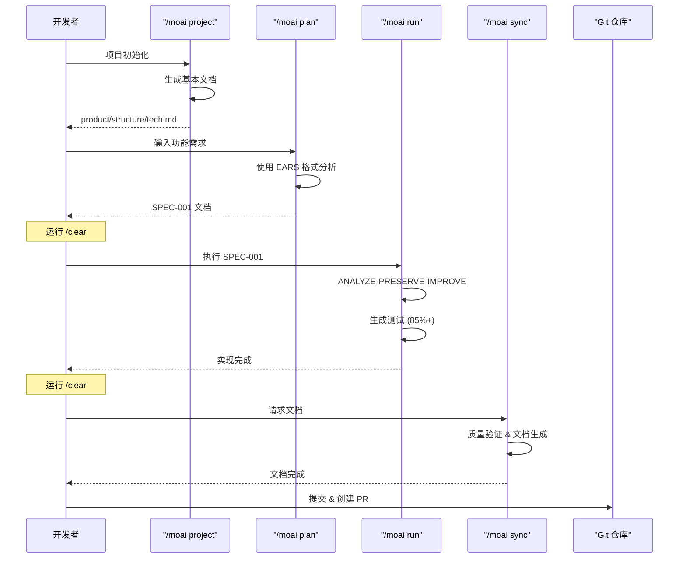
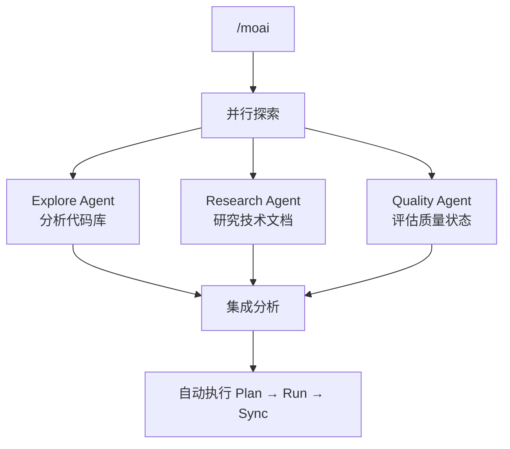
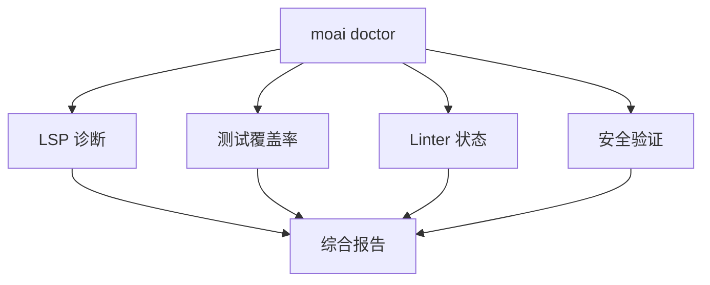

使用 MoAI-ADK 创建您的第一个项目并体验开发工作流。

## 前置条件

开始之前,请确保完成以下事项:

- [x] 已安装 MoAI-ADK ([安装指南](./installation))
- [x] 已完成初始设置 ([初始设置](./init-wizard))
- [x] 已获取 GLM API 密钥

## 创建您的第一个项目

### 步骤 1: 项目初始化

使用 `moai init` 命令创建新项目:

```bash
moai init my-first-project
cd my-first-project
```

要在现有项目中初始化 MoAI-ADK,请导航到该文件夹并运行:

```bash
cd existing-project
moai init
```

### 步骤 2: 生成项目文档

生成基本项目文档。此步骤对于 Claude Code 理解项目至关重要。

```bash
> /moai project
```

此命令分析项目并自动生成 3 个文件:



| 文件 | 内容 |
|------|---------|
| **product.md** | 项目名称、描述、目标用户、主要功能 |
| **structure.md** | 目录树、文件夹用途、模块组成 |
| **tech.md** | 使用的技术、框架、开发环境、构建/部署配置 |


在初始项目设置后或结构发生重大变化时运行 `/moai project`。


### 步骤 3: 创建 SPEC 文档

为您的第一个功能创建 SPEC 文档。使用 EARS 格式定义清晰的需求。


**为什么需要 SPEC?** 📝

**Vibe Coding** (氛围编程) 的最大问题是 **上下文丢失**:

- 使用 AI 编程时,您会遇到"等等,我们想要做什么?"的时刻
- 会话结束或上下文初始化时,**之前讨论的需求消失**
- 最终,您重复解释或得到与意图不符的代码

**SPEC 文档解决这个问题:**

| 问题 | SPEC 解决方案 |
|---------|---------------|
| 上下文丢失 | 通过 **保存到文件** 永久保留需求 |
| 需求模糊 | 使用 **EARS 格式** 清晰构建 |
| 沟通错误 | 使用 **验收标准** 指定完成条件 |
| 无法追踪进度 | 使用 **SPEC ID** 管理工作单元 |

**一句话总结**: SPEC 是"将与 AI 的对话记录保存为文档"。即使会话结束,您也可以通过阅读 SPEC 文档继续工作!


```bash
> /moai plan "实现用户认证功能"
```

此命令执行以下操作:



生成的 SPEC 文档保存在 `.moai/specs/SPEC-001/spec.md`。


创建 SPEC 后,始终运行 `/clear` 以节省令牌。


### 步骤 4: 执行 TDD/DDD 开发

基于 SPEC 文档选择开发方法论进行实现。

```bash
> /clear
> /moai run SPEC-001
```

MoAI-ADK 根据项目状态自动选择最优开发方法论。



---

#### TDD 模式 (新项目 / 测试覆盖率 10%+)


**什么是 TDD?** 📝

TDD 是"先出考题再学习":
- **先编写测试 (评分标准)** — 功能不存在，自然会失败
- **编写最少的代码通过测试** — 恰好够用，不多不少
- **在保持测试通过的同时改进代码** — 打磨成更好的代码

**关键：** 测试先于代码！


**RED-GREEN-REFACTOR 循环:**

| 阶段 | 含义 | 做什么 |
|-------|---------|---------|
| 🔴 **RED** | 失败 | 先为还不存在的功能编写测试 |
| 🟢 **GREEN** | 通过 | 编写最少的代码使测试通过 |
| 🔵 **REFACTOR** | 改进 | 在保持测试通过的同时提升代码质量 |



---

#### DDD 模式 (现有项目 / 测试覆盖率低于 10%)


**什么是 DDD?** 🏠

DDD 类似于"家庭装修":
- **不拆除现有房屋**，一次改进一个房间
- **装修前拍摄当前状态照片** (= 表征测试)
- **一次处理一个房间，每次检查** (= 增量改进)

**关键：** 在保留现有行为的同时安全地改进！


**ANALYZE-PRESERVE-IMPROVE 循环:**

| 阶段 | 类比 | 实际工作 |
|-------|---------|---------|
| **ANALYZE** (分析) | 🔍 房屋检查 | 理解当前代码结构和问题 |
| **PRESERVE** (保留) | 📸 拍摄当前状态照片 | 使用表征测试记录当前行为 |
| **IMPROVE** (改进) | 🔧 一次装修一个房间 | 在测试通过时进行增量改进 |



---


`/moai run` 自动目标为 85%+ 测试覆盖率。可通过 `.moai/config/sections/quality.yaml` 中的 `development_mode` 手动更改开发方法论。


**完成标准:**
- 测试覆盖率 >= 85%
- 0 错误，0 类型错误
- 达到 LSP 基线

### 步骤 5: 文档同步

开发完成后,自动生成质量验证和文档。

```bash
> /clear
> /moai sync SPEC-001
```

此命令执行以下操作:



## 完整开发工作流



## 集成自动化: /moai

要一次自动执行所有阶段:

```bash
> /moai "实现用户认证功能"
```

MoAI 自动执行 Plan → Run → Sync,通过并行探索提供 3-4 倍更快的分析。



## 工作流选择指南

| 情况 | 推荐命令 | 原因 |
|-----------|---------------------|--------|
| 新项目 | 首先运行 `/moai project` | 需要基本文档 |
| 简单功能 | `/moai plan` + `/moai run` | 快速执行 |
| 复杂功能 | `/moai` | 自动优化 |
| 并行开发 | 使用 `--worktree` 标志 | 独立环境保证 |

## 实用示例

### 示例 1: 简单 API 端点

```bash
# 1. 生成项目文档 (仅第一次)
> /moai project

# 2. 创建 SPEC
> /moai plan "实现用户列表 API 端点"
> /clear

# 3. 实现
> /moai run SPEC-001
> /clear

# 4. 文档 & PR
> /moai sync SPEC-001
```

### 示例 2: 复杂功能 (使用 MoAI)

```bash
# 如果项目文档存在,使用 MoAI 一次执行所有操作
> /moai "实现 JWT 认证中间件"
```

### 示例 3: 并行开发 (使用 Worktree)

```bash
# 在独立环境中并行开发
> /moai plan "实现支付系统" --worktree
```

## 理解文件结构

标准 MoAI-ADK 项目结构:

```
my-first-project/
├── CLAUDE.md                        # Claude Code 项目指南
├── CLAUDE.local.md                  # 项目本地设置 (个人)
├── .mcp.json                        # MCP 服务器配置
├── .claude/
│   ├── agents/                      # Claude Code 代理定义
│   ├── commands/                    # 斜杠命令定义
│   ├── hooks/                       # Hook 脚本
│   ├── skills/                      # 可重用技能
│   └── rules/                       # 项目规则
├── .moai/
│   ├── config/
│   │   └── sections/
│   │       ├── user.yaml            # 用户信息
│   │       ├── language.yaml        # 语言设置
│   │       ├── quality.yaml         # 质量门设置
│   │       └── git-strategy.yaml    # Git 策略设置
│   ├── project/
│   │   ├── product.md               # 项目概述
│   │   ├── structure.md             # 目录结构
│   │   └── tech.md                  # 技术栈
│   ├── specs/
│   │   └── SPEC-001/
│   │       └── spec.md              # 需求规范
│   └── memory/
│       └── checkpoints/             # 会话检查点
├── src/
│   └── [项目源代码]
├── tests/
│   └── [测试文件]
└── docs/
    └── [生成的文档]
```

## 质量检查

随时在开发期间检查质量:

```bash
moai doctor
```

此命令验证:

- LSP 诊断 (错误、警告)
- 测试覆盖率
- Linter 状态
- 安全验证



## 实用技巧

### 令牌管理

对于大型项目,在每个阶段后运行 `/clear` 以节省令牌:

```bash
> /moai plan "实现复杂功能"
> /clear  # 重置会话
> /moai run SPEC-001
> /clear
> /moai sync SPEC-001
```

### 错误修复 & 自动化

```bash
# 自动修复
> /moai fix "修复测试中的 TypeError"

# 重复修复直到完成
> /moai loop "修复所有 linter 警告"
```

---

## 下一步

在[核心概念](/core-concepts/what-is-moai-adk)中了解 MoAI-ADK 的高级功能。
