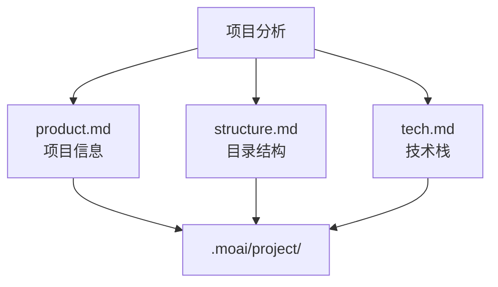
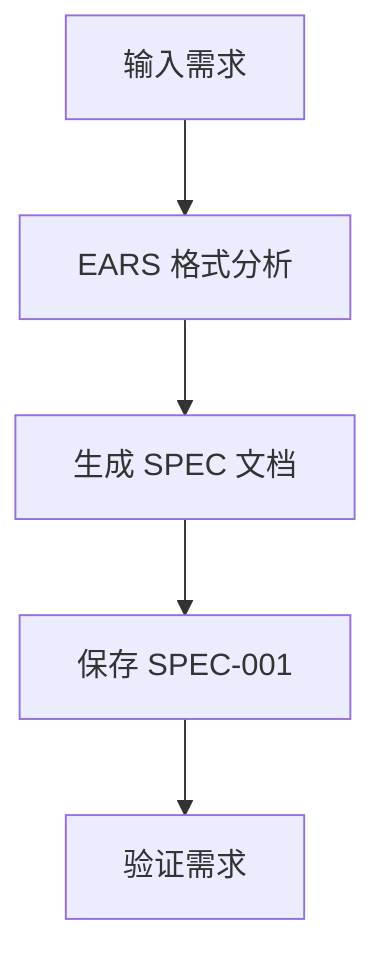
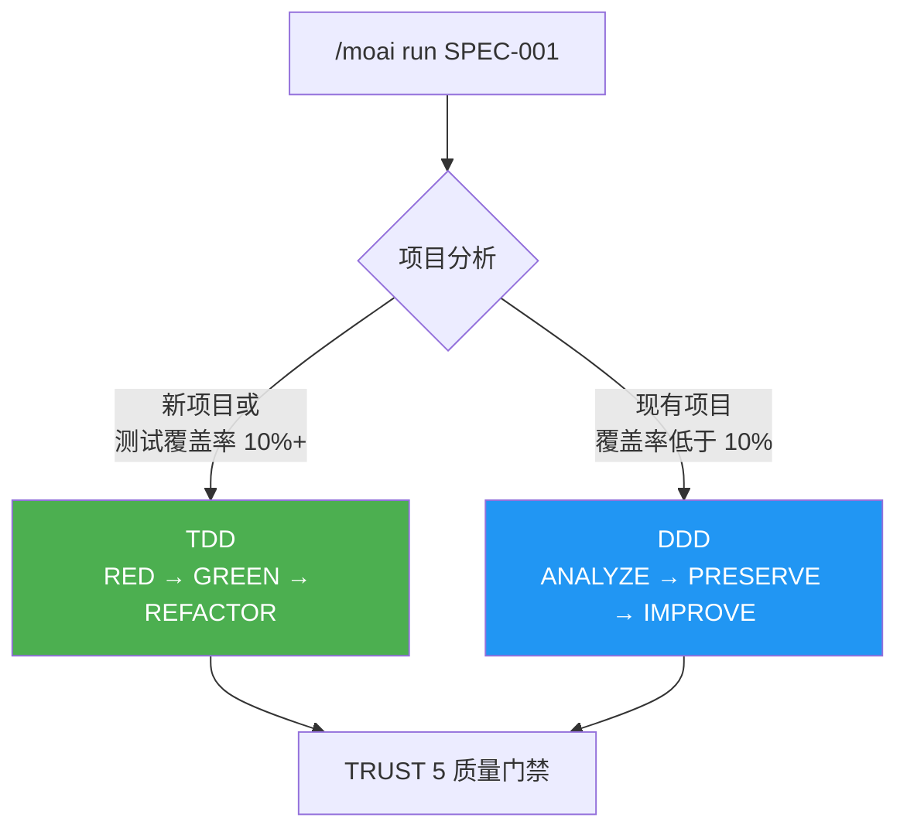
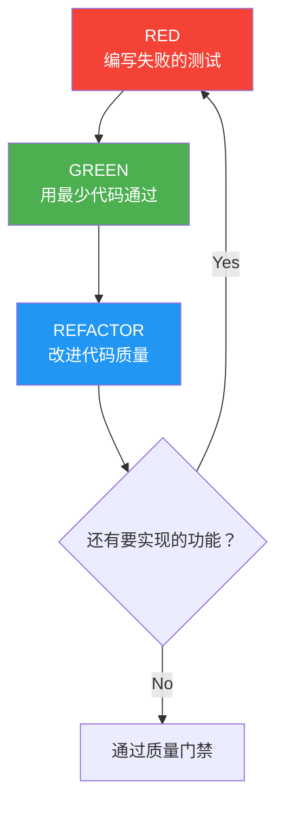
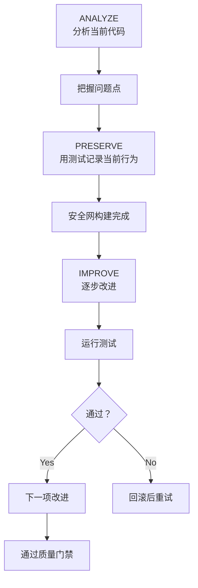
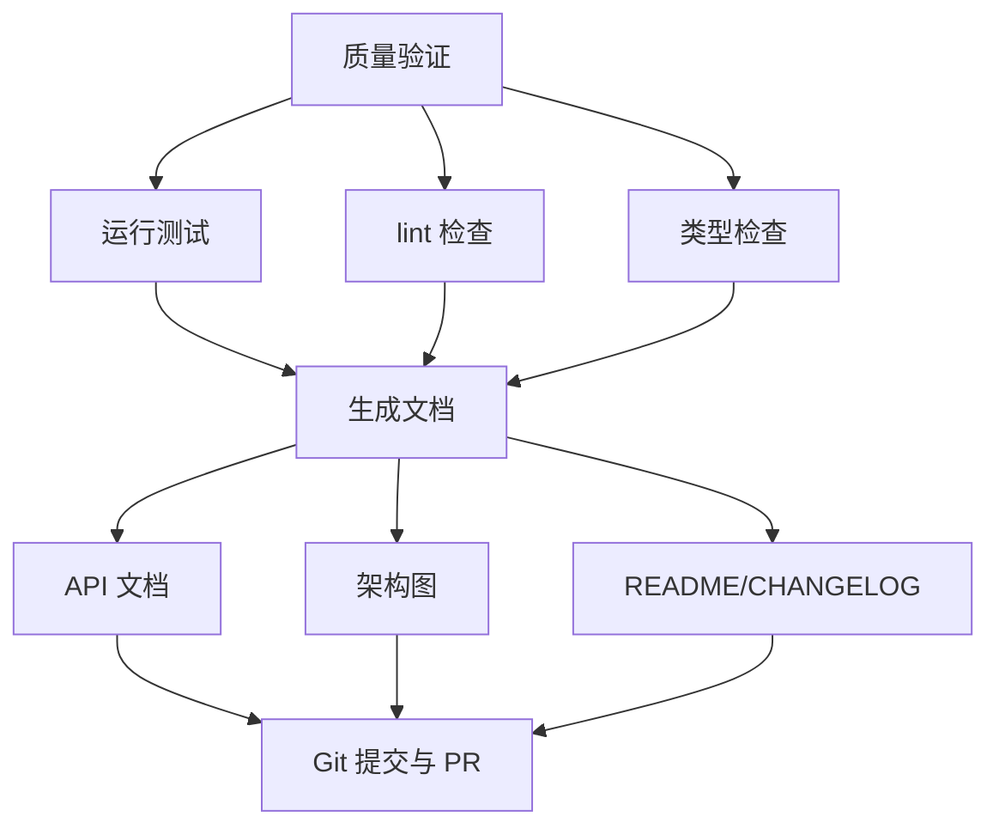
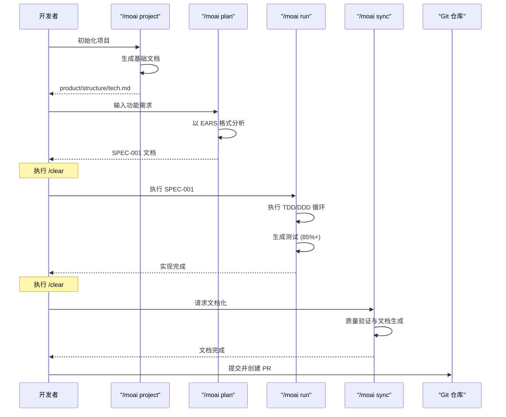
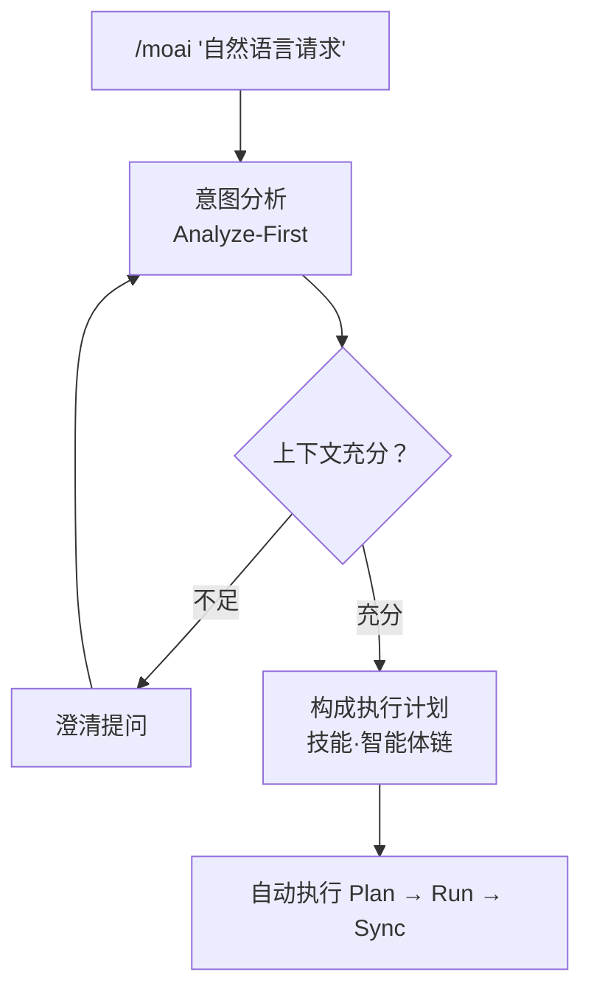
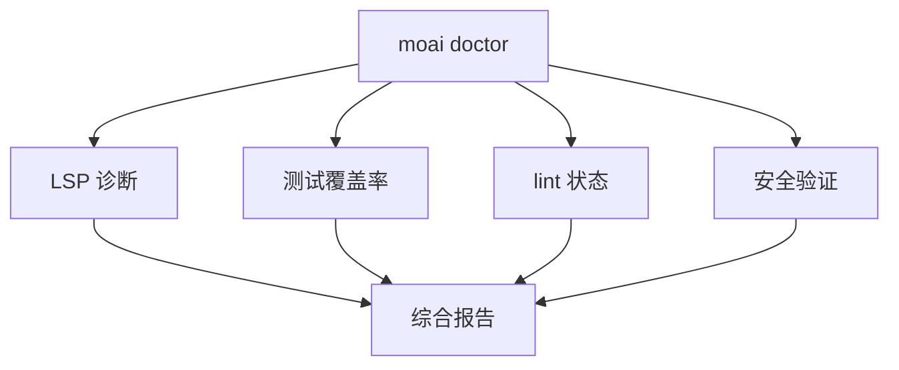

用 MoAI-ADK 创建第一个项目，体验开发工作流。跟随本文，你将完整跑完从编写 SPEC 到实现、文档化的一个循环。

## 事前准备

开始之前需完成以下事项：

- [x] 安装 MoAI-ADK（[安装指南](./installation)）
- [x] 完成初始设置（[初始设置](./init-wizard)）
- [ ] 获取 GLM API 密钥（可选 — 想用 CG 模式降低 token 成本时）

## 创建第一个项目

### 第 1 步：初始化项目

要创建新项目，请使用 `moai init` 命令：

```bash
moai init my-first-project
cd my-first-project
```

要在现有项目中初始化 MoAI-ADK，请进入该文件夹后执行：

```bash
cd existing-project
moai init
```

### 第 2 步：生成项目文档

生成项目的基础文档。这一步对 Claude Code 理解项目至关重要 — 与其每个会话都解释项目结构，不如让智能体读这些文档。

```bash
> /moai project
```

该命令会分析项目并自动生成以下 3 个文件：


```mermaid
flowchart TB
    A["项目分析"] --> B["product.md<br>项目信息"]
    A --> C["structure.md<br>目录结构"]
    A --> D["tech.md<br>技术栈"]

    B --> E[".moai/project/"]
    C --> E
    D --> E
```

| 文件 | 内容 |
|------|------|
| **product.md** | 项目名、说明、目标用户、核心功能 |
| **structure.md** | 目录树、主要文件夹用途、模块构成 |
| **tech.md** | 使用的技术、框架、开发环境、构建/部署设置 |


请在项目初始设置后或结构发生较大变更后执行 `/moai project`。在生成项目文档的同时，还会自动配置项目专属挽具。


### 第 3 步：生成 SPEC 文档

为第一个功能生成 SPEC 文档。使用 EARS 格式定义明确的需求。


**为什么需要 SPEC？**

**氛围编程** (Vibe Coding) 最大的问题是**上下文丢失**：

- 与 AI 边聊边写代码时，总有"刚才我要干什么来着？"的瞬间
- 会话中断或上下文被重置后，**之前讨论的需求就消失了**
- 结果就是重复同样的解释，或者做出与意图不符的代码

**SPEC 文档解决了这个问题：**

| 问题 | SPEC 的解决方式 |
|------|-----------------|
| 上下文丢失 | 将需求**保存为文件**，永久留存 |
| 需求含糊 | 用 **EARS 格式**明确结构化 |
| 沟通错误 | 用**验收标准**明示完成条件 |
| 无法追踪进度 | 用 **SPEC ID** 管理工作单元 |

**一句话总结：** SPEC 就是"把与 AI 的对话留成文档"。即使会话中断，只要读 SPEC 文档就能接着干 — 不重复同样的解释，token 也省了。


```bash
> /moai plan "사용자 인증 기능 구현"
```

该命令执行以下操作：


```mermaid
flowchart TB
    A["输入需求"] --> B["EARS 格式分析"]
    B --> C["生成 SPEC 文档"]
    C --> D["保存 SPEC-001"]
    D --> E["验证需求"]
```

生成的 SPEC 文档保存在 `.moai/specs/SPEC-001/spec.md`。


生成 SPEC 后请用 `/clear` 命令清空上下文。决策事项已经留在 SPEC 文件里，没有理由保留对话记录 — 这是节省 token 的基本功。


### 第 4 步：执行 TDD/DDD 开发

基于 SPEC 文档推进实现。

```bash
> /clear
> /moai run SPEC-001
```

MoAI-ADK 会根据项目状态自动选择最优开发方法论。


```mermaid
flowchart TD
    A["/moai run SPEC-001"] --> B{"项目分析"}
    B -->|"新项目或<br/>测试覆盖率 10%+"| C["TDD<br/>RED → GREEN → REFACTOR"]
    B -->|"现有项目<br/>覆盖率低于 10%"| D["DDD<br/>ANALYZE → PRESERVE → IMPROVE"]
    C --> E["TRUST 5 质量门禁"]
    D --> E
    style C fill:#4CAF50,color:#fff
    style D fill:#2196F3,color:#fff
```

---

#### TDD 模式（新项目 / 测试覆盖率 10%+）


**什么是 TDD？**

TDD 就像"先出考题再学习"：
- **先写测试（评分标准）** — 功能还不存在，当然会失败
- **编写通过测试的最少代码** — 只写刚好需要的部分
- **在保持测试通过的前提下改进代码** — 打磨成更好的代码

**核心：** 测试先于代码！


**RED-GREEN-REFACTOR 循环：**

| 阶段 | 含义 | 做的事 |
|------|------|--------|
| **RED** | 失败 | 先为尚不存在的功能编写测试 |
| **GREEN** | 通过 | 编写通过测试的最少代码 |
| **REFACTOR** | 改进 | 保持测试通过的同时提升代码质量 |


```mermaid
flowchart TD
    A["RED<br/>编写失败的测试"] --> B["GREEN<br/>用最少代码通过"]
    B --> C["REFACTOR<br/>改进代码质量"]
    C --> D{"还有要实现的功能？"}
    D -->|Yes| A
    D -->|No| E["通过质量门禁"]
    style A fill:#f44336,color:#fff
    style B fill:#4CAF50,color:#fff
    style C fill:#2196F3,color:#fff
```

---

#### DDD 模式（现有项目 / 测试覆盖率低于 10%）


**什么是 DDD？**

DDD 类似"房屋改造"：
- **不拆掉旧房子**，一个房间一个房间地改
- **改造前先给现状拍照**（= 特性测试）
- **一次改一间，每次都验收**（= 渐进式改进）

**核心：** 在保存现有行为的同时安全地改进！


**ANALYZE-PRESERVE-IMPROVE 循环：**

| 阶段 | 比喻 | 实际工作 |
|------|------|----------|
| **ANALYZE**（分析） | 检查房子 | 把握当前代码结构与问题点 |
| **PRESERVE**（保存） | 给现状拍照 | 用特性测试记录当前行为 |
| **IMPROVE**（改进） | 一间一间改造 | 在测试通过的前提下逐步改进 |


```mermaid
flowchart TD
    A["ANALYZE<br/>分析当前代码"] --> B["把握问题点"]
    B --> C["PRESERVE<br/>用测试记录当前行为"]
    C --> D["安全网构建完成"]
    D --> E["IMPROVE<br/>逐步改进"]
    E --> F["运行测试"]
    F --> G{"通过？"}
    G -->|Yes| H["下一项改进"]
    G -->|No| I["回滚后重试"]
    H --> J["通过质量门禁"]
```

---


`/moai run` 会自动以 85% 以上的测试覆盖率为目标进行开发。开发方法论可在 `.moai/config/sections/quality.yaml` 的 `development_mode` 中手动更改。


**完成条件：**
- 测试覆盖率 >= 85%
- 0 errors、0 type errors
- 达到 LSP 基线

完成判定靠的是证据而非感觉 — 每一条验收标准都注册为任务，测试通过才会被勾选。

### 第 5 步：文档同步

开发完成后，自动进行质量验证并生成文档。

```bash
> /clear
> /moai sync SPEC-001
```

该命令执行以下操作：


```mermaid
graph TD
    A["质量验证"] --> B["运行测试"]
    A --> C["lint 检查"]
    A --> D["类型检查"]

    B --> E["生成文档"]
    C --> E
    D --> E

    E --> F["API 文档"]
    E --> G["架构图"]
    E --> H["README/CHANGELOG"]

    F --> I["Git 提交与 PR"]
    G --> I
    H --> I
```

## 完整开发工作流


```mermaid
sequenceDiagram
    participant Dev as 开发者
    participant Project as "/moai project"
    participant Plan as "/moai plan"
    participant Run as "/moai run"
    participant Sync as "/moai sync"
    participant Git as "Git 仓库"

    Dev->>Project: 初始化项目
    Project->>Project: 生成基础文档
    Project-->>Dev: product/structure/tech.md

    Dev->>Plan: 输入功能需求
    Plan->>Plan: 以 EARS 格式分析
    Plan-->>Dev: SPEC-001 文档

    Note over Dev: 执行 /clear

    Dev->>Run: 执行 SPEC-001
    Run->>Run: 执行 TDD/DDD 循环
    Run->>Run: 生成测试 (85%+)
    Run-->>Dev: 实现完成

    Note over Dev: 执行 /clear

    Dev->>Sync: 请求文档化
    Sync->>Sync: 质量验证与文档生成
    Sync-->>Dev: 文档完成

    Dev->>Git: 提交并创建 PR
```

## 一体化自动化：/moai

要一次性自动执行所有步骤，用自然语言发出请求即可：

```bash
> /moai "사용자 인증 기능 구현"
```

请求会经过 **Analyze-First** 路由 — 无论用哪种语言发出请求，都先分析意图，上下文不足时通过提问补全，然后自动执行 Plan → Run → Sync 流水线。


```mermaid
flowchart TB
    A["/moai '自然语言请求'"] --> B["意图分析<br>Analyze-First"]
    B --> C{"上下文充分？"}
    C -->|"不足"| D["澄清提问"]
    D --> B
    C -->|"充分"| E["构成执行计划<br>技能·智能体链"]
    E --> F["自动执行 Plan → Run → Sync"]
```

## 工作流选择指南

| 场景 | 推荐命令 | 理由 |
|------|-----------|------|
| 新项目 | 先执行 `/moai project` | 基础文档必需 |
| 简单功能 | `/moai plan` + `/moai run` | 快速执行 |
| 复杂功能 | `/moai` | 自动优化 |
| 并行开发 | 使用 `--worktree` 标志 | 保证独立环境 |

## 实战示例

### 示例 1：简单的 API 端点

```bash
# 1. 프로젝트 문서 생성 (최초 1회)
> /moai project

# 2. SPEC 생성
> /moai plan "사용자 목록 조회 API 엔드포인트 구현"
> /clear

# 3. 구현
> /moai run SPEC-001
> /clear

# 4. 문서화 및 PR
> /moai sync SPEC-001
```

### 示例 2：复杂功能（自然语言自动化）

```bash
# 프로젝트 문서가 이미 있다면 자연어로 한 번에 실행
> /moai "JWT 인증 미들웨어 구현"
```

### 示例 3：并行开发（使用 Worktree）

```bash
# 독립된 환경에서 병렬 개발
> /moai plan "결제 시스템 구현" --worktree
```

## 理解文件结构

MoAI-ADK 项目的标准结构：

```
my-first-project/
├── CLAUDE.md                        # Claude Code 프로젝트 지침서
├── CLAUDE.local.md                  # 프로젝트 로컬 설정 (개인용)
├── .mcp.json                        # MCP 서버 설정
├── .claude/
│   ├── agents/                      # Claude Code 에이전트 정의
│   ├── commands/                    # 슬래시 명령어 정의
│   ├── hooks/                       # 훅 스크립트
│   ├── skills/                      # 재사용 가능한 스킬
│   └── rules/                       # 프로젝트 규칙
├── .moai/
│   ├── config/
│   │   └── sections/
│   │       ├── user.yaml            # 사용자 정보
│   │       ├── language.yaml        # 언어 설정
│   │       ├── quality.yaml         # 품질 게이트 설정
│   │       └── git-strategy.yaml    # Git 전략 설정
│   ├── project/
│   │   ├── product.md               # 프로젝트 개요
│   │   ├── structure.md             # 디렉토리 구조
│   │   └── tech.md                  # 기술 스택
│   ├── specs/
│   │   └── SPEC-001/
│   │       └── spec.md              # 요구사항 명세서
│   └── memory/
│       └── checkpoints/             # 세션 체크포인트
├── src/
│   └── [프로젝트 소스 코드]
├── tests/
│   └── [테스트 파일]
└── docs/
    └── [생성된 문서]
```

## 质量检查

开发过程中随时可以检查质量：

```bash
moai doctor
```

该命令检查以下内容：

- LSP 诊断（错误、警告）
- 测试覆盖率
- lint 状态
- 安全验证


```mermaid
graph TD
    A["moai doctor"] --> B["LSP 诊断"]
    A --> C["测试覆盖率"]
    A --> D["lint 状态"]
    A --> E["安全验证"]

    B --> F["综合报告"]
    C --> F
    D --> F
    E --> F
```

## 实用技巧

### token 管理

每个步骤结束后执行 `/clear` 清空上下文。决策事项已以文件形式留在 SPEC 与 `progress.md` 中，即使没有对话记录也能继续下一步：

```bash
> /moai plan "복잡한 기능 구현"
> /clear  # 세션 초기화
> /moai run SPEC-001
> /clear
> /moai sync SPEC-001
```

### Bug 修复与自动化

```bash
# 자동 수정 (단일 패스)
> /moai fix "테스트에서 발생하는 TypeError 수정"

# 반복 수정 (완료될 때까지)
> /moai loop "모든 린터 경고 수정"

# 완료 조건 선언형 루프
> /moai goal "go test ./... exits 0; 모든 린트 경고 해소"
```

---

## 下一步

在[核心概念](/zh/core-concepts/what-is-moai-adk)中了解 MoAI-ADK 的深入功能。
