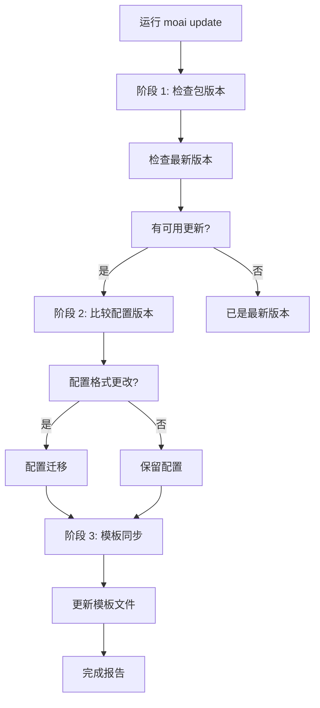
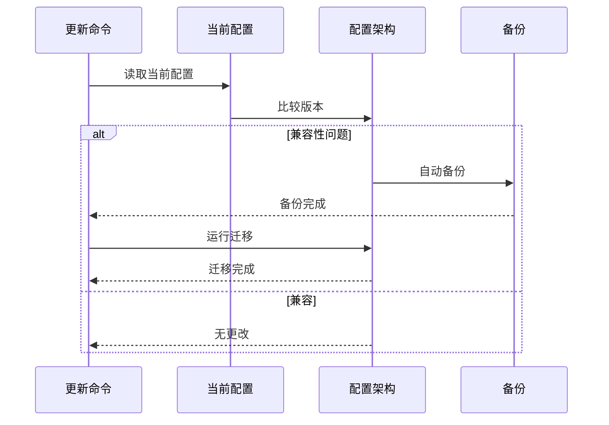
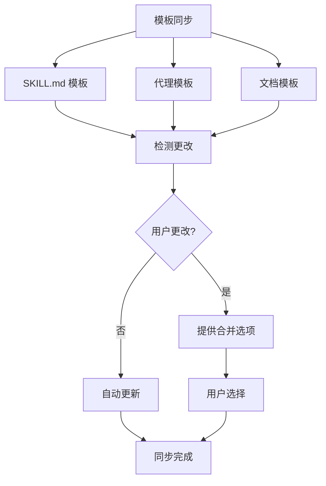

# 更新

保持 MoAI-ADK 更新,使用智能更新工作流进行平滑升级。

## 更新命令

要将 MoAI-ADK 更新到最新版本:

```bash
moai update
```

此命令运行 3 阶段智能更新工作流。

## 3 阶段智能更新工作流



### 阶段 1: 检查包版本

首先,比较当前安装的版本与 GitHub Releases 上的最新版本。

```bash
# 检查当前版本
moai --version

# 检查可用更新
moai update --check-only
```

**检查项目:**

- 当前安装的版本
- GitHub Releases 最新版本
- 更新日志 (新功能、错误修复、兼容性)

**输出示例:**

```
当前版本: 1.2.0
最新版本: 1.3.0

发布说明:
- 添加新的 expert-performance 代理
- 改进令牌优化
- 修复 SPEC 验证问题

有可用更新! 运行 'moai update' 进行升级。
```

### 阶段 2: 比较配置版本

检查配置文件格式和兼容性。



**检查的文件:**

- `.moai/config/sections/user.yaml`
- `.moai/config/sections/language.yaml`
- `.moai/config/sections/quality.yaml`

**迁移示例:**

```yaml
# 旧配置 (v1.2.0)
development_mode: ddd
test_coverage_target: 85

# 新配置 (v1.3.0)
development_mode: ddd
test_coverage_target: 85
ddd_settings:
  require_existing_tests: true
  characterization_tests: true
```


`.moai/config/` 中的配置文件在迁移前始终会备份。


### 阶段 3: 模板同步

将项目模板和基础文件同步到最新版本。



**同步的文件:**

- `.moai/templates/` - 项目模板
- `.claude/skills/` - 技能模板
- `.claude/agents/` - 代理模板


用户修改的模板文件会被保留,新版本会提供合并选项。


## 更新选项

### 操作模式

| 命令 | 二进制更新 | 模板同步 |
|---------|-----------|----------|
| `moai update` | O | O |
| `moai update --binary` | O | X |
| `moai update --templates-only` | X | O |

### 仅更新二进制

仅更新 MoAI-ADK 二进制文件，不同步模板:

```bash
$ moai update --binary
```

**使用场景:**
- 当您手动修改了模板时
- 当您想跳过模板同步时
- 仅需要二进制更新时

### 仅同步模板

仅同步模板，不更新二进制:

```bash
$ moai update --templates-only
```

**使用场景:**
- 应用最新的技能和代理模板
- 保持二进制版本的同时更新模板
- 需要在多个项目中同步模板时

### 仅检查

检查可用版本而不实际更新:

```bash
$ moai update --check-only
```

### 自动更新

自动更新而无需确认:

```bash
$ moai update --yes
```

### 特定版本

更新到特定版本:

```bash
$ moai update --version 1.2.0
```

### 保留备份

保留备份以便在更新失败时恢复:

```bash
$ moai update --keep-backup
```

## 更新后步骤

### 步骤 1: 检查版本

```bash
moai --version
```

### 步骤 2: 验证配置

```bash
moai doctor
```

### 步骤 3: 检查新功能

```bash
moai --help
```

检查新添加的命令或选项。

## 故障排除

### 问题: 更新失败

```bash
错误: 更新失败 - 权限被拒绝
```

**解决方案:**

```bash
# 使用 curl 手动重新安装
curl -fsSL https://raw.githubusercontent.com/modu-ai/moai-adk/main/install.sh | bash

# 或重新安装特定版本
moai update --version <VERSION>
```

### 问题: 配置迁移错误

```bash
错误: 配置迁移失败
```

**解决方案:**

```bash
# 从备份恢复
cp -r .moai/config.bak .moai/config

# 手动迁移
vim .moai/config/sections/quality.yaml
```

### 问题: 模板冲突

```bash
警告: 检测到模板冲突
```

**解决方案:**

```bash
# 自动合并 (保留用户更改)
$ moai update --merge

# 手动合并 (保留备份,创建合并指南)
$ moai update --manual

# 强制更新 (无备份)
$ moai update --force
```

## 个人设置管理

更新 MoAI-ADK 时,**CLAUDE.md** 和 **settings.json** 会被新版本覆盖。如果您有个人修改,请按以下方式管理。

### 使用 .local 文件

将个人设置存储在单独的文件中,以防止在更新期间被覆盖:

| 文件 | 位置 | 用途 |
|------|----------|---------|
| `CLAUDE.md` | 项目根目录 | MoAI-ADK 管理 (更新时更改) |
| `settings.json` | `.claude/` | MoAI-ADK 管理 (更新时更改) |
| `CLAUDE.local.md` | 项目根目录 | ✅ 项目个人设置 (不受更新影响) |
| `.claude/settings.local.json` | 项目 | ✅ 项目个人设置 (不受更新影响) |

**个人设置示例 (项目本地):**

```markdown
# CLAUDE.local.md

## 用户信息

- 姓名: 张三
- 角色: 高级软件工程师
- 专长: 后端开发、DevOps

## 开发偏好

- 语言: Python、TypeScript
- 框架: FastAPI、React
- 测试: pytest、Jest
- 文档: Markdown、OpenAPI
```

**个人设置示例 (settings):**

```json
// .claude/settings.local.json
{
  "env": {
    "ANTHROPIC_AUTH_TOKEN": "YOUR-API-KEY",
    "ANTHROPIC_BASE_URL": "https://api.z.ai/api/anthropic",
    "ANTHROPIC_DEFAULT_HAIKU_MODEL": "glm-4.7-flashx",
    "ANTHROPIC_DEFAULT_SONNET_MODEL": "glm-4.7",
    "ANTHROPIC_DEFAULT_OPUS_MODEL": "glm-4.7"
  },
  "permissions": {
    "allow": [
      "Bash(bun run typecheck:*)",
      "Bash(bun install)",
      "Bash(bun run build)"
    ]
  },
  "enabledMcpjsonServers": [
    "context7"
  ],
  "companyAnnouncements": [
    "🗿 MoAI-ADK: 28个专业代理 + 52个技能的SPEC优先DDD",
    "⚡ /moai: 一站式 Plan→Run→Sync 自动化（智能路由）",
    "🌳 moai worktree: 在隔离的工作树环境中并行SPEC开发",
    "🤖 Expert Agents (8): backend, frontend, security, devops, debug, performance, refactoring, testing",
    "🤖 Manager Agents (8): git, spec, ddd, tdd, docs, quality, project, strategy",
    "🤖 Builder Agents (3): agent, skill, plugin",
    "🤖 Team Agents (8, 实验性): researcher, analyst, architect, designer, backend-dev, frontend-dev, tester, quality",
    "📋 工作流程: /moai plan (SPEC) → /moai run (DDD) → /moai sync (Docs)",
    "🚀 选项: --team (并行Agent Teams)、--ultrathink (Sequential Thinking MCP深度分析)、--loop (迭代自动修复)",
    "✅ 质量: TRUST 5 + 85%+ 覆盖率 + Ralph Engine (LSP + AST-grep)",
    "🔄 Git策略: 3-Mode (Manual/Personal/Team) + Smart Merge配置更新",
    "📚 提示: moai update --templates-only 同步最新的skills和agents",
    "📚 提示: moai worktree new SPEC-XXX 创建并行开发的worktree",
    "⚙️ moai update -c: 模型可用性设置 (high/medium/low) - 按Claude计划等级配置模型",
    "💡 混合模式: Plan使用Claude (Opus/Sonnet)，Run/Sync使用GLM-5节省成本",
    "💡 并行开发: 终端1运行Claude，终端2+运行 'moai glm && claude' 并行执行",
    "💎 GLM-5赞助商: z.ai合作伙伴关系 - 高性价比AI，同等性能"
  ],
  "_meta": {
    "description": "用户特定的 Claude Code 设置 (gitignored - 永不提交)",
    "created_at": "2026-01-27T18:15:26.175926Z",
    "note": "编辑此文件以自定义您的本地开发环境"
  }
}
```


**配置优先级:** 本地 > 项目 > 用户 > 企业<br />
<code>settings.local.json</code> 覆盖项目设置。


### moai 文件夹结构

MoAI-ADK 仅管理以下文件夹中的文件:

```
.claude/
├── agents/
│   └── moai/                # MoAI-ADK 代理 (更新目标)
│
├── hooks/
│   └── moai/                # MoAI-ADK hook 脚本 (更新目标)
│
├── skills/
│   ├── moai-*               # MoAI-ADK 技能 (moai- 前缀,更新目标)
│   │
│   └── my-skills/           # ✅ 个人技能 (不更新)
│
└── rules/
    └── moai/                # 规则文件 (moai 管理)
        ├── core/            # 核心原则和宪法
        ├── development/     # 开发指南和标准
        ├── languages/       # 语言特定规则 (16 种语言)
        └── workflow/        # 工作流阶段定义
```

**命名约定:**

| 类型 | 位置 | 更新影响 |
|------|----------|---------------|
| **代理** | `agents/moai/` | ⚠️ **更新时更改** |
| **Hooks** | `hooks/moai/` | ⚠️ **更新时更改** |
| **技能** | `skills/moai-*` | ⚠️ **更新时更改** |
| **规则** | `rules/moai/` | ⚠️ **更新时更改** |
| **个人代理** | `agents/my-agents/` | ✅ **不受更新影响** |
| **个人技能** | `skills/my-skills/` | ✅ **不受更新影响** |


**重要:** 带 `moai-*` 前缀的技能由 MoAI-ADK 管理。对于个人添加或修改,使用 `my-*` 文件夹或单独的前缀。



**重要:** `moai/` 文件夹中的文件在更新期间可能被覆盖。对于个人添加或修改,请使用单独的文件夹。


### 如何组织文件

```bash
# 移动个人代理 (示例)
mv .claude/agents/my-agent.md .claude/my-agents/

# 移动个人技能 (示例)
mv .claude/skills/my-skill.md .claude/my-skills/
```

### 更新日志

查看 [GitHub Releases](https://github.com/modu-ai/moai-adk/releases) 了解最新更改。

## 回滚

如果更新后出现问题,您可以回滚到以前的版本:

```bash
# 回滚到特定版本
moai update --version 1.2.0

# 或从备份恢复
cp -r .moai/config.bak .moai/config
```


回滚前提交您的工作。


## 下一步

更新完成后:

1. **[查看更新日志](/getting-started/update)** - 了解新功能
2. **[核心概念](/core-concepts/what-is-moai-adk)** - 掌握新代理和功能
3. **[快速开始](/getting-started/quickstart)** - 将新功能应用到您的项目

---

定期更新以充分利用 MoAI-ADK 的最新功能和改进!
