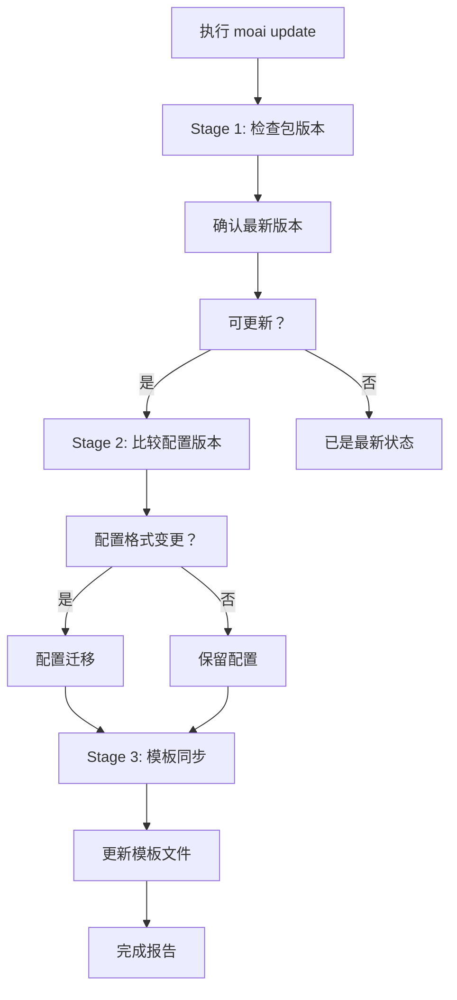
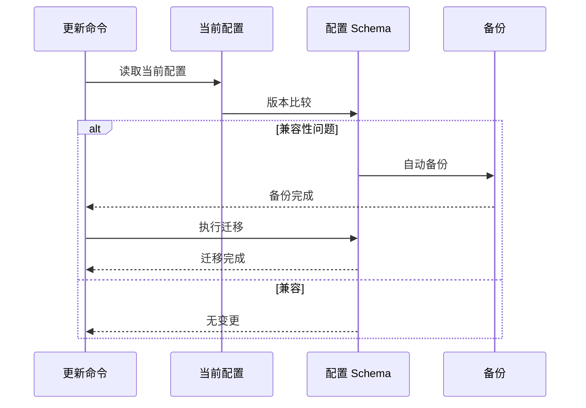
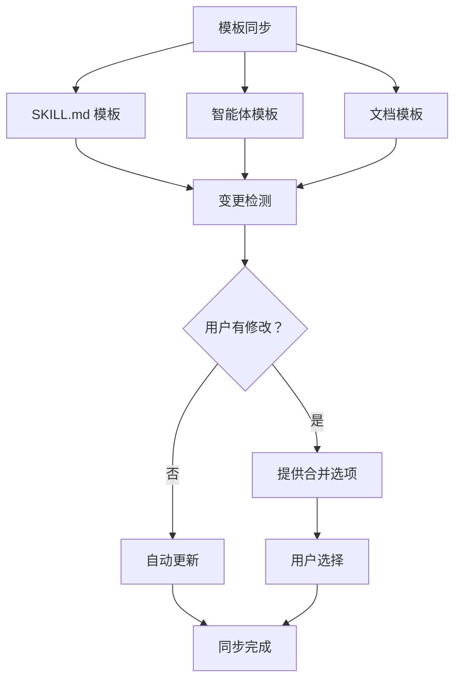

本文介绍让 MoAI-ADK 保持最新版本的方法。一条 `moai update` 就能同时更新二进制与模板，用户创建的自定义资产会自动保留。

## 更新命令

要将 MoAI-ADK 更新到最新版本：

```bash
moai update
```

该命令执行 3 阶段智能更新工作流。

## 3 阶段智能更新工作流


```mermaid
flowchart TD
    A[执行 moai update] --> B[Stage 1: 检查包版本]
    B --> C[确认最新版本]
    C --> D[可更新？]

    D -->|是| E[Stage 2: 比较配置版本]
    D -->|否| F[已是最新状态]

    E --> G[配置格式变更？]
    G -->|是| H[配置迁移]
    G -->|否| I[保留配置]

    H --> J[Stage 3: 模板同步]
    I --> J

    J --> K[更新模板文件]
    K --> L[完成报告]
```

### Stage 1：检查包版本

首先比较当前已安装版本与 GitHub Releases 上的最新版本。

```bash
# 현재 버전 확인
moai --version

# 사용 가능한 업데이트 확인
moai update --check-only
```

**检查项目：**

- 当前已安装的版本
- GitHub Releases 最新版本
- 变更日志（新功能、Bug 修复、兼容性）

**输出示例：**

```
Current version: 1.2.0
Latest version: 1.3.0

Release notes:
- Add new manager-develop agent
- Improve token optimization
- Fix SPEC validation issues

Update available! Run 'moai update' to upgrade.
```

### 校验和强制验证 (Mandatory Checksum Verification) {#checksum-verification}

自 v2.20.0-rc1 起，`moai update` 的二进制下载**无法绕过校验和验证**。若 release 的 `checksums.txt` 下载失败或解析失败，将返回 sentinel error `ErrChecksumUnavailable` 并**中止**更新流程 — 不会尝试下载二进制。

#### Retry 策略

`checksums.txt` 下载会以指数退避进行 **3 次 retry**：

| 尝试 | 等待时间 |
|------|-----------|
| 第 1 次（立即） | 0s |
| 第 2 次 retry | 等待 2s |
| 第 3 次 retry | 等待 4s |
| 无更多 retry | 累计等待约 6s 后失败 |

（内部实现：base delay 2s × 2^(attempt-1) 指数退避，作为 defense-in-depth 在 checker 与 updater 两个阶段都拦截 empty checksum）

所有 retry 都失败时输出如下消息：

```
error: checksum unavailable: persistent retry failure after 3 attempts
```

**不存在 `--skip-checksum` 之类的绕过选项**（CWE-345 有意为之的策略）。

#### 失败时的恢复步骤

1. **确认网络连接**：
   ```bash
   curl -I https://github.com/modu-ai/moai-adk/releases/latest
   ```
2. **检查 Proxy / firewall** — 是否放行 GitHub release asset 域名（`github.com`、`objects.githubusercontent.com`）
3. **可能是暂时性的 GitHub CDN 故障** — 稍后重试
4. **手动安装二进制**（长期被拦截时）：
   ```bash
   curl -fsSL https://raw.githubusercontent.com/modu-ai/moai-adk/main/install.sh | bash
   ```
   手动安装时由用户自行验证完整性，为获得与自动更新同等的保护，建议另行核对 GitHub Release 的 `checksums.txt`。

详细威胁模型、实现位置、检查步骤请参考[安全笔记 — CWE-345](/zh/advanced/security-notes/#cwe-345)。

### Stage 2：比较配置版本

检查配置文件的格式与兼容性。


```mermaid
sequenceDiagram
    participant Update as 更新命令
    participant Current as 当前配置
    participant Schema as 配置 Schema
    participant Backup as 备份

    Update->>Current: 读取当前配置
    Current->>Schema: 版本比较
    alt 兼容性问题
        Schema->>Backup: 自动备份
        Backup-->>Update: 备份完成
        Update->>Schema: 执行迁移
        Schema-->>Update: 迁移完成
    else 兼容
        Schema-->>Update: 无变更
    end
```

**检查文件：**

- `.moai/config/sections/user.yaml`
- `.moai/config/sections/language.yaml`
- `.moai/config/sections/quality.yaml`

**迁移示例：**

```yaml
# 이전 설정 (v1.2.0)
development_mode: ddd
test_coverage_target: 85

# 새로운 설정 (v1.3.0)
development_mode: ddd
test_coverage_target: 85
ddd_settings:
  require_existing_tests: true
  characterization_tests: true
```


配置迁移前总是会备份 `.moai/config/` 目录。


### Stage 3：模板同步

将项目模板与基础文件同步到最新版本。


```mermaid
graph TD
    A[模板同步] --> B[SKILL.md 模板]
    A --> C[智能体模板]
    A --> D[文档模板]

    B --> E[变更检测]
    C --> E
    D --> E

    E --> F{用户有修改？}

    F -->|否| G[自动更新]
    F -->|是| H[提供合并选项]

    G --> I[同步完成]
    H --> J[用户选择]
    J --> I
```

**同步文件：**

- `.moai/templates/` - 项目模板
- `.claude/skills/` - 技能模板
- `.claude/agents/` - 智能体模板


用户修改过的模板文件会被保留，并提供与新版本的合并选项。


## 更新选项

### 工作方式

| 命令 | 二进制更新 | 模板同步 |
|--------|-------------------|---------------|
| `moai update` | O | O |
| `moai update --binary` | O | X |
| `moai update --templates-only` | X | O |

### 仅更新二进制

只更新 MoAI-ADK 二进制，不同步模板：

```bash
$ moai update --binary
```

**使用场景：**
- 亲自修改过模板
- 想跳过模板同步
- 只需要快速的二进制更新

### 仅同步模板

只同步模板，不更新二进制：

```bash
$ moai update --templates-only
```

**使用场景：**
- 应用最新的技能与智能体模板
- 保持二进制版本不变，仅更新模板
- 需要在多个项目间同步模板

### 仅检查 (Check Only)

不实际更新，仅确认可用版本：

```bash
$ moai update --check-only
```

### 自动更新

无需确认，自动进行更新：

```bash
$ moai update --yes
```

### 特定版本

更新到特定版本：

```bash
$ moai update --version 1.2.0
```

### 保留备份

为更新失败时的恢复保留备份：

```bash
$ moai update --keep-backup
```

## 更新后的步骤

### 第 1 步：确认版本

```bash
moai --version
```

### 第 2 步：验证配置

```bash
moai doctor
```

### 第 3 步：确认新功能

```bash
moai --help
```

查看新增的命令或选项。

## 问题排查

### 问题：更新失败

```bash
Error: Update failed - permission denied
```

**解决方法：**

```bash
# curl을 사용하여 수동 재설치
curl -fsSL https://raw.githubusercontent.com/modu-ai/moai-adk/main/install.sh | bash

# 또는 특정 버전으로 재설치
moai update --version <VERSION>
```

### 问题：配置迁移错误

```bash
Error: Config migration failed
```

**解决方法：**

```bash
# 백업에서 복원
cp -r .moai/config.bak .moai/config

# 수동으로 마이그레이션
vim .moai/config/sections/quality.yaml
```

### 问题：模板冲突

```bash
Warning: Template conflicts detected
```

**解决方法：**

```bash
# 자동 병합 (사용자 변경 보존)
$ moai update --merge

# 수동 병합 (백업 보존, 병합 가이드 생성)
$ moai update --manual

# 강제 업데이트 (백업 없음)
$ moai update --force
```

## 个人设置管理

MoAI-ADK 更新时，**CLAUDE.md** 与 **settings.json** 会被新版本覆盖。如果有个人修改，请按以下方式管理。

### 使用 .local 文件

将个人设置保存到单独文件，防止更新时被覆盖：

| 文件 | 位置 | 用途 |
|------|------|------|
| `CLAUDE.md` | 项目根目录 | MoAI-ADK 管理（更新时会变更） |
| `settings.json` | `.claude/` | MoAI-ADK 管理（更新时会变更） |
| `CLAUDE.local.md` | 项目根目录 |  项目个人设置（不受更新影响） |
| `.claude/settings.local.json` | 项目 |  项目个人设置（不受更新影响） |

**个人设置示例（项目本地）：**

```markdown
# CLAUDE.local.md

## 사용자 정보

- Name: John Developer
- Role: Senior Software Engineer
- Expertise: Backend Development, DevOps

## 개발 선호도

- 언어: Python, TypeScript
- 프레임워크: FastAPI, React
- 테스트: pytest, Jest
- 문서: Markdown, OpenAPI
```

**个人设置示例 (settings)：**

```json
// .claude/settings.local.json
{
  "env": {
    "ANTHROPIC_AUTH_TOKEN": "YOUR-API-KEY",
    "ANTHROPIC_BASE_URL": "https://api.z.ai/api/anthropic"
  },
  "permissions": {
    "allow": [
      "Bash(bun run typecheck:*)",
      "Bash(bun install)",
      "Bash(bun run build)"
    ]
  },
  "enabledMcpjsonServers": [
    "context7"
  ],
  "_meta": {
    "description": "User-specific Claude Code settings (gitignored - never commit)",
    "note": "Edit this file to customize your local development environment"
  }
}
```


**设置优先级：** Local > Project > User > Enterprise<br />
<code>settings.local.json</code> 会覆盖项目设置。


### moai 文件夹结构

MoAI-ADK 只在以下文件夹中管理文件：

```
.claude/
├── agents/
│   ├── moai/                # MoAI-ADK 에이전트 (업데이트 대상)
│   └── harness/             # 사용자 하네스 에이전트 (업데이트 제외, 보존)
│
├── hooks/
│   └── moai/                # MoAI-ADK 훅 스크립트 (업데이트 대상)
│
├── skills/
│   ├── moai-*               # MoAI-ADK 스킬 (moai- 접두사, 업데이트 대상)
│   │
│   └── hns-*                # 사용자 생성 스킬 (업데이트 제외, 보존)
│
└── rules/
    └── moai/                # 규칙 파일 (moai 관리)
        ├── core/            # Core principles and constitution
        ├── development/     # Development guidelines and standards
        ├── languages/       # Language-specific rules (16 languages)
        └── workflow/        # Workflow phase definitions
```

**命名规则：**

| 类型 | 位置 | 更新影响 |
|------|------|--------------|
| **智能体** | `agents/moai/` |  **更新时会变更** |
| **钩子** | `hooks/moai/` |  **更新时会变更** |
| **技能** | `skills/moai-*` |  **更新时会变更** |
| **规则** | `rules/moai/` |  **更新时会变更** |
| **用户智能体** | `agents/harness/` |  **不受更新影响（保留）** |
| **用户技能** | `skills/hns-*`（含旧版 `harness-*`、`my-*`） |  **不受更新影响（保留）** |


**重要：** 带 <code>moai-*</code> 前缀的技能由 MoAI-ADK 管理，更新时会被覆盖。自己创建的技能请使用 <code>hns-*</code> 前缀（用户所有的命名空间），智能体请使用 <code>.claude/agents/harness/</code> 目录。详细策略请参考[挽具命名空间策略](/zh/core-concepts/harness-engineering/#挽具命名空间策略-template-managed-vs-user-owned)。


### 文件整理方法

```bash
# 개인 에이전트 이동 (예시)
mv .claude/agents/moai/my-agent.md .claude/agents/harness/

# 개인 스킬 이름 변경 (예시: hns- 접두사 부여)
mv .claude/skills/my-skill .claude/skills/hns-my-skill
```

### 变更日志

最新变更请查看 [GitHub Releases](https://github.com/modu-ai/moai-adk/releases)。

## 回滚

更新后出现问题时，可以回滚到旧版本：

```bash
# 특정 버전으로 롤백
moai update --version 1.2.0

# 또는 백업에서 복원
cp -r .moai/config.bak .moai/config
```


回滚前请先提交当前工作。


## 下一步

完成更新后：

1. **[查看变更日志](/zh/getting-started/update)** - 学习新功能
2. **[核心概念](/zh/core-concepts/what-is-moai-adk)** - 熟悉新智能体与新功能
3. **[快速开始](/zh/getting-started/quickstart)** - 在项目中应用新功能

---

定期更新，善用 MoAI-ADK 的最新功能与改进！
