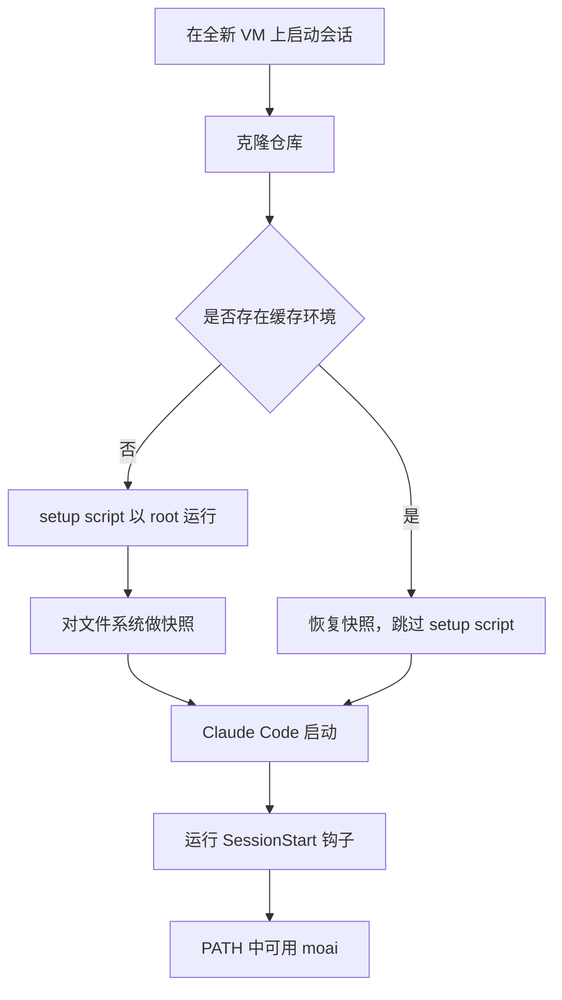

云端会话在 Anthropic 托管的 VM 上重新克隆仓库后启动。MoAI-ADK 放在仓库里的东西 ——
`CLAUDE.md`、`.claude/settings.json` 及其挂载的钩子、`.claude/rules/`、`.claude/skills/`、
`.claude/agents/`、`.claude/commands/`、`.mcp.json` —— 都随这次克隆一起到达。只有一样不会：
`moai` 二进制文件。它只存在于你自己的机器上，从未进入仓库。

本指南要补的就是这一处空缺。没有该二进制文件，`.claude/settings.json` 中配置的钩子会失败，
`moai` 命令会提示找不到，`.mcp.json` 声明的 MCP 服务器根本不会启动。有了它，云端会话的表现
与本地会话一致。

## 配方

在 [claude.ai/code](https://claude.ai/code) 打开环境设置对话框，把下面内容粘贴到
**Setup script** 字段：

```bash
#!/bin/bash
curl -fsSL https://raw.githubusercontent.com/modu-ai/moai-adk/main/install.sh \
  | bash -s -- --install-dir /usr/local/bin || true
moai --version || true
```

这段短脚本里有三处是关键，它们之所以这样写，是因为"看起来理所当然"的写法都会失败。

**安装脚本从 `raw.githubusercontent.com` 获取，而不是 `adk.mo.ai.kr`。** README 里的
`curl -fsSL https://adk.mo.ai.kr/install.sh | bash` 是给自己机器用的。云端会话默认的网络等级
**Trusted** 只放行一份固定域名清单，`adk.mo.ai.kr` 不在其中。GitHub 在其中 —— `github.com`、
`raw.githubusercontent.com`、`objects.githubusercontent.com`、
`release-assets.githubusercontent.com` 均可访问，脚本本身和它下载的发布资产都被覆盖。
`raw.githubusercontent.com` 提供的文件与仓库根目录的 `install.sh` 完全相同。

**`--install-dir` 用命令行标志传入，而不是环境变量。** 安装脚本在解析参数时会清空
`INSTALL_DIR`，所以 `INSTALL_DIR=/usr/local/bin bash` 会被静默忽略，二进制文件落到别处。
若交给默认值，VM 上会选择 `$GOPATH/bin` 或 `~/.local/bin`，两者都不保证在会话的 `PATH` 中。
`/usr/local/bin` 则在。

**`|| true` 用来兜住退出码。** 退出码非 0 的 setup script 会让整个会话启动失败。也就是说安装
过程中一次短暂的网络波动，带来的不是"没有 moai 的会话"，而是"打不开的会话"。随后的
`moai --version` 用于把已安装版本写进 setup 日志，出于同样的理由加了同样的保护。

## 为什么不用 `go install`

对 Go 用户最自然的写法并不可行。为免有人为此耗掉半天，这里原样记下失败形态：

```bash
go install github.com/modu-ai/moai-adk/cmd/moai@latest
# go: module github.com/modu-ai/moai-adk@latest found (v1.14.5),
#     but does not contain package github.com/modu-ai/moai-adk/cmd/moai
```

模块路径是不带 `/v3` 后缀的 `github.com/modu-ai/moai-adk`，而 Go 的语义化导入版本要求主版本
2 及以上必须带该后缀。于是 `@latest` 解析到不带后缀的路径所能承载的最新标签 `v1.14.5` ——
远早于 `cmd/moai` 出现之前。直接点名 v3 发布版则会被拒绝：

```bash
go install github.com/modu-ai/moai-adk/cmd/moai@v3.1.3
# go: invalid version: module contains a go.mod file, so module path must match
#     major version ("github.com/modu-ai/moai-adk/v3")
```

`@main` 可以构建，因为来自分支的伪版本绕开了主版本规则。但不建议用于云端环境，原因有三 ——
它不是下载二进制而是编译整棵树（在预热的本地机器上耗时 1 分 42 秒，安装脚本约 2 秒）；
它要求 VM 的 Go 版本足以满足本模块的 `go` 指令；生成的二进制没有版本戳，`moai version`
报告的是编译期默认值而非所构建的发布版，日后"这是哪个版本"将无从回答。

## 执行顺序



setup script 在 Claude Code 启动之前只运行一次。随后 Anthropic 会对文件系统做快照，并把它作为
后续会话的起点重用，因此安装成本只付一次，而不是每个会话都付。快照保留写入磁盘的内容
（包括该二进制文件），丢弃仅仅处于运行状态的东西。

当你修改脚本、修改环境的允许网络主机，以及快照在大约 7 天后过期时，脚本会重新运行。正因为
这个周期，本配方不锁定特定版本而是安装最新发布版 —— 每次重建都会取到当前版本。若希望锁定，
加上标志即可：

```bash
curl -fsSL https://raw.githubusercontent.com/modu-ai/moai-adk/main/install.sh \
  | bash -s -- --install-dir /usr/local/bin --version 3.1.2 || true
```


setup script 需要在大约 5 分钟内完成，缓存才能建立。安装脚本下载的是预构建二进制，数秒即可完成，
剩下的预算可以留给项目真正需要的其他工作。


## 验证

在云端会话中请 Claude 执行下面几条。它们是普通 shell 命令，由 Claude 代为运行：

```bash
which moai              # /usr/local/bin/moai
moai --version          # setup script 安装的发布版
moai doctor             # 环境体检，包含 MCP 接线
```

如果 `which moai` 返回为空，说明 setup script 要么没有运行（缓存环境会跳过它），要么失败了而
`|| true` 吞掉了错误。修改脚本（任何改动都会使缓存失效），开一个新会话，然后阅读 setup 日志。

## 本指南不涉及的内容

环境对话框以明文保存 setup script 和环境变量，使用该环境的任何人都能读取，目前还没有专用的
密钥存储。本配方不需要任何凭据，也不应被扩展去携带凭据。如果项目需要 `GH_TOKEN`，会话的
GitHub 代理无需令牌即可为 `gh` 完成认证。
