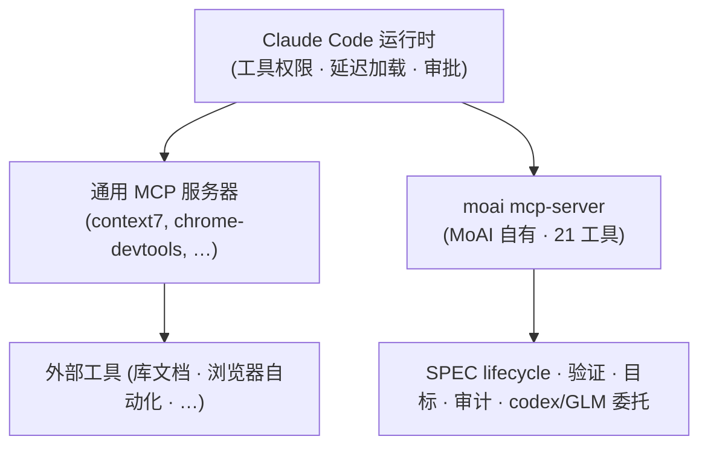

# MCP 服务器

MoAI-ADK 在 Claude Code 的 MCP 生态之上，又叠加了一个**自有的 MCP 服务器**。一个二进制文件（`moai mcp-server`）以 stdio 本地服务器的方式运行，向 Claude Code 运行时暴露 MoAI-ADK 独有的 21 个工具——SPEC 生命周期审计、验证快照、目标引擎、跨模型审计、codex·GLM 委托等。


[**Claude Code 通用 MCP**](/zh/claude-code/extensibility/mcp) 讲的是平台自身的 MCP（Model Context Protocol）集成——USB 端口比喻、服务器注册、传输类型、`/mcp` 命令、OAuth 认证、延迟加载原理。

本文档讲的是叠加在其上的 **MoAI 自有 MCP 服务器**。两个表面共享相同的核心规则，但所讨论的主体不同。


## 同一个核心，两个表面

Claude Code 的 MCP 生态与 MoAI 的自有 MCP 服务器是各自独立的服务器，但都建立在**相同的运用原则**之上。它们共享三条核心规则。

| 核心规则 | 含义 |
|-----------|------|
| **MCP-over-CLI** | 同一功能同时以 CLI 和 MCP 工具暴露，但当智能体的 `tools:` 列表中存在 MCP 工具时优先使用 MCP。优势在于结构化输出、规避 shell-quoting、在子智能体中低延迟。 |
| **延迟加载** | MCP 工具定义默认延迟加载。平时只将简短的元数据留在上下文中，实际调用时再用 `ToolSearch` 加载 schema。 |
| **权限门** | MCP 工具与 Claude 的通用工具一样需通过相同的权限门。首次调用时审批提示出现在主会话，放行后同一工具不再询问。 |



关键在于，"MoAI 不配置 MCP"是一个**半真半假的说法**。不默认配置外部 MCP 服务器（context7、playwright 等）是对的。但 MoAI 自有的那个服务器在 `moai init` 时就会以 default-on 装上。这个服务器正是 MoAI 的 21-工具目录触达 Claude Code 的通道。

## .mcp.json 配置

`moai init` 在项目根目录创建 `.mcp.json`（project scope），在里面建立**恰好一个活跃条目**——自有的 `moai` 本地 stdio 服务器。

```json
{
  "mcpServers": {
    "moai": {
      "command": "moai",
      "args": ["mcp-server"]
    }
  },
  "staggeredStartup": {
    "enabled": true,
    "delayMs": 500,
    "connectionTimeout": 15000
  }
}
```

`staggeredStartup` 是 Claude Code 运行时字段，用来调节服务器顺序启动。当服务器有多个时，它能防止同时启动的竞争（race）。

### 四个 documented-but-disabled 条目

部署默认值只有 `moai` 一个服务器处于活跃状态。四个外部服务器已写入文档但处于禁用状态，用 `moai mcp add <名称>` 命令来开启。

| 服务器 | 用途 | 激活方式 |
|------|------|--------|
| `context7` | 查询最新库的官方文档（resolve-library-id, get-library-docs） | `moai mcp add context7` |
| `chrome-devtools` | 无头浏览器自动化 | `moai mcp add chrome-devtools` |
| `playwright` | 浏览器自动化 + E2E 测试 | `moai mcp add playwright` |
| `ast-grep` | 结构化代码搜索和重构 | `moai mcp add ast-grep` |

### 中立性契约

`.mcp.json` 是 git-tracked 文件。因此"搭载秘密的条目、需要凭证的条目、未通过中立性检查的条目"是**禁止**的。所有环境变量的值都以 `${VAR}` 字面量写入——Claude Code 运行时扩展实际值，被解释的秘密不会被序列化到 git-tracked 的 `.mcp.json` 中。

```json
{
  "remote-needs-auth": {
    "type": "http",
    "url": "https://mcp.example.com/sse",
    "headers": {
      "Authorization": "Bearer ${MY_API_KEY}"
    }
  }
}
```

`${MY_API_KEY}` 由运行时从环境变量中填充。文件本身只保留字面量字符串，所以秘密不会暴露到存储库中。

### atomic-RWM 管理

用户不直接手编 `.mcp.json`。`moai mcp add|remove|list` CLI 管理该文件，且此 CLI 通过 atomic-RWM seam（flock 文件锁 + compare-retry + 备份后写入 + idempotent-skip）运作。即使两个会话同时编辑，也不会让一边的变更覆盖另一边。

## `project_root` 输入——由调用方指名自己的树

五个工具接受可选的字符串 `project_root`：`spec_progress`、`spec_audit`、`spec_drift`、`codex_audit`、`audit_multi`。它指明这次调用应当作用的树，要传的值就是调用方自己的 `git rev-parse --show-toplevel`。

在 worktree 里工作的智能体必须传它。这不是图方便的功能。服务器没有办法自行推出答案：它是一个长寿的子进程，工作目录跟不上 worktree 的切换，而它退而依赖的环境变量指向的是**项目**根目录——也就是 primary 检出——即便会话正在 worktree 中工作也是如此。在 worktree 里省掉它，调用就会作用到 primary 检出上，于是只存在于卡片分支上的 SPEC 不会进入审计者读取的目录。它也不会被报告为缺失。它只是不存在。

握有答案的只有调用方。这正是它作为输入、而非由服务器推断的原因。

| 情形 | 传什么 | 结果 |
|------|--------|------|
| worktree 中的会话 | `project_root: <git rev-parse --show-toplevel>` | 调用作用于该树 |
| primary 检出中的会话 | 不传 | 与以往完全一致地解析 |
| 并非 MoAI 项目根的路径 | — | 调用被**拒绝**，错误信息中写明该路径 |

拒绝是刻意的设计，而不是毛边。若悄悄回退到默认值，就会把打错自己 worktree 路径的调用方送回去审计 primary 检出，还告诉它成功了——正是这个参数要防止的那种失败。

在 `audit_multi` 中，根会到达 fan-out 的**两个**后端：codex 把它作为执行审查的工作目录，GLM 路径则用它从那棵树上取出要发往 z.ai 的 diff。传这个值，才能让两份第二意见针对同一棵树——不传，它们可能看的是不同的树。

版本提醒：已经在运行的服务器，即使替换了其下的二进制，在重启前仍保持旧行为——子进程不会自行重新加载。调用方可以检查的是 `ListTools` 的响应中是否出现 `project_root`。

## 21-工具目录

`moai mcp-server` 暴露的 21 个工具分为六组。调用时都带 `mcp__moai__` 前缀。

### SPEC 生命周期

| 工具 | 目的 | 消费智能体 | CLI 等价物 |
|------|------|---------------|------------|
| `mcp__moai__spec_progress` | SPEC 文档列表 + frontmatter 查询 | manager-spec, manager-docs | `moai spec list` |
| `mcp__moai__spec_audit` | SPEC 生命周期审计（时代分类 + 漂移） | manager-spec, manager-docs, plan-auditor, super-advisor | `moai spec audit` |
| `mcp__moai__spec_drift` | 现代时代 V3R6 漂移发现 | manager-spec, plan-auditor | `moai spec audit` (drift 视图) |

用于 plan-phase（manager-spec 编写新 SPEC 时确认时代分类和漂移）与 sync-phase（manager-docs 验证生命周期终结）。plan-auditor 用 `spec_audit` / `spec_drift` 执行 plan-phase 的怀疑式审查。

### 验证快照

| 工具 | 目的 | 消费智能体 | CLI 等价物 |
|------|------|---------------|------------|
| `mcp__moai__verify_snapshot` | 按键读取/记录验证快照 | manager-develop | `moai verify check` |
| `mcp__moai__verify_trend` | 按键验证历史趋势 | manager-develop, sync-auditor, super-advisor | `moai verify check` |

manager-develop 在 run-phase 自验证（接缝 §E）中使用，sync-auditor 和 super-advisor 用于审查趋势。`verify_snapshot` 读取或记录以 HEAD 摘要为键的快照，`verify_trend` 展示用于判断收敛的历史。

### 目标 + 会话（自治循环）

| 工具 | 目的 | 消费智能体 | CLI 等价物 |
|------|------|---------------|------------|
| `mcp__moai__goal_arm` | 条件声明目标武装 | **编排器主会话专用**（未连线到任何智能体） | `moai goal arm` / `/moai goal` |
| `mcp__moai__goal_status` | 读取已武装的目标状态 | manager-develop, manager-lead | `moai goal status` |
| `mcp__moai__session_list` | 活跃 moai 会话列表 | manager-lead | `moai session list` |

`goal_arm` 是编排器专用的——自治循环武装是编排器关注的事，所以不在智能体内调用。这是为了保留平面层级武装表面而做的设计。`goal_status` 是 manager-develop / manager-lead 读取已武装条件进度的通道，`session_list` 是 manager-lead 在 fan-out 前检测同一检出上并发会话的竞争缓解手段。

### 跨模型审计（第二意见）

| 工具 | 目的 | 消费智能体 | CLI 等价物 |
|------|------|---------------|------------|
| `mcp__moai__audit_multi` | 多审计者收敛（claude + codex + glm） | plan-auditor, sync-auditor | —（MCP 专用收敛入口） |
| `mcp__moai__codex_audit` | codex 后端单一审计（原生/对抗式） | plan-auditor, sync-auditor | — |
| `mcp__moai__glm_audit` | GLM (z.ai) 后端单一审计 | plan-auditor, sync-auditor | — |
| `mcp__moai__audit_cache` | plan-audit PASS 缓存（compute_hash / lookup / store，进程间共享） | sync-auditor | `moai audit cache` |

单一后端审计模式由项目的 `audit_model` 设置决定：`codex+glm`（默认值，通过 `audit_multi` 收敛）| `glm` | `codex` | `none`（Claude 独自，无后端调用）。所有后端都是 fail-open——不可用的后端返回 `inconclusive`，而非 Go error。

### codex 委托（后台任务）

| 工具 | 目的 | 消费智能体 | CLI 等价物 |
|------|------|---------------|------------|
| `mcp__moai__codex_task` | 将编码/调查任务委托给 codex（同步或后台） | super-advisor | `moai codex task` |
| `mcp__moai__codex_setup` | 探测本地 codex 安装（LookPath + 版本 + 认证） | super-advisor | `moai codex setup` |
| `mcp__moai__codex_job_status` | 读取后台 codex 任务的状态/记录 | super-advisor | `moai codex job status` |
| `mcp__moai__codex_job_result` | 读取后台 codex 任务的输出 | super-advisor | `moai codex job result` |
| `mcp__moai__codex_job_cancel` | 中断正在运行的后台 codex 任务 | super-advisor | `moai codex job cancel` |

codex 委托工具族连线到 super-advisor——因为按需高推理咨询智能体是后台跨模型委托的自然消费者。用 `codex_task` 委托任务，用 `codex_job_status` / `codex_job_result` 轮询完成情况，用 `codex_job_cancel` 中断。codex 是可选的（optional）——缺失或不可用时返回 fail-open 的 `inconclusive`，而非 hard error。

### GLM 委托（后台任务）

| 工具 | 目的 | 消费智能体 | CLI 等价物 |
|------|------|---------------|------------|
| `mcp__moai__glm_task` | 把任务（任意提示词）委托给 GLM（z.ai）（同步或后台） | super-advisor | —（无对应 CLI） |
| `mcp__moai__glm_job_status` | 读取后台 GLM 任务的状态/记录 | super-advisor | — |
| `mcp__moai__glm_job_result` | 读取后台 GLM 任务的输出 | super-advisor | — |
| `mcp__moai__glm_job_cancel` | 中断正在运行的后台 GLM 任务 | super-advisor | — |

GLM 委托工具族与 codex 委托同形，也连线到 super-advisor。`glm_task` 在 `background` 为假时直接返回完成的文本，为真时立即返回任务 ID（此后用 `glm_job_status`·`glm_job_result`·`glm_job_cancel` 观察·中断）。响应 token 上限可用 `max_tokens` 覆盖，默认上限值定在服务器一侧。后台任务活在服务器进程里，进程结束它也一并结束。GLM 同样是可选的——密钥缺失或连不上 z.ai 时，只返回结构化的 fail-open 结果，而不是工具错误。

### MCP-over-CLI 规则

当智能体的 `tools:` 列表中存在 MCP 工具时优先走 MCP 路径而非 CLI。两条路径在后台跑的是**同一套实现**。MCP 路径的优势有三：

- 返回结构化输出（无需解析）
- 避开 shell-quoting 风险
- 在 Bash 可能受限的子智能体环境中以低延迟运作

CLI 仅在 MCP 工具不在 `tools:` 列表中，或在主会话中 CLI 形态更自然时使用。

## 认证

### GLM (z.ai)

在 GLM 会话（`moai glm` 或 `moai cg` 的 GLM 面板）中运行时，网络搜索和网络查询会路由到 z.ai MCP 工具，而非内置的 `WebSearch` / `WebFetch`。认证从 `~/.moai/.env.glm` 读取。

z.ai MCP 服务器（`zai-mcp-server`、`web_search_prime`、`web_reader`）默认禁用，在 GLM 会话中用 `moai glm tools enable` 开启。GLM 会话中的路由规则请参考[多 LLM 后端](/zh/multi-llm/)。

### codex

codex 审计/委托工具（`codex_audit`、`codex_task` 等）从 `~/.codex/auth.json` 读取认证凭证。codex 是**可选的**——认证文件不存在或 codex 未安装时，相关工具返回 `inconclusive` 并继续。这是智能体工作不依赖于 codex 可用性的设计。

### 所有后端都 fail-open

GLM、codex、Claude——三个后端都遵循 fail-open 原则。不可用的后端只会返回 `inconclusive`，不会引发 Go error。即使一个后端缺失，其余后端也能让审计收敛；如果所有后端都不可用，则以 Claude 独自运作（`audit_model: none`）。

## 后台任务进度跟踪

codex·GLM 委托工具中的 `codex_task` 和 `glm_task` 可以用 `background: true` 启动后台任务。此时不等待任务结束就立即返回任务 ID。

进度通过两个工具来轮询（下面以 codex 为例——GLM 由 `glm_job_*` 扮演同样角色）：

```text
codex_task(background=true) ──▶ 返回任务 ID
       │
       ├── codex_job_status(任务 ID) ──▶ 运行中 / 完成 / 失败
       │
       └── codex_job_result(任务 ID) ──▶ 完成时读取输出

需要时 codex_job_cancel(任务 ID) ──▶ 中断
```

可以在 MCP 控制台（Web 控制台）中查看各工具的设置和认证状态。控制台的详细功能请参考 [Web 控制台](/zh/advanced/moai-web-console)。

## 延迟加载与 ToolSearch

MoAI 自有 MCP 服务器也和 Claude Code 通用 MCP 一样遵循延迟加载原则。如果把工具定义全部常驻加载到上下文中，上下文窗口会很快填满，因此平时只放简短的元数据，在实际调用时才加载 schema。

要调用延迟工具，必须先用 `ToolSearch` 将 schema 加载到活动上下文中。

```text
需要工具了 ──▶ {schema 在上下文中吗？}
                   │
            ┌──────┴──────┐
            否              是
            │               │
    先用 ToolSearch         调用工具
    加载 schema
            │
            └──▶ 调用工具
```

跳过此步骤，工具调用会因验证错误而被拒绝。延迟加载原理的背景说明请参考 [Claude Code 通用 MCP](/zh/claude-code/extensibility/mcp) 文档的"延迟加载与 Tool Search"一节。

## 相关文档

- [Claude Code 通用 MCP](/zh/claude-code/extensibility/mcp) — 平台自身的 MCP 集成（USB 端口比喻、服务器注册、传输类型、`/mcp` 命令）
- [多 LLM 后端](/zh/multi-llm/) — Claude × GLM 多后端运用 · GLM 会话中网络搜索/查询路由到 z.ai MCP 工具的规则
- [跨模型审计](/zh/advanced/multi-model-audit) — 多审计者收敛机制
- [Web 控制台](/zh/advanced/moai-web-console) — MCP 工具设置与认证表面
