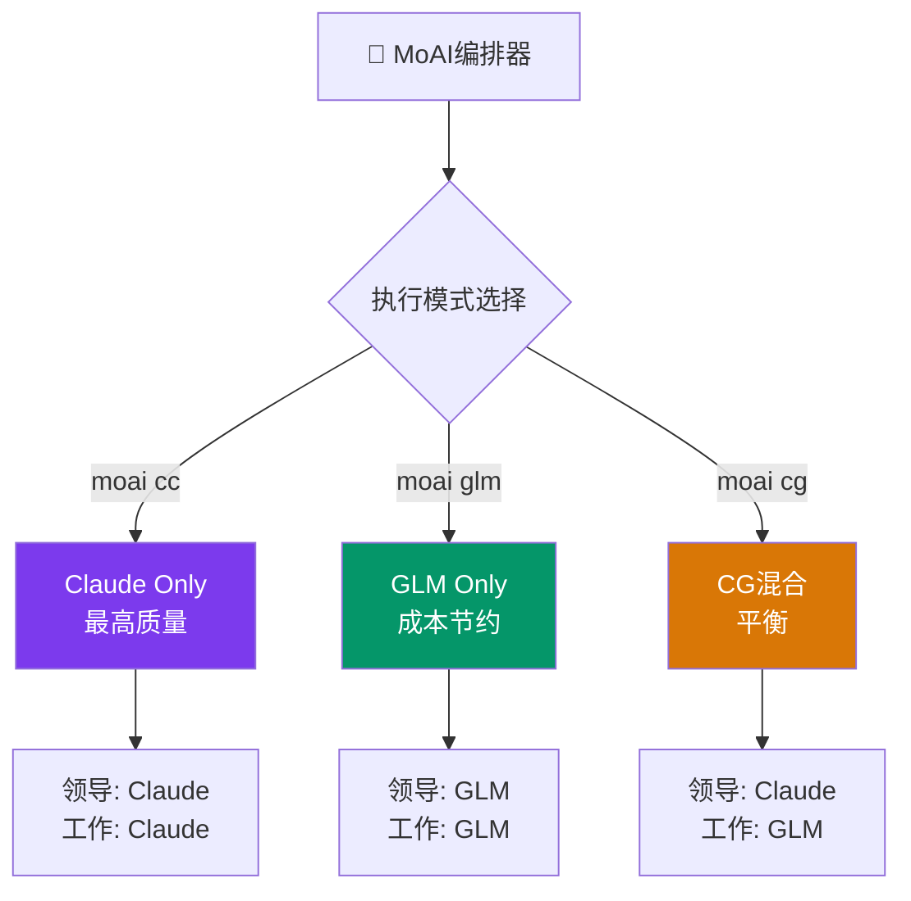

MoAI-ADK在Claude API之外支持**z.ai GLM**作为替代AI后端，实现多LLM开发工作流。

## z.ai GLM是什么?

GLM（Generative Language Model）是z.ai提供的AI模型服务，与Claude Code兼容。无需修改代码，仅通过环境变量即可切换。

| 项目 | 内容 |
|------|------|
| **GLM编码套餐** | 每月**$10**起（[注册链接](https://z.ai/subscribe?ic=1NDV03BGWU)） |
| **兼容性** | 与Claude Code兼容 — 无需修改代码 |
| **模型** | glm-5.2[1m], GLM-4.7, GLM-4.5-Air, 免费模型 |

## 默认模型映射

| Claude层级 | GLM模型 | 输入（每1M token） | 输出（每1M token） |
|------------|---------|---------------------|---------------------|
| Opus / Sonnet / Haiku / Fable | glm-5.2[1m] | $2.00 | $8.00 |

> 四个Claude层级（Opus、Sonnet、Haiku、Fable）全部统一为 `glm-5.2[1m]` 单一模型（1M上下文）。GLM模型故意不跨这些槽位差异化映射（例如 opus→glm-5.2, sonnet→glm-4.7, haiku→glm-4.5-air），原因是在这些槽位间混用1M上下文模型与200K上下文模型会破坏agent spawn时的会话共享 — 1M上下文模型与200K上下文模型无法共享会话。

> 此映射通过四个Claude Code `ANTHROPIC_DEFAULT_*_MODEL` 环境变量（`ANTHROPIC_DEFAULT_OPUS_MODEL`、`ANTHROPIC_DEFAULT_SONNET_MODEL`、`ANTHROPIC_DEFAULT_HAIKU_MODEL`、`ANTHROPIC_DEFAULT_FABLE_MODEL`）实现，全部设为 `glm-5.2`。Fable环境变量自Claude Code v2.1.202起正式支持。

> 也提供免费模型: GLM-4.7-Flash, GLM-4.5-Flash。完整价格请参见[z.ai Pricing](https://docs.z.ai/guides/overview/pricing)。

## 三种执行模式

MoAI-ADK提供三种LLM执行模式:

| 命令 | 领导者 | 工作者 | 需要tmux | 成本节约 | 用途 |
|------|--------|--------|----------|----------|------|
| `moai cc` | Claude | Claude | 否 | - | 最高质量，复杂任务 |
| `moai glm` | GLM | GLM | 推荐 | ~70% | 成本优化 |
| `moai cg` | Claude | GLM | **必需** | **~60%** | 质量＋成本平衡 |


```mermaid
graph TD
    A["🗿 MoAI编排器"] --> B{"执行模式选择"}
    B -->|"moai cc"| C["Claude Only<br/>最高质量"]
    B -->|"moai glm"| D["GLM Only<br/>成本节约"]
    B -->|"moai cg"| E["CG混合<br/>平衡"]

    C --> F["领导: Claude<br/>工作: Claude"]
    D --> G["领导: GLM<br/>工作: GLM"]
    E --> H["领导: Claude<br/>工作: GLM"]

    style C fill:#7C3AED,color:#fff
    style D fill:#059669,color:#fff
    style E fill:#D97706,color:#fff
```

### 快速开始

```bash
# 1. 存储GLM API密钥（仅首次）
moai glm sk-your-glm-api-key

# 2. 选择模式
moai cc            # 仅Claude
moai glm           # 仅GLM
moai cg            # CG混合（需要tmux）
```

> **从v2.7.1起**，CG模式是`--team`标志的**默认团队模式**。除非显式切换到`moai cc`或`moai glm`，否则以CG模式运行。

## 下一步

- [CG模式（Claude + GLM）](/zh/multi-llm/cg-mode) — tmux隔离架构详情
- [模型策略](/zh/multi-llm/model-policy) — 按Agent分配的模型表
