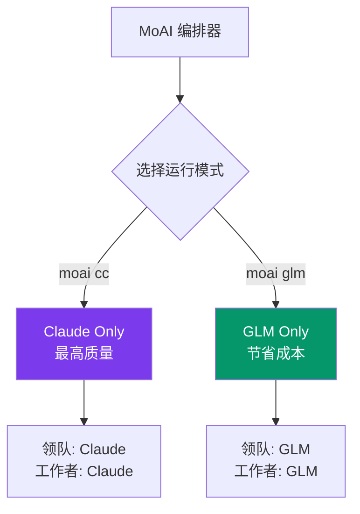

 <strong>所属价值</strong>: 代币经济学

<!-- @value: tokenomics -->


MoAI-ADK 除 Claude API 外，还支持 **z.ai GLM** 作为备选 AI 后端。这不是
便利功能，而是真正落实 v3.0 三大核心中成本层面的 **代币经济学** (Token
 Economics) 的手段 —— 要以更低成本获得同等质量的代码，就必须能为每项工作
分配合适的模型。


## 什么是 z.ai GLM？

GLM (Generative Language Model) 是 z.ai 提供的 AI 模型服务，与 Claude Code 兼容。无需修改代码，仅通过环境变量即可切换。

| 项目 | 内容 |
|------|------|
| **GLM 编码计划** | 每月 **$10** 起（[订阅链接](https://z.ai/subscribe?ic=1NDV03BGWU)） |
| **兼容性** | 与 Claude Code 兼容 —— 无需修改代码 |
| **模型** | glm-5.3-flash（默认）, glm-5.3, GLM-4.7, GLM-4.5-Air, 免费模型 |

## 默认模型映射

| Claude 层级 | GLM 模型 | 输入（每 1M Token） | 输出（每 1M Token） |
|-------------|----------|-----------------|-----------------|
| Opus / Sonnet / Haiku / Fable | glm-5.3-flash | 未公开 | 未公开 |

> z.ai 尚未公布 glm-5.3 的按量单价。上一代 glm-5.2 为输入 $2.00 / 输出 $8.00 (每 1M 代币)。在定额 Coding Plan 下使用时，该单价不影响计费。

> 4 个 Claude 层级 (Opus, Sonnet, Haiku, Fable) 全部统一映射到 `glm-5.3-flash` 单一模型（1M 上下文）。之所以不像 opus→glm-5.3、sonnet→glm-4.7、haiku→glm-4.5-air 那样按层级分别映射 GLM 模型，是因为 1M 上下文模型和 200K 上下文模型无法在同一会话中混用 —— 代理 spawn 时，拥有 1M 上下文窗口的模型与 200K 模型无法共享会话。glm-5.3 在任何层级插槽都仍然可选（`llm.yaml` 的 `llm.glm.models.*`）。

> 该映射通过 4 个 Claude Code `ANTHROPIC_DEFAULT_*_MODEL` 环境变量（`ANTHROPIC_DEFAULT_OPUS_MODEL`、`ANTHROPIC_DEFAULT_SONNET_MODEL`、`ANTHROPIC_DEFAULT_HAIKU_MODEL`、`ANTHROPIC_DEFAULT_FABLE_MODEL`）实现，全部设置为 `glm-5.3-flash`。Fable 环境变量自 Claude Code v2.1.202 起获得官方支持。

> 同时提供免费模型：GLM-4.7-Flash、GLM-4.5-Flash。完整价格请参考 [z.ai Pricing](https://docs.z.ai/guides/overview/pricing)。

## 运行模式

MoAI-ADK 提供 Claude 和 GLM 启动器。按"要优化什么"来选择即可：

| 命令 | 领队 | 工作者 | 需要 tmux | 成本节省 | 用途 |
|--------|------|------|----------|----------|------|
| `moai cc` | Claude | Claude | 否 | - | 最高质量、复杂任务 |
| `moai glm` | GLM | GLM | 推荐 | ~70% | 成本优化 |


```mermaid
graph TD
    A["MoAI 编排器"] --> B{"选择运行模式"}
    B -->|"moai cc"| C["Claude Only<br/>最高质量"]
    B -->|"moai glm"| D["GLM Only<br/>节省成本"]

    C --> F["领队: Claude<br/>工作者: Claude"]
    D --> G["领队: GLM<br/>工作者: GLM"]

    style C fill:#7C3AED,color:#fff
    style D fill:#059669,color:#fff
```

`moai cg` 已停用。它会显示迁移提示并退出，不会启动 Claude 或 GLM，也不是 `moai cc` 的别名。项目中若仍有 `llm.team_mode: cg`，必须先明确选择迁移方案，才能启动会话。 [CG 停用与配置迁移](/zh/multi-llm/cg-mode/)

### 快速开始

```bash
# 1. 保存 GLM API 密钥（仅首次）
moai glm sk-your-glm-api-key

# 2. 选择模式
moai cc            # Claude 专用
moai glm           # GLM 专用
```

## 下一步

- [CG 停用与配置迁移](/zh/multi-llm/cg-mode/)
- [模型策略](/zh/multi-llm/model-policy) —— 各代理的模型分配表
