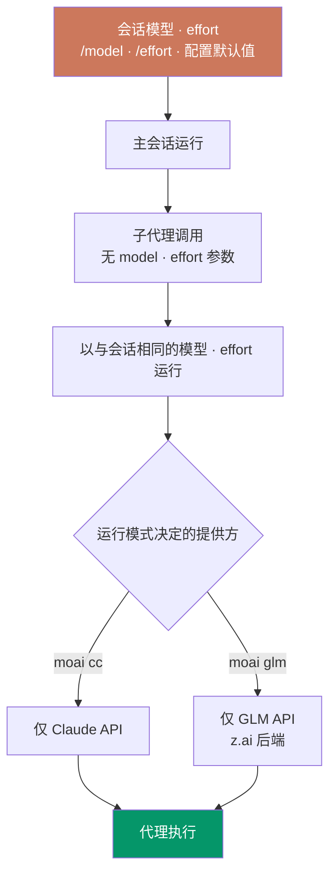

 <strong>所属价值</strong>: 代币经济学

<!-- @value: tokenomics -->

MoAI-ADK 在启动会话时要决定一件事："这个会话用哪个模型、让它想多深"。本节正是
处理这个模型选择的地方 —— Claude 模型阵容、推理深度(effort)、子代理沿用会话的
继承规则，以及在同一个会话里混用 Claude 与 GLM 的多提供方路由。

## 代币经济学中本节的位置

代币经济学(tokenomics)是对"用更少的代币获得同等质量结果"的所有手段的总称。
其中分摊成本的工作大致分为两个分支。

- **模型选择** (本节) —— 决定会话交给哪个模型、想多深、交给哪个提供方。子代理
  原样沿用该会话的模型与推理深度，因此选好一个会话就完成了整体分配。
- **上下文节约** ([成本优化](/zh/cost-optimization) 节) —— 把交给模型的内容本身
  减下来(上下文节食)，并让剩下的内容能以低价复用(提示缓存)。

两个分支互相补充。模型选得再好，上下文臃肿则成本照样失控；上下文减得再多，
模型选择跑偏则便宜的工作用上了昂贵的推理。本节负责的是前者，也就是"会话用
什么、在什么条件下跑"。整体图景见
[代币经济学概述](/zh/advanced/tokenomics-overview)。

## 成对的两轴：模型与推理深度

会话决定的是一对 `{model, effort}`。这一对原样应用到会话中的每一次代理调用。
两根轴回答的是不同的问题。

- **模型** (model) —— "用哪个模型？" 在 Fable·Opus·Sonnet·Haiku 之间选择。
  模型一变，代币单价与上下文窗口都随之改变。
- **effort** (推理深度) —— "让它想多深？" 同一个模型内，决定是浅浅扫过还是
  深入挖掘。推理越深，代币开销越大。

两轴是一起动的，所以既能"贵模型浅着用"，也能"便宜模型深着用"。不改模型
类别、只靠 effort 就能找到成本曲线的拐点，原因就在这里。

### 模型阵容 (2026-08)

| 模型 | 标识符 | 上下文 | 适合的工作 |
|------|--------|----------|------------|
| **Claude Fable 5** | `claude-fable-5` | 1M | 新一代 Mythos 层通用旗舰。最深的推理与复杂编码 |
| **Claude Opus 5.5 / 5 / 4.8** | — | 1M | 复杂架构与高难度推理 |
| **Claude Sonnet 5** | — | 1M | 速度与智能的平衡，日常编码 |
| **Claude Haiku 5.5** | `claude-haiku-5-5` | 1M | 最快最经济 (Anthropic API 默认 Haiku，CC v2.1.293+) |
| **Claude Haiku 4.5** | `claude-haiku-4-5-20251001` | 200K | 最快最经济，简单·批量工作 (AWS 系别名解析目标) |


**阵容与选择是两回事。** 上表只展示"可用的模型"。MoAI-ADK 的会话默认选择遵循
**No-Haiku 策略**，以 Opus 系为一线模型，Haiku 不出现在任何默认组合里。实际用
什么跑由会话的模型选择决定，其规则在下文
[会话决定模型与 effort](#会话决定模型与-effort) 中讨论。


### 推理深度 effort

effort 分五档。

| effort | 含义 |
|--------|------|
| `low` | 浅浅扫过。速度优先，简单工作 |
| `medium` | 默认平衡 |
| `high` | 深入挖掘 |
| `xhigh` | 更深。高难度推理·复杂编码 |
| `max` | 最深的推理 |

`xhigh` 与 `max` 在 Opus 5.5·Opus 5·Opus 4.8·Sonnet 5·Opus 4.7 上受支持。一次打开这两档的
捷径是 **ultrathink** 关键词。它在设置 `effort: xhigh` 的同时开启
**Adaptive Thinking** (让模型自行分配推理 token 的方式)。


**固定推理预算是被禁止的。** Opus 4.7 及以上版本会拒绝 `budget_tokens` 这类
固定推理预算。推理深度始终只用 effort 档位与 Adaptive Thinking 调节 ——
把固定值写死会让请求失败。


effort 可以用斜杠命令切换。

```bash
/effort low       # 速度优先
/effort high      # 深度推理
/effort xhigh     # 高难度
/effort ultracode # 工作流自动编排开关
/effort auto      # 由模型根据上下文选择
```

## 会话决定模型与 effort

过去那种为每个代理逐一挑选模型的配置矩阵方式已经退役。v3.2 起，**子代理原样
沿用主会话的模型与推理深度** —— 调用子代理时不传 `model` 也不传 `effort`，
MoAI 代理定义也不声明任何一方。逐代理分配表不再需要维护，剩下的就是会话的
三项选择。

| 选择 | 做什么 |
|------|--------|
| 模型 (`/model`) | 会话运行的模型。所有子代理一起沿用 |
| effort (`/effort` · `ultrathink`) | 会话的推理深度。`high` 重质量，`medium` 为默认，`low` 是同一模型内的经济运行 |
| 会话模型策略 (`moai profile setup`) | 未单独选择推理强度时，配置文件交出的默认 effort 回退 |

> 旧矩阵(13 个代理 × 3 个配置)如何退役，以及继承规则的细节，见
> [配置矩阵](/zh/advanced/profile-matrix) 与
> [模型策略](/zh/multi-llm/model-policy)。

### 会话选择如何传导到代理调用


```mermaid
flowchart TD
    A["会话模型 · effort<br/>/model · /effort · 配置默认值"] --> B["主会话运行"]
    B --> C["子代理调用<br/>无 model · effort 参数"]
    C --> D["以与会话相同的模型 · effort 运行"]
    D --> E{"运行模式决定的提供方"}
    E -->|"moai cc"| F["仅 Claude API"]
    E -->|"moai glm"| G["仅 GLM API<br/>z.ai 后端"]
    F --> I["代理执行"]
    G --> I

    style A fill:#cc785c,color:#fff
    style I fill:#059669,color:#fff
```

## 多提供方：混用 Claude 与 GLM

模型分配的最后一个问题是"交给哪个提供方"。除 Claude API 外，MoAI-ADK 还把
**z.ai GLM** (Generative Language Model) 作为备选后端。无需改代码，只改环境变量
就保持 Claude Code 兼容、原样运行。

切换到 GLM 时，每个 Claude 层级都会分配到对应的 GLM 模型。通过 Claude Code 的
`ANTHROPIC_DEFAULT_*_MODEL` 环境变量注入的组合如下。

| Claude 插槽 | GLM 模型 | 上下文 |
|-------------|----------|----------|
| Opus / Fable | `glm-5.3-flash` | 1M |
| Sonnet | `glm-5.3-flash` | 1M |
| Haiku | `glm-5.3-flash` | 1M |

> `glm-5.3-flash` 是默认模型。glm-5.3 在任何层级插槽都仍然可选 —— 在 `llm.yaml`(`llm.glm.models.*`) 中指定插槽，即按既有行为(1M 上下文、标准 effort 收拢)原样加载。

### 运行模式

显式选择 Claude 或 GLM 启动器。

| 命令 | 领队 | 工作者 | 需要 tmux | 成本节省 | 用途 |
|--------|------|------|----------|----------|------|
| `moai cc` | Claude | Claude | 否 | — | 最高质量、复杂任务 |
| `moai glm` | GLM | GLM | 推荐 | ~70% | 成本优化 |

`moai cg` 已停用。它会显示迁移提示并退出，不会启动 Claude 或 GLM，也不是 `moai cc` 的别名。项目中若仍有 `llm.team_mode: cg`，必须先明确选择迁移方案，才能启动会话。 [CG 停用与配置迁移](/zh/multi-llm/cg-mode/)

```bash
# 1. 保存 GLM API 密钥（仅首次）
moai glm setup sk-your-glm-api-key

# 2. 选择模式
moai cc            # Claude 专用
moai glm           # GLM 专用
```

## 模型策略：会话决定，代理沿用

**模型策略** (model policy) 今天的职责，是决定会话的模型与推理深度。子代理
原样沿用会话的模型与推理深度，因此调用无需写明模型，代理定义也不声明任何一方。
过去"声明的模型"与"实际解析的模型"出现偏差的 **drift** (漂移)要靠审计日志抓取；
继承成为默认之后，调用时写明模型本身就是罕见的观测对象了。

会话模型策略决定什么、不决定什么，以及旧矩阵退役的来龙去脉，在
[模型策略](/zh/multi-llm/model-policy) 中展开。

## 本节的文档

- [CG 停用与配置迁移](/zh/multi-llm/cg-mode/)
- [模型策略](/zh/multi-llm/model-policy) —— 会话模型策略、effort 回退、继承规则详情
- [配置矩阵](/zh/advanced/profile-matrix) —— 旧矩阵退役后的位置与现在的继承规则

## 相关文档

- [成本优化](/zh/cost-optimization) —— 代币经济学的另一个分支：上下文节食与提示缓存
- [代币经济学概述](/zh/advanced/tokenomics-overview) —— 连接模型分配与上下文节约的整体图景
