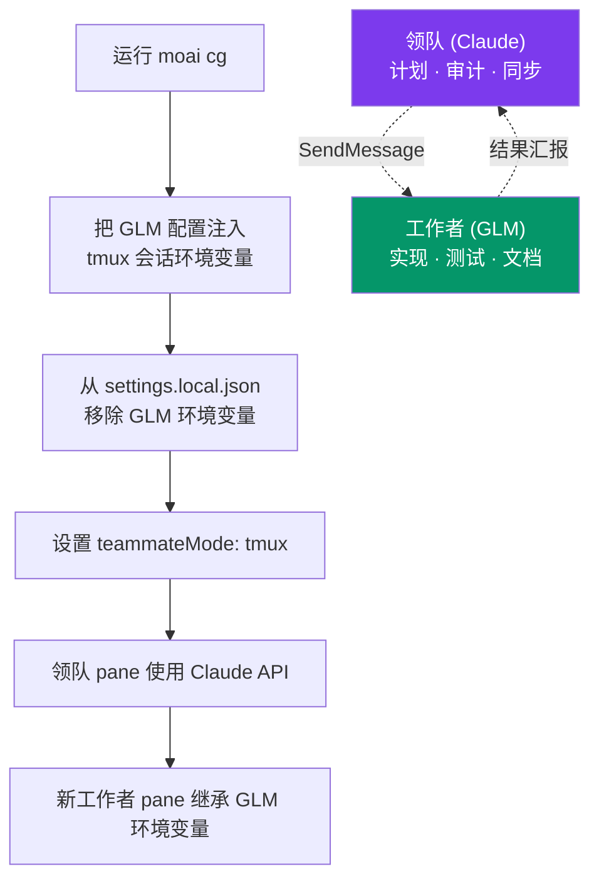

## CG 模式，一句话说清

CG 模式一言以蔽之，就是"思考交给 Claude，动手交给 GLM"的执行方式。战略与质量判断关键的环节由 **Claude** 领队承担，直接写代码的实现为主的环节交给更便宜的 **GLM** (z.ai) 工作者，在同一个会话里把成本降低约 60-70%。

名字里的 **CG** 指 **Claude + GLM**。它不是轮流使用两个模型，而是把环境变量按 tmux 会话分开装，让两个模型在同一个会话里各司其职、互不干扰。等于把"计划由 Claude 深入做、实现由 GLM 便宜做"这条代币经济学（tokenomics）目标原样落地，一行代码都不用改。


 <strong>核心想法</strong>: 最昂贵的推理交给最聪明的模型，工作量最大的活交给最便宜的模型。在同一个会话里把两种角色分开承担，就是 CG 模式的全部。


## 为什么需要这样的分工

AI 编码工作的成本大部分发生在"实现"阶段。建立 SPEC、思考架构的计划 (plan) 阶段与审查结果的审计 (audit) 阶段，推理深度决定质量，但调用次数本身不多。反过来，实际写代码、填测试、产出文档的实现 (run) 阶段，是代币大量倾泻的区间。

因此两个阶段都用同一个最贵的模型，质量有保证，成本却迅速膨胀。CG 模式正是利用这道不对称：需要 Claude 深度推理的位置放 Claude，工作量大到模型单价直接决定账单的位置放更便宜的 GLM。结果就是计划与审计的质量原样保留，只有实现成本大幅下降。

## 工作原理

CG 模式以 tmux 会话为单位切分环境变量。领队所在的 pane 只保留 Claude API 环境，新开的工作者 pane 继承注入到 tmux 会话的 GLM 环境变量。不需要改任何代码，仅凭环境变量就让两个模型分头运转。



领队与工作者通过 Claude Code 的信使 (SendMessage) 工具对话。领队交出任务后，工作者 pane 里由 GLM 执行，结果再回到领队手中。

## 什么事由谁做

| 角色 | 模型 | 承担的工作 |
|------|------|--------|
| **领队**（当前 tmux pane） | Claude | 编排、计划 (plan)、质量判断、审计、同步 (sync) |
| **工作者**（新 tmux pane） | GLM | run 阶段的实现工作量、代码生成、测试编写、文档生成 |

领队决定"做什么、怎么做"，并确认结果是否达标。工作者按照定好的计划实际写代码。这道分工就是 CG 模式省成本的来源 —— 不让贵的模型把实现的工作量也扛在身上。

> **GLM 工作者使用的模型**： Claude 的整个梯队（Opus · Sonnet · Haiku · Fable）被统一映射为一个 1M 上下文的 `glm-5.3`。Claude Code 只按 Opus 槽位设定一次自动压缩窗口，其他槽位启动的智能体也继承这个值，所以混入小模型时即使超出自身上限也不会触发压缩。梯队区分不由模型承担，而由推理深度 (effort) 轴承担。详细映射请参阅[多 LLM 介绍](/zh/multi-llm)。

## 准备与运行

### 第 1 步： 保存 GLM API 密钥（仅首次）

```bash
moai glm setup sk-your-glm-api-key
```

密钥安全地保存在 `~/.moai/.env.glm`。

### 第 2 步： 确认 tmux 环境

已经在用 tmux 的话，不需要新建会话。

```bash
# 如果尚未使用 tmux:
tmux new -s moai
```


 把 VS Code 终端默认 shell 设为 tmux，这一步可以整个跳过。CG 模式只有在 tmux 分屏环境下才能实现领队/工作者的 API 分离。


### 第 3 步： 运行 CG 模式

```bash
moai cg
```

`moai cg` 会在当前 pane 自动启动 Claude Code，不需要另外敲 `claude`。

### 第 4 步： 运行工作流

```bash
/moai "实现用户认证功能"
```

之后就与平常一样。编排器（领队，Claude）负责计划、质量与同步，实现工作量大的任务交给新 tmux pane 的 GLM 工作者。


 过去的 <code>--team</code> 标志（Agent Teams 静态编排层）已在 v3.0 退役。强制指定也会回到 sub-agent 模式。CG 模式的领队/工作者分离由 Claude Code 内置的 teammate 运行时（tmux pane）承担，这个运行时保留不变。


## 什么时候用 CG 模式，什么时候该避开

### 适合 CG 模式的工作

- 实现为主的 SPEC 执行（run 阶段）
- 代码生成、重构工作量
- 编写测试代码
- 生成文档

这些工作重工作量轻推理，交给 GLM 工作者时省成本的效果最大。

### 应该避开 CG 模式的工作

- 架构设计与计划（需要 Opus/Fable 级深度推理）
- 安全审查（需要 Claude 的安全训练）
- 复杂调试（高级推理决定质量）

这些工作里一次判断会大幅左右后续的成本与方向，由最聪明的模型亲自做到底更安全。此时不要用 CG 模式，改用 Claude 专用执行（`moai cc`）。


 CG 模式并不总是正确答案。计划阶段过早把判断交给 GLM 工作者，成本虽然省了，方向一旦走偏，返工的成本会更大。"思考"务必由 Claude 领队承担，只把"动手"交给 GLM 工作者，才是这个模式的正确用法。


## 三种执行模式对比

| 命令 | 领队 | 工作者 | 需要 tmux | 成本节省 | 用途 |
|--------|------|------|----------|----------|------|
| `moai cc` | Claude | Claude | 否 | - | 复杂任务、最高质量 |
| `moai glm` | GLM | GLM | 推荐 | ~70% | 成本优先 |
| `moai cg` | Claude | GLM | **必需** | **~60%** | 质量 + 成本平衡 |

`moai cc` 质量最优先，`moai glm` 成本最优先，`moai cg` 取两者之间的平衡。只有 CG 模式给领队与工作者分配不同的模型，因此 tmux 是必需的。

## 显示模式 (teammateMode)

`teammateMode` 是 Claude Code 内置的显示设置，保存在 `settings.local.json`。它与 MoAI 的 team-mode（旧 `--team` 标志，v3.0 退役）是不同的概念。teammate 运行时本身由 Claude Code 提供，`teammateMode` 只决定画面上怎么呈现。

| 值 | 说明 | 领队/工作者分离 | CG 模式 |
|------|------|--------------|---------|
| `in-process` | 默认值，同一终端内联 | 不可 | 不使用 |
| `auto` | 自动检测环境 | 不支持 | 不使用 |
| `tmux` | tmux 分屏 | 会话环境变量隔离 |  使用 |
| `iterm2` | iTerm2 分屏 | 不支持 | 不使用 |

`moai cg` 与 `moai glm` 把 `settings.local.json` 的 `teammateMode` 设为 `"tmux"`，`moai cc` 则改回空值。`teammateMode` 设置优先于旧的 `CLAUDE_CODE_TEAMMATE_DISPLAY` 环境变量。

> **CG 模式只有在 `tmux` 显示模式下才能实现领队/工作者的 API 分离。**

## 重要事项

| 项目 | 说明 |
|------|------|
| **tmux 环境** | 已在使用 tmux 时无需新会话。把默认 shell 设为 tmux 会很方便 |
| **自动启动** | `moai cg` 在当前 pane 自动启动 Claude Code。无需单独的 `claude` 命令 |
| **会话结束** | session_end 钩子自动清理 tmux 会话环境变量 → 下一个会话使用 Claude |
| **团队通信** | 领队与工作者之间通过 SendMessage 工具通信 |
| **模式切换** | 从 `moai glm` 切换过来时，`moai cg` 自动初始化 GLM 配置。中间无需经过 `moai cc` |

## tmux 环境变量注入安全模型 {#tmux-env-security}

自 v3.0.0 起，`moai cg` 向 tmux 会话环境变量注入 GLM token（`ANTHROPIC_AUTH_TOKEN`）时，使用 **source-file 通道** (`tmux source-file <tmp>`) 而非 **argv 通道** (`tmux set-environment <KEY> <VALUE>`)。token 因此不会以明文出现在 `ps auxe`、`/proc/<pid>/cmdline`、auditd 日志、sysmon 跟踪、崩溃转储中 (CWE-214)。

### 注入流程

1. 在 `~/.moai/run/` 下用 `mkstemp` 创建临时文件（强制 mode `0o600`）
2. 写入一行 `set-environment -t <session> <KEY> <VALUE>`
3. 通过 `tmux source-file <tmp>` 让 tmux 读取该文件并注入环境
4. 注入后立即用 `os.Remove` unlink

argv 里留下的只有临时文件路径，token 本身不会出现。

### 非敏感值维持 argv

`CLAUDE_CONFIG_DIR`、`ANTHROPIC_BASE_URL`、`ANTHROPIC_DEFAULT_*_MODEL` 等非 token 值维持原有 argv 路径（无安全威胁）。

### 用户责任

`~/.moai/.env.glm` 文件在用户环境中必须保持 `0o600` 权限。权限由 `moai glm` 命令自动设置：

```bash
stat -c '%a' ~/.moai/.env.glm    # Linux: 600
stat -f '%A' ~/.moai/.env.glm    # macOS: 600
```

### 自检

确认 CG 模式运行期间 token 是否暴露在 argv 中：

```bash
# 运行 moai cg 后，在新 tmux 会话内
ps auxe | grep -i 'tmux set-environment.*ANTHROPIC_AUTH_TOKEN'
# 期望值: 0 matches (token 不在 argv 中)
```

详细的威胁模型、失败时的行为（`ErrTmuxSensitiveInjectFailed` sentinel）与附加检查步骤，请参阅[安全说明 — CWE-214](/zh/advanced/security-notes/#cwe-214)。

## 降低成本的两条路径

CG 模式所处理的"省成本"，与提示缓存所处理的"省成本"视角不同。两者都是代币经济学的一根轴，但省钱的位置不一样。

| 路径 | 在哪里省 | 怎么省 | 相关页面 |
|------|--------------|--------|------------|
| **模型分配** (CG 模式) | 模型单价 | 便宜的活交给便宜的模型 | 本页面 |
| **计算复用** (提示缓存) | 重复计算 | 缓存相同前缀，跳过重算 | [提示缓存](/zh/claude-code/context-memory/prompt-caching) |

CG 模式是 **成本** 视角（降低账单），提示缓存是 **上下文** 视角（降低反复重算同一上下文的成本）。两条轴互不排斥，一起用效果叠加。不过本页的主题是模型分配这一侧。

## 问题排查

| 问题 | 原因 | 解决 |
|------|------|------|
| 工作者用了 Claude API | tmux 会话环境变量未设置 | 在 tmux 里重新运行 `moai cg` |
| 敲了 `moai cg` 但 Claude Code 没起来 | 在 tmux 之外运行 | 先 `tmux new -s moai` 再重新运行 |
| 会话关闭后 GLM 环境变量残留 | session_end 钩子失败 | 用 `moai cc` 手动清理 |

## 下一步

- [模型策略](/zh/multi-llm/model-policy) —— 为每个智能体分配合适模型的方式
- [提示缓存](/zh/claude-code/context-memory/prompt-caching) —— 省成本的另一条轴：计算复用
- [常见问题](/zh/getting-started/faq) —— 执行模式相关 FAQ
- [CLI 参考](/zh/getting-started/cli) —— moai cc、moai glm、moai cg 详解
