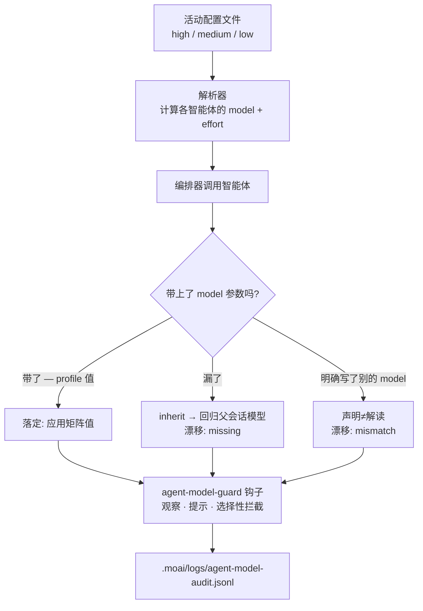

## 什么是模型策略？

模型策略是一套分配规则：把"所有事都用最贵的模型"换成"这件事用这个模型、用这个深度"。它把计划、审计这类思考繁重的工作与文档化、Git 流程这类轻量工作区分开，为每个智能体声明式地规定合适的模型与推理深度（effort）。这样既能把质量尽量拉高，又能避开速率限制错误——全部发生在 Claude Code 订阅计划之内。

这套规则是代币经济学（tokenomics，代币经济）的骨架。代币经济学指权衡质量与成本来分配代币的使用方式，而 MoAI-ADK 实现其中 **成本** 这一轴的手段，正是这套模型策略。


**一句话**： 选定一个策略（high/medium/low），该列的值就一次性定下当天 11 个智能体各自的模型与推理深度。挑模型的负担从十一处收敛到一处（选择策略）。


## 为什么不该执着于"最强模型"

乍看之下全用 Opus 最安全。但有两个问题。

第一，**决定账单的不是每代币单价，而是每个任务的步数**。多轮智能体会一步步推进到任务结束，步数一长，输出代币不断堆积，成本随之膨胀。深度推理模型一次能做完的事，浅层模型要返工好几遍——即使代币单价便宜，总成本反而更高。反过来，真正一次简单 pass 就能结束的工作，每次都用深度推理模型去跑，只是白白花钱。

第二，**同一个模型内部也能调节推理深度**。Opus 的 `low` effort 若比某一档的 Sonnet 得分更高、同时每任务成本更低，那么与其为省钱下调模型等级，不如在同一个模型里只调低推理深度——存在质量与成本双双占优的区间。模型策略要做的，正是找到这个区间并完成分配。

## 模型面板与推理深度

先把可选项摆清楚。模型策略就是在下面的阵容中挑选用哪个模型、以哪个推理深度来用的规则。

### 模型阵容（2026-08）

| 模型 | 标识符 | 上下文 | 特性 |
|------|--------|----------|------|
| Claude Fable 5 | `claude-fable-5` | 256K | 新 Mythos 级通用旗舰。最深的推理与复杂编码 |
| Claude Opus 5 / 4.8 | `opus` | 1M | 复杂架构、高难度推理 |
| Claude Sonnet 5 | `sonnet` | 200K | 速度与智能的平衡，日常编码 |
| Claude Haiku 4.5 | `claude-haiku-4-5-20251001` | 200K | 最快最省，简单 · 大批量任务 |

> MoAI 的模型策略并不使用这份阵容的全部。按 **No-Haiku 策略**，Haiku 不出现在智能体矩阵的任何位置，多轮智能体行全部由 Opus 承担。原因就在下一节。

### 推理深度（effort）

模型思考得多深，分五档选择。

| effort | 含义 |
|--------|------|
| `low` | 最浅的推理。快且便宜 |
| `medium` | 平衡。默认配置文件的基准点 |
| `high` | 深推理 |
| `xhigh` | 更深的推理（Opus 5 · 4.8 · Sonnet 5 · Opus 4.7 支持） |
| `max` | 最深的推理 |

> **`ultrathink` 关键字**： 输入 `ultrathink` 会同时开启 `effort:xhigh` 和 Adaptive Thinking（推理代币自动分配）。不使用固定的 `budget_tokens` —— 模型自行分配推理深度。也可以用 `/effort low|medium|high|xhigh|max|ultracode|auto` 斜杠命令切换。

## 三档配置文件

策略从三个值里选一个开始。选定后，整列随之激活。

| 配置文件 (profile) | CLI 标志 | 特性 |
|---------------|-----------|------|
| **high** | `--model-policy high` | 质量优先。调用频率最低的两行使用 `max` effort |
| **medium**（默认） | `--model-policy medium` | 质量与成本的平衡。成本/得分曲线的拐点 |
| **low** | `--model-policy low` | 每任务成本最低。智能体行降到 Opus `low` |


**名称对照**： `llm.yaml` 的 `profile` 字段、legacy `performance_tier` 别名与 CLI 标志 `--model-policy` 用的都是 `high`/`medium`/`low` 三个值，1:1 对应。默认值是 `medium`。旧顶层档位名 `max` 至今仍作为 `high` 的**只读别名**处理（让既有配置继续可读），但保存时始终写入 `high`。无需单独迁移。`performance_tier` 仅在 `profile` 缺失时读取。


> **调低策略并不等于换更弱的模型等级。** 在长周期智能体任务上，Opus 的 `low` effort 比任何 effort 的 Sonnet 得分都高，同时每任务成本更低。因此 `low` 策略是在 Opus *内部* 靠调低推理深度来省，只在多步完赛失败不构成问题的单发行上才用 Sonnet。

## 各智能体分配表

下面 33 个格子就是配置矩阵（11 个智能体 × 3 个配置文件）。每个格子是解析器在调用时注入的 `{model, effort}` 对。编排器主会话不是被调用的智能体，因此不在表中。

### Manager Agents（5 个）

| 智能体 | high | medium | low |
|---------|------|--------|-----|
| manager-spec | opus / high | opus / medium | opus / low |
| manager-develop | opus / max | opus / medium | opus / low |
| manager-docs | opus / medium | opus / low | sonnet / low |
| manager-git | sonnet / low | sonnet / low | sonnet / low |
| manager-design | opus / high | opus / medium | opus / low |

### Evaluator · Advisor · Builder · Specialist Agents（5 个）

| 智能体 | high | medium | low |
|---------|------|--------|-----|
| plan-auditor | opus / high | opus / medium | opus / low |
| sync-auditor | opus / high | opus / medium | opus / low |
| super-advisor | opus / max | opus / high | opus / medium |
| builder-harness | opus / high | opus / medium | opus / low |
| e2e-tester | opus / medium | opus / low | sonnet / low |

### Built-in Agent（1 个）

| 智能体 | high | medium | low |
|---------|------|--------|-----|
| Explore | sonnet / low | sonnet / low | sonnet / low |

> `Explore` 在磁盘上没有智能体文件，无法用 frontmatter 固定 effort。矩阵改为把 `sonnet / low` 记作调用时的默认值，这个值原样写进调用提示。Agent Teams 静态层（静态 role profile）已在 v3.0 退役，其位置由子智能体并行执行与动态工作流补上。`moai cg` 的 teammate 运行时（tmux pane）保留不变。

> **Haiku 移除**（v3.0）： 原先的 Haiku 槽位（文档化 · MX 标注 · Git 流程）换成了更低的推理深度，而非更低的模型等级。成本不是靠换模型、而是靠按档分配 effort 削减的。

## 分配原则

- **所有智能体行都用 Opus**： `manager-spec`、`manager-develop`、`plan-auditor`、`sync-auditor`、`manager-design`、`builder-harness`、`manager-docs`、`e2e-tester` 等多轮工作全部留在 Opus。因为 Opus 的 `low` 比任何 effort 的 Sonnet 得分高、每任务成本却更低。
- **Sonnet 只用于单发行**： `manager-git` 的机械性工作与 `Explore` 探索都是一次以输入为主的 pass 就结束，不存在多步完赛失败的问题，而在这些位置 Sonnet 更低的输入单价是决定性的。这两行在三个配置文件下都固定不变。
- **`max` 只在两格**： 仅 `high` 配置文件的 `manager-develop` 与 `super-advisor`。这是调用频率最低、且一次判断会大幅左右后续成本的两行。
- **`xhigh` 哪里都不用**： 在 Opus 上得分与 `high` 相同，成本却多 49%。
- **`low` 降的是 effort，不是模型等级**： 智能体行降到 Opus `low`，只有 `manager-docs` 与 `e2e-tester` 进一步退到 Sonnet。

制定计划的智能体不得审计自己的计划——`plan-auditor` 与 `sync-auditor` 因此与 `manager-spec` 分开分配。防偏差的力量不来自格子取值，而来自目录结构本身。

## 既定值如何传给智能体

到这里整理的是"这个智能体该用这个模型"的**意图**。但意图不等于执行。把矩阵定下的值落实到实际调用（spawn）的过程另有其事，而那正是**模型策略的强制点**。

### 解析器决定取值

每次调用一个智能体时，决定它使用哪个 `{model, effort}` 的决策器称为**解析器** (resolver)。解析器按固定优先级取第一个命中的值。

1. 若存在 `llm.agent_overrides[智能体名]`，该值优先。
2. 否则使用活动配置文件的智能体格（config 的 `llm.profiles`）。
3. config 中没有该格，则用 Go 默认矩阵的智能体格。
4. 矩阵之外的智能体（用户自行添加的）为 `inherit` —— 不注入模型，直接跟随父会话。

查看解析出的值，用只读命令 `moai model profile`。人读的表不带参数，机器读取加 `--json`。

```bash
moai model profile          # 人读的表
moai model profile --json   # 机器读取用 JSON
```

这条命令什么也不改 —— 只是把编排器调用智能体时会传入的值原样展示。

### model 与 effort 走不同的路

这里是关键。解析出的 **model** 与 **effort** 的消费路径不同。

- **model** —— 是编排器调用智能体时**每次给出的运行时参数**，以 `Agent(model: <alias>)` 形式传入。智能体文件的 frontmatter 保持 `model: inherit` 不动，初始化 · 更新 · 保存任何阶段都不碰这个值。
- **effort** —— 是智能体决定推理深度的依据，属于**文档化的意图**。调用智能体的工具在每次调用时不接收 effort 参数，所以 effort 只能经由 (a) 智能体文件的 effort 默认值、(b) GLM effort 覆盖层、(c) 工作流或提示层的 steering 生效。


**`model: inherit` 陷阱**： 几乎所有智能体文件的 frontmatter 默认都是 `model: inherit`。于是编排器调用智能体时一旦**漏掉** `model` 参数，就会悄悄回落到**父会话的模型**，而不是配置文件定下的模型。配置照常计算，却没有任何机制报告"没被应用"。实际观测中，带 model 参数的调用不足 1%。这一点引出下一节的漂移话题。




## 声明与解读不一致时（漂移）

矩阵定下的值（解读）与实际调用携带的值（声明）不同，就产生**漂移** (drift)。MoAI 挂了一个机械观察这道缝隙的 PreToolUse 钩子——**agent-model-guard**。每次调用发生时，这个钩子取出声明的 model，向解析器询问"这个智能体本该用什么模型"，然后给出四种判定 (verdict) 之一。

| 判定 | 含义 | 处理 |
|------|------|------|
| `ok` | 声明与解读一致 | 放行 |
| `missing` | 解读是具体别名，但调用里根本没有 model 参数 | 提示（不拦截）—— 最常见的情形 |
| `mismatch` | 调用声明的 model 与解读不同 | 提示 +（选择开启后）拦截 |
| `unmapped` | 保留目录之外的智能体（用户 harness 专家）—— 本就是 `inherit`，无从比较 | 放行 |

### 三档强度

钩子以三档运行，各自独立开关。

- **observe**（观察）—— 始终开启。每次调用留下一行 JSONL 记录，绝不拦截。
- **advise**（提示）—— 始终开启。`missing` 或 `mismatch` 时弹出非拦截的提示消息。
- **block**（拦截）—— 选择开启。只在打开 `workflow.agent_model_guard.enabled`（默认 `false`）后生效，且**只拒绝 `mismatch` 判定**。


**`missing` 不拦截。** 在带 model 参数的调用不足 1% 的现实里，连 `missing` 也拦的话，几乎全部调用都会被拒。所以即使打开闸门，`missing` 仍停留在提示。拦截只作用于"明确写了另一个模型"的 `mismatch`。


### 审计记录与 fail-open

观察记录逐行累积在 `<项目根>/.moai/logs/agent-model-audit.jsonl`。每行包含时间 · 会话 · 智能体 · 声明的 model · 解读的 model · 判定，绝不记录提示正文。用这份日志可以统计各智能体的漂移比例。

拦截只在有**确凿证据**时发出（fail-open 原则）。智能体标识符可解析、解读已映射、声明的 model 存在、且两者不同——只有这些齐备才拒绝。其余所有不确定状态（解析失败、无标识符、未映射、config 读取失败、项目根无法定位）一律放行。强制机制不该因为自己的 bug 把会话卡停。

> **effort 不在这个钩子的范围内。** 调用智能体的工具根本不暴露 effort 参数，调用时刻能观察到的只有 `model`。effort 是否落实，只能靠 frontmatter 与覆盖层把关。

## v3.1 的强化

目前的 agent-model-guard 停留在"观察常开、拦截可选"的阶段。最常见的 `missing` 判定只到提示为止，意图中的配置文件被悄悄忽略的缝隙仍然存在。v3.1 正在推进把这道强制收紧的工作（SPEC-AGENT-MODEL-ENFORCE-001，进行中）。

方向是减少调用时漏掉 model 参数这件事本身 —— 强化路由，让编排器把 `moai model profile --json` 告知的值逐次调用如实注入；观察记录累积起来后，把漂移比例可视化。但这个 SPEC 尚在进行中，不要读成"v3.1 起会自动拦截 `missing`"。当前拦截仍然只针对 `mismatch`、且需要选择开启。

## 再省成本的两个 lever

模型策略决定"用哪个模型"，旁边还有两个把成本再往下压的 lever。两者都从本页的 **成本** 视角点出，深入内容交给各自专页。

**提示缓存**通过前缀匹配（tools → system → messages 的顺序）复用先前请求的前段，降低输入成本。读约为基本输入的 0.1 倍，写为 1.25 倍，5 分钟没有请求（空闲 TTL）缓存即过期。因此闸门要提前绑、长会话要拆分才划算。顺带一提，这个 **成本** 视角的提示缓存，与[上下文/内存的提示缓存](/zh/claude-code/context-memory/prompt-caching/)讨论的"上下文保持"视角看的角度不同 —— 同一个机制，一个算账单，一个算会话连续性。

**`MOAI_AUTONOMY_TIER`** 定义各自主级别的成本与速度取舍。级别越高，越多工作无需人工介入推进，代币消耗也随之增大。级别定义详见[自主级别](/zh/advanced/autonomy-tier/)页面。

## 设置方法

### 项目初始化时

```bash
moai init my-project
# 交互式向导中包含模型策略选择
```

### 重置既有项目

```bash
moai update
# 交互式提示:
# - Reset model policy? (y/n) — 重置模型策略
# - Update GLM settings? (y/n) — 配置 GLM 环境变量
```

### 用 CLI 标志直接设置

```bash
moai init my-project --model-policy high    # 最高质量 (2 行使用 max effort)
moai init my-project --model-policy medium  # 平衡 (默认值)
moai init my-project --model-policy low     # 每任务成本最低
```

`--model-policy` 接受 `high`/`medium`/`low` 三个值，结果保存在 `llm.yaml`。旧顶层档位名 `max` 作为输入仍然接受，并归一化为 `high`。


默认策略是 `medium`（对应 llm.yaml `profile: "medium"` 与 CLI `--model-policy medium`，无值时按 `medium` 处理）。GLM 配置单独放在 `settings.local.json`，不会提交进 Git。只想覆盖单个智能体时，在 `llm.agent_overrides` 里以智能体名为键写值 —— 写入会用模型 enum 与智能体目录校验，未知名字会被拒绝。


## 下一步

- [配置矩阵](/zh/advanced/profile-matrix/) —— 33 个格子的推导依据（基准测试）与解析器优先级细节
- [CG 模式](/zh/multi-llm/cg-mode) —— Claude 领队 + GLM 工作者的混合省钱方式
- [自主级别](/zh/advanced/autonomy-tier/) —— `MOAI_AUTONOMY_TIER` 的成本 · 速度取舍
- [CLI 参考](/zh/getting-started/cli) —— `moai init`、`moai update`、`moai model profile` 详解
