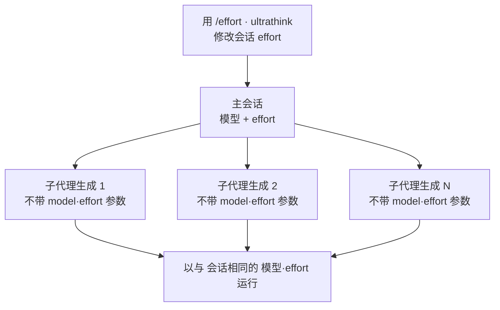

## 什么是模型策略？

模型策略把"所有事都用最贵的模型"换成"这个会话用这个模型、这么深的推理"。从 v3.2 起，MoAI-ADK 的模型和推理深度（effort）以**会话**为单位决定。主会话以哪个模型、哪个推理深度运行，子代理就沿用同样的模型和推理深度。曾经按智能体逐一分配模型的配置矩阵方式已经退役。

这个选择是代币经济学（tokenomics）的骨架。代币经济学指的是对照质量与成本来分配代币的用法，MoAI-ADK 真正落实其中**成本**一侧的手段正是这个模型策略。


**一句话：** 主会话的模型与推理深度，就是所有子代理的模型与推理深度。不再需要按智能体挑选模型，要选的只是会话这一个模型和 effort。


## 为什么不该坚持"最强的模型"

乍一看，全程只用 Opus 似乎最安全。但有两件事横在中间。

第一，**划开账单的不是 token 单价，而是每个任务花的步数**。多轮智能体会一直走到任务结束为止，步数拉长，输出 token 堆积，成本随之膨胀。深度推理模型一次完成的事，浅推理模型反复做几遍，即便单价便宜，总成本反而更高。反过来，真正一次就能走完的简单任务也每次都用深度推理模型跑，就纯属浪费。

第二，**同一个模型内部也可以调节推理深度**。Opus 的 `low` effort 得分高于某些档位的 Sonnet，但每任务成本更低。也就是说，与其为了省钱换到更弱的模型档，不如在同一个模型内只调低推理深度，这在质量和成本上都存在更划算的区间。模型策略要找的正是这个区间。

这一原则的依据和实测数据整理在[三层智能体架构](/zh/advanced/no-haiku-3tier/)页面。

## 模型清单与推理深度

先确认选项。模型策略就是从下面的清单里选哪个模型、以哪个推理深度运行会话的规则。

### 模型清单 (2026-09)

| 模型 | 标识符 | 上下文 | 特点 |
|------|--------|----------|------|
| Claude Fable 5 | `claude-fable-5` | 1M | 新的 Mythos 级通用旗舰。最深的推理与复杂编码 |
| Claude Opus 5.5 | `opus` | 1M | 复杂架构、高难度推理 |
| Claude Sonnet 5.5 | `sonnet` | 1M | 速度与智能的平衡，日常编码 |
| Claude Haiku 4.5 | `claude-haiku-4-5-20251001` | 200K | 最快最经济，简单·批量任务 |

> MoAI 的会话清单默认不使用 Haiku。把 Haiku 塞进长周期智能体任务反而抬高每任务成本 —— 这一点已由 DeepSWE 排行榜实测确认，即 **No-Haiku 策略**。依据见[三层智能体架构](/zh/advanced/no-haiku-3tier/)页面。


**迁移到 Sonnet 5.5**：如果你在关闭 thinking 的状态下使用 Sonnet，升级前请先把 thinking 设置改为
`between_tools` —— 在 Sonnet 5.5 上，前置 thinking 仍然是关闭的。


### 推理深度 (effort)

模型思考多深，分五档选择。

| effort | 含义 |
|--------|------|
| `low` | 最浅推理。快且便宜 |
| `medium` | 平衡。会话默认值的基准点 |
| `high` | 深推理 |
| `xhigh` | 更深推理（Opus 5.5 · Opus 5 · 4.8 · Sonnet 5.5 · Opus 4.7 支持） |
| `max` | 最深推理 |

> **默认 effort**：Opus 5.5 默认 `medium`，其他支持 effort 的模型大多默认 `high`。
> `opus` 别名解析到 Opus 5.5 需要 Claude Code v2.1.280 以上。

> **`ultrathink` 关键词**：输入 `ultrathink` 会同时开启 `effort:xhigh` 与 Adaptive Thinking（自动分配推理 token）。不使用固定的 `budget_tokens` —— 模型自行分配推理深度。也可以用 `/effort low|medium|high|xhigh|max|ultracode|auto` 斜杠命令修改。这个调节以**会话**为单位 —— 改了会话 effort，这个会话里运行的子代理全部跟着走。

## 子代理跟随会话

MoAI-ADK v3.2 的模型·effort 规则可以浓缩成一句话。

> 子代理沿用主会话的模型与推理深度 —— 生成子代理时不传 `model` 也不传 `effort`，MoAI 智能体定义对两者都不作声明。

由此得到的实际面貌有三点。

- **智能体定义不声明 model 也不声明 effort。** `.claude/agents/moai/` 下智能体文件的 frontmatter 两者都不写。曾经随文件分发的 `model: inherit` 字段和 effort 默认值已退役。
- **调用时也不传。** 编排器生成子代理时，不带 model、effort 参数才是正常形态。调用时点名 model 是配置矩阵时代的做法，现在不再如此。
- **会话就是答案。** 会话以 `opus / high` 运行，这个会话的所有子代理就以 `opus / high` 运行。用 `/effort` 斜杠命令或 `ultrathink` 关键词改了会话 effort，之后的全部子代理调用都跟随新的深度。


```mermaid
flowchart TD
    S["主会话<br/>模型 + effort"] --> W1["子代理生成 1<br/>不带 model·effort 参数"]
    S --> W2["子代理生成 2<br/>不带 model·effort 参数"]
    S --> W3["子代理生成 N<br/>不带 model·effort 参数"]
    W1 --> I["以与 会话相同的 模型·effort 运行"]
    W2 --> I
    W3 --> I
    E["用 /effort · ultrathink<br/>修改会话 effort"] --> S
```

逐会话切换模型是 Claude Code 自身的模型选择（`/model` 等）的职责，MoAI 不碰会话模型。

## 会话模型策略做什么

`moai profile setup` 向导中的**会话模型策略**问题决定的不是模型，而是 **effort 回退**。以这个配置文件启动的 Claude 会话开始时若没有单独选择推理强度，这里选的值就成为会话的默认推理强度。`high` / `medium` / `low` 三个值原样映射到 effort 词汇；不设值时保持 Claude Code 的默认启动行为，不加任何覆盖。


**名称整理**：过去 `llm.yaml` 的 `profile` 字段、`performance_tier` 别名、`moai init --model-policy` 旗标负责挑选逐智能体分配表的列。如今那个位置上只剩会话 effort 回退这一件事。旧旗标为了脚本兼容仍然接受值，但没有任何效果，执行时会打印指向 `moai profile setup` 的弃用警告。


### GLM 后端的 reasoning 上限

GLM 后端（切换到 `moai glm`）下，会话的 effort 不能直接使用 Claude 的五档词汇。GLM-5.3 **始终推理** —— 关闭 reasoning 不受支持，请求关闭的调用会失败。可调节的轴只有三档 `reasoning_effort`（low / high / max），Claude 的 effort 收敛到它上面。

| Claude effort | GLM reasoning_effort |
|--------------|---------------------|
| `low` | `low` |
| `medium` | `max` |
| `high` | `max` |
| `xhigh` | `max` |
| `max` | `max` |
| （无法识别的值） | `max` —— 完整性条款：绝不让推理不足 |

也就是说**上限是 `max`**。`low` 以上的所有 Claude effort 收敛为 reasoning-max，无法识别的值也落入 reasoning-max，没有显式覆盖的 GLM 会话默认以 reasoning-max 运行。reasoning-high 仍是有效的 wire 值，但没有任何 Claude effort 收敛到那里。实现类智能体 `manager-develop` 不论收敛结果如何都被强制为 reasoning-max（z.ai 的"编码任务用 reasoning max"建议）。

这个映射的原典是代码而非文档 —— 运行时的单一来源是 `internal/template/glm_effort_overlay.go`。

## 逐智能体分配后来怎样了（历史）

到 v3.1 为止，MoAI-ADK 用**配置矩阵**给每个智能体分配 `{model, effort}`。13 个智能体 × 3 个配置 = 39 格的表格由活动配置选出一列，解析器在调用时注入该值，还能用 `moai model profile` 命令查看解析结果。

整套装置在 SPEC-AGENT-MODEL-INHERIT-001 中退役了。契机是实测：带 model 参数的调用不足 1%，而矩阵却在持续制造"算出来了但谁也没应用上"的漂移，而且没有任何机制会报告这一点。分配的单一来源换成了会话本身，访问器、解析器、漂移强制一并清理。当年矩阵的布置依据（支出给做判断的行、智能体行用 Opus、No-Haiku）作为会话级模型选择的判断标准，仍然保留在[三层智能体架构](/zh/advanced/no-haiku-3tier/)与[配置矩阵](/zh/advanced/profile-matrix/)页面。

调用时 model 参数的观测记录（`.moai/logs/agent-model-audit.jsonl`）仍然保留。在继承成为默认之后，这份记录的职责是盯住"声明的 model 是否与会话值不同"，拦截需要选择开启。平时是可以不用管的观测层。

## 进一步省钱的两个杠杆

模型策略决定"会话用哪个模型、多深"，旁边还有两个降成本的杠杆。两者都只从本页的**成本**视角点一下，深度留给各自的专页。

**提示缓存**通过前缀匹配（tools → system → messages 顺序）复用之前请求的前半部分，降低输入成本。读取约为基本输入的 0.1 倍，写入是 1.25 倍，5 分钟没有请求（空闲 TTL）缓存就过期。所以用户门要捆在靠前的位置，长会话拆开更划算。顺带说明，这个**成本**视角的提示缓存与[上下文/记忆的提示缓存](/zh/claude-code/context-memory/prompt-caching/)处理的"上下文保持"视角切入角度不同 —— 同一个机制，一个盯着账单，一个盯着会话连续性。

**`MOAI_AUTONOMY_TIER`** 按自主性层级决定成本与速度的取舍。层级越高，越多工作无需人工介入即可推进，token 消耗也越大。层级定义见[自主性层级](/zh/advanced/autonomy-tier/)页面。

## 配置方法

### 在配置向导中决定

```bash
moai profile setup
# 在会话模型策略问题中选择会话默认的 effort 回退
```

会话模型策略决定以这个配置文件启动的 Claude 会话的默认推理强度。子代理沿用那个会话的模型与推理深度。

### 关于 CLI 旗标

过去使用的 `moai init --model-policy`、`--profile`、`--high`、`--medium-alias`、`--low` 旗标是**已弃用的桩（stub）**。为了脚本兼容仍然接受值，但没有任何效果，执行时会打印指向 `moai profile setup` 的警告。新的配置请走向导。


GLM 设置单独放在 `settings.local.json` 中，不会提交进 Git。要随时改会话的模型与 effort，请使用 Claude Code 的 `/model`、`/effort`。


## 下一步

- [配置矩阵](/zh/advanced/profile-matrix/) —— 矩阵退役后的位置与继承规则的详情
- [三层智能体架构](/zh/advanced/no-haiku-3tier/) —— DeepSWE 实测依据与 No-Haiku 策略
- [CG 停用与配置迁移](/zh/multi-llm/cg-mode/)
- [CLI 参考](/zh/getting-started/cli) —— `moai profile setup`、`moai init` 详解
