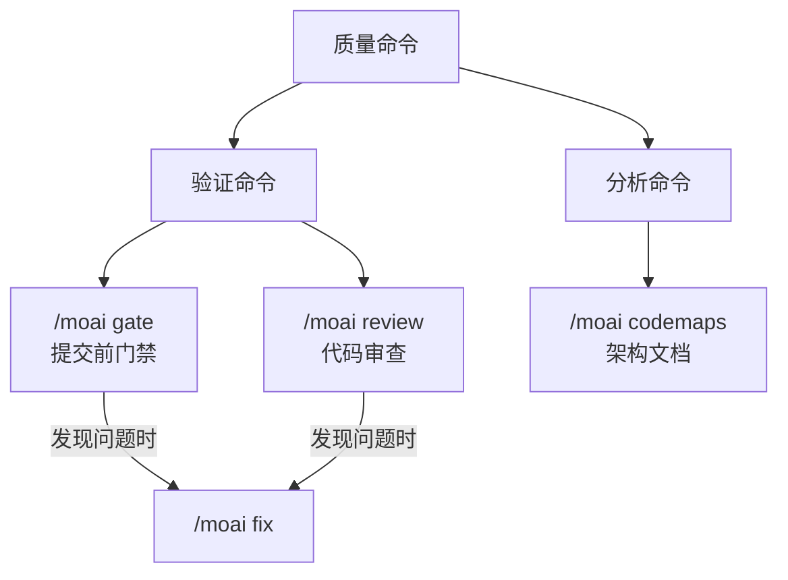

验证代码质量并将架构文档化的命令集合。


质量命令是专注于 **提交前门禁、多视角代码审查、架构分析** 的命令。它是在日常工作流中执行 TRUST 5 质量框架的界面。


## 质量门禁也是挽具的一部分

v3 的智能体挽具指的是"让智能体高效工作的环境",而质量门禁正是这一环境的核心部件。因为它是用 lint·测试·审查这些 **证据** 来判定智能体产出的装置,而不是"看起来做完了"。验证深度也根据任务大小来选择 — 提交前用 30 秒内完成的 `/moai gate`,PR 前用 4 种视角的 `/moai review`。不每次都运转最重的检查,这就是令牌经济学。

## 命令对比

| 命令 | 目的 | 执行方式 | 使用时机 |
|--------|------|-----------|-----------|
| `/moai gate` | 提交前质量门禁 | lint + format + type-check + test 并行执行 (<30 秒) | 每次 commit 之前 |
| `/moai review` | 代码审查 | 安全/性能/质量/UX 4 种视角分析 | PR 前需要代码审查时 |
| `/moai codemaps` | 架构文档 | 分析并文档化代码库结构 | 想掌握项目架构时 |

## 命令关系图

```mermaid
flowchart TD
    A[质量命令] --> B[验证命令]
    A --> C[分析命令]

    B --> G["/moai gate<br/>提交前门禁"]
    B --> D["/moai review<br/>代码审查"]
    C --> E["/moai codemaps<br/>架构文档"]

    G -->|发现问题时| H["/moai fix"]
    D -->|发现问题时| H
```


**不知道该用哪条命令?**

- 想在提交前快速运转一遍安全网 → `/moai gate`
- 想全面检查代码质量 → `/moai review`
- 想理解并文档化项目结构 → `/moai codemaps`

