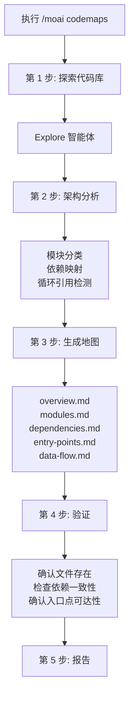
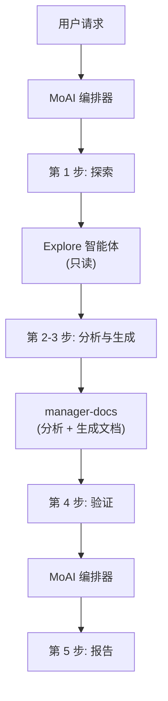

扫描代码库并自动生成 **架构文档** 的命令。


**一句话总结**: `/moai codemaps` 是"架构地图绘制师"。分析代码库并 **自动生成结构文档**,包括模块地图、依赖图、入口点目录等。



**斜杠命令**: 在 Claude Code 中输入 `/moai:codemaps` 即可直接执行此命令。仅输入 `/moai` 会显示所有可用子命令列表。


## 概述

加入新项目或掌握大规模代码库时,理解架构最为重要。`/moai codemaps` 自动分析代码库,生成模块地图、依赖图、入口点目录、数据流文档。

生成的文档保存在 `.moai/project/codemaps/` 目录中,帮助人与 AI 智能体都能快速理解代码库。用挽具工程术语来说,这是 **上下文地图** — 智能体无需每个会话重新发现架构,而是随时可参照的基于文件的地图。用 1 次文档生成替代重复探索成本,令牌节省效果也很显著。

## 使用方法

```bash
# 生成整个代码库的架构文档
> /moai codemaps

# 忽略既有文档并重新生成
> /moai codemaps --force

# 仅分析特定领域
> /moai codemaps --area api

# 包含 Mermaid 图表
> /moai codemaps --format mermaid

# 限制探索深度
> /moai codemaps --depth 3
```

## 支持的标志

| 标志 | 说明 | 示例 |
|-------|------|------|
| `--force`(或 `--regenerate`) | 忽略既有文档,重新生成所有代码地图 | `/moai codemaps --force` |
| `--area AREA` | 聚焦分析特定领域 | `/moai codemaps --area auth` |
| `--format FORMAT` | 输出格式 (markdown, mermaid, json, 默认: markdown) | `/moai codemaps --format mermaid` |
| `--depth N` | 最大目录探索深度(默认: 4) | `/moai codemaps --depth 3` |

### --force 标志

删除所有既有代码地图文档并从头重新生成:

```bash
> /moai codemaps --force
```

在代码库发生重大变化时非常有用。

### --area 标志

仅分析特定领域及其依赖:

```bash
# 仅分析 API 模块
> /moai codemaps --area api

# 仅分析认证模块
> /moai codemaps --area auth
```

结果保存在 `.moai/project/codemaps/{area}/` 中。

### --format 标志

指定输出格式:

```bash
# 包含 Mermaid 图表
> /moai codemaps --format mermaid

# 额外生成 JSON 格式
> /moai codemaps --format json
```

## 执行过程

`/moai codemaps` 分 5 步执行。



### 第 1 步: 探索代码库

`Explore` 智能体深入探索代码库:

| 探索对象 | 说明 |
|-----------|------|
| 目录结构 | 映射顶层与重要子目录 |
| 模块边界 | 识别包/模块边界与职责 |
| 入口点 | 探索主入口点(main.go, index.ts, app.py 等) |
| 公开 API | 列出导出的函数、类型、接口 |
| 依赖图 | 映射模块间依赖 (import, require) |
| 外部依赖 | 第三方依赖目录 |
| 配置文件 | 识别构建、部署、配置文件 |

### 第 2 步: 架构分析

`manager-docs` 智能体分析探索结果:

- 按层分类模块(表现、业务、数据、基础设施)
- 识别高 fan-in 模块(`@MX:ANCHOR` 候选)
- 检测循环依赖
- 映射请求/数据流路径
- 识别领域边界
- 识别架构模式(MVC、Clean、Hexagonal 等)

### 第 3 步: 生成地图

在 `.moai/project/codemaps/` 目录中生成 5 种文档:

| 文件 | 内容 |
|------|------|
| `overview.md` | 高层架构摘要与模块说明 |
| `modules.md` | 详细模块目录(职责、依赖) |
| `dependencies.md` | 依赖图(文本与 Mermaid 图表) |
| `entry-points.md` | 入口点目录与调用路径 |
| `data-flow.md` | 主要数据流路径 |

使用 `--area` 标志时:
- `.moai/project/codemaps/{area}/overview.md`
- `.moai/project/codemaps/{area}/modules.md`
- `.moai/project/codemaps/{area}/dependencies.md`

### 第 4 步: 验证

- 确认所有被引用的文件与模块实际存在
- 检查依赖关系的双向一致性
- 验证入口点的可达性
- 与既有代码地图对比变更(非 `--force` 时)

这一步机械地确认生成的地图与实际代码一致 — 文档也不是"生成了"就算完,而是要经过验证才判定为完成。

### 第 5 步: 报告

```
## 代码地图生成报告

### 生成的文件
- .moai/project/codemaps/overview.md
- .moai/project/codemaps/modules.md
- .moai/project/codemaps/dependencies.md
- .moai/project/codemaps/entry-points.md
- .moai/project/codemaps/data-flow.md

### 架构亮点
- 模式: Clean Architecture
- 模块数: 12 个
- 入口点: 3 个(API 服务器、CLI、Worker)

### 潜在问题
- 循环依赖: pkg/auth <-> pkg/user
- 高耦合度: pkg/core (fan_in: 8)
- 孤立模块: pkg/legacy(无使用处)
```

## 智能体委派链



**智能体角色:**

| 智能体 | 角色 | 主要工作 |
|----------|------|----------|
| **MoAI 编排器** | 协调工作流、验证、报告 | 解析标志、验证、用户交互 |
| **Explore** | 探索代码库(只读) | 目录结构、模块边界、依赖映射 |
| **manager-docs** | 架构分析与生成文档 | 模块分类、依赖分析、撰写代码地图文件 |

## 常见问题

### Q: 代码地图应该多久重新生成一次?

建议在大规模重构或添加新模块后重新生成。执行 `/moai sync` 时,代码地图也会自动更新。

### Q: 用 --area 标志生成的代码地图会和整体代码地图冲突吗?

不会。用 `--area` 生成的代码地图保存在单独的子目录中。与整体代码地图独立管理。

### Q: 可以直接修改生成的代码地图吗?

可以手动修改。但用 `--force` 标志重新生成时,手动修改会被覆盖。不带 `--force` 执行时,会参照既有文档进行增量更新。

### Q: 能识别哪些架构模式?

可识别 MVC、Clean Architecture、Hexagonal、Layered Architecture 等主要模式。识别出的模式记录在 `overview.md` 中。

## 相关文档

- [/moai review - 代码审查](/quality-commands/moai-review)
- [/moai mx - @MX 标签扫描](/utility-commands/moai-mx)
