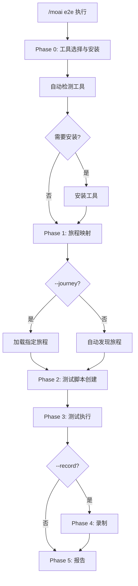
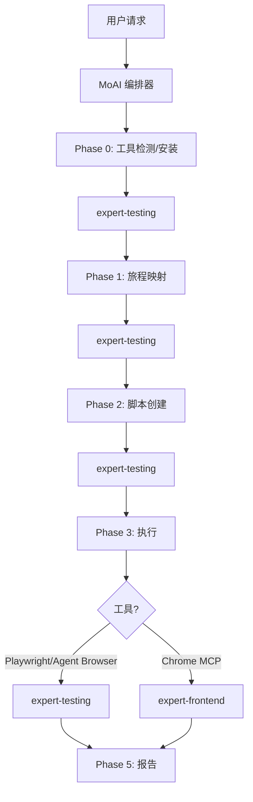

# /moai e2e

使用浏览器自动化工具创建和运行 **E2E (端到端) 测试** 的命令。


**一句话总结**: `/moai e2e` 是 "用户旅程测试员"。从 **3种浏览器工具** 中选择最优工具，自动测试用户流程。



**斜杠命令**: 在 Claude Code 中输入 `/moai:e2e` 可以直接运行此命令。仅输入 `/moai` 即可查看所有可用子命令列表。


## 概述

E2E 测试从实际用户的角度验证应用程序是否正确运行。`/moai e2e` 支持3种浏览器自动化工具，并根据项目环境自动选择最佳工具。

自动发现用户旅程、生成测试脚本、执行并报告结果。GIF 录制功能支持视觉验证。

## 用法

```bash
# 自动选择工具运行 E2E 测试
> /moai e2e

# 指定 Playwright
> /moai e2e --tool playwright

# 包含 GIF 录制
> /moai e2e --record

# 指定目标 URL
> /moai e2e --url http://localhost:3000

# 仅运行特定用户旅程
> /moai e2e --journey login

# 禁用无头模式 (用于调试)
> /moai e2e --headless false
```

## 支持的标志

| 标志 | 描述 | 示例 |
|------|------|------|
| `--tool TOOL` | 强制选择浏览器工具 (agent-browser, playwright, chrome-mcp) | `/moai e2e --tool playwright` |
| `--record` | 将浏览器交互录制为 GIF | `/moai e2e --record` |
| `--url URL` | 测试目标 URL (默认: 从项目配置自动检测) | `/moai e2e --url http://localhost:3000` |
| `--journey NAME` | 仅运行指定的用户旅程 | `/moai e2e --journey login` |
| `--headless` | 无头模式 (默认: true) | `/moai e2e --headless false` |
| `--browser BROWSER` | Playwright 浏览器选择 (chromium, firefox, webkit) | `/moai e2e --browser firefox` |
| `--timeout N` | 测试超时时间 (秒, 默认: 30) | `/moai e2e --timeout 60` |
| `--retry N` | 失败测试重试次数 (默认: 1) | `/moai e2e --retry 3` |

## 浏览器自动化工具

### 工具比较

| 功能 | Agent Browser | Playwright CLI | Claude in Chrome |
|------|--------------|----------------|------------------|
| **令牌成本** | 低 (CLI 输出) | 低 (CLI 输出) | 高 (MCP 往返) |
| **安装** | npm install | npx playwright install | 需要 Chrome 扩展 |
| **无头模式** | 支持 | 支持 | 不支持 (需要 Chrome) |
| **跨浏览器** | 仅 Chromium | Chromium, Firefox, WebKit | 仅 Chrome |
| **GIF 录制** | Playwright trace | Playwright trace | MCP GIF creator |
| **AI 导航** | 内置 AI 代理 | 脚本驱动 | MCP 工具驱动 |
| **适合场景** | AI 探索测试 | 确定性测试套件 | 交互式调试 |
| **CI/CD** | 支持 | 支持 | 不支持 |

### 自动选择逻辑

未指定 `--tool` 标志时，根据任务特征自动选择最佳工具:

| 条件 | 选择的工具 | 原因 |
|------|-----------|------|
| 使用 `--record` 标志 | Claude in Chrome | 最佳 GIF 录制功能 |
| 检测到 CI/CD 环境 | Playwright CLI | 最稳定的无头支持 |
| 旅程需要 AI 探索 | Agent Browser | 内置 AI 导航 |
| 需要确定性测试 | Playwright CLI | 最稳定，跨浏览器 |
| 交互式调试 | Claude in Chrome | 实时视觉反馈 |
| 默认 | Playwright CLI | 功能与令牌效率的最佳平衡 |

## 执行过程

`/moai e2e` 分5个阶段 (+安装阶段) 执行。



### Phase 0: 工具选择与安装

并行检查3种工具的安装状态:

```bash
# 自动检测命令 (并行执行)
npx agent-browser --version     # Agent Browser
npx playwright --version         # Playwright
# 检查 Chrome MCP 工具可用性    # Claude in Chrome
```

需要安装时:

| 工具 | 安装命令 |
|------|---------|
| **Playwright** | `npx playwright install --with-deps chromium` |
| **Agent Browser** | `npm install -g agent-browser` |
| **Claude in Chrome** | Chrome 扩展安装 (无法自动安装) |

### Phase 1: 旅程映射

无 `--journey` 标志时，分析应用程序自动发现关键用户旅程:

- 分析项目文档 (`.moai/project/product.md`)
- 分析路由定义 (`routes.ts`, `urls.py`, `router.go`)
- 识别表单元素、认证流程、CRUD 操作
- 映射关键用户路径 (登录、主要功能、错误处理)

### Phase 2: 测试脚本创建

生成匹配所选工具的测试文件:

| 工具 | 测试文件格式 | 位置 |
|------|-------------|------|
| **Playwright** | `{journey-name}.spec.ts` | `e2e/` |
| **Agent Browser** | `{journey-name}.agent.ts` | `e2e/` |
| **Claude in Chrome** | 结构化 MCP 提示 | 内存中 |

Playwright 测试包含:
- Page Object Model 模式
- 逐步断言
- 截图捕获
- 网络响应验证
- 无障碍检查 (`@axe-core/playwright`)

### Phase 3: 测试执行

| 工具 | 执行方式 |
|------|---------|
| **Playwright** | `npx playwright test e2e/` (CLI, 令牌高效) |
| **Agent Browser** | `npx agent-browser --task "..."` (CLI, AI 导航) |
| **Claude in Chrome** | MCP 工具调用 (实时, 高令牌成本) |

### Phase 4: 录制 (可选)

使用 `--record` 标志时:

| 工具 | 录制方式 | 输出 |
|------|---------|------|
| **Playwright** | `npx playwright test --trace on` | `e2e/traces/` |
| **Agent Browser** | `npx agent-browser --task "..." --trace` | `e2e/recordings/` |
| **Claude in Chrome** | `mcp__claude-in-chrome__gif_creator` | `e2e/recordings/{journey}.gif` |

### Phase 5: 报告

```
## E2E 测试报告

### 使用的工具: Playwright CLI

### 结果摘要
| 旅程 | 状态 | 耗时 | 截图 |
|------|------|------|------|
| 登录 | PASS | 2.3秒 | 3张 |
| 结账 | FAIL | 5.1秒 | 4张 |

### 失败详情
- 结账 (步骤4): 期望重定向到 /confirmation，实际到 /error
  - 截图: e2e/screenshots/checkout-step4.png
  - 错误: TimeoutError: 超过 30000ms 超时

### 录制 (使用 --record 时)
- e2e/recordings/login_flow.gif
- e2e/recordings/checkout_process.gif

### 覆盖
- 已测试用户旅程: 5/7
- 已覆盖关键路径: 3/3
- 已测试错误场景: 2/4
```

## 代理委托链



**代理角色:**

| 代理 | 角色 | 主要工作 |
|------|------|----------|
| **MoAI 编排器** | 工作流协调, 用户交互 | 报告输出, 下一步指引 |
| **expert-testing** | 工具检测、旅程映射、脚本创建、执行 | 完整 E2E 测试管道 |
| **expert-frontend** | Chrome MCP 执行 (仅 Chrome 模式) | 浏览器自动化、GIF 录制 |

## 常见问题

### Q: 应该选择哪个工具？

大多数情况下 **Playwright CLI** 是最佳选择。提供 CI/CD 支持、跨浏览器测试和低令牌成本。需要 AI 探索用 Agent Browser，需要视觉调试用 Claude in Chrome。

### Q: 可以在 CI/CD 管道中使用吗？

Playwright CLI 和 Agent Browser 支持 CI/CD。Claude in Chrome 需要真实的 Chrome 浏览器，无法在 CI/CD 中使用。

### Q: GIF 录制的令牌成本是多少？

Playwright/Agent Browser 使用 CLI trace，无额外令牌成本。Claude in Chrome 的 GIF 录制因 MCP 往返而令牌成本较高。

### Q: 如果已有 E2E 测试怎么办？

会检测现有测试，并按现有模式添加新测试。不会覆盖现有测试。

## 相关文档

- [/moai coverage - 覆盖率分析](/quality-commands/moai-coverage)
- [/moai review - 代码审查](/quality-commands/moai-review)
- [/moai fix - 一键自动修复](/utility-commands/moai-fix)
