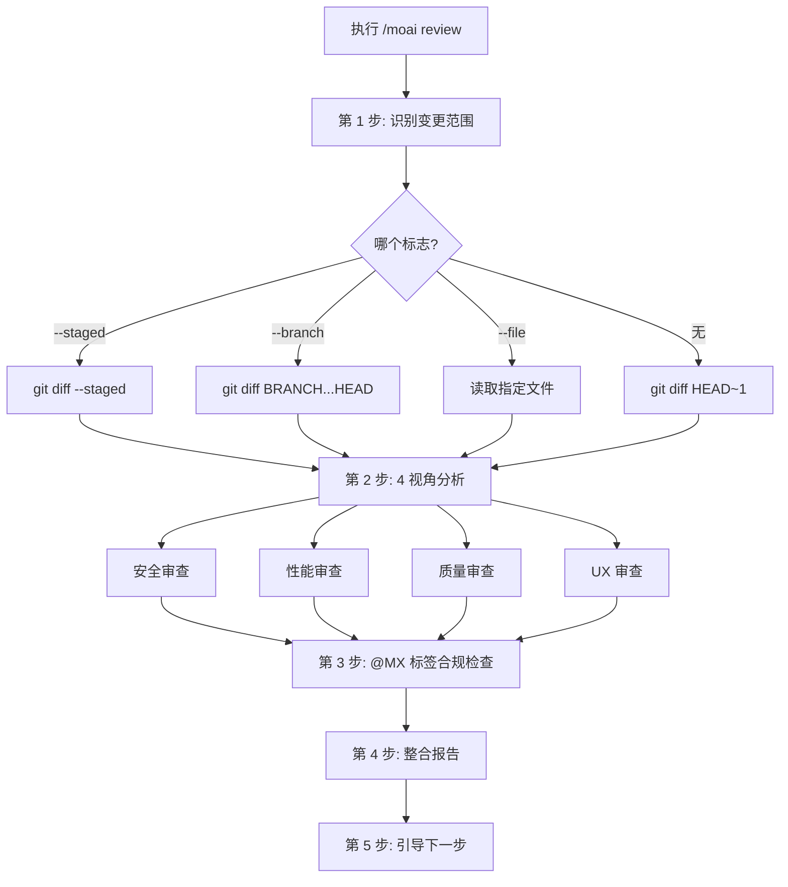
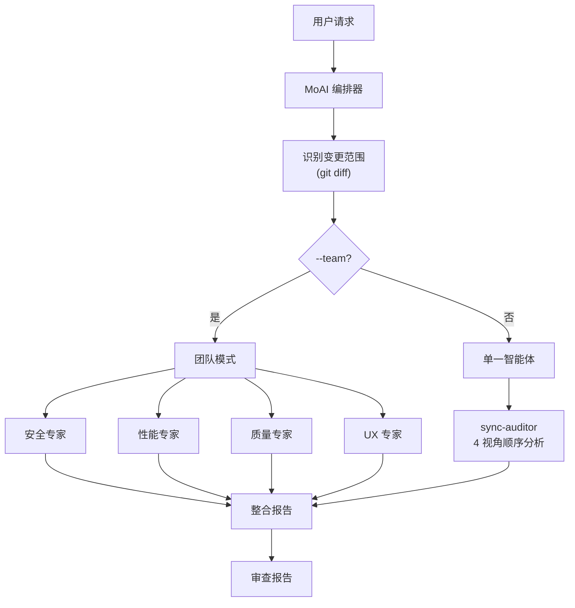

从 **安全、性能、质量、UX** 4 种视角分析代码库的代码审查命令。


**一句话总结**: `/moai review` 是"AI 代码审查员"。从 OWASP 安全检查到性能分析、TRUST 5 质量验证、UX 可访问性,**以 4 种视角同时审查**。



**斜杠命令**: 在 Claude Code 中输入 `/moai:review` 即可直接执行此命令。仅输入 `/moai` 会显示所有可用子命令列表。


## 概述

代码审查是软件质量的核心。但要把安全、性能、质量、UX 都仔细检查一遍并不容易。`/moai review` 让 AI 从 4 种视角系统地分析代码,并生成按严重程度整理的审查报告。

审查的默认负责者是 **sync-auditor** — 一个独立评估者,而不是编写代码的智能体。创建者不自行检查这一挽具原则同样适用于审查命令。它还会一并检查 @MX 标签合规情况,帮助 AI 智能体更好地理解代码。

## 使用方法

```bash
# 审查最近一次提交的变更
> /moai review

# 仅审查已暂存的变更
> /moai review --staged

# 与特定分支对比审查
> /moai review --branch develop

# 聚焦安全的审查
> /moai review --security

# 仅审查特定文件
> /moai review --file src/auth/service.py
```

## 支持的标志

| 标志 | 说明 | 示例 |
|-------|------|------|
| `--staged` | 仅审查已暂存 (git add) 的变更 | `/moai review --staged` |
| `--branch BRANCH` | 与指定分支对比审查(默认: main) | `/moai review --branch develop` |
| `--security` | 聚焦安全审查(OWASP、注入、认证) | `/moai review --security` |
| `--file PATH` | 仅审查特定文件 | `/moai review --file src/auth/` |
| `--team` | 智能体团队模式(4 名专业审查员并行分析) | `/moai review --team` |

### --staged 标志

仅审查用 `git add` 暂存的变更。适合提交前的最终检查:

```bash
> git add src/auth/
> /moai review --staged
```

### --security 标志

聚焦安全视角进行更深入的分析:

```bash
> /moai review --security
```

深度分析 OWASP Top 10、注入风险、认证/授权逻辑、机密泄露等。

### --team 标志

4 名专业审查智能体同时分析:

```bash
> /moai review --team
```

安全、性能、质量、UX 专家各自独立审查,因此可以获得更深入的分析。相应地令牌消耗也更大(约 4 倍),对安全·支付等重要性高的变更选择性使用才是经济的做法。

## 执行过程

`/moai review` 分 5 步执行。



### 第 1 步: 识别变更范围

根据标志决定审查对象:

| 条件 | 使用的命令 |
|------|----------------|
| `--staged` | `git diff --staged` |
| `--branch BRANCH` | `git diff {BRANCH}...HEAD` |
| `--file PATH` | 直接读取指定文件 |
| 无标志 | `git diff HEAD~1` |

只把变更范围而非整个代码库列为审查对象,这也是为令牌效率而做的设计。

### 第 2 步: 4 视角分析

从 4 种专业视角分析代码:

#### 视角 1: 安全审查

| 检查项目 | 说明 |
|-----------|------|
| OWASP Top 10 合规 | 检查主要 Web 安全漏洞 |
| 输入验证与净化 | 用户输入处理安全性 |
| 认证/授权逻辑 | 验证访问控制实现 |
| 机密泄露 | API 密钥、密码、令牌是否泄露 |
| 注入风险 | SQL、命令、XSS、CSRF 风险 |
| 依赖漏洞 | 第三方库漏洞 |

#### 视角 2: 性能审查

| 检查项目 | 说明 |
|-----------|------|
| 算法复杂度 | O(n) 分析 |
| 数据库查询效率 | N+1 查询、缺失索引 |
| 内存使用模式 | 内存泄漏、过度分配 |
| 缓存机会 | 识别可应用缓存的部分 |
| 打包体积 | 前端变更对打包体积的影响 |
| 并发安全性 | 竞态条件、死锁 |

#### 视角 3: 质量审查

| 检查项目 | 说明 |
|-----------|------|
| TRUST 5 合规 | Tested, Readable, Unified, Secured, Trackable |
| 命名规则 | 代码可读性 |
| 错误处理 | 错误处理完整性 |
| 测试覆盖率 | 变更代码是否有测试 |
| 文档化 | 公开 API 是否有文档 |
| 项目模式一致性 | 遵守既有代码库模式 |

#### 视角 4: UX 审查

| 检查项目 | 说明 |
|-----------|------|
| 用户流程 | 既有流程是否被破坏 |
| 错误状态 | 用户视角的错误与边界情况 |
| 可访问性 | WCAG、ARIA 合规 |
| 加载状态 | 加载指示与反馈 |
| 破坏性变更 | 公开接口兼容性 |

### 第 3 步: @MX 标签合规检查

检查变更文件的 @MX 标签合规情况:

- 新的 exported 函数: 需要 `@MX:NOTE` 或 `@MX:ANCHOR`
- 高 fan_in 函数(>=3 处调用): 必须有 `@MX:ANCHOR`
- 危险模式: 需要 `@MX:WARN`
- 无测试的公开函数: 需要 `@MX:TODO`

### 第 4 步: 整合报告

生成按严重程度整理的整合报告:

```
## 代码审查报告

### 致命问题(必须修复)
- [SECURITY] src/auth/service.py:45: SQL 注入可能性
- [PERFORMANCE] src/api/handler.py:23: N+1 查询模式

### 警告(建议修复)
- [QUALITY] src/utils/helper.py:12: 缺少错误处理
- [UX] src/components/Form.tsx:88: 缺少可访问性属性

### 建议(可改进)
- [QUALITY] src/models/user.py:34: 建议拆分方法

### @MX 标签合规
- 缺失标签: 3 个
- 过期标签: 1 个
- 合规文件: 8/12

### 综合评价
- 安全: PASS
- 性能: WARN
- 质量: PASS
- UX: WARN
- TRUST 5 评分: 4/5
```

### 第 5 步: 引导下一步

根据审查结果引导下一步:

- **自动修复**: 用 `/moai fix` 自动解决 Level 1-2 问题
- **创建修复工作**: 将各发现事项登记为单独工作
- **导出报告**: 将审查报告保存到 `.moai/reports/`
- **关闭**: 确认审查后无额外措施直接结束

## 智能体委派链



**智能体角色:**

| 智能体 | 角色 | 主要工作 |
|----------|------|----------|
| **MoAI 编排器** | 识别变更与整合结果 | git diff、生成报告 |
| **sync-auditor** | 代码质量分析(默认模式) | 4 视角顺序分析 |
| **manager-develop** | 聚焦安全分析 (`--security`) | OWASP、注入、认证 |

## 常见问题

### Q: --team 模式和默认模式的区别是?

默认模式由 `sync-auditor` 智能体顺序分析 4 种视角。`--team` 模式由 4 名专业审查员同时分析,更加深入,但令牌消耗约多 4 倍。

### Q: PR 前审查最合适的标志组合是?

用 `/moai review --staged` 仅审查已暂存的变更最为高效。安全重要时使用 `/moai review --staged --security`。

### Q: 可以跳过 @MX 标签检查吗?

目前 @MX 标签检查始终包含在内。检查结果在报告中以单独章节展示,标签不会自动添加。

### Q: 审查中发现的问题可以自动修复吗?

可以,审查完成后在下一步执行 `/moai fix`,即可自动修复 Level 1-2 问题。Level 3-4 问题需要人工确认。

## 相关文档

- [/moai gate - 提交前质量门禁](/quality-commands/moai-gate)
- [/moai fix - 一次性自动修复](/utility-commands/moai-fix)
- [/moai codemaps - 架构文档](/quality-commands/moai-codemaps)
