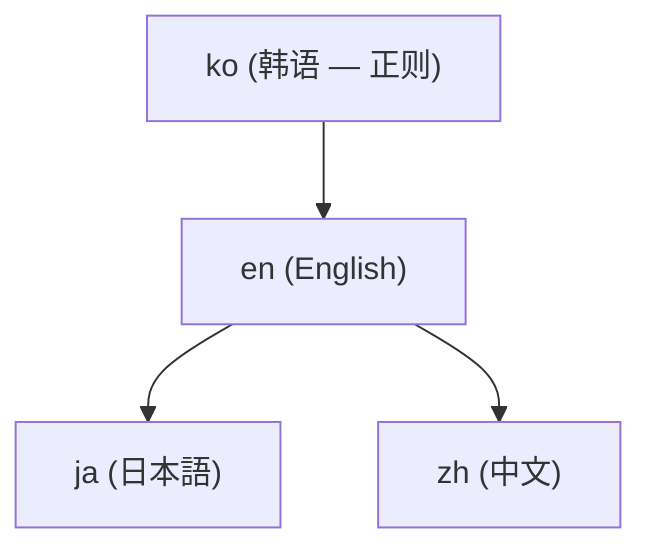

# 4-locale 文档和翻译

这个文档站点(adk.mo.ai.kr)用**四种语言**提供相同内容 — 韩语(ko)、英语(en)、日语(ja)、中文(zh)。所有页面在四种语言中以相同权重存在是规则。这个页面说明该结构,并引导如何报告翻译问题。

## 四个 locale 的位置

每个 locale 在文档根目录下有自己的目录。

| Locale | 语言 | 路径 |
|--------|------|------|
| **ko** | 韩语 | `/ko/...` (站点默认语言) |
| **en** | English | `/en/...` |
| **ja** | 日本語 | `/ja/...` |
| **zh** | 中文 | `/zh/...` |

`ko` 是站点默认语言(Hugo 配置 `defaultContentLanguage = "ko"`)。站点顶部的语言选择器可以在四个 locale 之间切换。

## 正则链 — 翻译从哪里开始

文档的原版(正则 locale)是**韩语(ko)**。翻译遵循确定的顺序。

- **ko** 是正则源。新页面先在 ko 中编写。
- **en** 从 ko 派生。
- **ja** 和 **zh** 从 en 经过派生。

修改韩语页面时,相同变更也要反映到 en·ja·zh 的对应页面。


**只在正则 locale 中修改。** 禁止在翻译 locale(en·ja·zh)中"修改"原文。翻译奇怪的话,大部分情况是原文(ko)把翻译带错了。不要直接修改翻译页面,建议修改原文页面。


## 4-locale 同时更新义务

所有文档变更必须在**一个 PR 中反映到所有四个 locale**。只修改韩语页面而将其他三个 locale 推后会产生 locale 间不一致。创建新页面时也一样 — 四个 locale 的页面作为一束上传。

## 什么被保留,什么被翻译

翻译**不变**(跨 locale 的共同规则):

- **Mermaid 图方向** — 只允许 `flowchart TD` / `graph TB`。`LR`/`RL` 方向被禁止,翻译不改变方向。
- **代码块** — 命令·代码·标志保持原样。只翻译注释中的自然语言。
- **URL 白名单** — 只允许 `adk.mo.ai.kr` 和 `github.com/modu-ai`。其他变形域(`docs` + `moai-ai` + `dev` 系列,`adk` + `moai` + `com` 系列,点位置不同的 `adk` + `moai` + `kr` 系列)在任何 locale 都不使用。有效域准确是 `adk.mo.ai.kr` — 点一个都不能差。
- **禁止装饰表情符号** — 本文的装饰表情符号使用 `` shortcode。排版符号(`→ ← ↓ ✓ ✗`)不是表情符号,保持原样。
- **版本** — `hugo.toml` 的 `params.version` / `params.releaseDate` 是单个源。不要在页面中直接写版本,使用 `` shortcode。

翻译**变**:

- 本文散文 — 各 locale 的自然语言。
- UI 标签和菜单 — 站点菜单(`data/menu/main.yaml`)的名称映射在各 locale 中翻译。
- 文档标题 — frontmatter 的 `title` 在各语言中翻译。

## 翻译质量 — 避免翻译腔

因为英语是源语言,其他语言派生,所以翻译容易陷入将英语句子结构原样搬过来的"翻译腔"(calque)。使用各语言的自然表达。

- 韩语中避免"세 축"/"일곤 기둥"这样的结构比喻。"세 가지 핵심"/"일곤 가지 강점"更自然。
- 不要逐词搬用英语比喻表达,在各语言中寻找传达相同意思的普遍表达。
- 区分对话体散文和文章体散文 — 指南的散文用干净的文章体。

## 如何报告翻译问题

发现翻译错误或 locale 间不一致,请通过 GitHub issue 告知。

1. **哪个页面** — 写 URL(例如:`https://adk.mo.ai.kr/ko/core-concepts/trust-5/`)。
2. **哪个 locale** — 明确四个 locale 中的哪个(ko/en/ja/zh)。
3. **什么问题** — 翻译错误、缺少段落、locale 间不一致、术语不一致等。
4. **如果有建议** — 一起写自然的替代表达有助于反映。

Issue 在 [github.com/modu-ai/moai-adk/issues](https://github.com/modu-ai/moai-adk/issues) 开启。在 Claude Code 会话中也可以用 `/moai feedback` 命令开启 issue。


**怀疑原文时。** 翻译奇怪不要先怀疑翻译页面。很多情况是韩语原文(ko)的表达把翻译带错了。这种情况原文修改和翻译修改作为一束处理。


## README 也是相同结构

不仅这个文档站点,GitHub 仓库的 README 也提供四种语言。但 README 与站点相反**英语(en)是正则**,韩语·日语·中文派生。注意文档站点(ko 正则)和 README(en 正则)的正规 locale 不同。

- **文档站点**(这个站点) — ko 正则,en·ja·zh 派生。
- **README**(GitHub 仓库) — `README.md`(en) 正则,`README.ko.md` / `README.ja.md` / `README.zh.md` 派生。

两个表面都是四个 locale 在一个变更束中更新的规则相同。

## 相关文档

- [开始](/zh/getting-started/) — 安装和快速开始
- [MoAI-ADK 是什么?](/zh/core-concepts/what-is-moai-adk/) — 项目概要
- [GitHub 仓库](https://github.com/modu-ai/moai-adk) — Issue 和贡献
