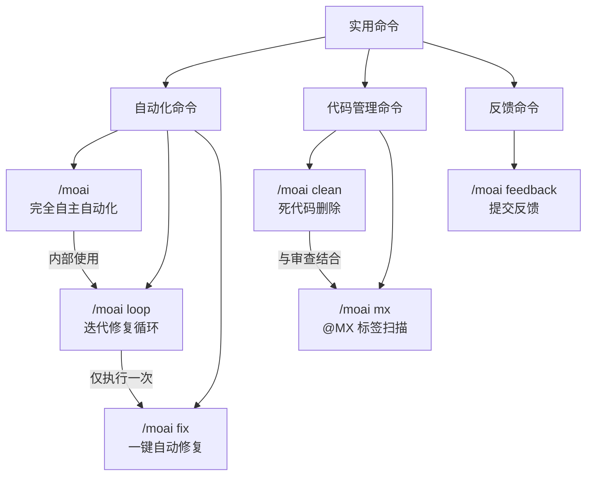

MoAI-ADK 的自动化和反馈命令介绍。


实用命令与工作流命令 (`/moai plan`、`/moai run`、`/moai sync`) 不同，是专门用于**快速自动化和问题解决**的命令。


## 命令比较

| 命令 | 目的 | 执行方式 | 使用时机 |
|--------|------|-----------|-----------|
| `/moai` | 完全自主自动化 | 从 SPEC 创建到文档化的整个过程 | 想要从头到尾委托一个功能时 |
| `/moai loop` | 迭代修复循环 | 重复诊断 → 修复 → 验证 | 想要一次性修复多个错误时 |
| `/moai fix` | 一键自动修复 | 诊断 → 修复 → 完成 (一次) | 想要快速修复 lint 错误或类型错误时 |
| `/moai clean` | 死代码删除 | 静态分析 → 使用图 → 安全删除 | 想要清理未使用的代码时 |
| `/moai mx` | @MX 标签扫描 | 3 遍扫描 → 自动标签插入 | 想要为代码添加 AI 上下文注解时 |
| `/moai feedback` | 提交反馈 | 自动创建 GitHub issue | 想要发送 MoAI-ADK 的 bug 报告或改进建议时 |

## 命令关系图


**不确定应该使用哪个命令？**

- 想要完整创建一个功能 → `/moai`
- 代码中有多个错误需要迭代修复 → `/moai loop`
- 只想快速修复简单的 lint 错误 → `/moai fix`
- 想要清理未使用的代码 → `/moai clean`
- 想让 AI 通过标签更好地理解代码 → `/moai mx`
- MoAI-ADK 本身有问题 → `/moai feedback`

