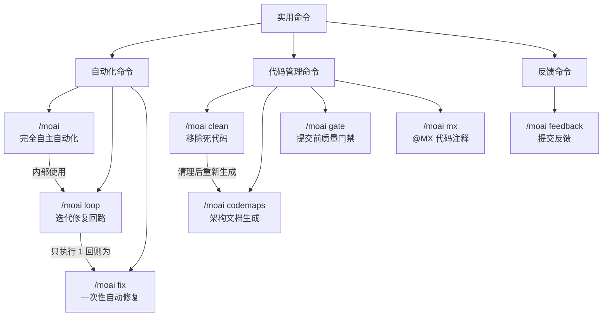

自主自动化、迭代修复回路、代码管理与反馈命令的集合。


与工作流命令(`/moai plan`, `/moai run`, `/moai sync`)不同,实用命令是专注于 **快速自动化与问题解决** 的命令。


## 智能体回路工程的执行界面

v3 的第二大支柱 **智能体回路工程** 实际运转的地方就是本节。`/moai loop` 是诊断型回路,反复运行直到清空诊断工具发现的问题队列;`/moai goal` 是条件声明型回路,声明完成条件后,会话会自行工作直到条件被满足。`/moai fix` 是同一系列的单次(1 回)预设。回路运转时留下的观察成为挽具学习的原料 — 回路积累观察,挽具从中学习并使指令演化,这里正是这条递归链的入口。

## 命令对比

| 命令 | 目的 | 执行方式 | 使用时机 |
|--------|------|-----------|-----------|
| `/moai` | 完全自主自动化 | 从 SPEC 生成到文档化的全过程 | 想把新功能从头到尾全权托付时 |
| `/moai goal` | 条件声明型自主回路 | 持续轮次直到满足完成条件 | 想声明"直到所有测试通过"这样的终态时 |
| `/moai loop` | 迭代修复回路 | 反复执行诊断 → 修复 → 验证 | 想一次性解决多个错误时 |
| `/moai fix` | 一次性自动修复 | 诊断 → 修复 → 完成(1 回) | 想快速修复 lint 错误或类型错误时 |
| `/moai gate` | 提交前质量门禁 | lint·格式化·类型·测试并行检查(<30 秒) | 提交前想快速确认通过/失败时 |
| `/moai mx` | @MX 代码注释 | 扫描代码库 → 插入 @MX 标签 | 想植入 AI 上下文用的代码锚点·风险标注时 |
| `/moai clean` | 移除死代码 | 静态分析 → 使用图 → 安全移除 | 想清理未使用代码时 |
| `/moai codemaps` | 架构文档生成 | 代码库扫描 → 自动生成结构文档 | 想生成项目架构文档时 |
| `/moai feedback` | 提交反馈 | 自动创建 GitHub Issue | 想向 MoAI-ADK 提交 Bug 报告或改进建议时 |

## 命令关系图

```mermaid
flowchart TD
    A[实用命令] --> B[自动化命令]
    A --> C[代码管理命令]
    A --> D[反馈命令]

    B --> E["/moai<br/>完全自主自动化"]
    B --> F["/moai loop<br/>迭代修复回路"]
    B --> G["/moai fix<br/>一次性自动修复"]
    C --> H["/moai clean<br/>移除死代码"]
    C --> I["/moai codemaps<br/>架构文档生成"]
    C --> K["/moai gate<br/>提交前质量门禁"]
    C --> L["/moai mx<br/>@MX 代码注释"]
    D --> J["/moai feedback<br/>提交反馈"]

    E -->|内部使用| F
    F -->|只执行 1 回则为| G
    H -->|清理后重新生成| I
```


**不知道该用哪条命令?**

- 想整体构建一个功能 → `/moai`
- "直到满足这个条件为止自己搞定" → `/moai goal`
- 代码错误很多,想反复修复 → `/moai loop`
- 只想快速修复简单的 lint 错误 → `/moai fix`
- 提交前只想快速确认通过/失败 → `/moai gate`
- 想植入 AI 上下文用的代码注释(@MX) → `/moai mx`
- 想清理未使用的代码 → `/moai clean`
- 想生成项目架构文档 → `/moai codemaps`
- MoAI-ADK 本身有问题 → `/moai feedback`

