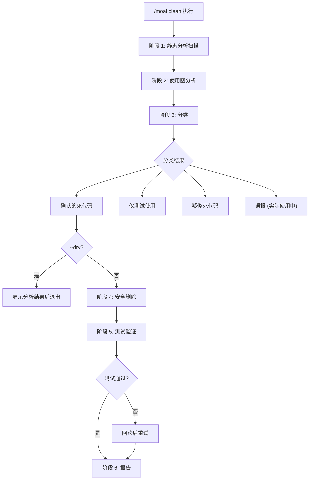
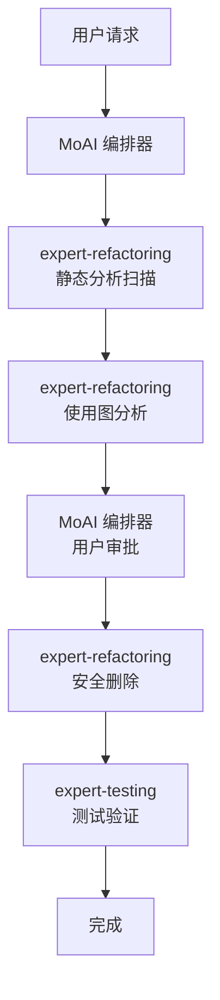

# /moai clean

死代码识别和安全删除命令。通过静态分析和使用图分析，**查找并安全删除未使用的代码**。


**一句话总结**: `/moai clean` 是"代码瘦身工具"。自动**查找并安全删除**未使用的函数、变量、import 和文件。



**斜杠命令**: 在 Claude Code 中输入 `/moai:clean` 可以直接运行此命令。仅输入 `/moai` 即可查看所有可用子命令列表。


## 概述

随着项目增长，未使用的代码会不断累积。未使用的 import、从未调用的函数、未引用的类型使代码库变得复杂。`/moai clean` 通过静态分析检测死代码，经过测试验证后安全删除。

## 用法

```bash
# 基本用法
> /moai clean

# 预览 (不删除，仅查看)
> /moai clean --dry

# 仅删除确认的死代码
> /moai clean --safe-only

# 分析特定文件/目录
> /moai clean --file src/auth/

# 分析特定代码类型
> /moai clean --type functions
```

## 支持的标志

| 标志 | 描述 | 示例 |
|------|------|------|
| `--dry` (或 `--dry-run`) | 不删除，仅显示分析结果 | `/moai clean --dry` |
| `--safe-only` | 仅删除确认的死代码 (跳过不确定项) | `/moai clean --safe-only` |
| `--file PATH` | 分析特定文件或目录 | `/moai clean --file src/utils/` |
| `--type TYPE` | 分析特定代码类型 | `/moai clean --type imports` |
| `--aggressive` | 包含低使用代码 (1 个调用者也是死代码的情况) | `/moai clean --aggressive` |

### --type 标志选项

| 类型 | 描述 |
|------|------|
| `functions` | 未被调用的函数/方法 |
| `imports` | 未被引用的 import 语句 |
| `types` | 未使用的类型定义 |
| `variables` | 声明后未使用的变量 |
| `files` | 没有被任何地方 import 的文件 |

### --dry 标志

不修改实际代码，预览哪些项目将被分类为死代码:

```bash
> /moai clean --dry
```

在删除前查看分析结果时非常有用。

## 执行过程

`/moai clean` 分 6 个阶段执行。



### 阶段 1: 静态分析扫描

使用各语言工具检测死代码候选:

| 语言 | 分析工具 | 检测对象 |
|------|---------|----------|
| **Go** | `go vet`, `staticcheck`, `deadcode` | 未使用变量、函数、类型 |
| **Python** | `vulture`, `autoflake` | 死代码、未使用 import |
| **TypeScript/JavaScript** | `ts-prune`, ESLint `no-unused-vars` | 未使用 export、变量 |
| **Rust** | `cargo clippy`, `cargo udeps` | 死代码警告、未使用依赖 |

### 阶段 2: 使用图分析

构建使用图以验证静态分析结果:

- 搜索每个候选项在整个代码库中的引用
- 检查间接使用 (接口、反射、动态分派)
- 检查仅测试使用 (仅在测试中使用)

### 阶段 3: 分类

| 分类 | 描述 | 删除安全度 |
|------|------|-----------|
| **确认的死代码** | 代码库中无任何引用 | 安全 |
| **仅测试使用** | 仅在测试文件中使用 | 基本安全 |
| **疑似死代码** | 低可信度 (可能存在动态使用) | 需谨慎 |
| **误报** | 实际使用中 (反射、插件等) | 不可删除 |

### 阶段 4: 安全删除

按依赖图反序删除 (先删叶子节点)。带 `@MX:ANCHOR` 标签的代码未经明确批准不会被删除。

### 阶段 5: 测试验证

删除后运行完整测试套件验证无回归。测试失败时自动回滚该删除操作。

### 阶段 6: 报告

显示删除结果、保留项、测试结果及代码库缩减量。

## 代理委托链



| 代理 | 角色 | 主要任务 |
|------|------|---------|
| **expert-refactoring** | 分析和删除 | 静态分析、使用图、安全删除 |
| **expert-testing** | 验证 | 运行测试套件、确认无回归 |
| **MoAI 编排器** | 协调 | 用户审批、@MX 标签清理 |

## 常见问题

### Q: 如果误删了死代码怎么办？

可以用 Git 回滚。MoAI 按依赖反序删除并运行测试，出现问题会自动回滚。

### Q: 什么时候应该使用 --aggressive？

当你想包含只有 1 个调用者且该调用者也是死代码的情况时使用。适用于大规模重构后的清理。

### Q: 通过反射使用的代码也会被删除吗？

`--safe-only` 模式下仅删除"确认的死代码"。通过反射或动态分派使用的代码会被分类为"误报"并保留。

## 相关文档

- [/moai fix - 一键自动修复](/utility-commands/moai-fix)
- [/moai mx - @MX 标签扫描](/utility-commands/moai-mx)
- [/moai review - 代码审查](/quality-commands/moai-review)
- [/moai coverage - 覆盖率分析](/quality-commands/moai-coverage)
