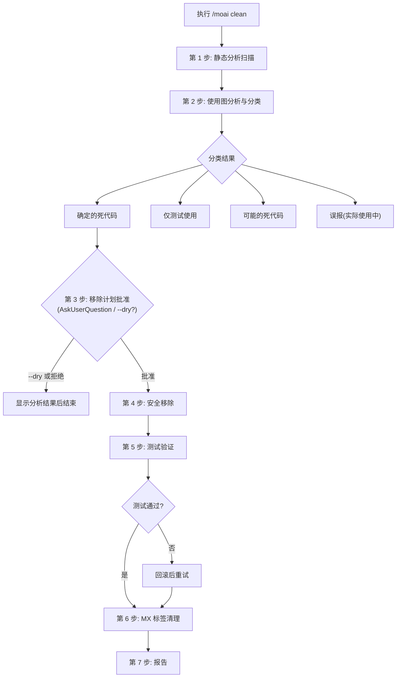
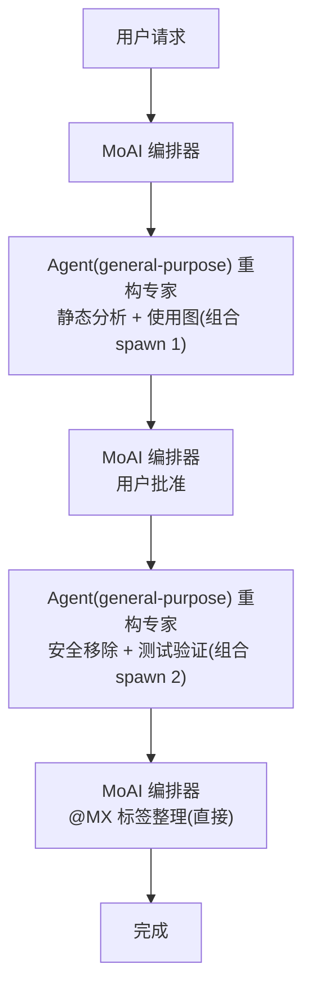

死代码识别与安全移除命令。通过静态分析与使用图分析,**找到未使用代码并安全移除**。


**一句话总结**: `/moai clean` 是"代码瘦身工具"。**自动找到并安全删除** 未使用的函数、变量、import、文件。



**斜杠命令**: 在 Claude Code 中输入 `/moai:clean` 即可直接执行此命令。仅输入 `/moai` 会显示所有可用子命令列表。


## 概述

随着项目成长,不再使用的代码会不断堆积。未使用的 import、不被调用的函数、不被引用的类型等使代码库变得复杂。`/moai clean` 通过静态分析找出这些死代码,经测试验证后安全移除。

从挽具工程的角度看,这条命令扮演 **垃圾回收** 的角色。死代码不仅是人的负担,也是智能体的负担 — 智能体读取的每一行代码都是上下文(令牌),因此移除死代码既是代码卫生,同时也是缩减上下文、节省成本的工作。

## 使用方法

```bash
# 基本用法
> /moai clean

# 预览(不修改,仅确认)
> /moai clean --dry

# 仅移除安全的项目
> /moai clean --safe-only

# 仅分析特定文件/目录
> /moai clean --file src/auth/

# 仅分析特定代码类型
> /moai clean --type functions
```

## 支持的标志

| 标志 | 说明 | 示例 |
|-------|------|------|
| `--dry`(或 `--dry-run`) | 不移除,仅显示分析结果 | `/moai clean --dry` |
| `--safe-only` | 仅移除确定的死代码(跳过不确定项目) | `/moai clean --safe-only` |
| `--file PATH` | 仅分析特定文件或目录 | `/moai clean --file src/utils/` |
| `--type TYPE` | 仅分析特定代码类型 | `/moai clean --type imports` |
| `--aggressive` | 也包含低使用代码(唯一调用者本身是死代码的情况) | `/moai clean --aggressive` |

### --type 标志选项

| 类型 | 说明 |
|------|------|
| `functions` | 不被调用的函数/方法 |
| `imports` | 不被引用的 import 语句 |
| `types` | 未使用的类型定义 |
| `variables` | 声明后未使用的变量 |
| `files` | 在任何地方都未被 import 的文件 |

### --dry 标志

在不修改实际代码的情况下,预先确认哪些项目被分类为死代码:

```bash
> /moai clean --dry
```

此选项适合想在移除前审查分析结果的情况。

## 执行过程

`/moai clean` 分 7 步执行。


```mermaid
flowchart TD
    Start["执行 /moai clean"] --> Phase1["第 1 步: 静态分析扫描"]

    Phase1 --> Phase2["第 2 步: 使用图分析与分类"]
    Phase2 --> Classify{"分类结果"}
    Classify --> Dead["确定的死代码"]
    Classify --> TestOnly["仅测试使用"]
    Classify --> Likely["可能的死代码"]
    Classify --> False["误报(实际使用中)"]

    Dead --> Phase3{"第 3 步: 移除计划批准<br/>(AskUserQuestion / --dry?)"}
    Phase3 -->|--dry 或拒绝| Report["显示分析结果后结束"]
    Phase3 -->|批准| Phase4["第 4 步: 安全移除"]

    Phase4 --> Phase5["第 5 步: 测试验证"]
    Phase5 --> Pass{"测试通过?"}
    Pass -->|否| Rollback["回滚后重试"]
    Pass -->|是| Phase6["第 6 步: MX 标签清理"]
    Rollback --> Phase6
    Phase6 --> Phase7["第 7 步: 报告"]
```

第 3 步 **移除计划批准** 是一道人工门禁: 编排器用 `AskUserQuestion` 展示待删清单并取得批准。第 6 步 **MX 标签清理** 会连同被删代码上的 `@MX` 注释一起收走,不让无处安放的注释留下来。

### 第 1 步: 静态分析扫描

用项目标记 (project marker) 自动识别项目语言,再用各语言的标准死代码分析工具检测候选。**16 种支持语言同等对待**(go, python, typescript, javascript, rust, java, kotlin, csharp, ruby, php, elixir, cpp, scala, r, flutter, swift),未安装的工具自动跳过。识别不到语言标记的项目安静通过。下表只是代表性示例,不优待任何特定语言:

| 语言(示例) | 分析工具(示例) | 检查对象 |
|------|-----------|-----------|
| Go | `go vet`, `staticcheck`, `deadcode` | 未使用变量、函数、类型 |
| Python | `vulture`, `autoflake` | 死代码、未使用 import |
| TypeScript/JavaScript | `ts-prune`, ESLint `no-unused-vars` | 未使用 export、变量 |
| Rust | `cargo clippy`, `cargo udeps` | 死代码警告、未使用依赖 |

其余 12 种语言(java, kotlin, csharp, ruby, php, elixir, cpp, scala, r, flutter, swift 等)也各自以标准工具链同样扫描。

**扫描类别:**

- 未使用 import: 无引用的 import 语句
- 未使用变量: 声明但未被读取的变量
- 未使用函数: 定义但未被调用的函数
- 未使用类型: 无使用处的类型定义
- 未使用文件: 在任何地方都不被 import 的文件
- 死依赖: 已安装但未被 import 的包

### 第 2 步: 使用图分析

为验证静态分析结果,构建使用图:

- 对每个候选在整个代码库中搜索引用
- 确认间接使用(接口、反射、动态分发)
- 确认仅测试使用(仅在测试中使用,生产代码中未使用)
- 确认条件编译(构建标签、基于环境的 import)

### 第 3 步: 分类

| 分类 | 说明 | 移除安全度 |
|------|------|------------|
| **确定的死代码** | 代码库中任何地方都无引用 | 安全 |
| **仅测试使用** | 仅在测试文件中使用 | 大体安全 |
| **可能的死代码** | 低置信度(存在动态使用的可能) | 需谨慎 |
| **误报** | 实际使用中(反射、插件等) | 不可移除 |

### 第 4 步: 安全移除

按依赖图的逆序移除(叶节点优先):

- 将相关代码作为组一起移除(函数 + 私有助手)
- 更新受影响的 import
- 清理所有 export 均被移除的空文件
- 带 `@MX:ANCHOR` 标签的代码未经明确批准不移除

### 第 5 步: 测试验证

移除后运行完整测试套件验证回归。测试失败时回滚相应移除,并将其分类为"误报"。安全的判定依据是测试通过这一证据,而不是"删了以后好像没问题"。

### 第 6 步: 报告

```
死代码移除报告

已移除: 15 个项目 (287 行)
  - src/utils/helper.go: UnusedFunction (15 行)
  - src/models/old.go: 删除整个文件 (120 行)

已保留(误报): 2 个项目
  - src/api/handler.go: DynamicHandler(使用反射)

测试结果: PASS(全部测试通过)

代码库缩减:
  - 移除文件: 3 个
  - 移除行数: 287 行
  - 移除依赖: 1 个
```

## 智能体委派链

`/moai clean` 通过 2 次 `Agent(general-purpose)` 重构专家 spawn 执行(并非专用的 named 智能体,而是在 spawn 时注入重构白名单 + ANALYZE-PRESERVE-IMPROVE 指令的通用智能体)。第 1·2 步为一次组合 spawn,第 4·5 步为另一次组合 spawn,第 6 步由编排器直接执行(不 spawn)。


```mermaid
flowchart TD
    User["用户请求"] --> MoAI["MoAI 编排器"]
    MoAI --> Refactor1["Agent(general-purpose) 重构专家<br/>静态分析 + 使用图(组合 spawn 1)"]
    Refactor1 --> MoAI2["MoAI 编排器<br/>用户批准"]
    MoAI2 --> Refactor2["Agent(general-purpose) 重构专家<br/>安全移除 + 测试验证(组合 spawn 2)"]
    Refactor2 --> MoAI3["MoAI 编排器<br/>@MX 标签整理(直接)"]
    MoAI3 --> Complete["完成"]
```

| 智能体 | 角色 | 主要工作 |
|----------|------|----------|
| **Agent(general-purpose) 重构专家** (spawn 1) | 分析 | 静态分析 + 使用图(第 1·2 步组合) |
| **Agent(general-purpose) 重构专家** (spawn 2) | 移除与验证 | 安全移除 + 运行测试套件·确认回归(第 4·5 步组合) |
| **MoAI 编排器** | 协调 | 用户批准、@MX 标签整理(第 6 步,直接) |

## 常见问题

### Q: 误删死代码怎么办?

可以用 Git 回退。MoAI 按依赖逆序移除并运行测试,出现问题时会自动回滚。

### Q: 什么时候使用 `--aggressive`?

想把"调用者只有 1 个且该调用者本身也是死代码"的情况包含在内时使用。适合大规模重构后的清理。

### Q: 通过反射使用的代码也会被移除吗?

在 `--safe-only` 模式下只移除"确定的死代码"。通过反射或动态分发使用的代码被分类为"误报"并得到保留。

## 另一个表面 — `moai clean --home`(主目录清理)


同名的**终端 CLI** `moai clean --home` 与上面的 `/moai clean`(项目死代码)对象不同 —— 这边清理的是 `~/.moai` 主目录。它不是斜杠命令,也不做死代码分析。


`~/.moai` 里会堆积会话状态、缓存、日志和陈旧的配置档案。`moai clean --home` 只清理其中**列入允许名单 (allowlist) 的清理对象目录** —— 名单之外的东西连问都不问、原样保留。绝不触碰 `~/.claude`。

```bash
# 清理对话 —— 默认 dry-run(只报告、不删除)
$ moai clean --home

# 实际删除 —— 带守卫的 force
$ moai clean --home --force
```

- **默认 dry-run**。想要删除必须显式加上 `--force`,而且它也只在允许名单之内生效。
- 保留时长由 `~/.moai/config/sections/` 的 `state.home_retention_days` 决定。
- 删除之前想看占用了多少,`moai doctor` 的 **Home Disk Usage** 诊断会先告诉你 —— 属于建议 (advisory) 性质的检查,阈值跟随编译时的默认值。
- 想把 `~/.moai` 本身挪个位置,可以用 `MOAI_HOME` 环境变量重新指定主目录根(仅非空绝对路径有效,相对路径被忽略)。

## 相关文档

- [/moai fix - 一次性自动修复](/zh/utility-commands/moai-fix)
- [/moai codemaps - 架构文档生成](/zh/utility-commands/moai-codemaps)
