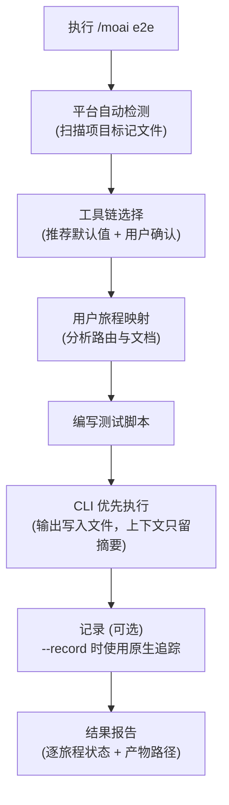
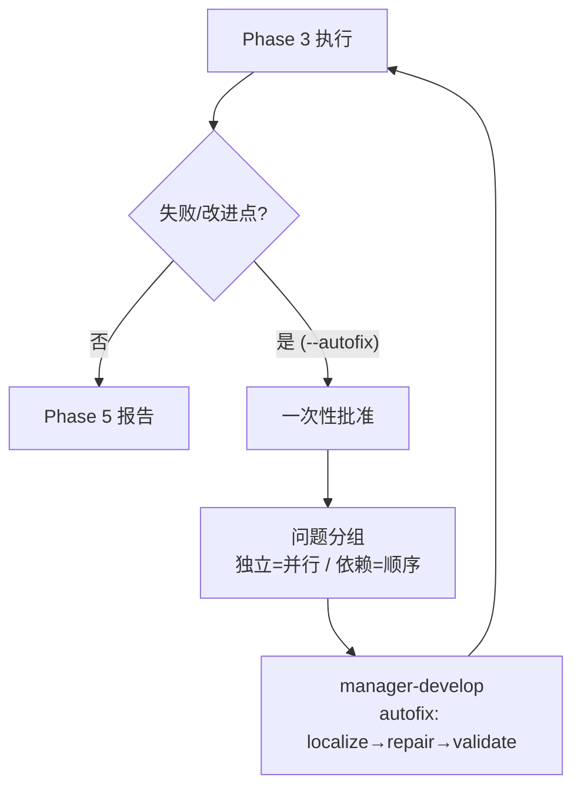
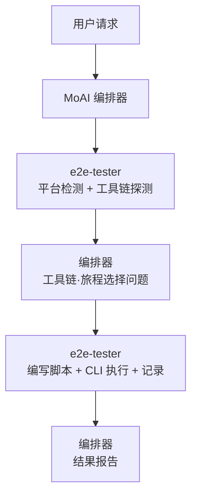

用于创建并运行网页、移动、桌面应用 E2E (End-to-End) 测试的命令。它会**自动检测**项目类型，为各平台选择 **CLI 优先的工具链**，在最小化 token 用量的前提下执行。


**一句话总结**: `/moai e2e` 是"用户旅程验证工具"。它把登录 → 支付 → 确认这样的真实用户流程，在浏览器·模拟器·桌面应用中从头到尾执行并验证。



**斜杠命令**: 在 Claude Code 中输入 `/moai:e2e` 即可直接执行此命令。只输入 `/moai` 会显示所有可用子命令的列表。


## 概述

单元测试验证的是单个函数，而 E2E 测试验证的是**用户的完整旅程**。`/moai e2e` 将这一过程自动化 — 它自行判别项目是网页、移动还是桌面应用，选出平台的默认工具链，然后编写并运行测试脚本。

整体流程如下。



## 用法

```bash
> /moai e2e
```

不带参数执行时，会先检测项目类型，然后给出推荐工具链和发现的用户旅程供选择，再继续进行。

```bash
# 指定工具链直接执行
> /moai e2e --tool playwright

# 只运行特定旅程
> /moai e2e --journey login

# 记录执行过程 (追踪/录制)
> /moai e2e --record
```

## 支持的标志

| 标志 | 说明 | 示例 |
|-------|------|------|
| `--tool TOOL` | 强制指定工具链 (跳过选择问题) | `/moai e2e --tool maestro` |
| `--platform web\|mobile\|desktop` | 强制指定平台分类 | `/moai e2e --platform web` |
| `--record` | 用工具链的原生记录功能记录运行 | `/moai e2e --record` |
| `--url URL` | 指定网页测试目标 URL | `/moai e2e --url http://localhost:3000` |
| `--journey NAME` | 只运行指定的用户旅程 | `/moai e2e --journey checkout` |
| `--headless` | 以无头模式运行 (默认 true) | `/moai e2e --headless` |
| `--browser BROWSER` | 选择 Playwright 浏览器 (默认 chromium) | `/moai e2e --browser firefox` |
| `--timeout N` | 测试超时 (秒，默认 30) | `/moai e2e --timeout 60` |
| `--retry N` | 失败测试的重试次数 (默认 1) — 只重跑**失败的用例** | `/moai e2e --retry 2` |
| `--autofix` | 启用自动修复委托 — Phase 3 失败时委托 manager-develop 修复并重跑 (最多 3 次，独立项并行) | `/moai e2e --autofix` |

## 平台工具链矩阵

每个平台都有固定的默认工具链，且所有默认路径都能**只靠 CLI 完成**。

| 平台 | 默认工具链 | 备选/回退 | 备注 |
|--------|-------------|-----------|------|
| **网页** | Playwright CLI | agent-browser (AI 探索型) | chromium / firefox / webkit 跨浏览器 |
| **移动** | Maestro | Appium (回退)、Detox (仅限 React Native) | 支持 iOS / Android / Flutter，声明式 YAML 流程 |
| **桌面 (Electron)** | Playwright `_electron` | — | 复用网页版 Playwright 安装。API 为实验性 (experimental) — 会在报告中注明 |
| **桌面 (Tauri)** | WebdriverIO + `@wdio/tauri-service` | — | 嵌入式 WebDriver 模式跨平台，包含 macOS |

若所选工具链未安装，会先给出安装命令，经批准后安装 → 重新确认版本 → 再继续。

## 项目类型自动检测

通过读取项目的**标记文件**来分类平台。检测由标记驱动，不偏袒任何语言或框架。

| 分类 | 检测标记 (示例) |
|------|------------------|
| 桌面 (Electron) | package.json 依赖中的 `electron`、electron-builder/Forge 配置 |
| 桌面 (Tauri) | `src-tauri/tauri.conf.json`、依赖中的 `tauri` |
| 移动 (React Native) | 依赖中的 `react-native`、`ios/` + `android/` 目录 |
| 移动 (Flutter) | 含 `flutter:` 的 `pubspec.yaml`、`lib/main.dart` |
| 移动 (原生) | 含 iOS 目标的 `*.xcodeproj`、含 `com.android.application` 的 `build.gradle` |
| 网页 | next/nuxt/vite/astro 等网页框架配置、`index.html`、各类 HTTP 服务应用 |
| 混合 (mixed) | 同时检测到两类以上平台标记 — 按表面分别选择工具链 |

## 执行流程

### 第 1 步: 用户旅程映射

读取项目文档和路由定义 (routes.ts、urls.py、router.go、导航图等)，发现待测的用户旅程候选。登录、核心功能、错误处理等关键路径优先。

```markdown
旅程: 用户登录
步骤:
1. 前往 /login (网页) | 启动应用至登录界面 (移动/桌面)
2. 输入邮箱
3. 输入密码
4. 提交
5. 验证重定向到 /dashboard
6. 验证欢迎消息显示
```

### 第 2 步: 编写脚本

按所选工具链的约定，在 `e2e/` 目录下编写测试脚本。

| 工具链 | 产物位置 |
|--------|-------------|
| Playwright | `e2e/<旅程>.spec.ts` |
| Maestro | `e2e/flows/<旅程>.yaml` |
| Appium / WebdriverIO | `e2e/<旅程>.e2e.ts` + `wdio.conf.ts` |

每个旅程步骤都对应一个**可验证的结果** — 不会编写没有断言 (assertion) 的纯导航脚本。

### 第 3 步: 执行与报告

运行测试，并以表格报告逐旅程的 PASS/FAIL 状态、耗时和产物路径。失败的旅程会附带失败点的日志摘录和截图路径。

## 自动修复委托 (--autofix)

加上 `--autofix` 标志后，当 Phase 3 执行发现 **失败或可改进之处** 时，编排器会将修复委托给 `manager-develop` 代理并重新运行 Phase 3，进入循环。若未加该标志或 Phase 3 已通过，则跳过此步骤。



- **一次性批准**：首次委托前编排器获取一次批准，该批准覆盖整个循环，后续迭代不再询问。拒绝则回到标准的手动下一步流程。
- **问题分组**：触及不同文件的独立问题并行 fan-out；触及同一模块的依赖问题顺序处理（避免并发写冲突）。
- **循环上限**：最多 3 次迭代（与 `ci-autofix-protocol.md` 一致）。通过即报告；耗尽则将剩余失败和产物路径上报给用户。

## Token 最小化执行

`/moai e2e` 的核心设计原则是 **CLI 优先** (CLI-first)。它不会把冗长输出堆进 AI 上下文，而是从最便宜的路径用起。

1. **CLI + 有界尾部输出**: 完整运行日志保存到 `e2e/.runs/` 下的文件，上下文中只显示退出码 + 末尾几行。日志文件路径始终被引用。
2. **结构化报告器**: 分析失败时，不重跑整个套件，而是从 JSON 报告器输出中只挑出**失败的用例**来读。
3. **MCP 仅限条件使用**: 只有性能追踪、Lighthouse 级审计等 CLI 无法完成的能力才使用 MCP 工具。任何默认路径都不把 MCP 作为硬依赖。

报告、追踪、截图、录制都保存在项目本地的 `e2e/` 目录中，并**以路径引用** — 内容不会内联进上下文。

## 记录选项

使用 `--record` 标志时，通过所选工具链的**原生记录功能**记录运行。

| 工具链 | 原生功能 | 输出位置 |
|--------|---------------|-----------|
| Playwright | `--trace on` 追踪 | `e2e/traces/*.zip` |
| Maestro | `maestro record` | `e2e/recordings/` |
| WebdriverIO | 视频/追踪报告器服务 | `e2e/recordings/` |

## 未检测到目标时

当未检测到可测的 E2E 表面时 (例如没有网页/移动/桌面入口的纯库项目)，会连同已核对的标记依据一起报告 **"未检测到 E2E 目标"**，不创建任何 `e2e/` 产物并正常退出。

检测到既非 Electron 也非 Tauri 的**原生桌面应用** (纯 macOS 应用、WinUI、Qt/GTK 等) 时也走同一分支 — 操作系统级的原生桌面自动化尚未提供；会连同分类依据一起给出延期 (deferral) 说明并正常退出。

## 智能体委派链

`/moai e2e` 的执行主体是 **e2e-tester** 智能体。所有面向用户的选择问题由 MoAI 编排器负责，e2e-tester 只接收选择结果并执行。



| 智能体 | 角色 | 主要工作 |
|----------|------|----------|
| **MoAI 编排器** | 选择与报告 | 工具链/旅程选择问题、结果报告渲染 |
| **e2e-tester** | 执行专责 | 检测探测、旅程映射、脚本编写、CLI 执行、记录 |
| **manager-develop** (使用 --autofix 时) | 修复委托 | localize→repair→validate（本地复验相关 e2e 用例） |

## 相关文档

- [/moai fix - 一次性自动修复](/utility-commands/moai-fix)
- [/moai loop - 迭代修复循环](/utility-commands/moai-loop)
- [/moai - 完全自主自动化](/utility-commands/moai)
