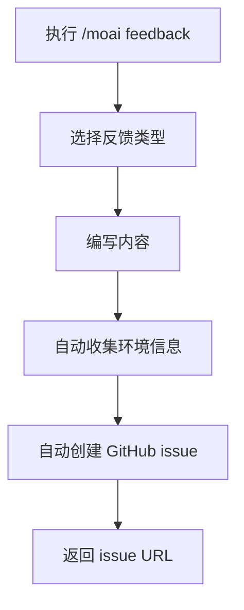
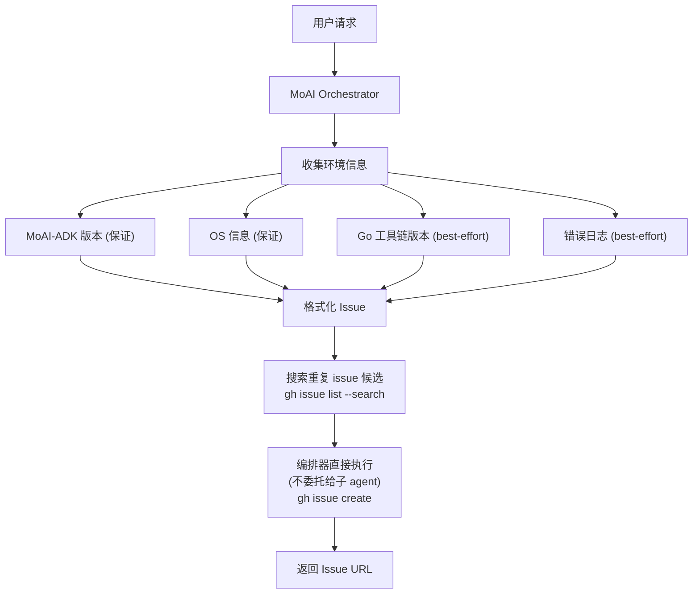

提交 MoAI-ADK 的反馈或 bug 报告的命令。



**新命令格式**

`/moai:9-feedback` 已更改为 `/moai feedback`。





**一句话总结**: `/moai feedback` 是一个**自动创建 GitHub issue** 的命令，用于提交关于 MoAI-ADK 本身的改进建议或 bug 报告。




**斜杠命令**: 在 Claude Code 中输入 `/moai:feedback` 可以直接运行此命令。仅输入 `/moai` 即可查看所有可用子命令列表。


## 概述

当您在使用 MoAI-ADK 时发现 bug、需要新功能或有改进想法时使用此命令。无需直接访问 GitHub - 可以直接在 Claude Code 中提交反馈。


**重要**: 此命令**不是用于修改项目代码**。它是用于向开发团队传达关于 MoAI-ADK 工具本身的反馈。


## 用法

```bash
# 标准形式
> /moai feedback

# 简短别名
> /moai fb
> /moai bug
> /moai issue
```

执行命令时，会引导您选择反馈类型和输入内容。

## 支持的标志

| 标志 | 描述 | 示例 |
|-------|------|------|
| `--type {bug,feature,question}` | 直接指定反馈类型 | `/moai feedback --type bug` |
| `--title "<title>"` | 直接指定标题 | `/moai feedback --title "错误报告"` |
| `--dry-run` | 仅检查内容而不创建 issue | `/moai feedback --dry-run` |

## 工作原理

运行 `/moai feedback` 时，会执行以下过程:



### 自动收集的信息

提交反馈时，会自动包含以下信息，帮助开发团队快速理解问题:

| 收集项目 | 描述 | 示例 |
|-----------|------|------|
| MoAI-ADK 版本 | 当前安装的版本 | v10.8.0 |
| OS 信息 | 操作系统和版本 | macOS 15.2 |
| Claude Code 版本 | 正在使用的 Claude Code 版本 | 1.0.30 |
| 当前 SPEC | 正在处理的 SPEC ID | SPEC-AUTH-001 |
| 错误日志 | 最近的错误 (如果有) | TypeError: ... |

## 反馈设置

`/moai feedback` 通过以下 4 项详细行为增强 issue 创建流程。

### 诊断信息：保证项 + best-effort 项

如上表所示，MoAI-ADK 版本(`moai version`)和 OS 信息(`uname`)是**始终**收集的保证项。Go 工具链版本(`go version`)和编排器传递的错误上下文属于 **best-effort** 项，如果条件不满足(例如仅有预构建的 `moai` 二进制文件、未安装 Go 工具链的环境)会被省略，这并不算失败。

### 检查重复 issue 候选

确定 issue 标题后，在创建 issue 之前，会使用 `gh issue list --repo <目标仓库> --search "<标题关键词>" --state open` 命令在目标仓库中搜索未解决的重复 issue。此步骤不会直接询问用户，只会生成"可能重复"的候选报告(issue 编号、标题、URL、状态)，是否以新 issue 继续还是指向现有 issue，由编排器决定。

### `gh` 认证失败时的本地临时保存

在创建 issue 之前，会检查 `gh auth status`。如果 `gh` 未通过身份验证，或触发了 GitHub API 速率限制，会按以下方式优雅应对。

1. 将检测到的状态(未认证或速率受限)告知用户。
2. 未认证时引导执行 `gh auth login`，速率受限时引导等待限制解除。
3. 提议将已撰写的 issue 内容本地保存至 `.moai/state/feedback-draft-<timestamp>.md`。

已撰写的反馈内容不会因 `gh` 失败而丢失，本地临时文件将作为恢复手段。

### 反馈目标仓库设置

`/moai feedback` 创建 issue 的目标仓库通过 `.moai/config/sections/feedback.yaml` 中的 `feedback.repository` 值设置。默认值为 `modu-ai/moai-adk`(MoAI-ADK 工具仓库本身)，维护 fork 的用户可以将此值改为自己的 fork 仓库，从而将反馈重定向过去。

## 反馈类型

### Bug 报告

报告在使用 MoAI-ADK 时遇到的错误或意外行为。

```bash
> /moai feedback
# 类型选择: Bug 报告
# 标题: /moai run 执行时未创建特征测试
# 描述: 我对 SPEC-AUTH-001 运行了 /moai run，
#        但在 PRESERVE 阶段没有创建特征测试，直接进入 IMPROVE 阶段。
# 重现方法: 运行 /moai run SPEC-AUTH-001
```

### 功能请求

建议您希望添加到 MoAI-ADK 的新功能。

```bash
> /moai feedback
# 类型选择: 功能请求
# 标题: 为 /moai loop 添加仅针对特定文件的选项
# 描述: 如果 /moai loop 可以只针对特定目录或
#        文件而不是整个项目，那就太好了。
# 示例: /moai loop --path src/auth/
```

### 改进建议

提出改进现有功能的想法。

```bash
> /moai feedback
# 类型选择: 改进建议
# 标题: 在 /moai fix 执行结果中显示修改前后的 diff
# 描述: 如果 /moai fix 以 diff 格式显示其自动修复，
#        我们可以一眼看出做了哪些更改。
```

## Agent 委托链

`/moai feedback` 命令**不委托给任何子 agent**，而是由 **编排器直接** 执行整个流程:



**职责主体:**

| 职责主体 | 角色 | 主要任务 |
|----------|------|----------|
| **MoAI Orchestrator** | 由编排器直接推进整个反馈流程 (不委托给子 agent) | 收集类型/标题/描述、收集环境信息、搜索重复 issue 候选、直接执行 `gh issue create`、返回 URL |

## 实际示例

### 情况: 命令执行期间发生意外错误

```bash
# 有错误的状况
> /moai "实现支付功能" --branch
# Error: 分支创建失败 - 权限被拒绝

# 提交反馈
> /moai feedback
```

MoAI Orchestrator 依次询问反馈类型、标题、描述。当您输入回答后，会自动创建 GitHub issue 并返回 issue URL。

```
GitHub issue 已创建:
https://github.com/anthropics/moai-adk/issues/1234

开发团队将在审查后回复。
```


**始终欢迎反馈！** 即使是小的不便之处，也请提交反馈，这有助于改进 MoAI-ADK。


## 常见问题

### Q: 可以编辑或删除反馈内容吗？

可以，您可以直接在 GitHub 上编辑或关闭 issue。由于提供了 issue URL，您可以随时访问。

### Q: 可以多次报告相同问题吗？

不用担心 - GitHub 会检查重复的 issue。如果问题已经报告过，会引导您到现有 issue。

### Q: 什么时候会收到对反馈的回复？

开发团队每周审查和评论 issue。复杂问题可能需要时间来解决。

### Q: `/moai feedback` 和直接创建 GitHub issue 有什么区别？

`/moai feedback` 自动收集环境信息，帮助开发团队更快地理解问题。比手动创建 issue 更高效。

## 相关文档

- [/moai - 完全自主自动化](/utility-commands/moai)
- [/moai loop - 迭代修复循环](/utility-commands/moai-loop)
- [/moai fix - 一键自动修复](/utility-commands/moai-fix)
