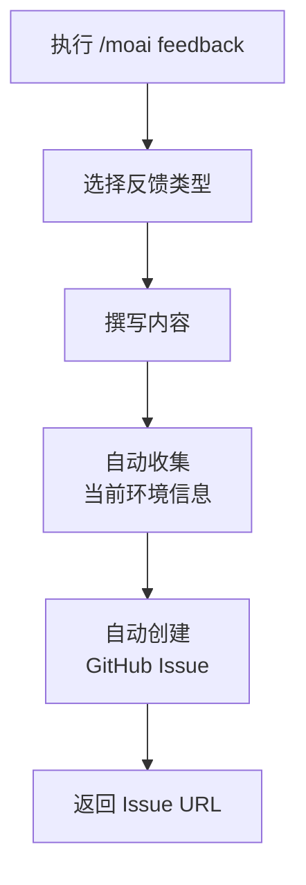
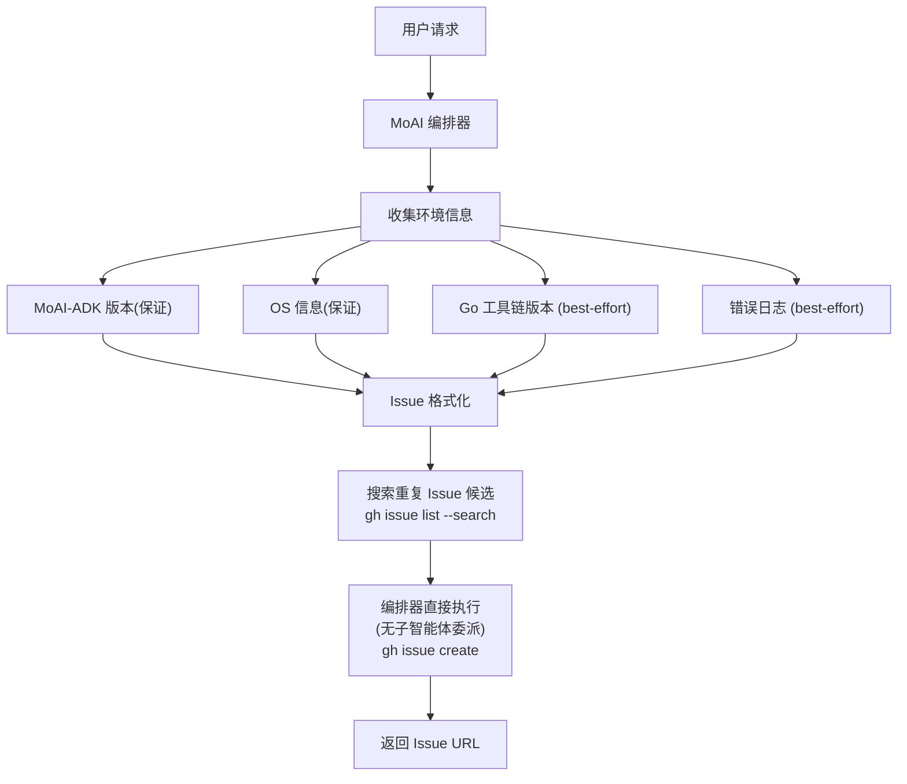

向 MoAI-ADK 提交反馈或 Bug 报告的命令。


**一句话总结**: `/moai feedback` 是把针对 MoAI-ADK 本身的改进建议或 Bug 报告 **自动创建为 GitHub Issue** 的命令。



**斜杠命令**: 在 Claude Code 中输入 `/moai:feedback` 即可直接执行此命令。仅输入 `/moai` 会显示所有可用子命令列表。


## 概述

在使用 MoAI-ADK 过程中发现 Bug、需要新功能或产生改进想法时,使用此命令。无需亲自访问 GitHub 撰写 Issue,可以在 Claude Code 内直接提交反馈。


**重要**: 这条命令 **不是修改您项目代码的命令**。它是把针对 MoAI-ADK 工具本身的反馈传达给开发团队的命令。


## 使用方法

```bash
# 标准形式
> /moai feedback

# 简短别名
> /moai fb
> /moai bug
> /moai issue
```

执行命令后,会引导您选择反馈类型并输入内容。

## 支持的标志

| 标志 | 说明 | 示例 |
|-------|------|------|
| `--type {bug,feature,question}` | 直接指定反馈类型 | `/moai feedback --type bug` |
| `--title "<title>"` | 直接指定标题 | `/moai feedback --title "错误报告"` |
| `--dry-run` | 不创建 Issue,仅确认内容 | `/moai feedback --dry-run` |

## 工作方式

执行 `/moai feedback` 后,将进行以下过程。


```mermaid
flowchart TD
    A["执行 /moai feedback"] --> B["选择反馈类型"]
    B --> C["撰写内容"]
    C --> D["自动收集<br/>当前环境信息"]
    D --> E["自动创建<br/>GitHub Issue"]
    E --> F["返回 Issue URL"]
```

### 自动收集的信息

提交反馈时会自动包含以下信息,帮助开发团队更快地掌握问题。

| 收集项目 | 说明 | 示例 | 收集方式 |
|-----------|------|------|-----------|
| MoAI-ADK 版本 | 当前安装的版本 (`moai version`) | v10.8.0 | 保证(始终收集) |
| OS 信息 | 操作系统及版本 (`uname`) | macOS 15.2 | 保证(始终收集) |
| Go 工具链版本 | 工具二进制的构建来源信息 (`go version`) | go1.23.4 | best-effort(未安装 Go 工具链的环境中省略) |
| 错误日志 | 编排器传递的错误上下文(如有) | TypeError: ... | best-effort(仅在编排器传递时包含,工作流本身不读取会话记录) |

## 反馈设置

`/moai feedback` 通过以下 4 项细节行为增强 Issue 创建过程。

### 诊断信息: 保证项目 + best-effort 项目

如上表所示,MoAI-ADK 版本 (`moai version`) 与 OS 信息 (`uname`) 是 **始终** 收集的保证项目。Go 工具链版本 (`go version`) 与编排器传递的错误上下文是 **best-effort** 项目,当条件不满足时(例: 只有预构建的 `moai` 二进制、未安装 Go 工具链的环境)会被省略,这不算失败。

### 确认重复 Issue 候选

Issue 标题确定后,在创建 Issue 前用 `gh issue list --repo <目标仓库> --search "<标题关键词>" --state open` 命令在目标仓库中搜索处于打开状态的重复 Issue。这一步不直接询问用户,只生成"可能重复的 Issue"候选报告(Issue 编号、标题、URL、状态),由编排器判断是继续创建新 Issue 还是引导至既有 Issue。

### `gh` 认证失败时本地临时保存

在创建 Issue 前确认 `gh auth status`。当 `gh` 未认证或触发 GitHub API rate limit 时,按以下方式优雅应对。

1. 将检测到的状态(未认证或 rate limit)告知用户。
2. 未认证时引导执行 `gh auth login`,rate limit 时引导等待限制解除。
3. 建议将已撰写的 Issue 内容本地保存到 `.moai/state/feedback-draft-<timestamp>.md` 路径。

已撰写的反馈内容不会因 `gh` 失败而丢失,本地临时文件即为恢复手段。

### 设置反馈目标仓库

`/moai feedback` 创建 Issue 的目标仓库由 `.moai/config/sections/feedback.yaml` 的 `feedback.repository` 值设定。默认值为 `modu-ai/moai-adk`(MoAI-ADK 工具仓库本身),维护 fork 的用户可将该值改为自己的 fork 仓库以重定向反馈。

## 反馈类型

### Bug 报告

报告使用 MoAI-ADK 时发生的错误或与预期不符的行为。

```bash
> /moai feedback
# 选择类型: Bug 报告
# 标题: 执行 /moai run 时未生成特征化测试
# 描述: 对 SPEC-AUTH-001 执行了 /moai run,
#        但 PRESERVE 阶段没有生成特征化测试,
#        直接进入了 IMPROVE 阶段。
# 重现方法: 执行 /moai run SPEC-AUTH-001
```

### 功能请求

建议希望添加到 MoAI-ADK 的新功能。

```bash
> /moai feedback
# 选择类型: 功能请求
# 标题: 为 /moai loop 添加仅针对特定文件的选项
# 描述: 希望执行 /moai loop 时可以只针对特定目录或
#        文件,而不是整个项目。
# 示例: /moai loop --path src/auth/
```

### 改进建议

提出对既有功能的改进想法。

```bash
> /moai feedback
# 选择类型: 改进建议
# 标题: 在 /moai fix 执行结果中显示修复前后的 diff
# 描述: 如果 /moai fix 以 diff 形式展示自动修复的内容,
#        就能一目了然地掌握发生了哪些变更。
```

## 智能体委派链

`/moai feedback` 命令不委派子智能体,由 **编排器直接** 执行全过程:


```mermaid
flowchart TD
    User["用户请求"] --> Orchestrator["MoAI 编排器"]
    Orchestrator --> Collect["收集环境信息"]

    Collect --> Info1["MoAI-ADK 版本(保证)"]
    Collect --> Info2["OS 信息(保证)"]
    Collect --> Info3["Go 工具链版本 (best-effort)"]
    Collect --> Info4["错误日志 (best-effort)"]

    Info1 --> Format["Issue 格式化"]
    Info2 --> Format
    Info3 --> Format
    Info4 --> Format

    Format --> Dup["搜索重复 Issue 候选<br/>gh issue list --search"]
    Dup --> GitHub["编排器直接执行<br/>(无子智能体委派)<br/>gh issue create"]
    GitHub --> Complete["返回 Issue URL"]
```

**负责主体:**

| 负责主体 | 角色 | 主要工作 |
|----------|------|----------|
| **MoAI 编排器** | 反馈流程全程由编排器直接进行(无子智能体委派) | 收集类型/标题/描述、收集环境信息、搜索重复 Issue 候选、直接执行 `gh issue create`、返回 URL |

不为简单的单一流程工作启动子智能体,这也是令牌经济学原则 — 委派仅在需要时,走最便宜的路径。

## 实战示例

### 场景: 执行命令时发生意外错误

```bash
# 发生错误的场景
> /moai "实现支付功能" --branch
# Error: Branch creation failed - permission denied

# 提交反馈
> /moai feedback
```

MoAI 编排器依次询问反馈类型、标题、描述。输入回答后自动创建 GitHub Issue,并返回 Issue URL。

```
GitHub Issue 已创建:
https://github.com/modu-ai/moai-adk/issues/1234

开发团队确认后将给予回复。
```


**随时欢迎反馈!** 即使是细微的不便之处,提交反馈也会为 MoAI-ADK 的改进带来很大帮助。


## 常见问题

### Q: 可以修改或删除反馈内容吗?

可以,您可以在 GitHub 上直接修改或关闭 Issue。由于提供了 Issue URL,随时可以访问。

### Q: 同一个问题可以报告多次吗?

不用担心,GitHub 会确认重复 Issue。如果是已报告的问题,会引导您至既有 Issue。

### Q: 什么时候能收到对反馈的回复?

开发团队确认后会在 Issue 中以评论形式回复。复杂问题可能需要更长时间解决。

### Q: `/moai feedback` 和直接在 GitHub 创建 Issue 有什么区别?

`/moai feedback` 会自动收集环境信息,让开发团队更快地掌握问题。比手动创建 Issue 更高效。

## 相关文档

- [/moai - 完全自主自动化](/utility-commands/moai)
- [/moai loop - 迭代修复回路](/utility-commands/moai-loop)
- [/moai fix - 一次性自动修复](/utility-commands/moai-fix)
