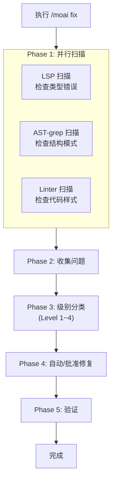
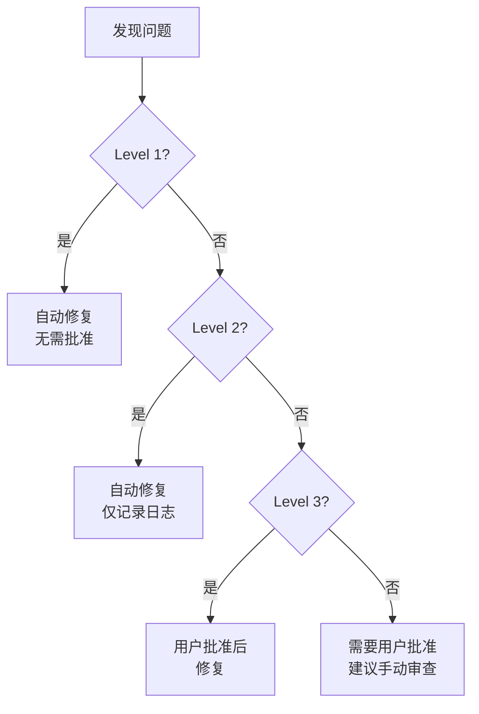
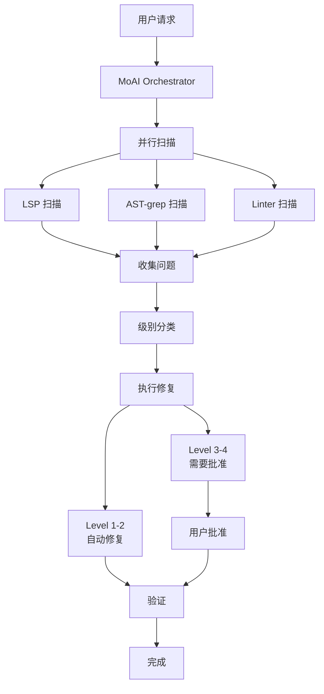

一键自动修复命令。**并行扫描**代码错误后**一次性修复**。


**一句话总结**: `/moai fix` 是"快速清理工具"。它**一次性清理**代码中积累的 lint 错误和类型错误。



**斜杠命令**: 在 Claude Code 中输入 `/moai:fix` 可以直接运行此命令。仅输入 `/moai` 即可查看所有可用子命令列表。


## 概述

开发过程中，import 顺序被打乱、类型不匹配、lint 警告会积累。与其一个个查找和修复这些问题，不如运行 `/moai fix`，AI 会自动查找并修复问题。

与 `/moai loop` 不同，它**仅运行一次**，因此适合想要快速清理当前状态时使用。

## 用法

```bash
> /moai fix
```

在没有单独参数的情况下执行时，会扫描当前项目的错误并自动修复可行的问题。

## 支持的标志

| 标志 | 描述 | 示例 |
|-------|------|------|
| `--dry` (或 `--dry-run`) | 仅显示结果而不修复 | `/moai fix --dry` |
| `--sequential` (或 `--seq`) | 顺序扫描而不是并行 | `/moai fix --sequential` |
| `--level N` | 指定最大修复级别 (默认 3) | `/moai fix --level 2` |
| `--errors` (或 `--errors-only`) | 仅修复错误，跳过警告 | `/moai fix --errors` |
| `--security` (或 `--include-security`) | 包括安全问题 | `/moai fix --security` |
| `--no-fmt` (或 `--no-format`) | 跳过格式化修复 | `/moai fix --no-fmt` |
| `--resume [ID]` (或 `--resume-from`) | 从快照恢复 (latest 为最新) | `/moai fix --resume` |
| `--team` | 强制代理团队模式 | `/moai fix --team` |
| `--solo` | 强制子代理模式 | `/moai fix --solo` |

### --dry 标志

预览将要进行的更改而不实际修复:

```bash
> /moai fix --dry
```

使用此选项时，不会进行实际代码修改 - 仅显示发现的问题和预期更改。

### --level 标志

限制修复级别:

```bash
# 仅修复 Level 1-2 (格式化、lint)
> /moai fix --level 2

# 仅修复 Level 1 (仅格式化)
> /moai fix --level 1
```

## 执行过程

`/moai fix` 分 5 个阶段运行:



### Phase 1: 并行扫描

三种工具**同时**扫描代码。

| 扫描工具 | 检查内容 | 发现的问题 |
|-----------|--------|---------------|
| **LSP** | 类型系统 | 类型不匹配、未定义变量、错误参数数量 |
| **AST-grep** | 代码结构 | 未使用的代码、危险模式、低效结构 |
| **Linter** | 代码样式 | import 顺序、缩进、命名规则违规 |

### Phase 2: 问题收集

将扫描结果合并为一个列表。

```
发现的问题 (示例):
  [Level 1] src/api/router.py:3 - 需要 import 排序
  [Level 1] src/models/user.py:15 - 不必要的空白
  [Level 2] src/utils/helper.py:8 - 未使用的变量 "temp"
  [Level 2] src/auth/service.py:22 - 不必要的 else 语句
  [Level 3] src/auth/service.py:45 - 缺少错误处理
  [Level 4] src/db/connection.py:12 - 可能的 SQL 注入
```

### Phase 3: 级别分类

收集的问题**按风险分为 4 级**。是否自动修复取决于级别。



## 问题级别详情

### Level 1: 格式化错误

**不影响代码行为**的形式问题。AI 自动修复。

| 项目 | 内容 |
|------|------|
| **风险** | 非常低 |
| **批准** | 不需要 (自动修复) |
| **示例** | import 排序、尾随空格删除、换行统一、缩进修复 |
| **修复工具** | black、isort、prettier |

**实际修复示例:**

```python
# 修复前 (Level 1 问题)
import os
import sys
from pathlib import Path
import json

# 修复后 (自动修复)
import json
import os
import sys
from pathlib import Path
```

### Level 2: Lint 警告

影响代码质量的**轻微**问题。AI 自动修复并记录日志。

| 项目 | 内容 |
|------|------|
| **风险** | 低 |
| **批准** | 不需要 (自动修复，记录日志) |
| **示例** | 未使用的变量、不必要的 else、重复代码、命名规则违规 |
| **修复工具** | ruff、eslint、golangci-lint |

**实际修复示例:**

```python
# 修复前 (Level 2 问题)
def get_user(user_id):
    result = db.query(user_id)
    if result:
        return result
    else:           # 不必要的 else
        return None

# 修复后 (自动修复)
def get_user(user_id):
    result = db.query(user_id)
    if result:
        return result
    return None
```

### Level 3: 逻辑错误

**可能改变代码行为**的问题。在用户批准后修复。

| 项目 | 内容 |
|------|------|
| **风险** | 中等 |
| **批准** | 需要 (用户确认后修复) |
| **示例** | 缺少错误处理、错误的条件、未处理的边缘情况、异步错误 |
| **修复方式** | 向用户展示更改内容并请求批准 |

**向用户展示的内容:**

```
[Level 3] src/auth/service.py:45
  问题: 认证失败时缺少错误处理
  建议: 添加 try-except 块，在认证失败时返回适当的错误响应

  批准吗？ (y/n)
```

### Level 4: 安全漏洞

**影响安全的**严重问题。需要用户批准，建议手动审查。

| 项目 | 内容 |
|------|------|
| **风险** | 高 |
| **批准** | 必需 (强烈建议手动审查) |
| **示例** | SQL 注入、XSS 漏洞、硬编码密钥、不安全的反序列化 |
| **修复方式** | 详细说明问题和解决方案，请求用户审查 |


**发现 Level 4 问题时** AI 不会自动修复。安全漏洞如果修复不当可能会产生更大问题，因此请手动审查后修复。


## 与 /moai loop 的区别

| 比较项目 | `/moai fix` | `/moai loop` |
|-----------|-------------|--------------|
| **执行次数** | 一次 | 重复直到完成 |
| **级别分类** | 有 (Level 1-4) | 无 |
| **批准流程** | Level 3-4 需要批准 | 自主处理 |
| **所需时间** | 短 (1-2 分钟) | 可能较长 (5-30 分钟) |
| **适合情况** | 简单错误清理 | 大规模问题解决 |


**选择指南**:
- "想在提交前快速清理 lint 错误" → `/moai fix`
- "多个测试失败，想全部修复" → `/moai loop`


## Agent 委托链

`/moai fix` 命令的 agent 委托流程:



**Agent 角色:**

| Agent | 角色 | 主要任务 |
|-------|------|------------|
| **MoAI Orchestrator** | 协调并行扫描 |
| **expert-backend** | 后端修复 (Level 1-2) |
| **expert-frontend** | 前端修复 (Level 1-2) |
| **expert-debug** | 逻辑错误修复 (Level 3-4) |
| **manager-quality** | 质量验证 | 验证修复结果 |

## 实际示例

### 情况: 提交前代码清理

实现新功能后，想在提交前清理代码。

```bash
# 检查当前状态
$ ruff check src/
# 发现 12 个 lint 警告

# 运行 fix
> /moai fix
```

**执行日志:**

```
[并行扫描]
  LSP: 发现 2 个错误
  AST-grep: 发现 3 个模式违规
  Linter: 发现 12 个警告

[问题分类]
  Level 1 (格式化): 7 个 → 自动修复
  Level 2 (lint): 8 个 → 自动修复
  Level 3 (逻辑): 2 个 → 需要批准
  Level 4 (安全): 0 个

[Level 1-2 自动修复完成]
  - import 排序 5 项
  - 尾随空格删除 2 项
  - 未使用变量删除 3 项
  - 不必要的 else 删除 2 项
  - 类型提示修复 2 项
  - 命名规则修复 1 项

[Level 3 批准请求]
  问题 1: src/auth/service.py:45
    问题: 令牌过期时缺少错误处理
    建议: 添加 TokenExpiredError 异常处理
    → 已批准: 修复完成

  问题 2: src/api/router.py:78
    问题: 缺少输入验证
    建议: 使用 Pydantic 模型添加输入验证
    → 已批准: 修复完成

[验证]
  LSP 错误: 0
  Linter 警告: 0
  所有修复已验证。

完成: 17 个问题已修复
```

## 常见问题

### Q: 如果有多个 Level 3-4 问题，都需要批准吗？

是的，每个 Level 3-4 问题都需要批准。但可以先使用 `--dry` 检查，仅批准重要的问题。

### Q: `/moai fix` 执行后出现问题怎么办？

可以使用 Git 回滚。修复前提交，或使用 `git stash` 备份。

### Q: 如果只想修复特定文件怎么办？

使用 `--path` 标志:

```bash
> /moai fix --path src/auth/
```

### Q: `/moai fix` 和 `/moai` 有什么区别？

`/moai fix` 仅负责**错误修复**。`/moai` 自动执行**从 SPEC 创建到实现和文档的整个工作流**。

## 相关文档

- [/moai loop - 迭代修复循环](/utility-commands/moai-loop)
- [/moai - 完全自主自动化](/utility-commands/moai)
- [TRUST 5 质量系统](/core-concepts/trust-5)
