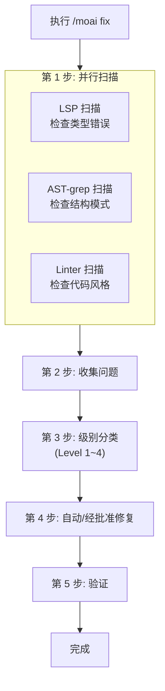
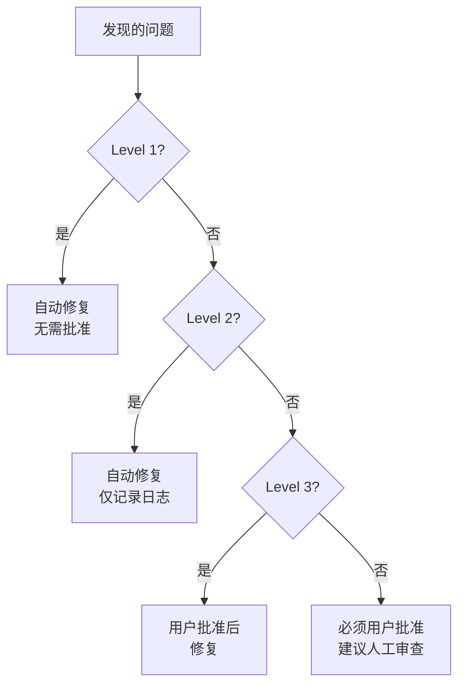
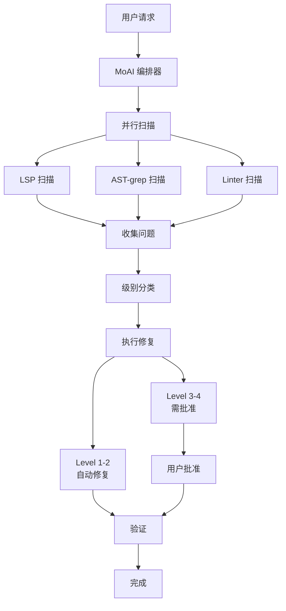

一次性自动修复命令。**并行扫描** 代码中的错误后 **一次性修复**。


**一句话总结**: `/moai fix` 是"快速清扫工具"。将代码中堆积的 lint 错误、类型错误 **一次性扫净** 并修复。



**斜杠命令**: 在 Claude Code 中输入 `/moai:fix` 即可直接执行此命令。仅输入 `/moai` 会显示所有可用子命令列表。


## 概述

开发过程中,import 排序会被打乱、类型会不匹配、lint 警告会堆积。与其逐个查找修复,不如执行 `/moai fix`,让 AI 自动发现并修复问题。

与 `/moai loop` 不同,它 **只执行 1 次**,适合想快速把当前状态清理干净的时候。从回路系列来看,`/moai fix` 是 **单次(1 回)预设** — 对无需迭代的明确错误运转回路是令牌浪费,选择与任务大小相称的最便宜工具,才是令牌经济学视角下的正确选择。

## 使用方法

```bash
> /moai fix
```

无需任何参数,执行后会扫描当前项目的错误并自动修复可修复的项目。

## 支持的标志

| 标志 | 说明 | 示例 |
|-------|------|------|
| `--dry`(或 `--dry-run`) | 不修复,仅显示结果 | `/moai fix --dry` |
| `--sequential`(或 `--seq`) | 顺序扫描代替并行 | `/moai fix --sequential` |
| `--level N` | 指定最大修复级别(默认 3) | `/moai fix --level 2` |
| `--errors`(或 `--errors-only`) | 仅修复错误,跳过警告 | `/moai fix --errors` |
| `--security`(或 `--include-security`) | 包含安全问题 | `/moai fix --security` |
| `--no-fmt`(或 `--no-format`) | 跳过格式化修复 | `/moai fix --no-fmt` |
| `--resume [ID]`(或 `--resume-from`) | 从快照恢复(latest 为最新) | `/moai fix --resume` |
| `--team` | (已退役)伴随 `MODE_TEAM_UNAVAILABLE` 回退到子智能体模式 | `/moai fix --team` |
| `--solo` | 强制子智能体模式 | `/moai fix --solo` |

### --dry 标志

可以在不修复的情况下预览将进行哪些变更:

```bash
> /moai fix --dry
```

使用此选项时,不修改实际代码,仅显示发现的问题与预期变更。

### --level 标志

限制修复的级别:

```bash
# 仅修复 Level 1-2(格式化、lint)
> /moai fix --level 2

# 仅修复 Level 1(仅格式化)
> /moai fix --level 1
```

## 执行过程

`/moai fix` 分 5 步执行。


```mermaid
flowchart TD
    Start["执行 /moai fix"] --> Scan

    subgraph Scan["第 1 步: 并行扫描"]
        S1["LSP 扫描<br/>检查类型错误"]
        S2["AST-grep 扫描<br/>检查结构模式"]
        S3["Linter 扫描<br/>检查代码风格"]
    end

    Scan --> Collect["第 2 步: 收集问题"]
    Collect --> Classify["第 3 步: 级别分类<br/>(Level 1~4)"]
    Classify --> Fix["第 4 步: 自动/经批准修复"]
    Fix --> Verify["第 5 步: 验证"]
    Verify --> Done["完成"]
```

### 第 1 步: 并行扫描

3 种工具 **同时** 扫描代码。

| 扫描工具 | 检查对象 | 发现的问题 |
|-----------|-----------|---------------|
| **LSP** | 类型系统 | 类型不匹配、未定义变量、参数数量错误 |
| **AST-grep** | 代码结构 | 未使用的代码、危险模式、低效结构 |
| **Linter** | 代码风格 | import 排序、缩进、命名规则违规 |

### 第 2 步: 收集问题

将扫描结果合并为一个列表。

```
发现的问题(示例):
  [Level 1] src/api/router.py:3 - 需要排序 import
  [Level 1] src/models/user.py:15 - 多余空白
  [Level 2] src/utils/helper.py:8 - 未使用的变量 "temp"
  [Level 2] src/auth/service.py:22 - 多余的 else 语句
  [Level 3] src/auth/service.py:45 - 缺少错误处理
  [Level 4] src/db/connection.py:12 - SQL Injection 可能性
```

### 第 3 步: 级别分类

将收集到的问题 **按风险程度分为 4 个级别**。级别不同,是否自动修复也不同。安全的交给机器处理,危险的需要人的批准 — 将自主性与安全门禁并置的挽具设计原则在这里同样适用。


```mermaid
flowchart TD
    Issue[发现的问题] --> L1{Level 1?}
    L1 -->|是| Auto1["自动修复<br/>无需批准"]
    L1 -->|否| L2{Level 2?}
    L2 -->|是| Auto2["自动修复<br/>仅记录日志"]
    L2 -->|否| L3{Level 3?}
    L3 -->|是| Approve3["用户批准后<br/>修复"]
    L3 -->|否| Approve4["必须用户批准<br/>建议人工审查"]
```

## 问题级别详解

### Level 1: 格式化错误

**不影响代码行为** 的形式性问题。AI 自动修复。

| 项目 | 内容 |
|------|------|
| **风险度** | 极低 |
| **批准** | 不需要(自动修复) |
| **示例** | import 排序、删除行尾空白、统一换行、修正缩进 |
| **修复工具** | black, isort, prettier |

**实际修复示例:**

```python
# 修复前 (Level 1 问题)
import os
import sys
from pathlib import Path
import json

# 修复后(自动修复)
import json
import os
import sys
from pathlib import Path
```

### Level 2: Lint 警告

影响代码质量的 **轻微** 问题。AI 自动修复并留下日志。

| 项目 | 内容 |
|------|------|
| **风险度** | 低 |
| **批准** | 不需要(自动修复,记录日志) |
| **示例** | 未使用的变量、多余的 else、重复代码、命名规则违规 |
| **修复工具** | ruff, eslint, golangci-lint |

**实际修复示例:**

```python
# 修复前 (Level 2 问题)
def get_user(user_id):
    result = db.query(user_id)
    if result:
        return result
    else:           # 多余的 else
        return None

# 修复后(自动修复)
def get_user(user_id):
    result = db.query(user_id)
    if result:
        return result
    return None
```

### Level 3: 逻辑错误

**可能改变代码行为** 的问题。经用户批准后修复。

| 项目 | 内容 |
|------|------|
| **风险度** | 中等 |
| **批准** | 需要(用户确认后修复) |
| **示例** | 缺少错误处理、错误的条件语句、未处理边界值、异步错误 |
| **修复方式** | 向用户展示变更内容并请求批准 |

**向用户展示的内容:**

```
[Level 3] src/auth/service.py:45
  问题: 认证失败时缺少错误处理
  建议: 添加 try-except 块,在认证失败时返回恰当的错误响应

  是否批准? (y/n)
```

### Level 4: 安全漏洞

**影响安全** 的严重问题。必须经用户批准,并建议人工审查。

| 项目 | 内容 |
|------|------|
| **风险度** | 高 |
| **批准** | 必须(强烈建议人工审查) |
| **示例** | SQL Injection、XSS 漏洞、硬编码的密钥、不安全的反序列化 |
| **修复方式** | 详细说明问题与解决方案,并请求用户审查 |


**发现 Level 4 问题时**,AI 不会自动修复。安全漏洞若修复不当可能造成更大问题,请务必亲自确认后再修复。


## 与 /moai loop 的区别

| 对比项目 | `/moai fix` | `/moai loop` |
|-----------|-------------|--------------|
| **执行次数** | 1 次 | 迭代直到完成 |
| **级别分类** | 有 (Level 1-4) | 无 |
| **批准流程** | Level 3-4 需批准 | 自主处理 |
| **耗时** | 短(1-2 分钟) | 可能较长(5-30 分钟) |
| **适合的场景** | 简单错误清理 | 大规模问题解决 |


**选择指南**:
- "提交前只想快速清理 lint 错误" → `/moai fix`
- "测试失败很多,想全部修复" → `/moai loop`


## 残余问题移交(交接给 loop)

`/moai fix` 是单次(1 回)流水线,因此可能残留一次扫描-修复-验证无法解决的问题。残留问题的种类:

- **Level 4 手动项**(安全·架构 —— 禁止自动修复)
- **未解决的错误**(在 repair 阶段未能修复的项)
- **Phase 5 回归守卫失败**(既未回退也未报告的回归)

出现此类残留时,fix 工作流会把它持久化到 `.moai/state/loop-verdict-<id>.json`,记为 `exit_kind: "one-shot-residue"`、`iterations_used: 1`。该 schema 与 `/moai loop` 的残留持久化 schema 相同。

报告对可再修复的残留仅 **建议** 进入 `/moai loop`,fix 工作流不会自动调用 `/moai loop` 或其他子命令。用户亲自重新进入 `/moai loop` 后,持久化的残留会作为条目并入循环的扫描队列,由 goal-preset 扫荡清空。

## 智能体委派链

`/moai fix` 命令的智能体委派流程:


```mermaid
flowchart TD
    User["用户请求"] --> Orchestrator["MoAI 编排器"]
    Orchestrator --> Parallel["并行扫描"]

    Parallel --> LSP["LSP 扫描"]
    Parallel --> AST["AST-grep 扫描"]
    Parallel --> Linter["Linter 扫描"]

    LSP --> Collect["收集问题"]
    AST --> Collect
    Linter --> Collect

    Collect --> Classify["级别分类"]
    Classify --> Fix["执行修复"]

    Fix --> Level12["Level 1-2<br/>自动修复"]
    Fix --> Level34["Level 3-4<br/>需批准"]

    Level12 --> Verify["验证"]
    Level34 --> UserApprove["用户批准"]
    UserApprove --> Verify

    Verify --> Complete["完成"]
```

**智能体角色:**

| 智能体 | 角色 | 主要工作 |
|----------|------|----------|
| **MoAI 编排器** | 协调并行扫描 | 收集问题、级别分类、用户批准 |
| **manager-develop** | 执行修复 | Level 1-2 自动修复,Level 3-4 批准后修复 |
| **sync-auditor** | 质量验证 | 确认修复结果 |

## 实战示例

### 场景: 提交前清理代码

实现新功能后,想在提交前清理代码。

```bash
# 确认当前状态
$ ruff check src/
# 发现 12 个 lint 警告

# 执行 fix
> /moai fix
```

**执行日志:**

```
[并行扫描]
  LSP: 发现 2 个错误
  AST-grep: 发现 3 个模式违规
  Linter: 发现 12 个警告

[问题分类]
  Level 1 (格式化): 7 个 → 自动修复
  Level 2 (lint): 8 个 → 自动修复
  Level 3 (逻辑): 2 个 → 需批准
  Level 4 (安全): 0 个

[Level 1-2 自动修复完成]
  - import 排序 5 处
  - 删除行尾空白 2 处
  - 删除未使用变量 3 处
  - 删除多余 else 2 处
  - 修正类型提示 2 处
  - 修正命名规则 1 处

[Level 3 批准请求]
  问题 1: src/auth/service.py:45
    问题: 令牌过期时缺少错误处理
    建议: 添加 TokenExpiredError 异常处理
    → 已批准: 修复完成

  问题 2: src/api/router.py:78
    问题: 缺少输入值验证
    建议: 用 Pydantic 模型添加输入验证
    → 已批准: 修复完成

[验证]
  LSP 错误: 0 个
  Linter 警告: 0 个
  所有修复均已验证。

完成: 修复了 17 个问题
```

## 常见问题

### Q: Level 3-4 问题很多时,必须全部批准吗?

是的,Level 3-4 问题需要逐个批准。不过可以先用 `--dry` 确认,只批准重要的项目。

### Q: 执行 `/moai fix` 后出现问题怎么办?

可以用 Git 回退。建议在修复前提交,或用 `git stash` 备份。

### Q: 只想修复特定文件?

请使用 `--path` 标志:

```bash
> /moai fix --path src/auth/
```

### Q: `/moai fix` 和 `/moai` 有什么区别?

`/moai fix` **只负责错误修复**。`/moai` 则从 SPEC 生成到实现、文档化,自动执行 **完整工作流**。

## 相关文档

- [/moai loop - 迭代修复回路](/utility-commands/moai-loop)
- [/moai - 完全自主自动化](/utility-commands/moai)
- [TRUST 5 质量系统](/core-concepts/trust-5)
