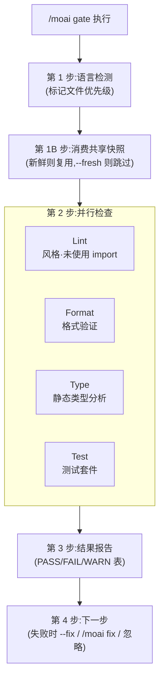

在提交前快速验证质量的 **轻量级门禁** 命令。**并行**执行 lint、格式化、类型检查、测试,在大多数项目中 30 秒内完成。


**一句话概括**:`/moai gate` 是"提交前的快速检查站"。同时跑 4 项检查(lint、格式化、类型、测试)并立即告知通过/失败 —— 无需完整的代码评审或覆盖率分析,快速完成。



**斜杠命令**:在 Claude Code 中输入 `/moai:gate` 即可直接执行该命令。仅输入 `/moai` 会显示所有可用子命令列表。


## 概述

当你在提交前想确认"当前状态干净吗?"时使用。与 `/moai review`(深度四视角评审)或 sync 流水线的完整质量检查不同,`/moai gate` 只提供 **快速的通过/失败判定**。

| 工作流 | 范围 | 速度 | 使用时机 |
|-----------|------|------|-----------|
| `/moai gate` | lint + 格式化 + 类型 + 测试 | 快(<30 秒) | 每次提交前 |
| `/moai review` | 四视角深度代码评审 | 中(2-5 分钟) | PR 前、设计评审 |
| sync 质量检查 | 完整质量 + 代码评审 + 覆盖率 | 慢(5-10 分钟) | sync 流水线的一部分 |

## 用法

```bash
# 全部检查
> /moai gate

# lint、格式化自动修复
> /moai gate --fix

# 仅检查已暂存的文件
> /moai gate --staged

# 仅检查特定文件
> /moai gate --file src/auth/service.go
```

## 支持的标志

| 标志 | 说明 | 示例 |
|-------|------|------|
| `--fix` | 自动修复 lint、格式化问题(默认:仅报告) | `/moai gate --fix` |
| `--staged` | 仅检查 `git diff --staged` 的文件(测试始终全量运行) | `/moai gate --staged` |
| `--file PATH` | 仅检查特定文件 | `/moai gate --file src/api.go` |
| `--fresh` | 强制 fresh 模式 —— 完全禁用共享诊断快照的消费,所有检查全部重新运行 | `/moai gate --fresh` |

## 执行过程



### 第 1 步:语言检测

按优先级确认标记文件(首个匹配胜出)以选择各语言的工具链。对 16 种支持语言一视同仁,例如 Go 会执行 `go vet`、`golangci-lint`、`go test -race`,Python 会执行 `ruff`、`mypy`、`pytest`。若没有可识别的标记,则跳过语言相关检查并报告 "unknown language"。

### 第 1B 步:消费共享诊断快照

在执行检查之前,查询针对当前工作树的共享诊断快照。若新鲜的快照(键匹配 + 在 TTL 内,默认 10 分钟)覆盖了本门禁将要跑的检查类别,则复用记录的结果而非重新运行,并在报告中标示为 `Test | PASS (snapshot)`。过期的快照绝不作为证据引用,而是重新运行。`--fresh` 模式下会整段跳过此步骤。

### 第 2 步:并行检查

将 4 项检查在后台同时执行。

| 检查 | 对象 | `--fix` 行为 |
|------|------|--------------|
| **Lint** | 风格违规、未使用 import、死代码 | 修正可自动修复的项 |
| **Format** | 未格式化的文件 | 自动格式化 |
| **Type** | 类型错误、缺失的注解 | 无自动修复(需手动介入) |
| **Test** | 测试失败 | 无自动修复(需调查原因) |

单项检查超时为 60 秒,整个门禁超时为 90 秒。超时则报告为 WARNING 但不阻断。已执行(非复用)的全量范围检查结果会记录到 `.moai/state/verify/` 下的共享快照存储中,以便下游消费者(run 阶段的预评审门禁、sync 预门禁、stop-goal 评估器)在工作树未变期间复用。

### 第 3 步:结果报告

```
## Quality Gate: PASS
| Check  | Status | Time  |
|--------|--------|-------|
| Lint   | PASS   | 2.1s  |
| Format | PASS   | 0.8s  |
| Type   | PASS   | 3.2s  |
| Test   | PASS   | 12.4s |
Total: 18.5s
```

### 第 4 步:下一步

全部通过则显示准备提交的消息。若无 `--fix` 而失败,会通过 `AskUserQuestion` 提示以下选项 —— 自动修复(重新运行 `--fix`,推荐)/ `/moai fix`(深度解决)/ 忽略并继续。`--fix` 之后仍残留的问题(类型错误、测试失败)建议手动调查。

## 与其他命令的关系

`/moai gate` 是只验证、不修改文件的 **轻量级检查站**(仅在给出 `--fix` 时修正 lint、格式化)。若需更深的解决,可转向 `/moai fix`(单次)或 `/moai loop`(反复);PR 前的综合评审使用 `/moai review`。`--fresh` 模式用于 `/moai loop` 的独立最终验证 pass 调用本门禁以获取无自引用的证据时。

## 相关文档

- [/moai fix - 一次性自动修复](/utility-commands/moai-fix)
- [/moai loop - 反复修复循环](/utility-commands/moai-loop)
- [TRUST 5 质量系统](/core-concepts/trust-5)
